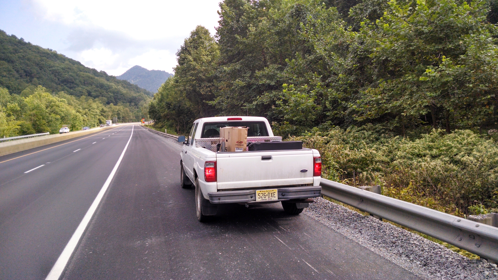
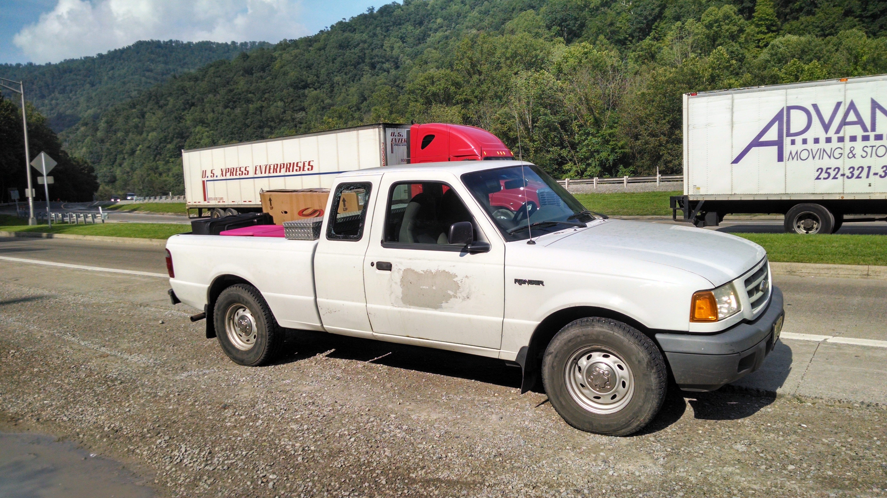
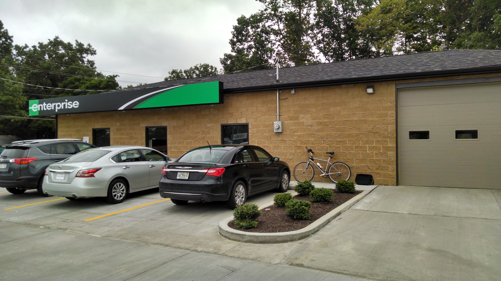

+++
title = "A Wild Roadtrip"
date = "2014-09-01T03:21:02+00:00"
tags = ["Travel"]
categories = []
image = "IMG_20140823_163450554_HDR.jpg"
+++

Why I should have gone to the Lube'n'Goinc when I had the chance

A few weeks ago I took my truck into the shop for an oil change. After the change they suggested a series of other maintenance that I should do soon. Knowing that shops always try to drum up extra business, and that some of the items were silly, like installing a new air filter, I didn't do any extra work. A few weeks later I hear a weird whining noise for a few minutes driving through the Pennsylvania hills. I thought I should get it checked out, but the noise went away and I didn't think much else of it. Before taking the long trip from Carlisle, PA to Huron, OH, I intended to take the truck to the local shop, "Lube and Go Inc", casually known as the Lube'n'Goinc. But I never got around to it.

As I drove back the whining occasionally came and went, but the truck ran and drove fine. Even after another trip to and from Toledo it seemed to run fine, so I didn't hesitate to start on my move down to Maggie's place in North Carolina. We had it planned out so that I could meet her at the airport as her flight was arriving from California.

As I made my way through Ohio the truck made the whining noise a few times, but it was nothing worse than before and it continued to run and handle just fine. As I entered West Virginia, the noise came once more and seemed louder, but again went away. I decided I would definitely get it to a shop before any more driving in North Carolina. A few hours later it came again, and began to sound more like a grinding. I decided I definitely needed to get off at the next exit to get it checked out. I was pretty bummed because I knew it was going to set me way behind schedule. But little did I know how much worse it was going to get.

As I cruised down into a valley between two hills, the grinding got worse and worse. At one point the rear wheels felt like they seized for a moment which is surely not a good sign. I decided to pull over and check it out just in case I could see anything clearly wrong. I looked under the truck, and didn't see or smell anything funny, so decided that although I was now nervous, there wasn't really a better option than continuing on to the next exit. But when I went to get back in the truck, I discovered that I had locked myself out. How stupid. I was stranded on the side of the freeway and locked out of my still-running truck. I got my phone to call AAA, and thought that since I was broken down anyway, I should probably just take a tow instead of just an unlock. But my phone had no service.

After a minute of thinking I decided to flag someone down. The first vehicle to stop was a van with two guys from some kind of construction company.  They seemed to think they may be able to get me back in, but (to no one's surprise) they couldn't. Unfortunately neither of their phones had service either. They assured me they would call AAA and the state police when they made it to town, and that there was a courtesy patrol that came by every half hour or so. Twenty minutes later no one had come so I decided to try flagging down another passerby. It was a girl driving a car, and her dad driving a U-haul truck behind her. Again, neither of them had cell service but said they'd call the state police and AAA when they got service back. After standing by the road for an hour I decided there was nothing left to do but break in a window. I used my ripstick to smash the small rear side window, sending safety glass shards all over my books in the back.

Finally I was back in. The truck seemed to be in even worse shape than I remembered. I limped at about 30 km/h along the shoulder until I reached a rest stop 2km down the road. From there I was able to borrow a land line and call AAA. They hauled me to a shop in Beckley, WV, where I had to leave my truck and possessions overnight. Luckily my parents hooked me up with a free hotel room across the small town with their rewards points. I got my bicycle out of the truck, put it back together behind the shop, and took off.

The next afternoon the rental car place opened up and I got back on the road arriving in North Carolina a full day after I had planned. When I heard that the truck would cost nearly $2000 to fix, a full seven times what I had payed for it, I decided I would have to part ways with it. Luckily one of the tow truck drivers at the shop was interested in buying it for $300. But that's when I found out exactly how shady this shop was.

They prevented their employees from buying the truck, and said I would have to be present before they could sign it over to anyone else. They added that after three days I would have to pay storage fees. But that I could give the truck to them for free. I decided I would rather donate it. After arranging the donation with the make a wish foundation, I seemed to have everything in order, and the charity assured me that according to WV state law I would not have to be present for them to get the truck. But it turned out the shop had implemented a "company policy" that they couldn't release the truck to anyone except me even with written notice. I called AAA to see if they could help pressure the shop into releasing my truck to a charity, but the dumb-ass representative I got refused to help. Finally the charity called and convinced the shop that a notarized letter would suffice. After several hours of searching for a free notary, the only one I could find was AAA in Durham, NC, and regretted having to deal with them again. But finally everything was arranged and the truck was donated.

It was sad to see the truck go since it had served me so well in Princeton and for the summer, but all things considered it was $250 well spent.

Photos:

