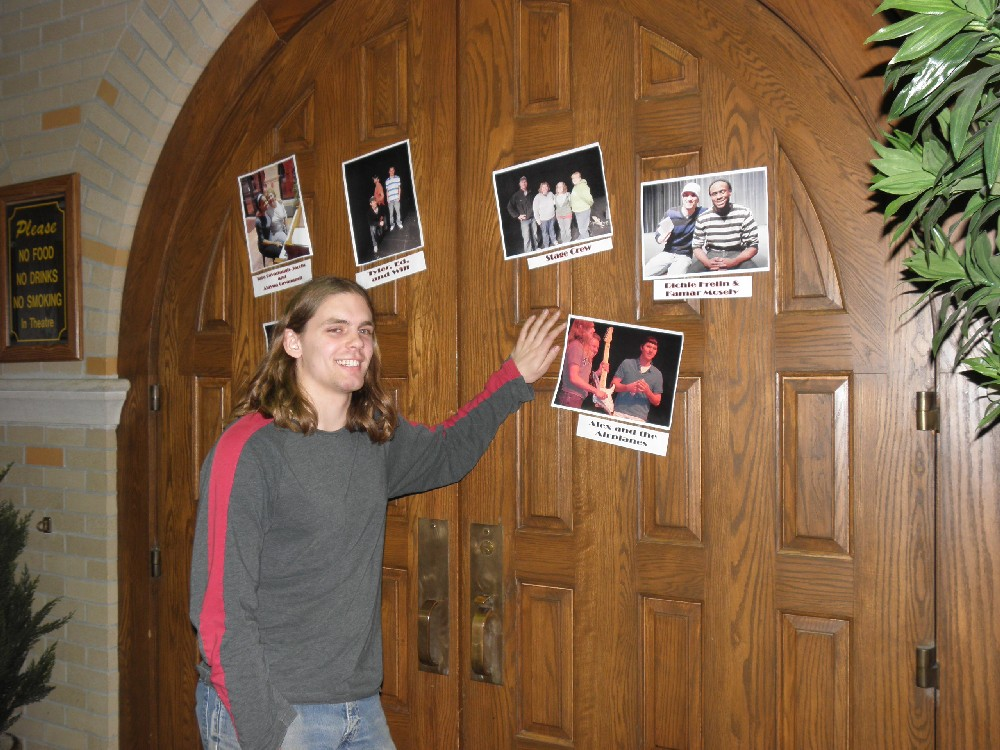
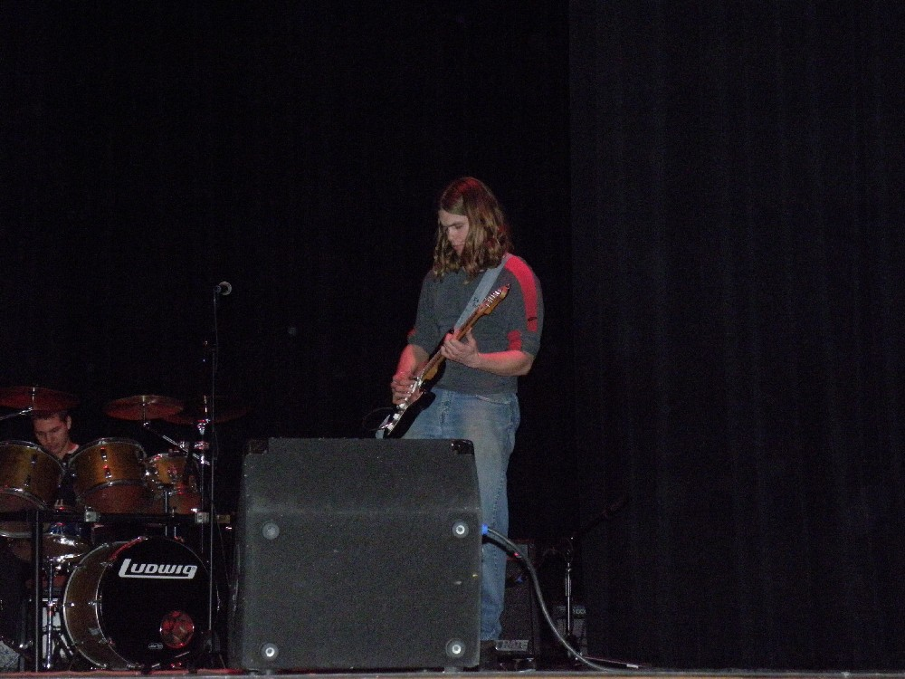
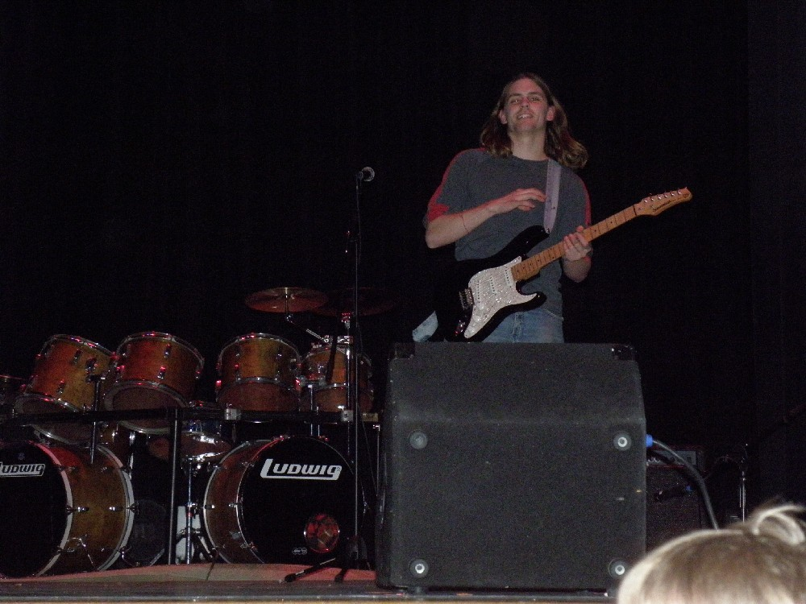
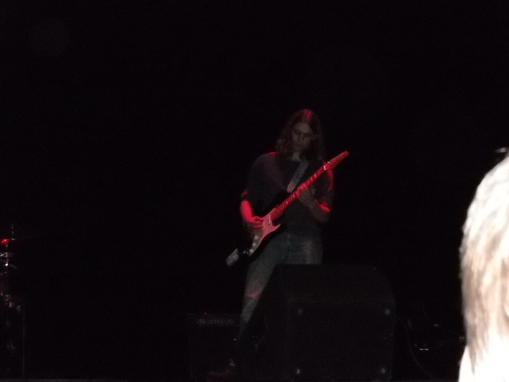
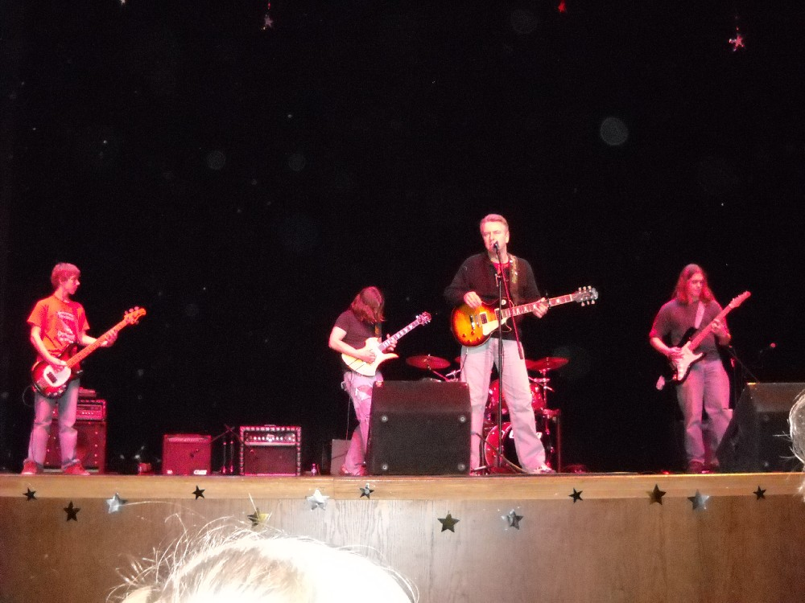
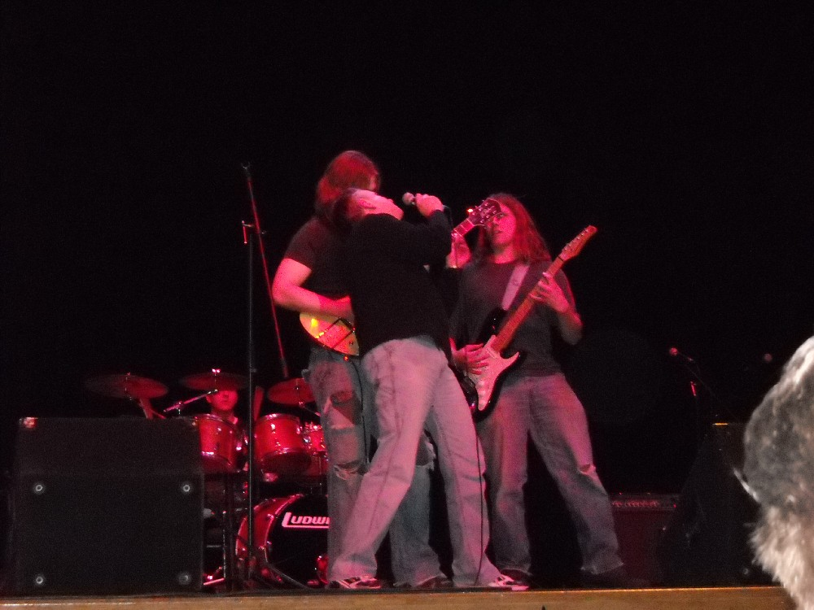
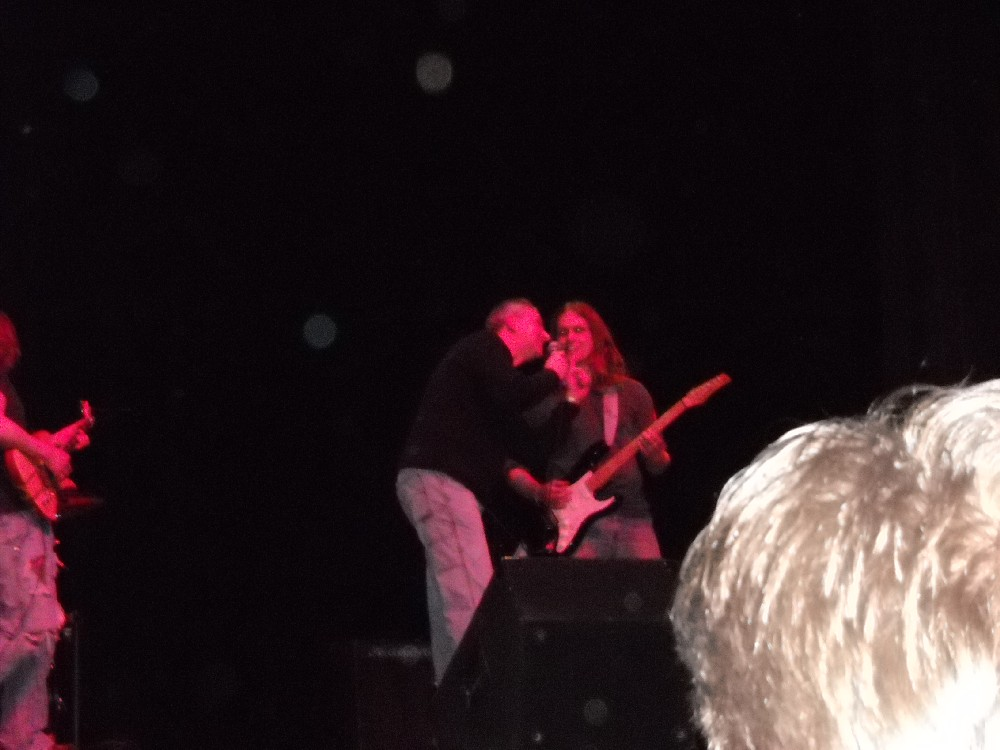
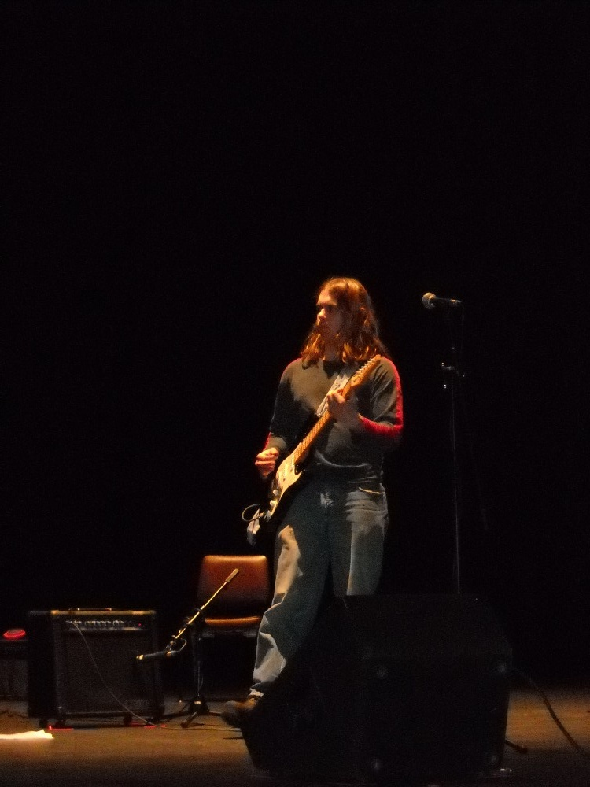
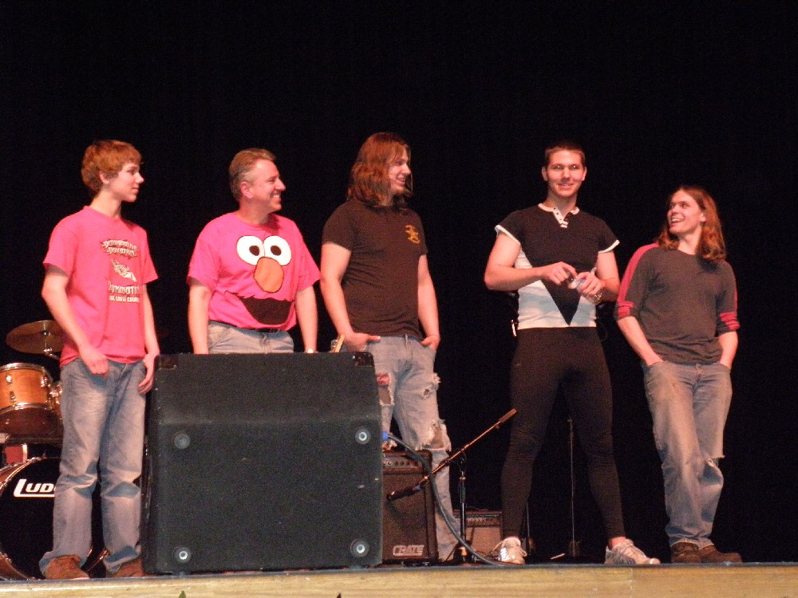
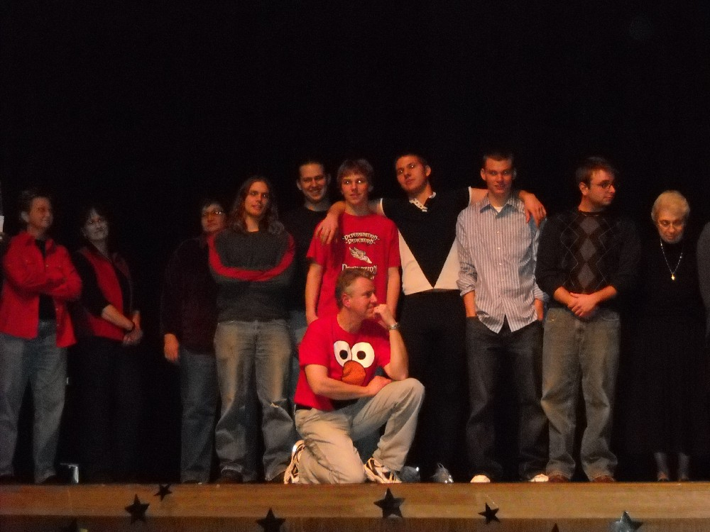

+++
title = "Alex and the Airplanes"
date = "2010-03-25T11:34:36+00:00"
tags = ["Band"]
categories = []
image = "image014.jpg"
+++

These pictures are from the first (and almost certainly last) show that we played as Alex and the Airplanes. It was 19 February 2010 at Lourdes College&#39;s Showtime talent show. Our two-song set was "Is it my Body" by Alice Cooper and "Heros" by David Bowie. I thought it was a pretty rockin' show!

Photos:

