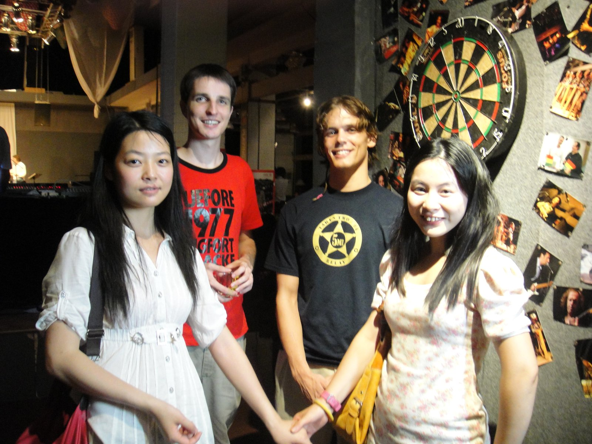
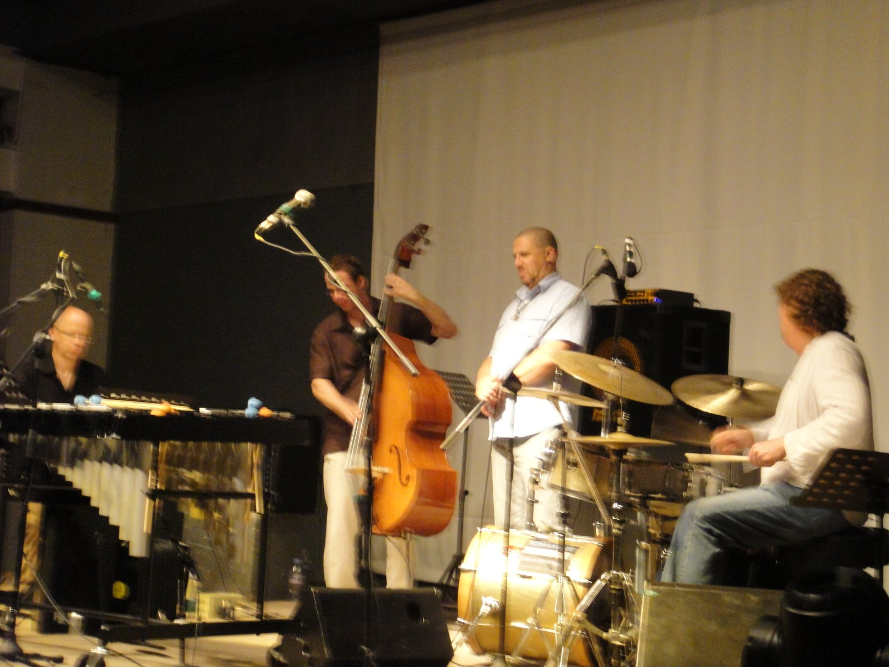

+++
title = "American Jazz Show"
date = "2010-06-24T13:00:28+00:00"
tags = ["China"]
categories = []
image = "f.JPG"
+++

My friend Yoyo (that of course is her English name) found some info about a concert that was happening at one of the many parks in Guangzhou.  It was a band form America who was in town on part of an international tour.  It was a small band  and I have no idea how they set up an international tour.  Maybe it was more of a vacation and they were booking some shows to cover some of the expenses.  In any case, we showed up to the park and the place looked deserted.  We asked some guards and they kept pointing us in the same direction, and eventually we got there.  It was a little hall/venue that seated about 200 people, and the band was pretty good.  They played long jazz songs and a few sets.  Our crew was Me, Yoyo, Sunny, Tim, and a new friend named Nicole.

Photos:

