+++
title = "Asheville, NC"
date = "2012-08-10T20:35:34+00:00"
tags = ["Travel"]
categories = []
image = "00_1581.JPG"
+++

I started out my summer travels with a trip down to Asheville, NC. My college friend Tim Langenberg is living and working there, so Anne Fennema and I decided to ride down with him one week, and visit for a while. We saw a lot of the town and surrounding area, and met a lot of his friends. I got some great pictures of our hikes, but never remembered to get pictures with his friends. But, in any case, here are some of the nature pics.

Photos:

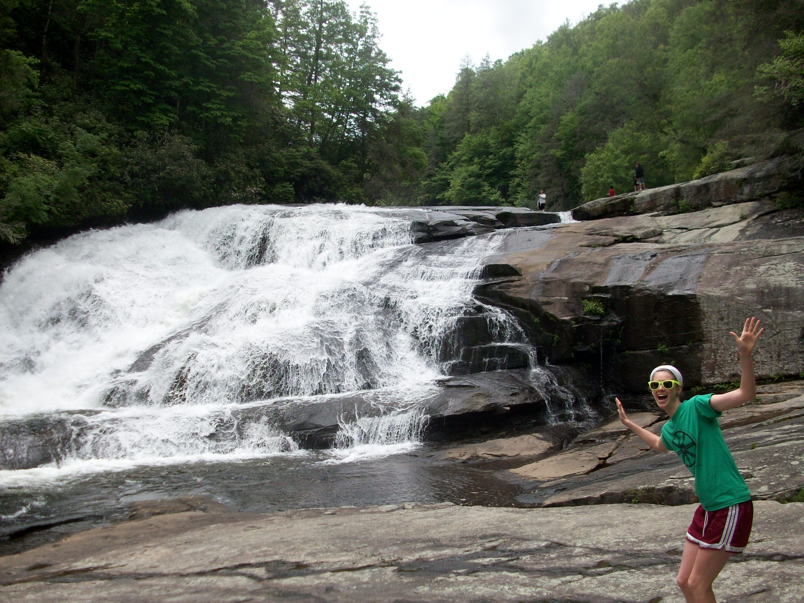
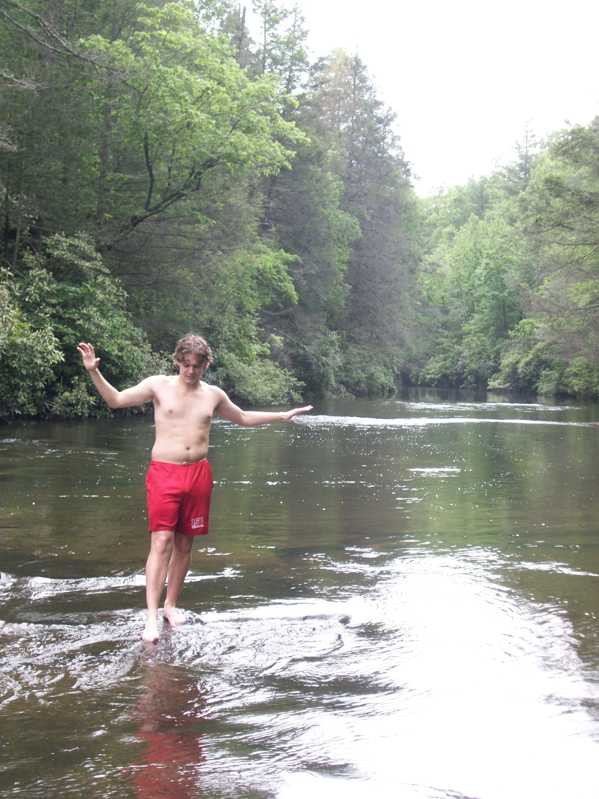

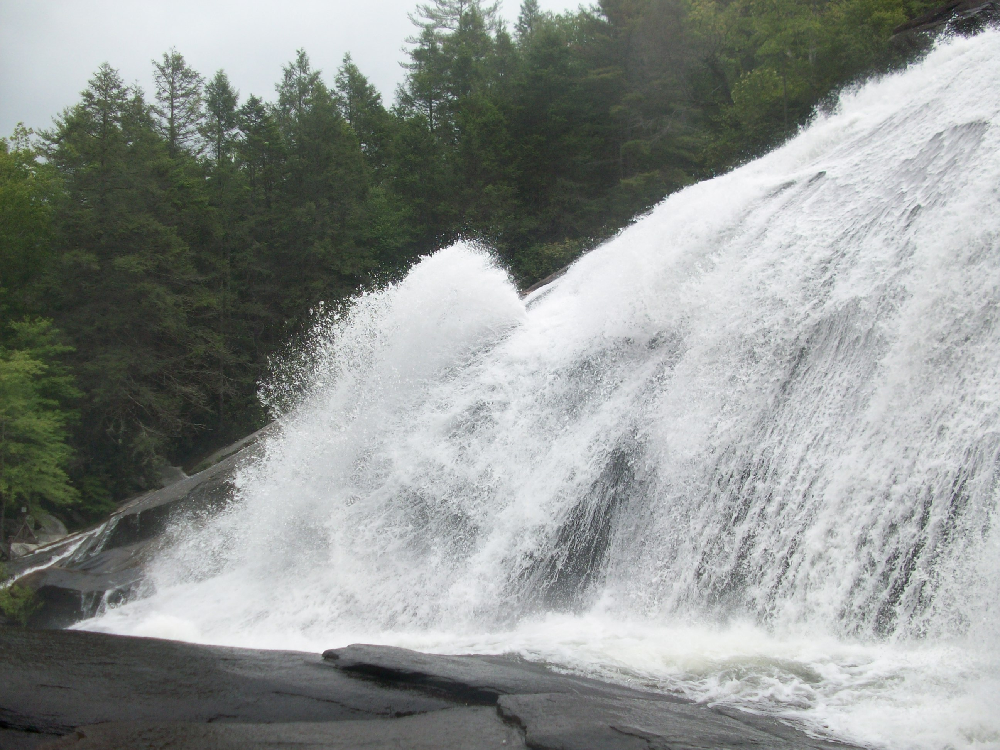
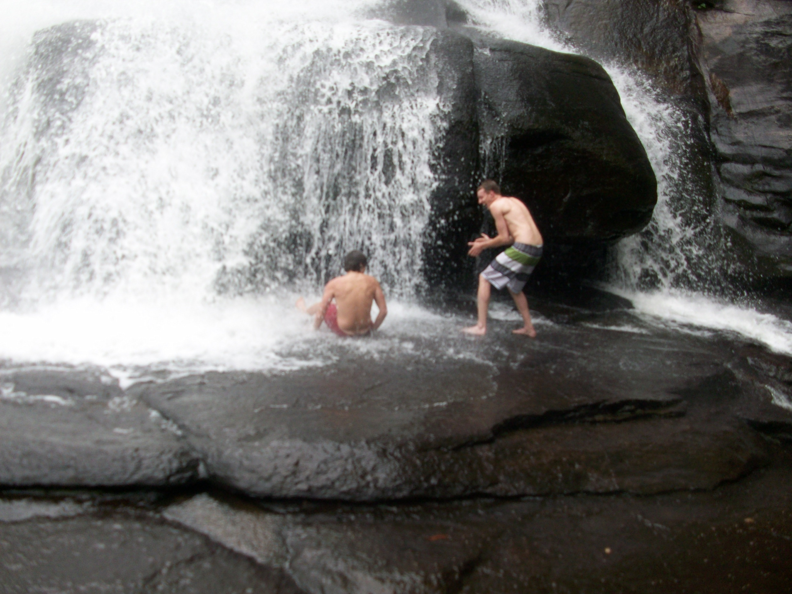

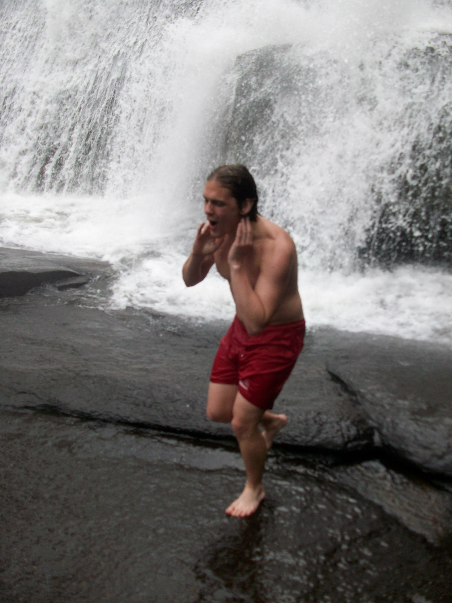
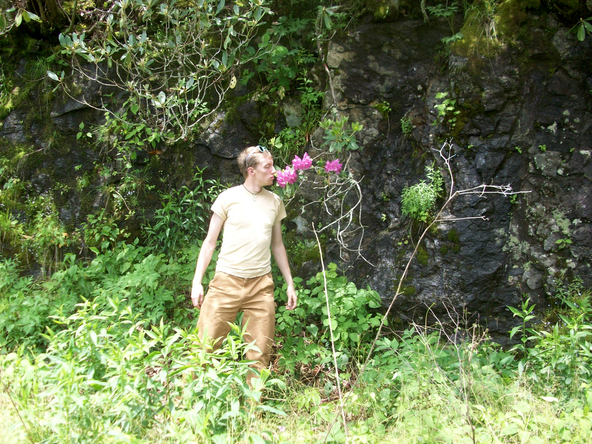
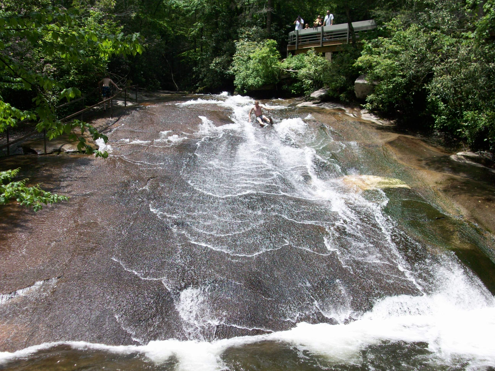
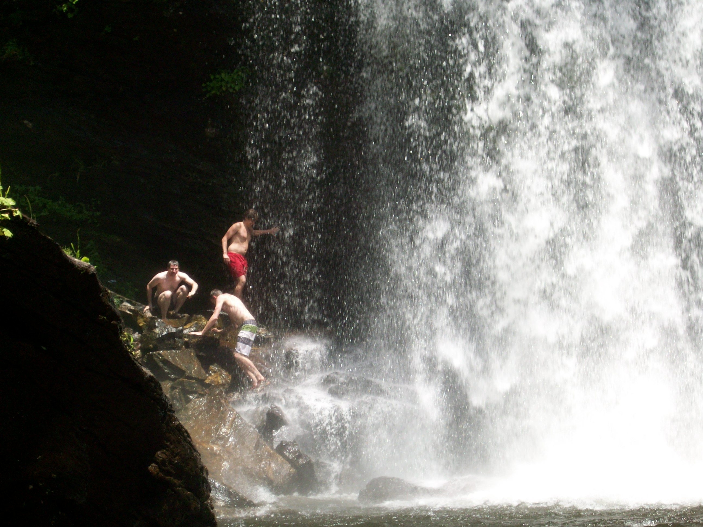
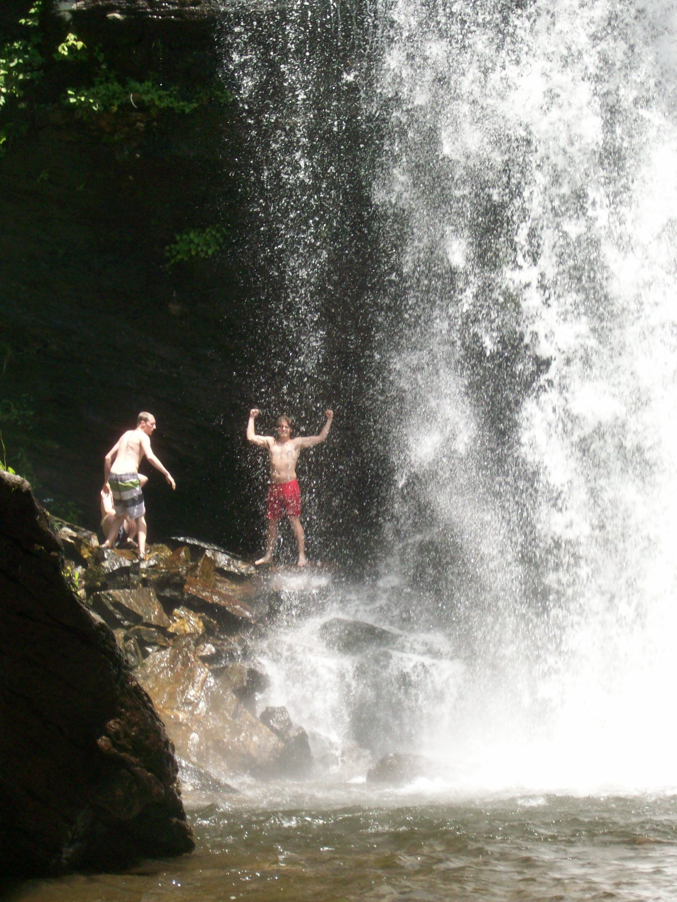

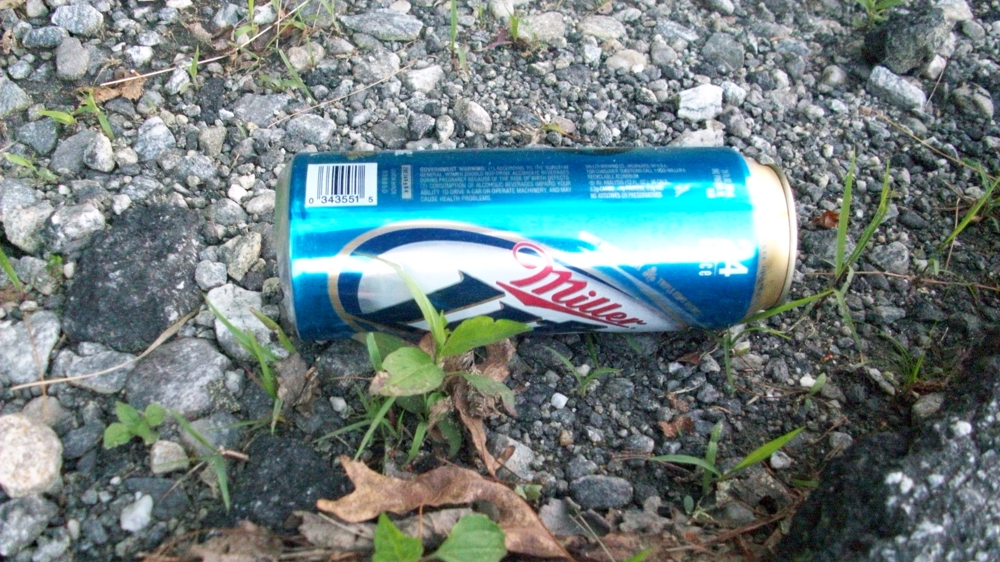
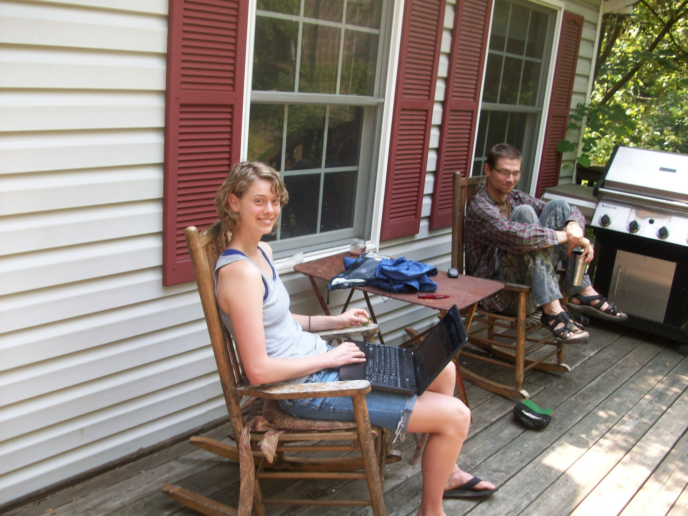
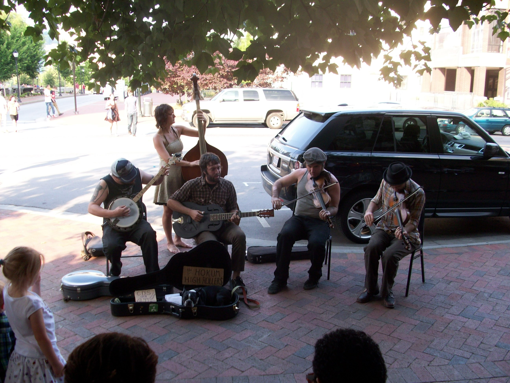
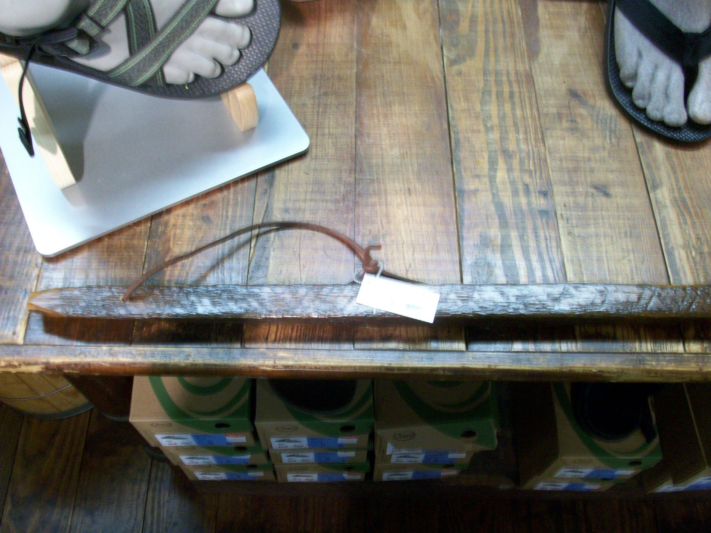
