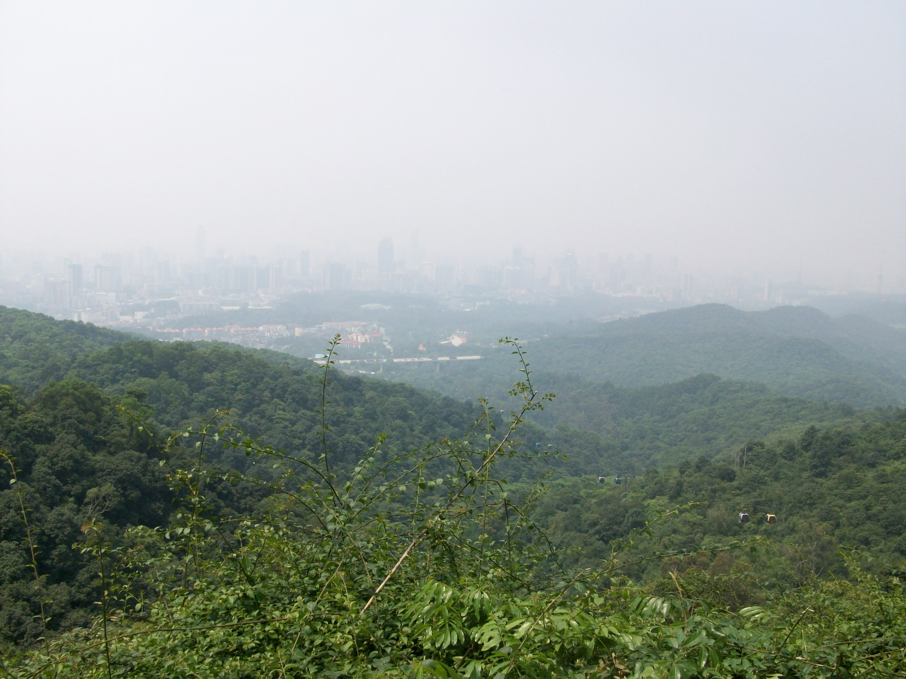
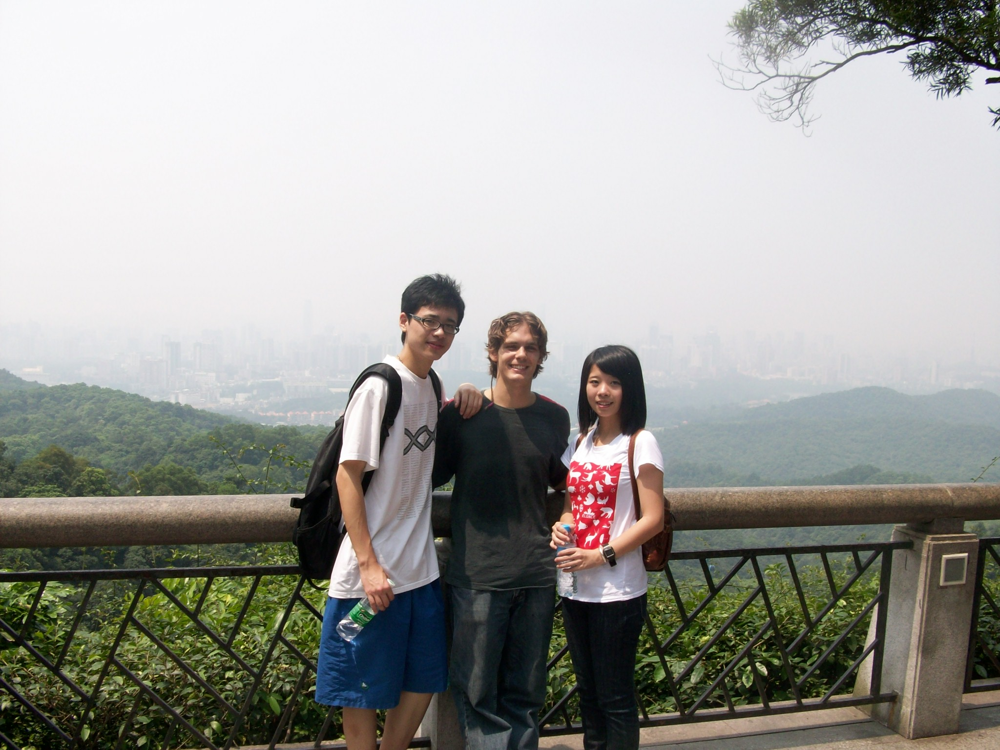
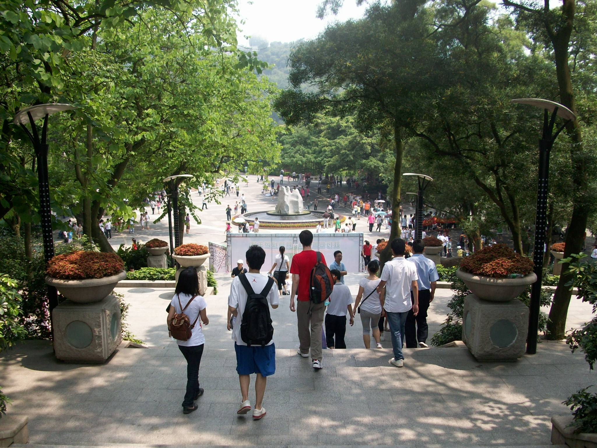
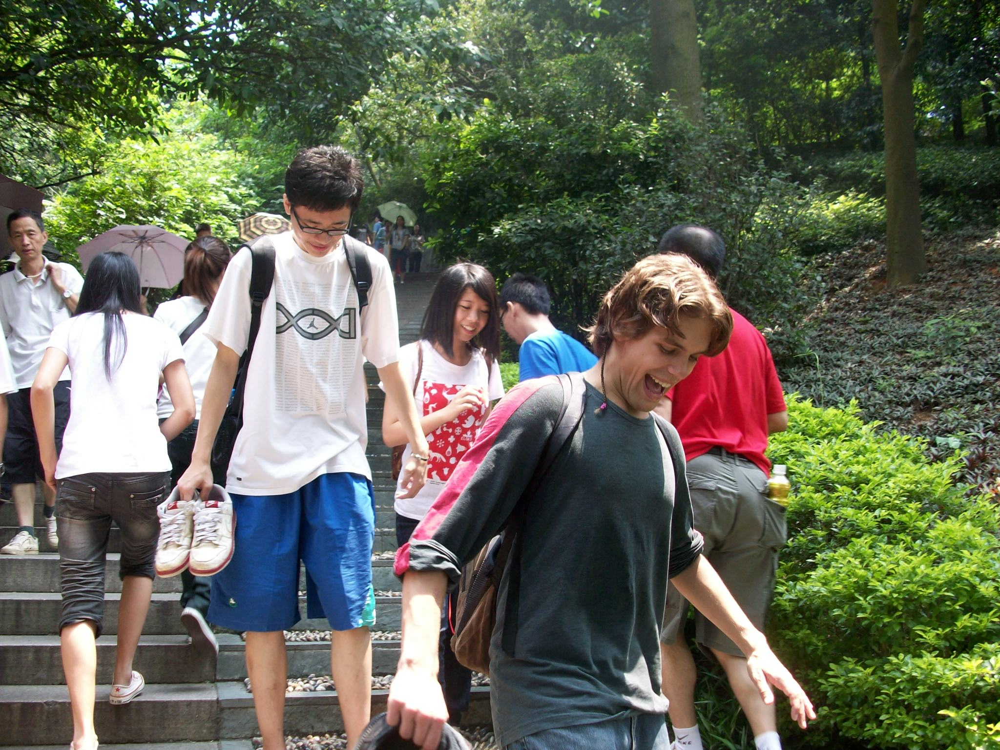
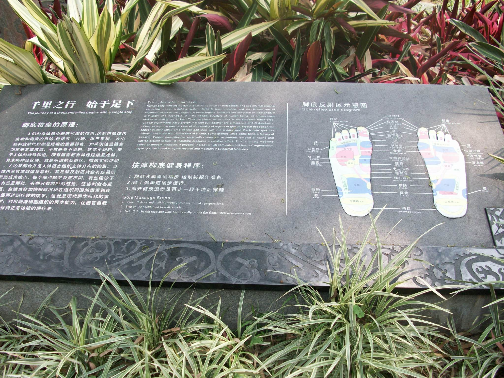
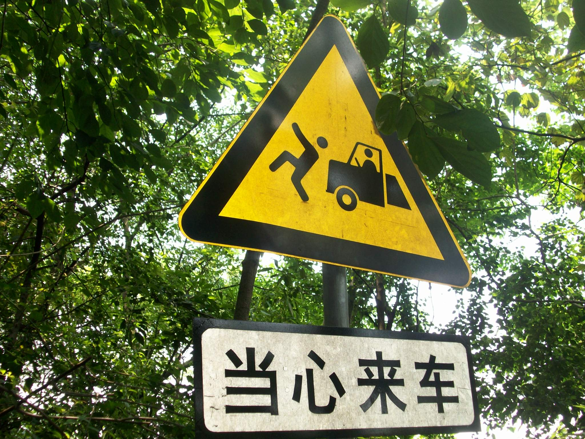
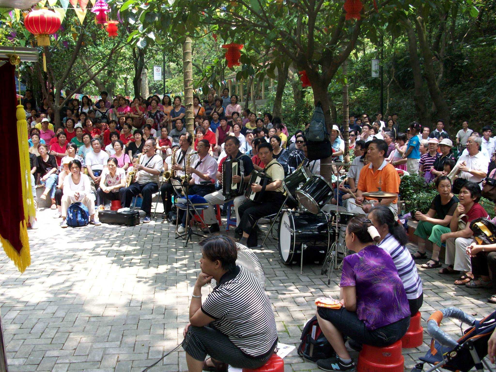
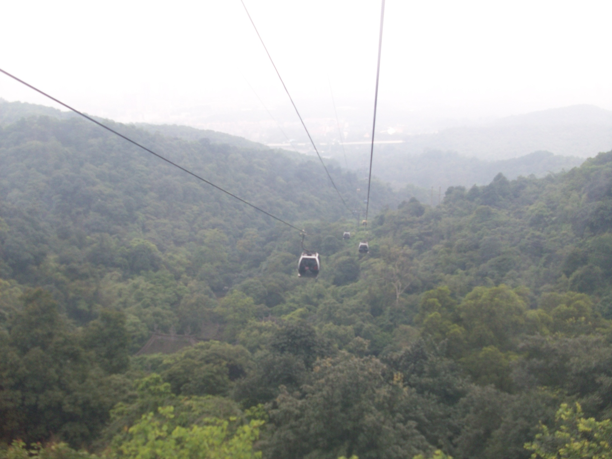

+++
title = "Baiyun Mountain (白云山)"
date = "2010-06-11T11:20:27+00:00"
tags = ["China"]
categories = []
image = "100_0458.JPG"
+++

This was a Saturday morning trip with Tim, Jasmine, and her friend Galon.  We hiked (which was more of a casual walk) up the mountain (which was more a big hill), and hung out on top for a while.  There were lots of stores, restaurants, and activities on top, and we spent a few hours there.  The highlight for me was bungee jumping which is terrifying.  It feels like you're falling forever, and nothing is going to catch you even though the harness is strapped on the whole time.

I don't have any pictures of the bungee jumping, but a video will be coming soon(ish).

Photos:

