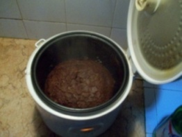
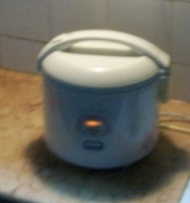
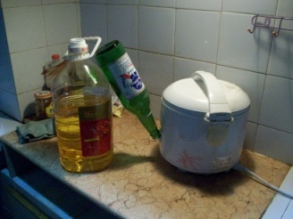
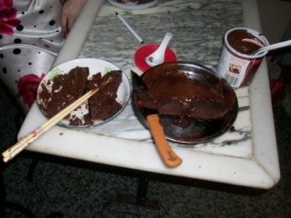

+++
title = "Baking Cake in a Rice Cooker"
date = "2010-10-02T06:22:39+00:00"
tags = ["China"]
categories = []
image = "finished.jpg"
+++

<!-- This node was created after the update to D8 and backdated to preserve sort order. -->

In this simple How-To, I will show how to use a rice cooker to bake (yes bake!) a cake.  The rice cooker is not superior or preferred to an actual oven, but if you find yourself without an oven, this method might save you.  It's also fun to try.

<h2>Step One -- Get the Supplies</h2>

To begin with, we have to get the supplies necessary to make the actual cake.  This is pretty simple in theory, but depending on where you are it may be hard to find a cake mix.

<ul>
<strong>You'll need:</strong>
<li>1 rice cooker</li>
<li>1 cake Mix</li>
<li>2 or 3 eggs (see the instructions on the cake mix)</li>
<li>Oil</li>
<li>Icing (optional, but recommended)</li>
</ul>

There are parts of the world where it is easy to find a cake mix, and there are parts of the world where it is easy to find a rice cooker, but, in my experience, those areas do not overlap.  So you might want to do a little planning in advance to be sure you can find everything you need.

<h2>Step Two -- Bake</h2>

After you have all of the supplies necessary, you can mix the cake batter as described on the cake-mix box.  The directions should be pretty straight-forward, and only take a minute or two.  When the badder is ready, pour it into the rice pot and put it in the cooker.  At this point you have to choose a cook setting.  If you have a fancy rice cooker, you may get to choose from lots of different settings for harder rice, or softer rice.  And if you have a very high-end cooker, you may even have a bake setting.   But if your cooker is like mine, then the only cook setting you have is "on".  While the simple on/off configuration, may limit the cookers versatility, it makes the task of choosing a setting quite simple.  Push the switch to on, and get ready.

<h2>Step Three -- Continue Baking</h2>

Rice cookers are built to automatically turn off when the rice inside of them is ready.  This task is accomplished (as far as I can tell) by continually testing the density of the pot's contents.  Of course cake cooks up to be a different density than rice, so the auto-shutoff mechanism may go off at the wrong time.  When the cooker turns off, check the consistency of the cake by poking it with a toothpick or chopstick.  If any cake sticks to the probe, it needs more baking.

At this point you have to find a way to force the cooker to stay on.  You may be able to manually hold the button, or use tape.  The important thing is to be resourceful.  In my case, I was able to hold the switch to the on position using a huge bottle of fish oil, and an empty 630mL beer bottle.  Do whatever it takes.

<h2>Step Four -- Ice and Enjoy</h2>

When you determine that the cake is done you can take it out of the cooker and let it cool.  After a few minutes you can ice it, and then enjoy!

<strong>Tip:</strong> In sticking with the rice cooker theme, you may choose to eat the cake with chopsticks.  Although, if you aren't Asian this can turn out to be a mess. :)

I hope your cake turns out to be delicious!

