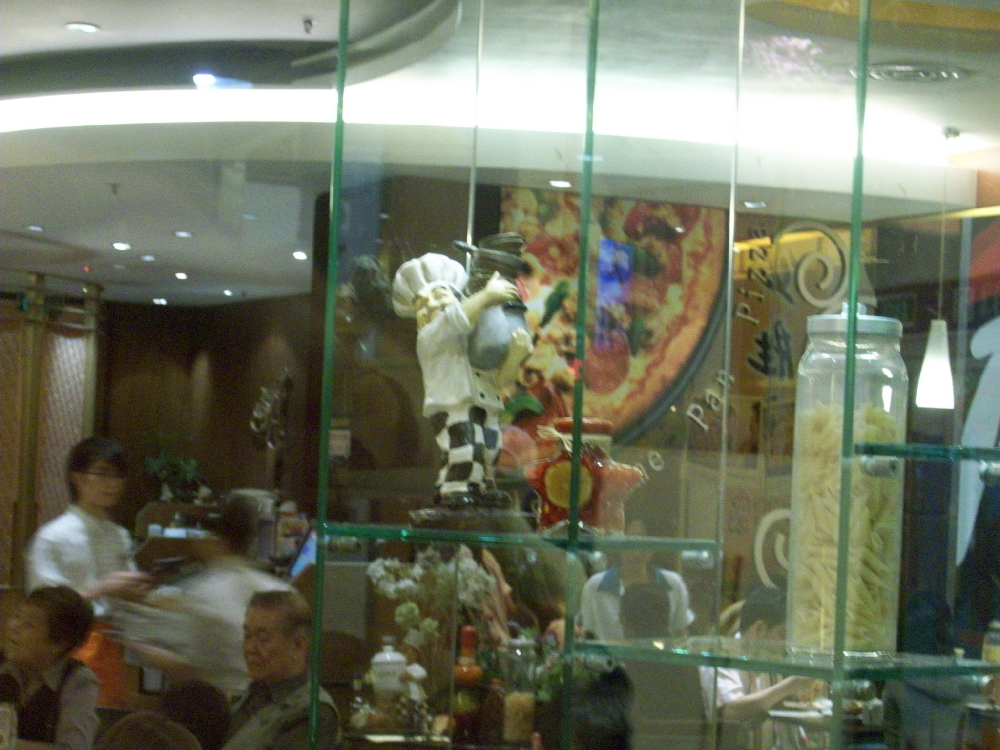
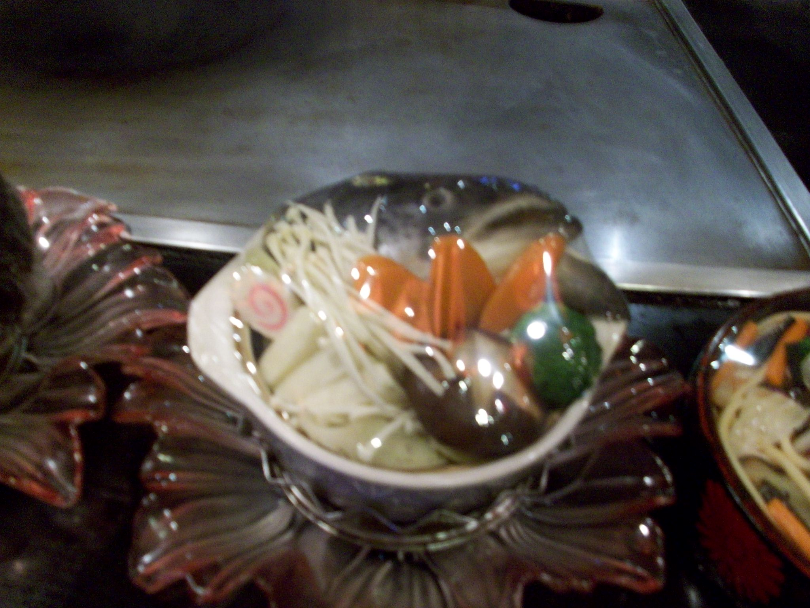
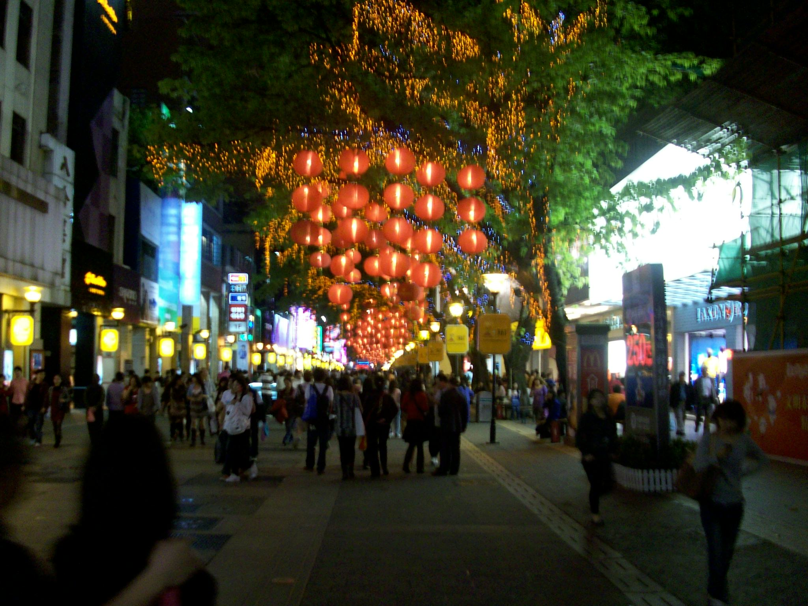
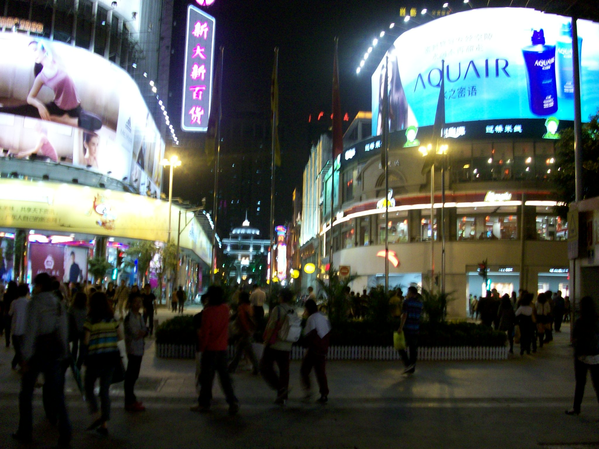
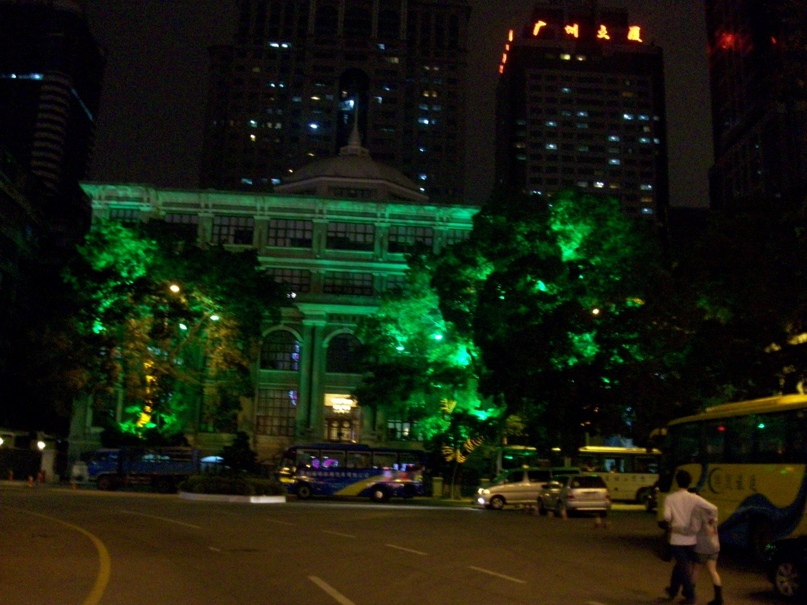

+++
title = "Beijing Road"
date = "2010-03-21T13:49:24+00:00"
tags = ["China"]
categories = []
image = "100_0055.JPG"
+++

Beijing Road is a pedestrian mall where they shut down several blocks of the road to traffic, and allow people to walk up and down the street browsing the different shops. I went there with two other foreign teachers and Zac bought a Rolex (or Faulex) from the upstairs room of some subtle little backstreet shop.

Photos:

