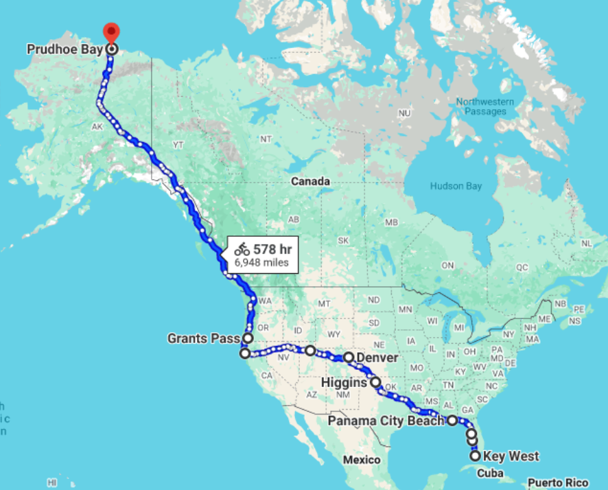

+++
title = "Bike Trip FAQ"
date = "2018-03-02T20:06:00+00:00"
tags = ["Bicycle Trip"]
categories = []
image = "FloridaAlaskaMap.png"
+++

<h3>Where are you going?</h3>
Across North America. From Key West, Florida to Prudhoe Bay, Alaska.

<h3>How long will it take?</h3>
Hopefully three months. I have accepted my usual summer job at CTY (in Pennsylvania) and I need to report for work on June 21st. I'm leaving March 12th.

<h3>Is anyone going with you?</h3>
For the most part, no. I plan to take most of the trip as a lone wolf. But! My friend Katie will join me for the last one to two weeks through Alaska! I also have a few friends along the way who will ride for a day here and there.

<h3>What kind of bike do you ride?</h3>
If you like talking specs on top end bikes, I'm not the guy you should be talking to. I ride a diamondback 7-speed hybrid that I got from Dick's sporting good in 2010 for $200. We've been through a lot together and I look forward to completing this trip together. The wheels and cables are upgraded to handle this kind of touring.

<h3>How can I help?</h3>
Thanks for asking! If you live along my route or know someone who does, I'm always looking for places to stay. It feels amazing to have a shower after a long cold day of riding. This is the biggest help of all.

You can also encourage me. Many days are emotionally draining. Obstacles include mechanical problems, detours, soreness/injury (I'm not 20 anymore, sadly), cold, wind, and many others that I won't even know to expect. An encouraging message goes a long way.

<h3>Can I help by giving money?</h3>
I certainly won't turn down your money, but lodging and encouragement really do go a long way. If you do want to give money, my BTC, BCH, and ETH addresses are listed in the footer. 

<h3>Why are you doing this?</h3>
Vanity of vanities; all is vanity.
What profit hath a man of all his labour which he taketh under the sun?
One generation passeth away, and another generation cometh: but the earth abideth for ever.
The sun also ariseth, and the sun goeth down, and hasteth to his place where he arose.
The wind goeth toward the south, and turneth about unto the north; it whirleth about continually, and the wind returneth again according to his circuits.
All the rivers run into the sea; yet the sea is not full; unto the place from whence the rivers come, thither they return again.
All things are full of labour; man cannot utter it: the eye is not satisfied with seeing, nor the ear filled with hearing.
The thing that hath been, it is that which shall be; and that which is done is that which shall be done: and there is no new thing under the sun.
Is there any thing whereof it may be said, See, this is new? it hath been already of old time, which was before us.
There is no remembrance of former things; neither shall there be any remembrance of things that are to come with those that shall come after.

<h3>But really, Why are you doing this?</h3>
This is my vision quest. I got tired of working my regular job, answering to the man, and putting up with #WhiningAndComplaining. I want to do something that challenges me and requires me to be tough when it would be easy to quit. I also want time to meditate and decide what I want to come next in my life. I need a chance to encounter real problems, not just problems that someone made for me, and be forced to solve them.

