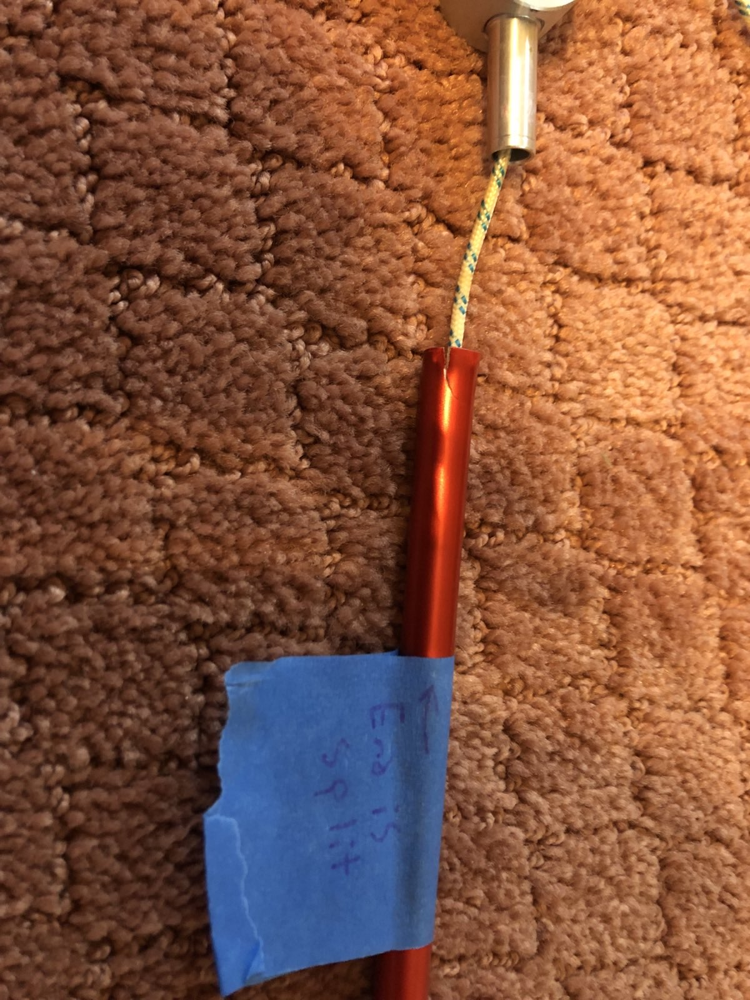

+++
title = "Family Camping and Gear Update"
date = "2025-08-12"

tags = [
    "Camping",
    "Family",
    "Memories",
    "Parenting",
]
categories = []
image = "camping-cover.jpg"
+++

Camping has been a notable part of my life including cub scouts and boy scout, family camping trips, college running friends camping together, and my bicycle trips. I have done very little camping (or blogging for that matter) since the unsuccessful end of my 2018 bike trip. I have camped a few times since then with Forest. Here's an update on our recent camping and our family camping gear.

## After the Bike Trip

For the ten days of my 2018 bike trip I was using my tiny bivy that I got on my 2013 bike trip. It served extremely well, but I was growing tired of only being able to lay down in the tent. I wanted something bigger that I could sit up in. At the time I thought I would return to the bike trip shortly so I bought a 1-person MSR Hubba tent. Well I never got back to the bike trip so I had a brand new tent sitting around for a while.

## 2021 Virginia

The first time I actually used the 1-person tent was camping with Forest in 2021 when he had just turned one year old. It was at a family reunion that I had attended and camped at as a kid so I was excited to do it. He was little enough that we both fit in the one person tent. He woke up crying once in the night. I guess maybe he was hot and confused and uncomfortable. But there was nothing really to be done about any of that, so I gave him some water and snuggled until he fell back asleep. The beautiful simplicity of life when you're camping: there is nothing to be done until morning, so relax into your situation and try to sleep.

## Spring 2025 Camping

We took another pass at camping this past spring. Forest is now old enough to get excited about the idea, and help with the gear somewhat, so we set up camp in the yard.

### The Gear

We had three tents in our possession and decided to set them all up to check their condition and practice with different types of tents and poles.

* My old bivy
* The  1-person MSR
* An 8-person steel-pole tent from c.2000 inhereited from a family friend.

### First Night

Setup was mostly fun, although the figure-this-tent-out part was not as fun as the follow-dads-direct-instructions part. We had a camp fire and smores and read books and colored in the tent. Julie hung out for a while, but didn't spend the night. In the morning we naturally woke up early, started another fire, played in the barn and yard, then came in and got ready for school.

### Second Night

Well when Forest got home from school the tent was still up and he did not like my plan of taking it down together. He wanted to camp again. We agreed that he could camp again, but he ahd to go to bed at his normal bedtime of 8:00 and not stay up to have a camp fire after dark. He was all about it and he even went out to color in advance of bedtime. We did his normal bedtime in the tent and he did awesome. I can out around 11:00 and slept in the tent and we made it all night again!

We decided if he wanted to camp a third night it was mom's turn.

### Rain

But there was no third night because it started to rain. We left the tents up though. Partly to see how water proof they are, but also because we didn't get around to taking them down. It rained for days and I checked them occasionally. The bivy and 1-person were good, and the 8-person was taking on a tiny bit of water, possibly through the door.

But then the rain got heavy. The bivy's window got destroyed. I'm sad to call it the end of the road, but I know that bivy served me well and didn't owe me anything.

The 1-person filled with water. Julie discovered it, and I think the rain fly may have blown off. When I went to move it, I underestimated the weight and busted out the end of a tent pole.

The 8-person also filled with water, and we aren't sure why. Possibly just because it's old, but it seemed okay for a few days. I think we had the door setup poorly and water funneled in through the screen. More data needed.

## Tent Pole Repair

The 1-person poles were slightly roughed up when we got them out. there was a slightly bent pole (not really a big deal) and the shock cord was mostly shot. Now there was also a blown out end making this tent kinda hard to use. I discovered tentpoletech.com and for about $60 total, they fixed my poles and replaced the cord. Good deal IMO.

The one section is replaced with a different color. Maybe slightly annoying, but honestly I like that they recycle.

## More Experience

Forest is excited to camp more, and I am too, so I hope to get another session in this summer.
