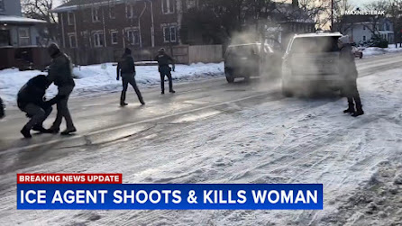
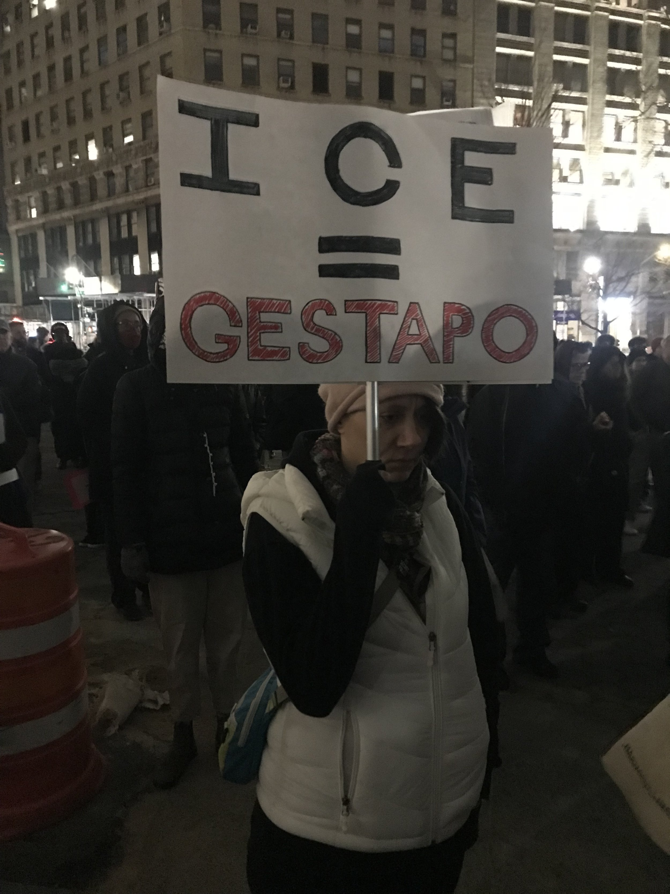
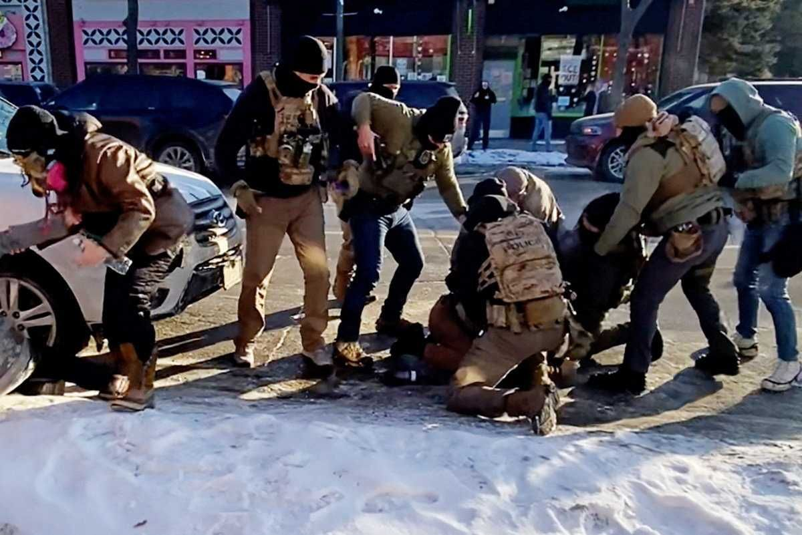
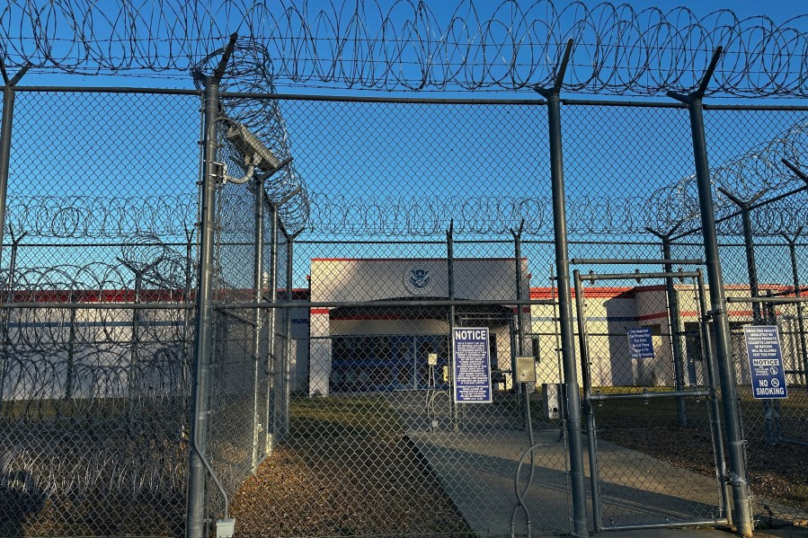

+++
title = "That Couldn't Happen Here... Right?"
date = "2026-07-29"

tags = [
    "Philosophy",
    "Morality",
    "History",
]
categories = []
image = "ColumbusNazis.jpg"
+++

I have this distinct memory from third grade when I was in Ms Tatum's class. The music teacher, Mr Stephenson, had been teaching us about songs from world war 2 era. He discussed several, but the only one I specifically remember is [Boogie Woogie Bugle Boy](https://en.wikipedia.org/wiki/Boogie_Woogie_Bugle_Boy). But he quickly realized that most of us eight- to nine-year-olds were not familiar with world war two at all. And since he was personally very interested in the topic, he spent a class period getting us up to speed on what all had gone down in Nazi Germany in the 30s and 40s. After music class, Ms Tatum came back and found us, her students, distressed from what we had learned and dedicated more time to it trying to reassure us. The part I remember most is one of my classmates asking her, "That could never happen here, right?" She assured us that it couldn't because we had strong morals here and if anyone tried that everyone else would immediately stand up and say no way.

## Well look where the fuck we are now

It's not just what ICE is doing. It's the fact that they have not been prosecuted or investigated. It's the fact that the dictator is preparing for another term in direct contradiction to the [22nd amendment](https://en.wikipedia.org/wiki/Twenty-second_Amendment_to_the_United_States_Constitution). It's the fact that there was already a coup attempt in 2021.

## Whose fault is it?

Of course it is partly the fault of the people who are trying to seize power. But more so, it is the fault of the people who were supposed to stand up and say "no way". It's the people who are saying that this is all legal and will work itself out if we just hope and vote. It's the people who are too afraid to call out their neighbors, and family. It's the people who continue to be friends with supporters without calling them out because they don't want to make it awkward. Are you standing up? Are you protesting? If not, you are the problem.