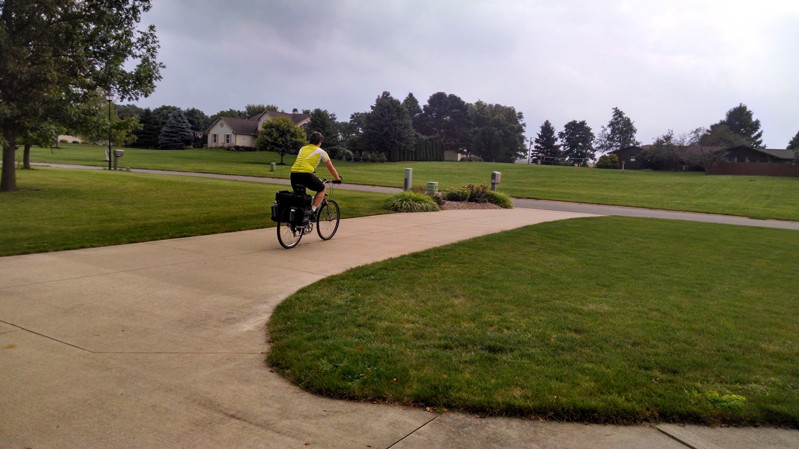
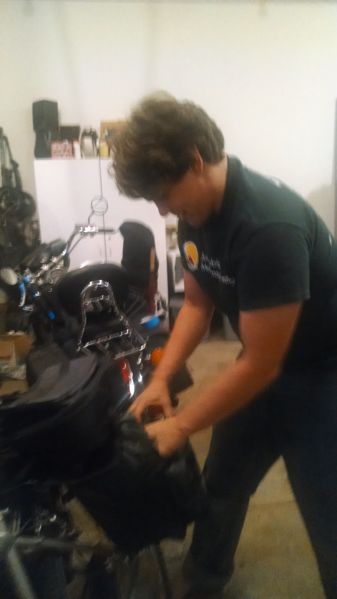

+++
title = "Day 0 -- Preparation"
date = "2014-08-13T01:58:21+00:00"
tags = ["Bicycle Trip"]
categories = []
image = "IMG_20140812_103433252_HDR.jpg"
+++

I've been in Huron getting set up for three days now, and I think I have everything ready to go for this second trip. I'm not as nervous as I was for the last one. I think it's mostly because I know what to expect more this time. My first day will not be as long, and I know I have better gear this time. On the other hand I'm heavier than I was last time, so hopefully my wheels hold up.

Wish me luck everybody!

Today's distance: 0 km
Average speed: ? km/h
Trip odometer: 0 km

Photos:

