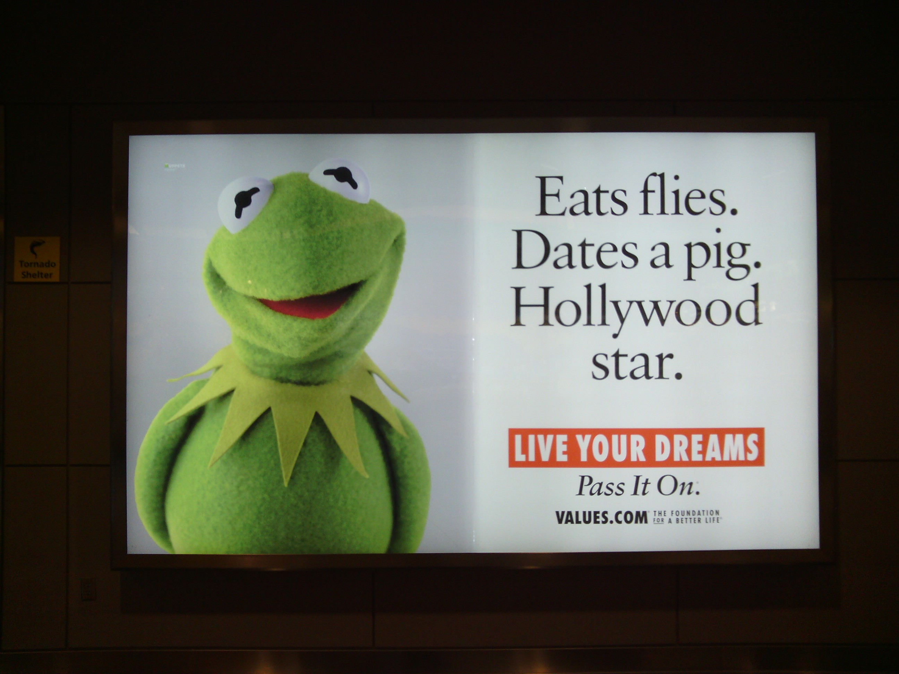
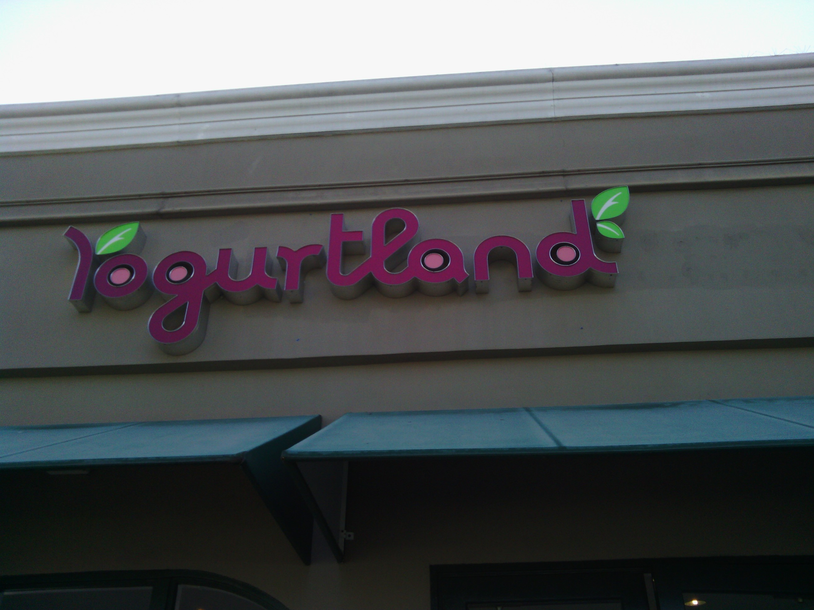
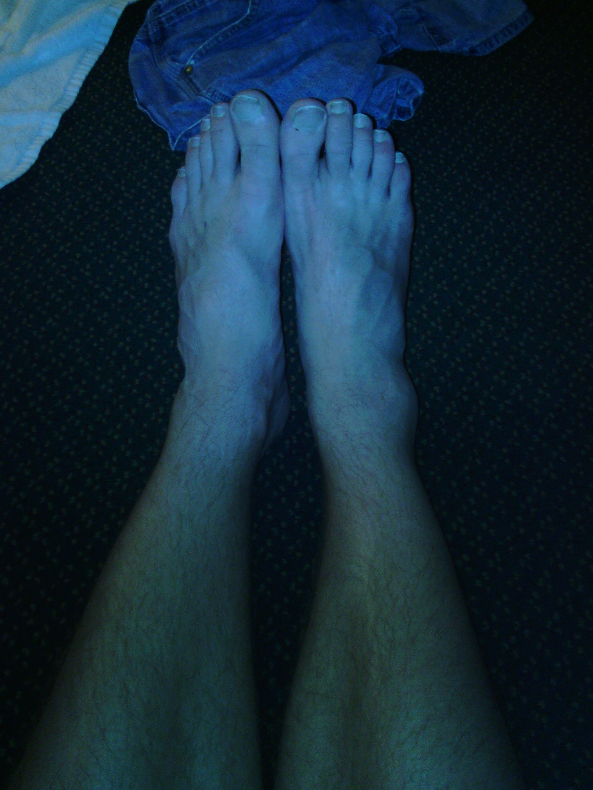

+++
title = "Day 0 -- Preparation"
date = "2013-05-04T00:50:31+00:00"
tags = ["Bicycle Trip"]
categories = []
image = "IMG_20130502_221543.jpg"
+++

I flew Frontier airlines to Los Angeles a few days ago. I've picked up the last few bike accessories, and gotten myself excited about the trip. The bike is ready to go with lights, installed bags, and a puncture proof rear tire. I saw my old friends, and got some yogurt land. I'm a bit nervous, but I think I'm ready to go. Tomorrow I'll get a ride to Santa Monica pier, take a picture, and take off for Boston.

My packing list is as follows:
* <a href="http://www.amazon.com/Topeak-Alien-26-Function-Bicycle-Tool/dp/B000FIE4AE/">Topeak alien II</a> multi tool
* Hand air pump
* Diamond Back 7 speed hybrid bike
* Clip-in bike shoes
* Bike lock
* <a href="www.amazon.com/M-Wave-122310-3-Piece-Traveller-Pannier/dp/B003BJ9Q9I/">M-Wave</a> paniers
* Headlight / taillight set
* One man tent
* Synthetic sleeping bag
* Inflatable raft to use as a pillow
* several zip ties
* 1 pair of cycling gloves
* 1 cycling top
* 1 spandex top
* 2 cycling bottoms
* 2 casual shirts
* 1 pair of jean shorts
* 3 pairs of socks
* 3 pairs of underwear
* 1 pair of cheap flip flops
* sunglasses
* sunscreen
* 4 ~liter water bottles

Wish me luck everyone.

Today's distance: 0 km
Trip odometer: 0 km

Photos:

