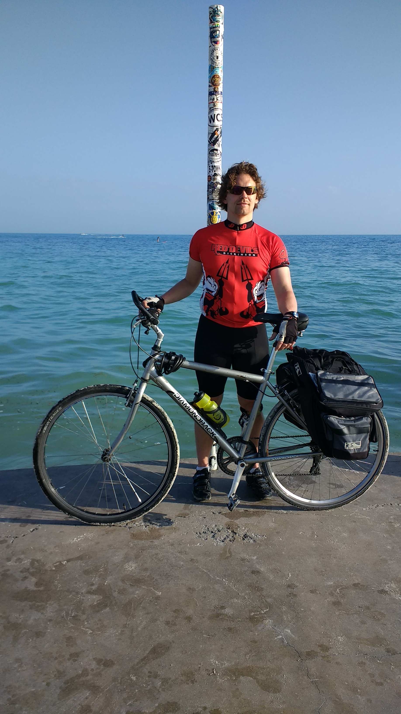
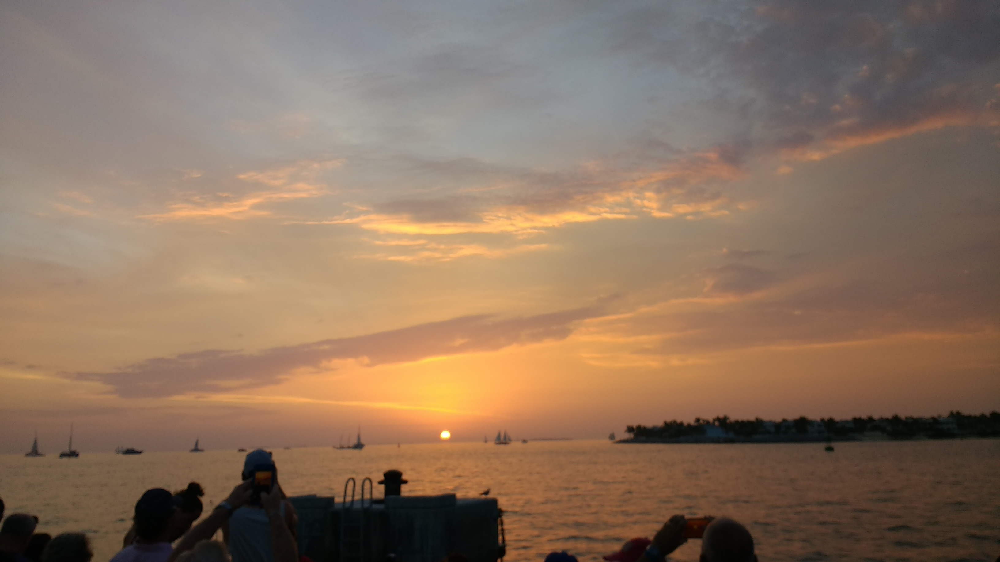

+++
title = "Day 0 -- Starting in Key West"
date = "2018-03-12T01:09:56+00:00"
tags = ["Bicycle Trip"]
categories = []
image = "IMG_20180311_180203635.jpg"
+++

Last Thursday, mom, dad, Sarah, and John flew down to Florida with me and we've been on vacation in Key West since. Lots of good food, snorkeling and fun.

While the serious riding begins tomorrow, I put in a test ride today and took care of the first few kms. I've had a few minor setbacks including my back wheel being pulled significantly out of true during shipping, and my phone no longer making voice calls without headphones due to water damage already, but I guess that's how it goes.

After doing my best to get the wheel adjusted, we went to the "southern most point in the continental us" and dipped the wheels. Mom, dad, and Sarah rode the half hour ish back to the condo with me.

Daily distance: 6.77 km
Average speed: 14.4 km/h
Trip odometer: 6km (apparently my bike computer rounds this number)

Photos:

