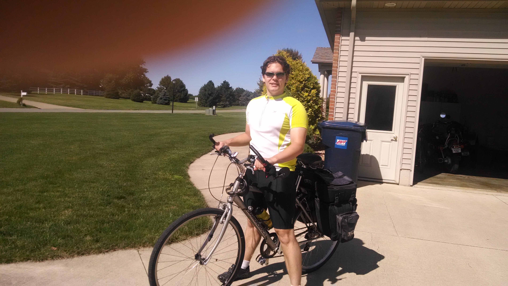
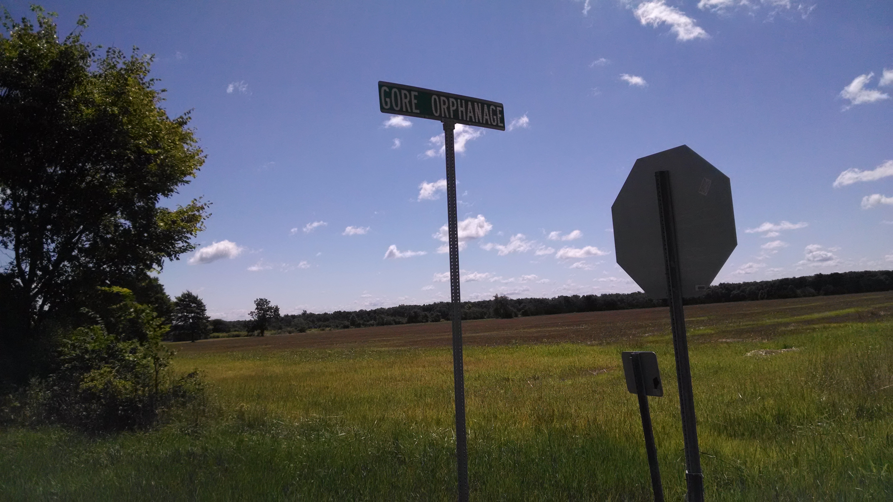
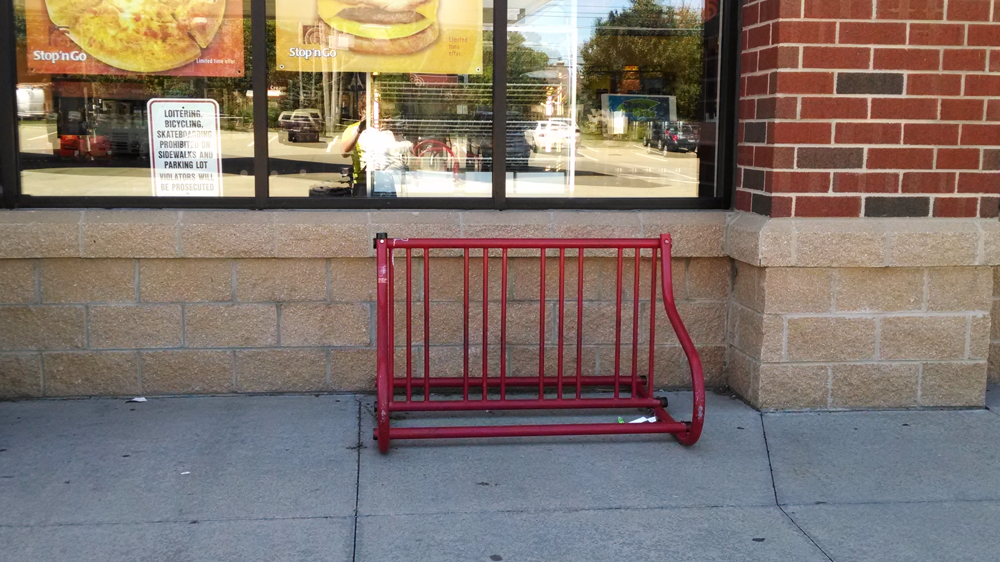
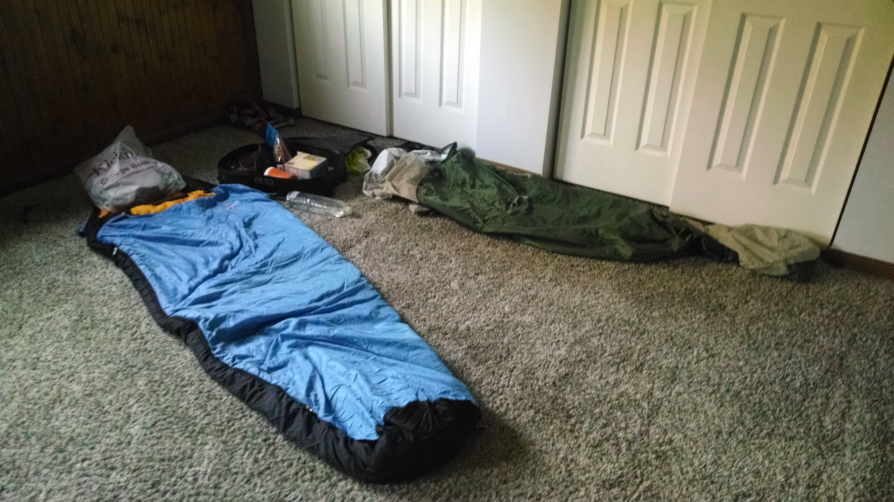

+++
title = "Day 1 -- Huron OH to Medina OH -- Back in the saddle"
date = "2014-08-14T00:52:44+00:00"
tags = ["Bicycle Trip","Travel"]
categories = []
image = "IMG_20140813_105243700.jpg"
+++

I woke up early to be sure I had everything together to leave today. After double checking my packs, breakfast with my mom, and a little nap, I got on the road around 11:00.

It was a tail wind day which was nice because it was my first long ride in over a year. I cruised along fine for the first part of the ride happy that my speed was staying around 28 km/h. As I got to around the halfway point my legs began to feel more sluggish and my speed started to decrease. I didn't like that too much because I had not been riding very long and between the short distance and tail wind I expected to have a pretty easy day.

I made sure to get some Gatorade and food to stay fresh and pressed on. I finally stopped to buy dinner at subway in Medina and found out they were only taking cash because their card machine was broken. That meant I had to use some of my limited cash, but also that I didn't have to pay taxes.

The last 8km to my uncle John's empty for-sale house was downhill and easy, and I finished the day around 3:30.

This was decidedly better than my first day of my last trip for several reasons including shorter distance, tail wind, better training, better gear, and knowing what to expect. Tomorrow will be longer and hillier, but I had lots of time to spare today, so hopefully it will be another good day.

Today's distance: 89 km
Average speed: 26.1 km
Trip odometer: 89 km

Pictures will come later. Signal is to weak here.

Photos:

