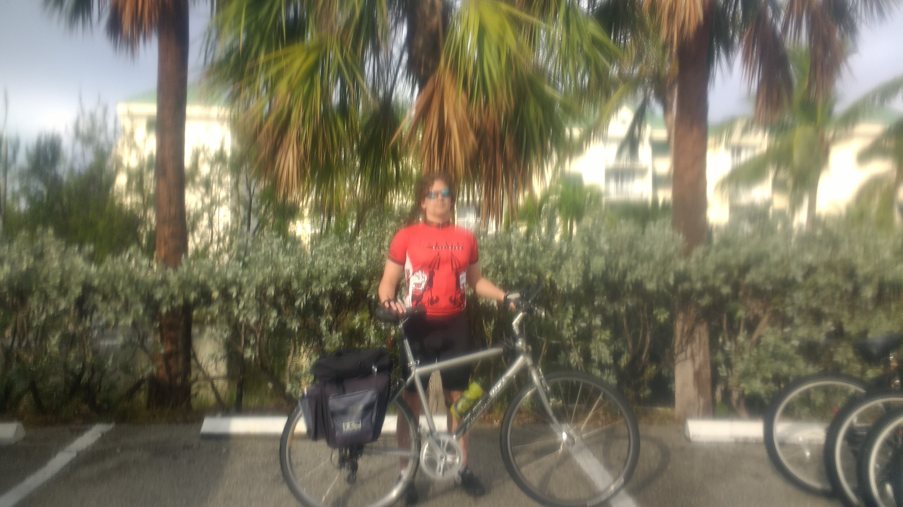
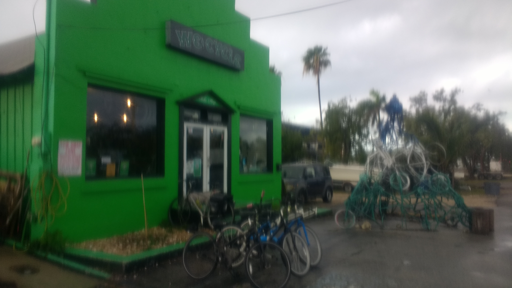
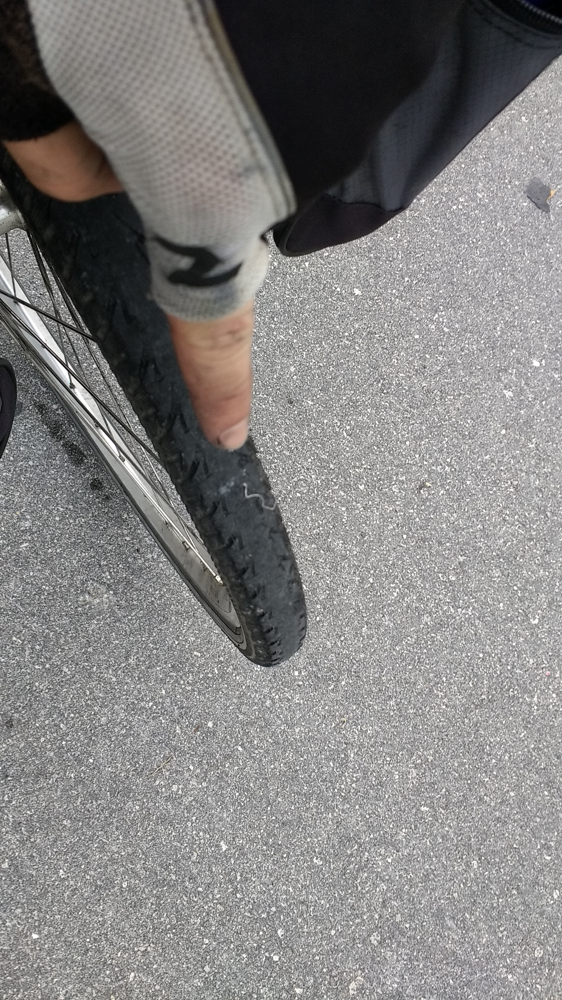
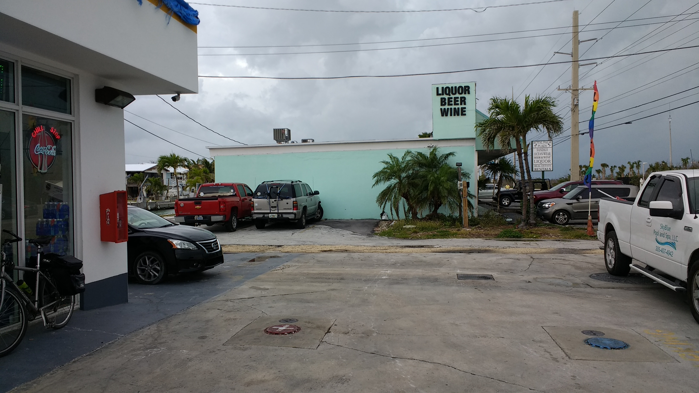
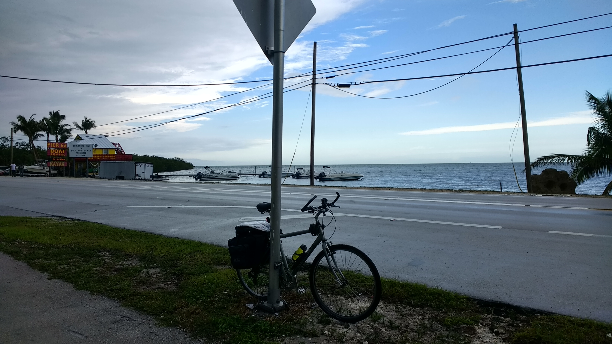
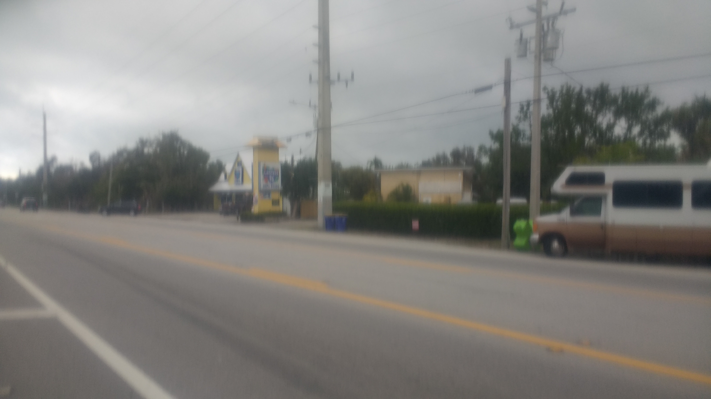

+++
title = "Day 1 -- Key West FL to Key Largo FL"
date = "2018-03-13T01:51:50+00:00"
tags = ["Bicycle Trip"]
categories = []
image = "IMG_20180312_091145911.jpg"
+++

I woke up at the condo shortly after 8:00. The family and I got ready, said goodbye and headed downstairs efficiently, and I was on my way around 9:00. After a quick stop at "We cycle" for air, I set out on the overseas highway.

The first setback happened a mere 6km into the ride when I rode through about a one foot section of grass to cross from road to bike lane. I immediately heard hissing and stopped to find a flat rear tire. Irritating, but I had a spare and it gave me the opportunity to put in the puncture proof liner that I hadn't gotten around to yet. I reinflated with my hand pump and put the wheel back on. It was hard to get on because the skewer nut wouldn't turn - likely a result of shipping and related to the completely loose spoke I discovered on my practice ride. By the time the wheel was back on, the tire was flat again. I pumped it the best I could and turned around to head back to the shop. It was a little early in the journey to be backtracking but such is life. At least it gave me a chance to appreciate the tailwind that I would have all day. Before I got back the tire went too flat to ride anywhere and came off the rim. I ended up walking the ~1.5 km to the shop.

Luckily the lady there found additional glass in the tire that I missed, fixed the skewer, and sold me some extra tubes. I got back on the road around 11:00.

It was smooth sailing for a while as I watched carefully for any hurricane debris to puncture my third tube of the day. It rained for a while in the afternoon, and I got to cross the seven mile bridge during an intense thunderstorm. Cool video on the go pro, but you might have to wait a while to see it. Despite the rain and storm, that was probably my favorite part of the day.

But the city/metropolis of Marathon was next and is where I received my only two angry honks of the day. I briefly stopped there to have some granola bars, fill bottles, and dry out before continuing to cruise.

I was making good time, and my mood got even better when the skies cleared. I stopped for linner around 4:00 at subway (thanks Sarah and Johnny) and let my shoes and socks dry out front. The second half of the sub got to ride the rest of the way to Key Largo with me for dinner.

I reached Key Largo Kampground just after 6:00 and snuck past the gate to try to get a free site. Some combination of conscience and fear of getting busted led me back to the office where I learned there were no sites. Luckily the host hooked me up with another cyclist who was tenting there long term. Unluckily the dude still wanted $30 to use part of his site. At least it was less than the official campground rate of $50.

There were definitely punches to roll with today, but compared to my first day out of LA in 2013, this was a big success. The distance was roughly the same, but I knew much better what I should be expecting, and how to cope with setbacks. I didn't even have to sit on the shower floor for half an hour hoping my bike would get stolen this time! My butt does hurt more than expected though.

Daily distance: 162.59km
Average speed: 24.3km/h (not bad considering it includes walking)
Trip odometer: 169km

Photos:

