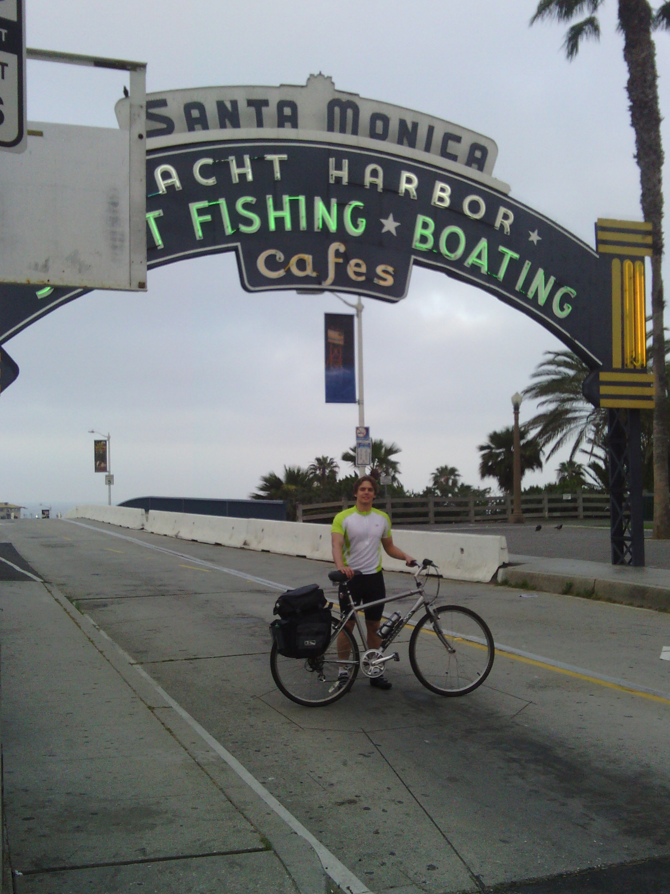
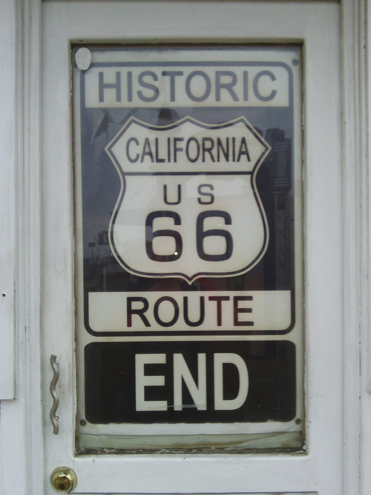
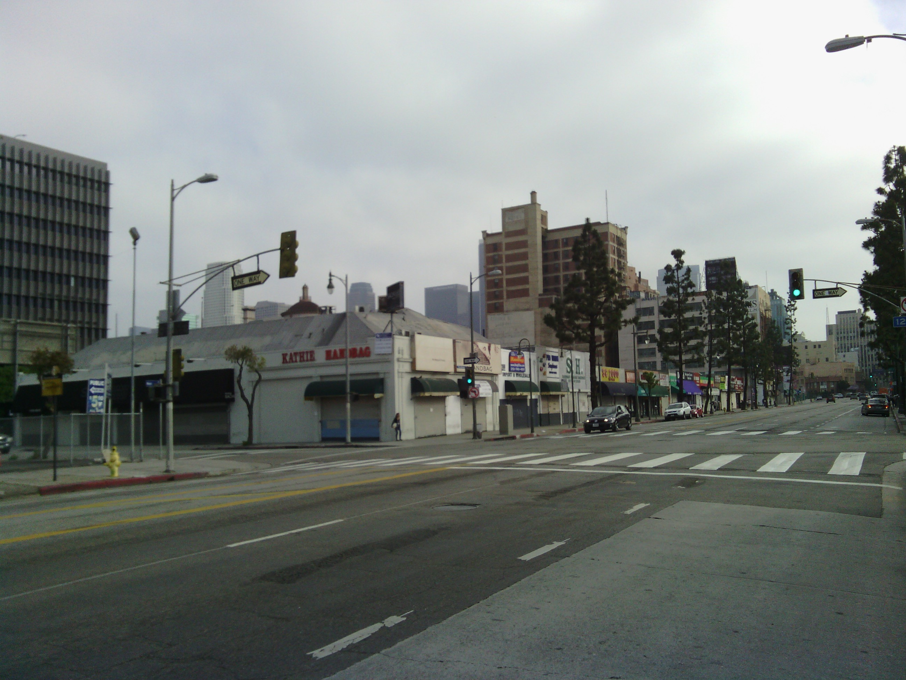
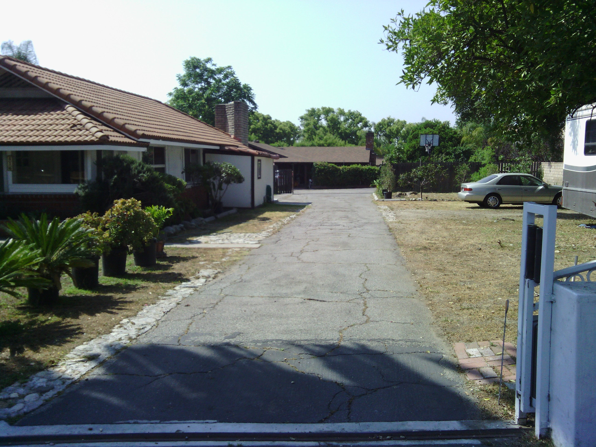
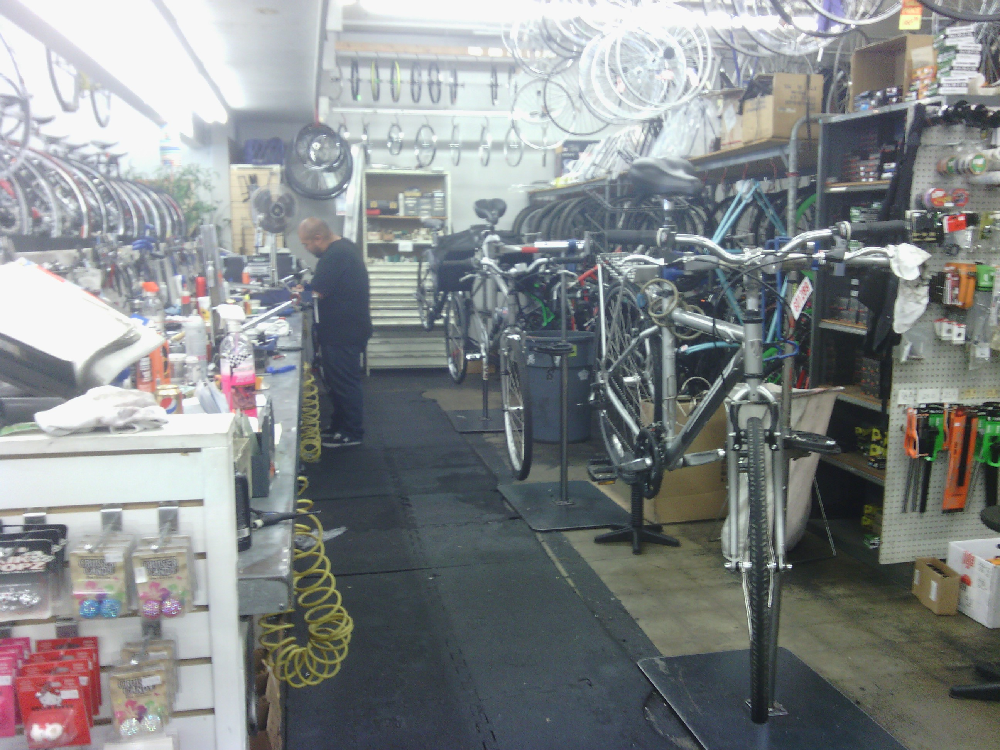
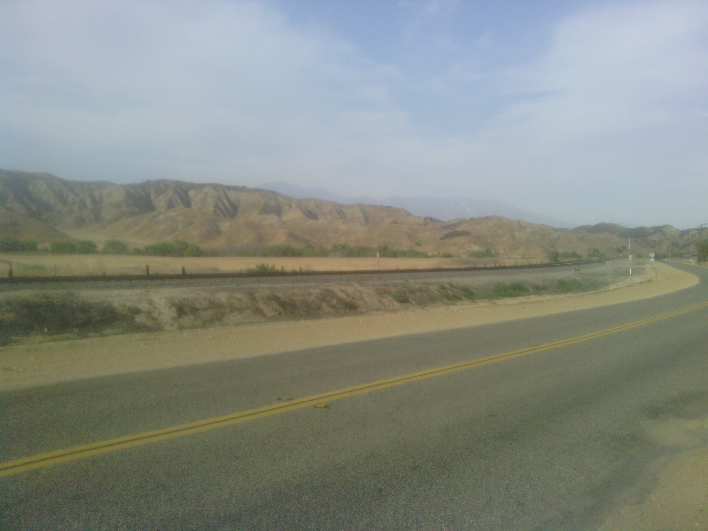
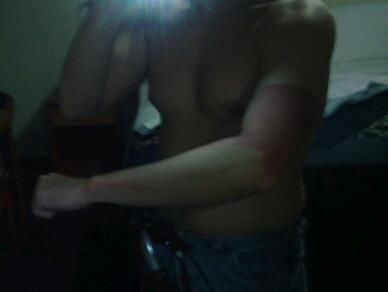

+++
title = "Day 1-- Santa Monica CA to Beaumont CA -- A long initiation"
date = "2013-05-05T04:04:22+00:00"
tags = ["Bicycle Trip"]
categories = []
image = "IMG_20130504_063726.jpg"
+++

I guess it's time to admit a few things. First, my training for this event was insufficient. Second, my planning for this event was also insufficient.

This morning my friend Amanda made me breakfast and drove me to the Santa Monica Pier to start my adventure. I got some good pictures there and accidentally got my feet wet in the ocean and then took off for Los Angeles. Downtown was great. Every road had bike lanes, and in no time I was cruising past my old house in Arcadia. I made a quick stop at the library to refill my bottles and check the map. As the day continued I cruised through the suburbs to the east. The wind was at my back and I was feeling strong.

As I was cruising up the hill in Glendora I heard a loud snap and pulled over to check on my bike. Everything seemed fine so I kept going but not long later my back wheel started to rub the brakes. Looking again I realized I had broken a spoke. I grabbed  the phone to find a local bike shop, and after disconnecting my rear brake I rode in to see what they could do. They fixed it up quickly and even gave me a 50 percent discount after I told them about my trip. But they did warm me that my bike was maybe not built for such a long trip and some of the components were a little low end. I had suspected that earlier, but the mechanic in LA assured me that it would be fine. The guys today said it might be okay, but I should stop into a shop every few days.

After a lunch stop at Subway around 1:00 I continued heading east happy that my average speed was around 22 km/h. I ran into another cyclist and he seemed excited about my trip but cautioned me about the very long desert stretch I had planned for day three.

Everything changed around 4:00. Google had directed me onto a gravel path, so I had to backtrack a bit to get on the right track. It was a small setback, but frustrating. When I got on the correct desert road to Beaumont, the hills began, but worse the wind switched to be in my face. My legs got tired, my breathing got quick, my spirit sank, and I spent nearly two hours in second gear. At one point I even decided to walk for about ten minutes. My increased rate of checking the map and forgetting to turn off GPS drained my phone to below 15%. 

When I finally came over the last hill with the wind howling in my face and saw a gas station, I felt some relief. I bought a huge gatorade, chugged it, laid down on the sidewalk and started calling hotels. I didn't quite make it to the campground in Banning, but I did ride 168km today. Although I was thinking of reasons to quit this trip, a gatorade and a rest stop had encouraged me to press on. As my friend Karl Hein says, "if you can make it one day, you can make it two". And I made it one day!

I'll have about nine hours of sleep tonight instead of about six last night, and the ride should be shorter tomorrow (although I am going to reconsider my route a bit after my new cycling friend's warning). I'll also be sure to apply my sunscreen more evenly tomorrow, and drink more gatorade instead of just water. 

Today's distance: 168 km
Trip odometer: 168 km

Photos:

Comments:

> Dude, glad to hear you got throught the first day.  Keep your spirits up and don't get down on yourself.  Remember to improvise, adapt and overcome. Most of all enjoy yourself and stay safe.  Ted and Syd
> **torndorff**