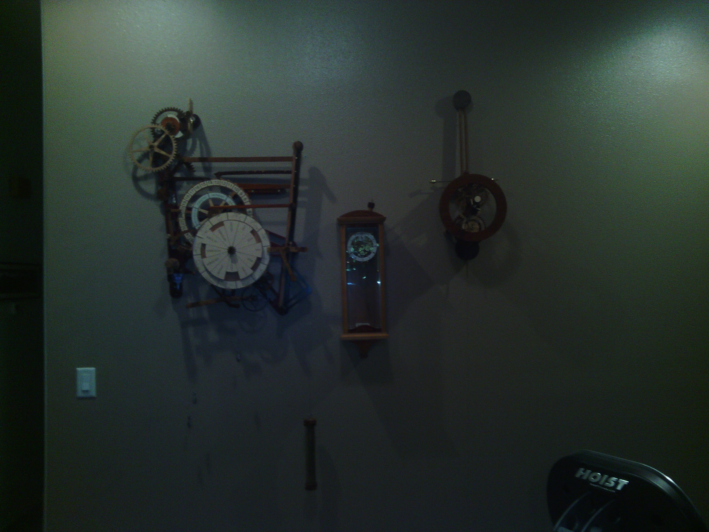
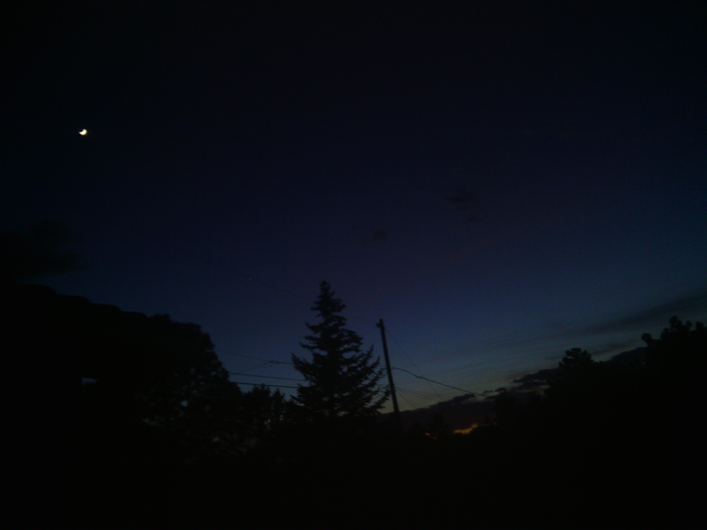

+++
title = "Day 10 -- A day of rest"
date = "2013-05-14T03:40:37+00:00"
tags = ["Bicycle Trip"]
categories = []
image = "IMG_20130513_214227.jpg"
+++

Today's total distance was 0.0km! That's right, I took a day to let my body recover, plan the route more carefully, and catch up on emails, the job hunt, and other aspects of life that missed the memo stating I would be off the grid for six weeks.  I stayed with Phil in Gallup, NM again, and he let me use his computer all day long.

Aside from catching up on all that stuff, it was good to let my body rest for a few reasons. The most obvious is probably that my legs were tired. I jumped into this with less training than I should have, gained a lot of elevation, fought the wind, and had two longish days in a row before getting here.  I actually think my legs were holding up quite well considering all that, but  it was still good to let them rest for a day. Hopefully they will be nice and fresh when I start again in the morning because I have several long days again this week. But I'll be crossing the continental divide soon, and the wind is forecast to be more at my back, so hopefully that will help.  Second, my arms and lips were starting to get roughed up by the sun. I've been using sun screen, and I still will continue to use it, but I think it still helped to give them a day of shade.  Third, I started to feel some blisters forming near the end of the ride yesterday. They feel and look good today, so hopefully the day off just turned those hot spots into tough spots that will be relatively blister proof as I continue riding.

Today's distance: 0 km
Trip odometer: 1191 km

Photos:

Comments:

> That sounds good! Did you get to see Jesi?
> **Sarah22bara**
>
>> Jessi was out of town. Luckily she still hooked me up with a place to stay though.
>> **Josh Orndorff**