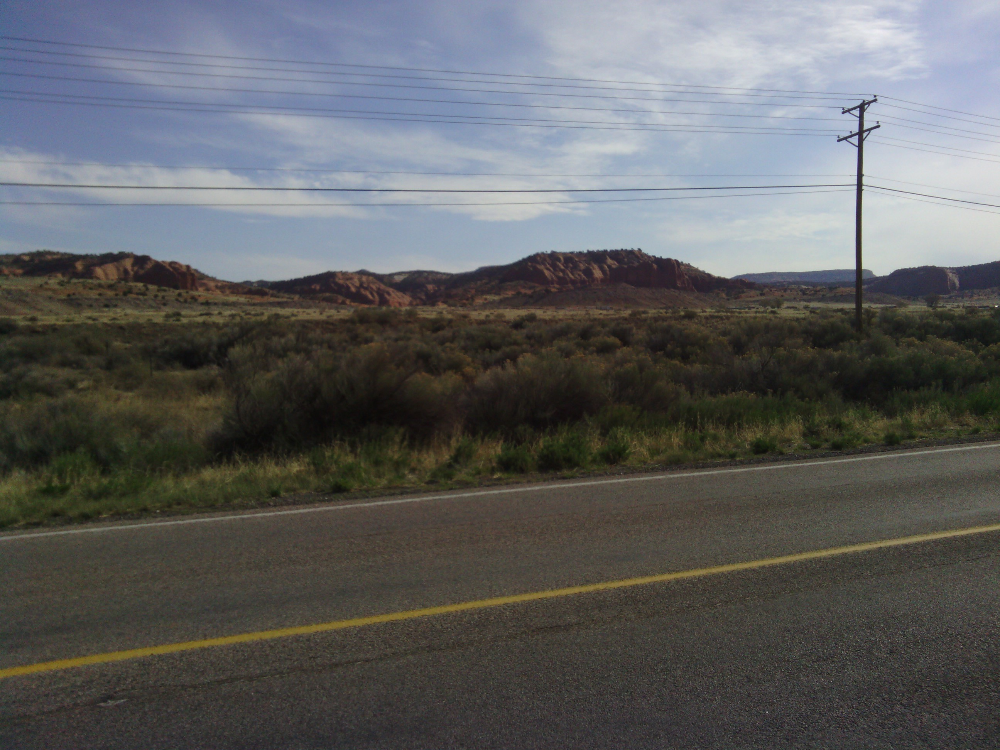
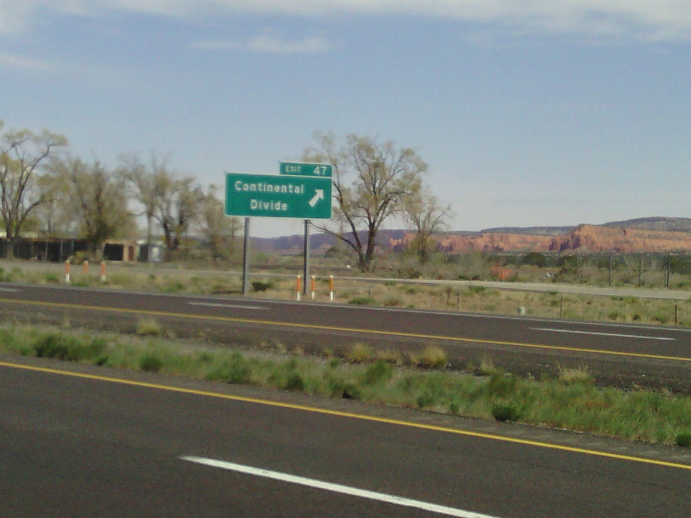
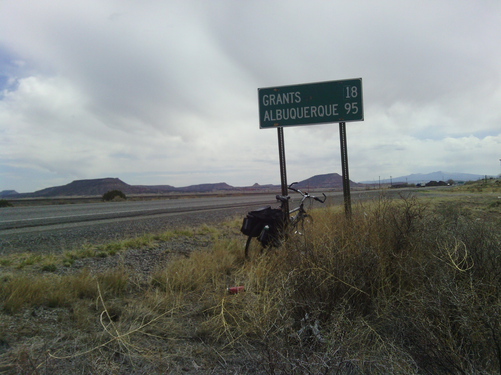
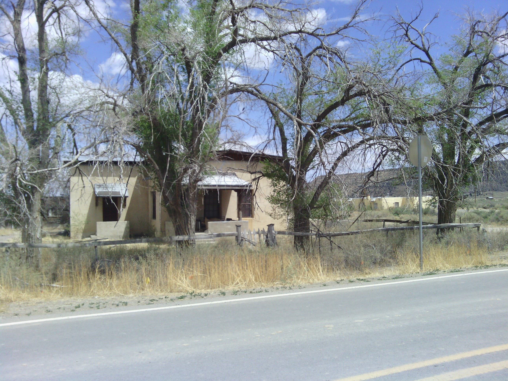
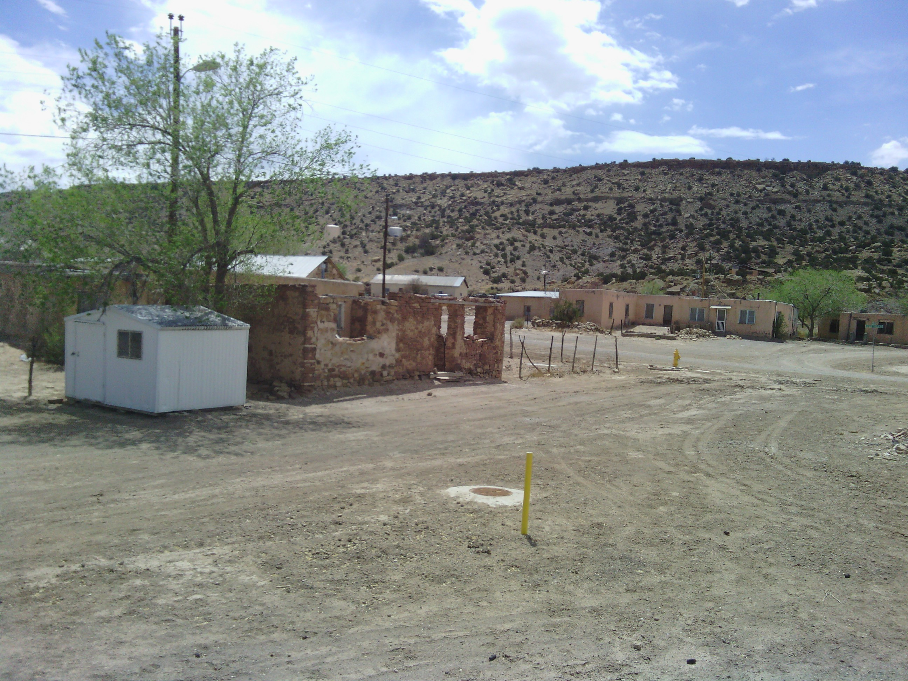
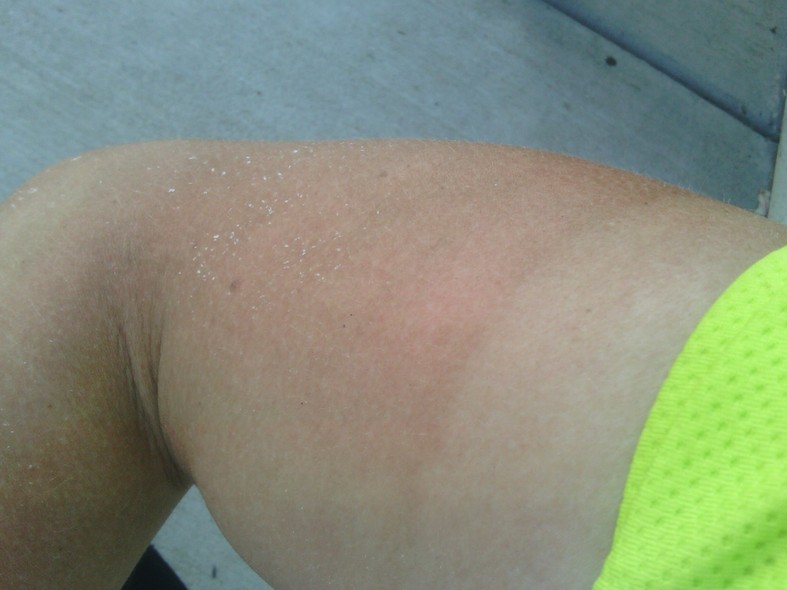
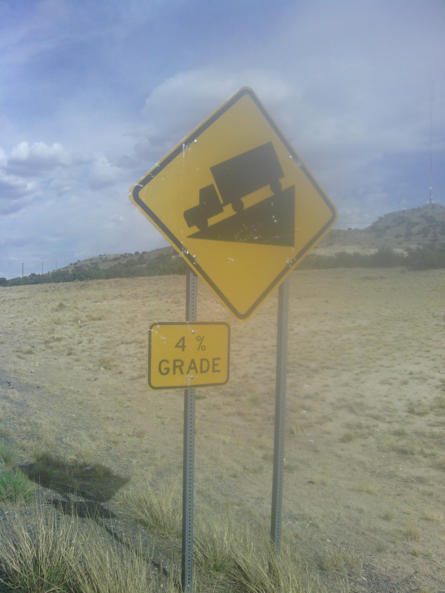
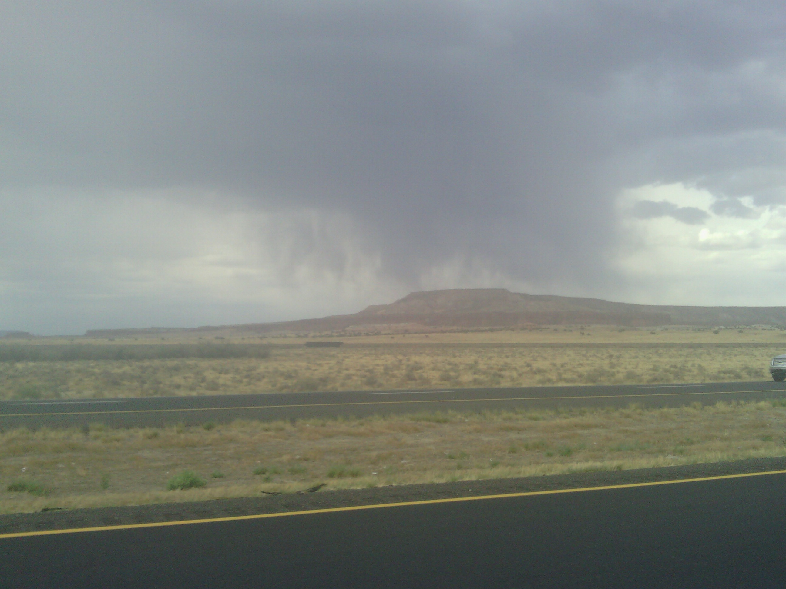
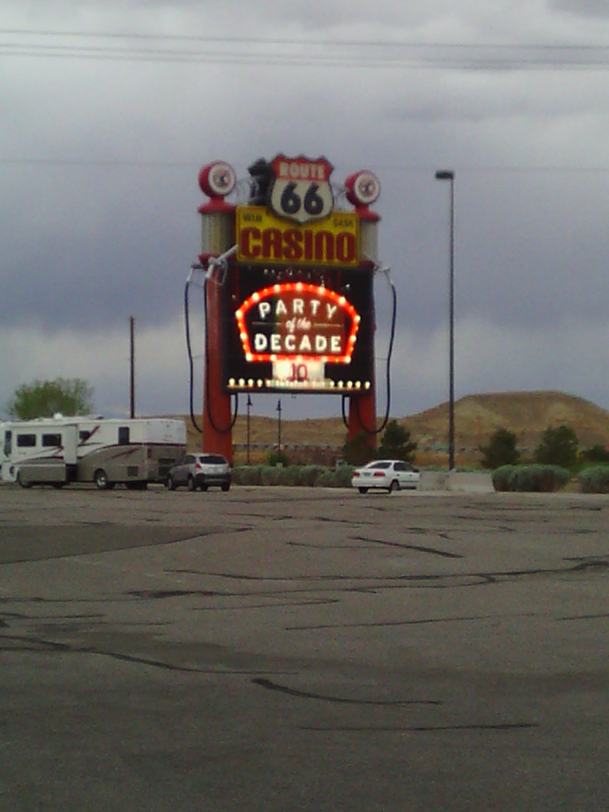

+++
title = "Day 11 -- Gallup NM to Route 66 travel center NM -- Crossing the divide"
date = "2013-05-15T01:45:55+00:00"
tags = ["Bicycle Trip"]
categories = []
image = "IMG_20130514_112356.jpg"
+++

It was a little difficult to get back on the bike after a day of rest, but I managed to leave Gallup around 8:30. The wind was gentle and behind me to begin with just like before, and I decided I should appreciate it while I could because you never know when it will suddenly change. Today's route was mostly frontage roads and the old 66 so it was nice to get off the freeway for a while. 

The wind made the initial uphill totally manageable and it wasn't long before I crossed the continental divide. That felt good because it should be generally downhill from here to the Mississippi. The downhill combined with the wind kept my average speed at 29 km/h for the day, a significant increase from the last several days.

After getting sprinkled on a few times, I arrived at my planned destination, Casa Blanca NM at about 3:00, and rested for an hour before deciding to press on.

Shortly after I took off again the sky turned dark and I could tell it was raining off to the north. I decided to stay on the highway to get to my new destination as fast as possible and hopefully beat the rain.  Again I got sprinkled on a bit, but the hill and wind helped me move fast enough not to get hit. I even got some good use out of my new, higher, 7th gear.

I arrived at the travel center around 6:00, stood by my bike relaxing for a bit, took a "shower" with some wet paper towels, and made my way to the buffet for dinner where I'm posting this on the free wifi. After dinner I'll find a secret camp site out back or just down the road.

Today's distance: 198 km (I thought about riding around the parking lot a few times to get 200, but didn't.)
Average speed: 29 km/h
Trip odometer: 1389 km

Photos:

Comments:

> Hi josh I work with your dad and I heard about what you are doing and I want you to know I'm really enjoying reading your updates and seeing your pictures. What can accomplishment this will be and what memories from what I've read there is no doubt you will accomplish your goal.  bike safe and the very best of luck to you.
> 
> **debbie murphy**
>
>> Thanks for the encouraging words Debbie. The memories will be great for sure. I just hope I crowding on each day :-)
>> 
>> I'm glad you're enjoying reading my updates.
>> **Josh Orndorff**

> Hi Josh!  Keeping track of your journey in the morning to see how you are doing!!!  Love to hear about your adventures and you have done quite a few!!! Keep it up!!!!  Safe travels!!!  
> **Gail Murray**

> Just stopping by your page (so I actually know what is going on and I don't send false information) and I decided to stay away from the physics tab...just in case it would accidentally self-destruct if I go to close. :) Lynn
> **Lynn**
>
>> Haha, probably a good choice. You never know what that tab might do :-)
>> **Josh Orndorff**

> It is clear from the pictures that you have shared that you had a great time exploring the wildness of Gallop with the bike riding trip. The pictures show that the places were really dry and the ride could be hectic. Anyway, I hope that the trip went well. 
> http://www.gregoryspallets.com
> **Amyiksdj10**
>
>> I know this comment is spam, but I'm choosing to leave it because of how impressive its content is. Do you think a human wrote it?
>> **Josh Orndorff**