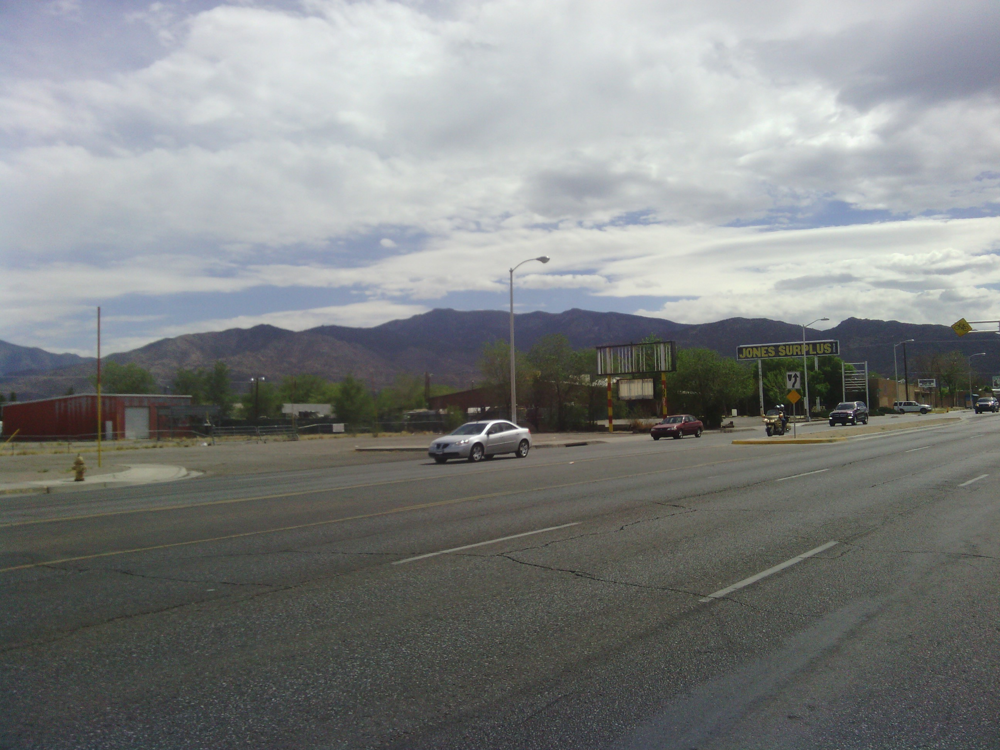
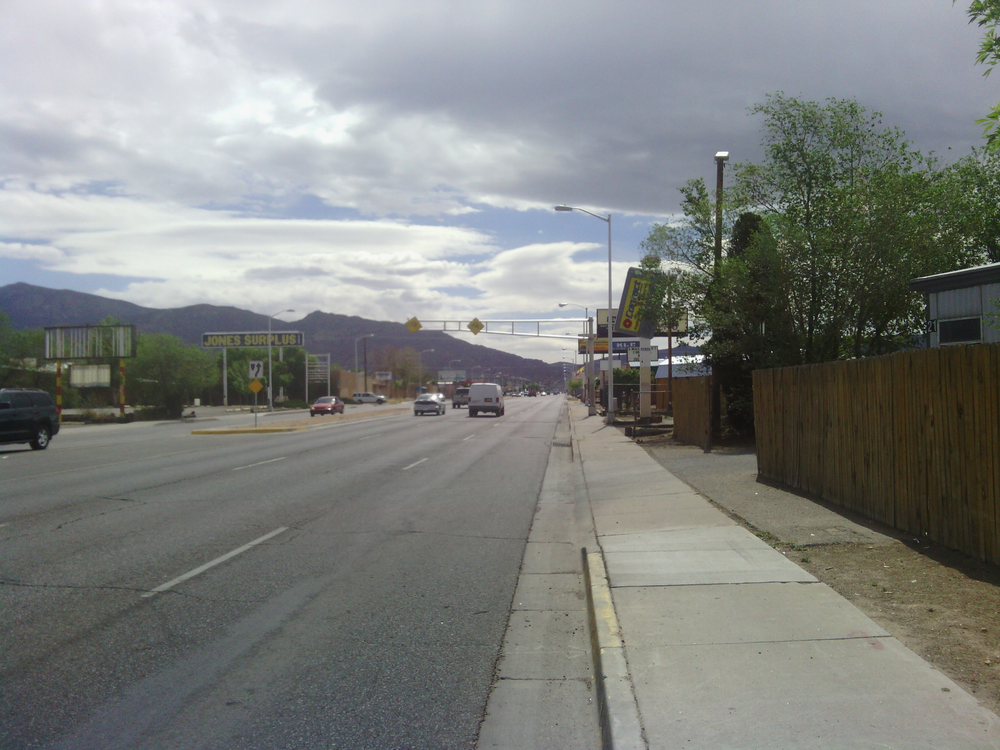
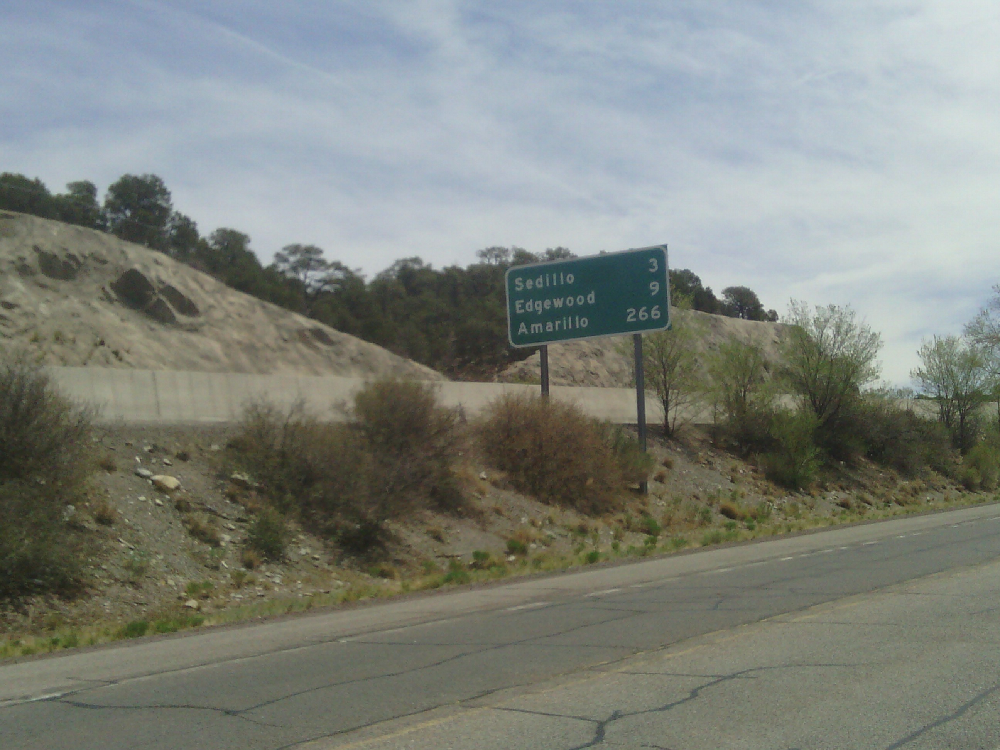
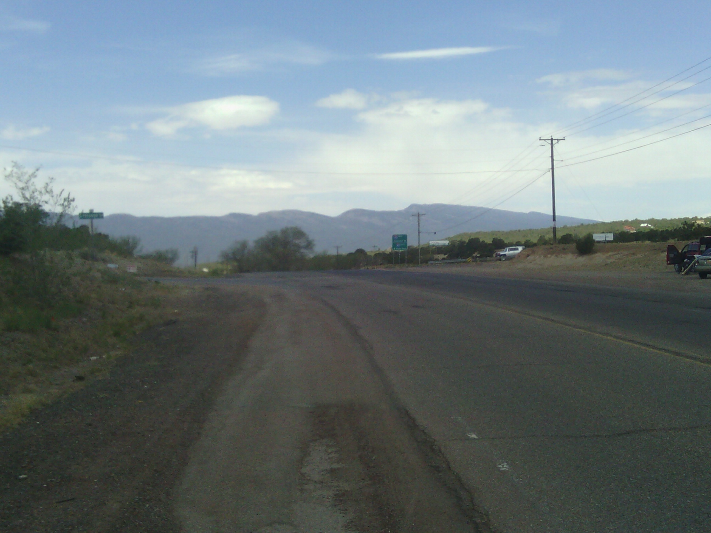
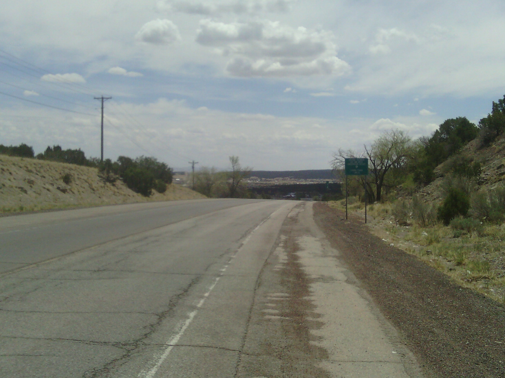
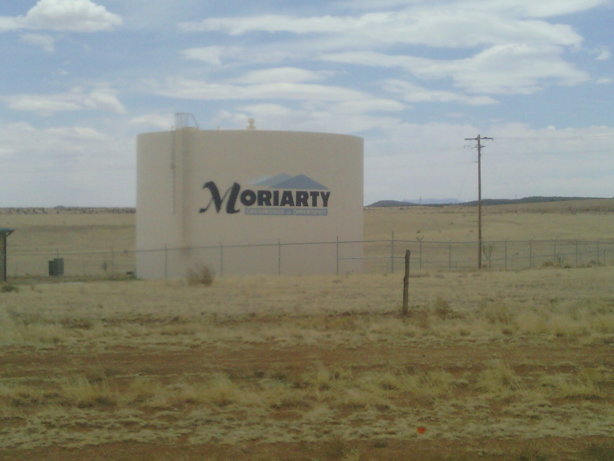

+++
title = "Day 12 -- Travel center to Moriarty NM -- Off the interstate"
date = "2013-05-15T22:57:10+00:00"
tags = ["Bicycle Trip"]
categories = []
image = "IMG_20130515_104107.jpg"
+++

The campsite I found last night was mostly sand but contained a little gravel too and consequently I slept lightly. I woke up in time to see a gorgeous desert sunrise over the mountains that I would later be riding through. The entire eastern sky glowed.

I tore down my camp, ate some egg rolls that I had snuck out of last night's buffet for breakfast, and put on my cycling outfit pretty quickly. But because my phone hadn't charged all night I hung around the travel center for an extra half hour while it charged to 70%. A few people saw me standing by my bike and asked about the trip, and as always it felt good to tell them about it. 

Maybe this should go without saying, but my legs didn't feel real fresh at the beginning of the morning. Most likely because of the long day yesterday. There was a small local uphill on the frontage road to begin the day and I slogged up it at about 12 km/h. After the initial uphill I got into a groove and held a good pace. As I got into Albuquerque the road became steeper and steeper downhill until I crossed the Rio Grande.

Working through the city's various regions and neighborhoods was interesting. It was easy riding with lots of bike lanes just like LA. I'm glad it was a short day though because all the turns and traffic lights were time consuming.

As I left the city I began the ~25 km climb into the pass through the Sandia mountains. I guess it isn't all straight downhill after the continental divide. But the climb was gradual and scenic and I didn't mind it. The old 66 followed more or less along the freeway the entire time and wad marked as a bike route. It felt good to be off the interstate again. In fact, this is the first time since day 4 that I haven't used any interstate at all. (Edit: No it isn't. Day 6 into Seligman didn't feature any interstate either. How forgetful of me.)

After the Sandias I cruised downhill into Edgewood and stopped at a grocery store to restock on granola bars and get some lunch meat for tonight and tomorrow. The final 15 km into Moriarty were straight downhill and I didn't have to pedal at all. That felt great.

I arrived at my hotel around 2:00. Being so early I considered going on farther, but there aren't many cities in the next stretch and I wanted a good place to stay tonight and tomorrow's ride isn't super far anyway. Tomorrow will start with another gradual uphill, and then be lots of downhill. And I should be well rested.

Today's distance: 91 km (my odometer actually says 91.000)
Average speed: [crap, I accidentally reset it - probably around 25 km/h]
Trip odometer: 1480 km

 

Photos:

Comments:

> Rio rio dance across the rio grande!
> **Sarah22bara**