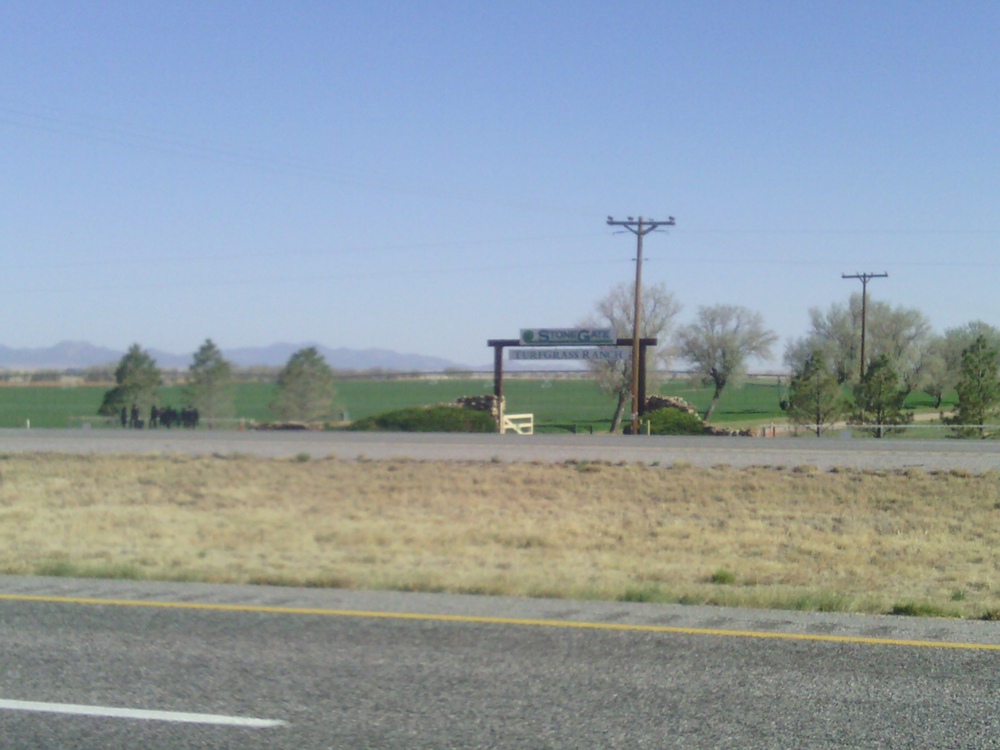
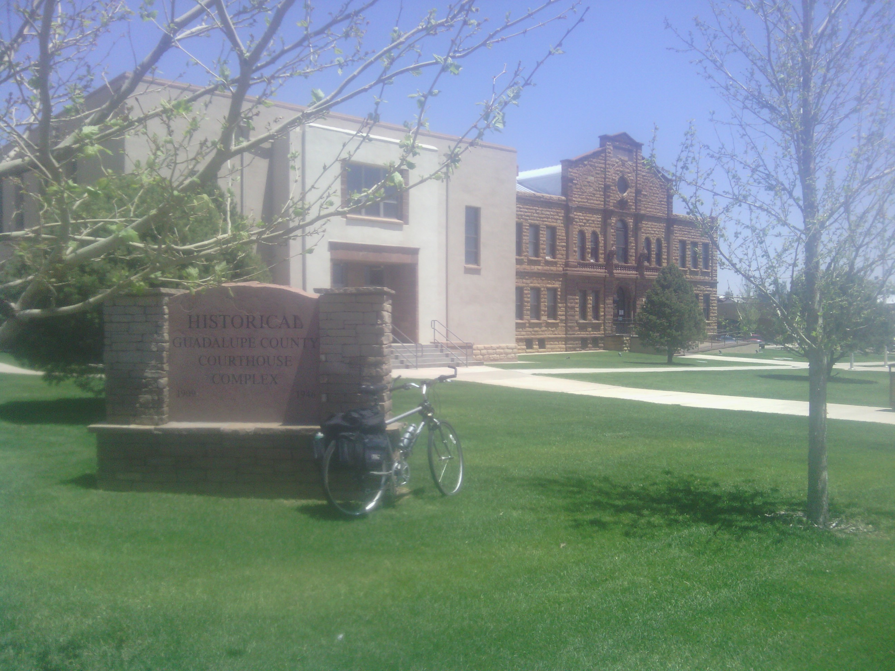
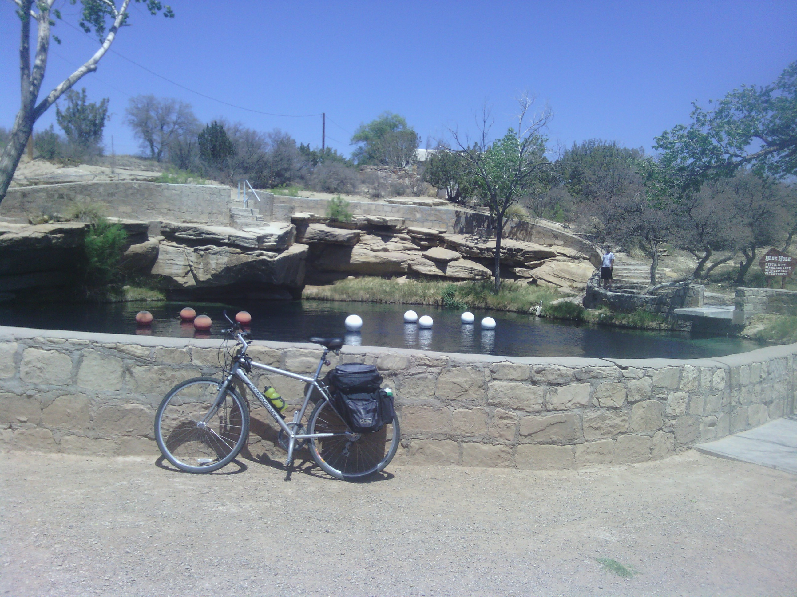
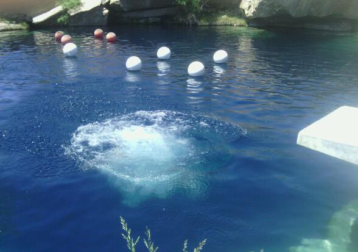
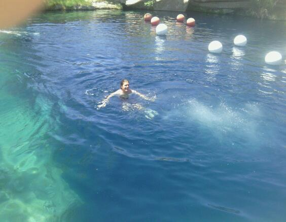

+++
title = "Day 13 -- Moriarty NM to Santa Rosa NM -- A free ride"
date = "2013-05-16T23:23:44+00:00"
tags = ["Bicycle Trip"]
categories = []
image = "IMG_20130516_135341_0.jpg"
+++

After sleeping through several alarms, I got up and had a quick breakfast around 7:30. I packed up the bike and got on the road by 8:30.

The first hour of the ride was a local uphill but the wind was at my back, so the climb to Cline's Corner didn't seem so bad. I guess that stop is a pretty historic place, but the google reviews were terrible, so I was planning on not stopping. As I neared the top of the hill I began to feel hungry and decided to have the first of my sandwiches when I reached the top. It was then that I realized I had left all of my delicious deli sandwiches in the refrigerator at the hotel. I briefly considered going back for them but decided the two hour round trip journey wasn't worth it. I decided to go to Cline's Corner after all. It wasn't great, but wasn't so bad either.

After getting back on the road, the wind really picked up at my back, and combining with the downhill I hardly had to pedal except for a few small local uphills. I quickly cruised into my next rest stop, the day's halfway point, and got a milk shake at Dairy Queen.

The second half of the trip was also fast with the wind so strong at my back. I arrived in Santa Rosa around 1:00 pm and stopped at a grocery store to get new sandwiches. Hopefully I won't be so forgetful this time. I also reached the highest stopped of the entire trip at 70 km/h. I don't know if I'll be able to beat that. Maybe it depends what the Appalachians have to offer.

After asking around at the grocery, I found out the cool local spot to see was the blue hole, an underwater sink hole and spring. I biked over, talked to some local people, and went for a swim.  The water is always clean and always the same temperature because it is constantly flowing up from underground. The sign says it is 81 feet deep, but one person I met says that's how deep it goes before it narrows into caves which the city gated off because some people had dove in and not come out. I have no idea how true that is.

After cooling down in the blue hole I rode to my campground and set up camp. I was a bit irritated that the wind kept blowing my stuff away but then I remembered how much good the wind had done for me today and decided that a few blowing camping items was a small price to pay. I hope it keeps blowing like this for a while.

Today's distance: 137 km
Average speed: 32 km/h.
Trip odometer: 1617 km

Photos:

Comments:

> Today's typo is funny, second only to the torture tent.  Done Purple diving in.
> **mom**
>
>> Haha, I fixed it now, but, so that everyone can appreciate it, here is the original swyped text:
>> 
>> "The sign says it is 81 feet deep, but one person I met says that's how deep it goes before it narrows into caves which the city gated off because some people had dove in and not come out."
>> **Josh Orndorff**

> Josh, been following your trip and realized that I have been bragging about you to colleagues.  They think your as cool as we do. Thought you needed to know that. Keep the tires pumped and ride on.  
> **Jason smith**
>
>> Thanks man. I hear you might want to ride along for a day in a few weeks?
>> **Josh Orndorff**

> Hi Josh!!!  I'll be flying from Philadelphia to Orange County, Calif. tomorrow via Midway in Chicago.  I'll be looking out the plane window to see if I spot you along the way!!!!  
> **Gail Murray**