+++
title = "Day 16 -- Amarillo TX to Higgins TX -- Family at the donut shop"
date = "2013-05-20T01:24:04+00:00"
tags = ["Bicycle Trip"]
categories = []
image = "IMG_20130519_093554.jpg"
+++

Today was a nice enjoyable ride. I left the RV park in Amarillo after having a complimentary donut around 8:30. It was a short haul to highway 60 and a nice ride for the rest of the day.

My first stop was Pampa where I filled my bottles and chatted with some motorcyclists for a while. Then I passed through Miami before things got hilly. It wasn't long climbs and descents like before, but a consistent up and down as I cruised through what looked like little mesas here in northern Texas.

I arrived in my planned destination, Canadian, around 3:30 and hung out recovering for a while. It was hot again and I could tell I was a bit dehydrated, so I made sure to chug lots of water at the gas station before looking for a place for dinner. There were lots of restaurants including one that had been recommended, but they were all closed on Sunday. I ended up getting dinner at Dairy Queen and having a hilarious conversation with the cashier about what size milk shake comes with their value meal. Let's just say I still don't know the answer, she still doesn't understand the question, and I'm still not sure what I paid for, but the price seemed fair, and we both had a good laugh, so I guess it was a win-win.

There is rain forecasted on my route tomorrow, and I didn't have a place to stay in Canadian, so I decided to go farther east. The next town, Higgins, was about 40 km farther down the road, and I made it there in good time. The town was smaller so I didn't expect to find a place to stay, but when I asked a man if he knew a place I could fill my bottles he led me to the donut shop cafe where I made lots of friends, and the owner offered me to camp in her front yard.

There was one large table of people who I initially assumed were family, but I came to find that it is just a great small town where everyone gets along like family, and they didn't hesitate to include me. Hopefully I beat the rain tomorrow.

Today's distance: 207 km
Average speed:27.7 km/h
Trip odometer: 2120 km

UPDATE: I can't believe I forgot to mention this. I ended up throwing away the lunch meat. I finally didn't forget it or have it stolen, and I threw it away. The meat package started swelling up like the sandwich I posted the other day, and mom suggested it was probably because it was growing bacteria. Thinking back, the last time I ate a bunch of warm meat was the ride into Gallup, after which I felt pretty sick. So I didn't want to chance it again.

Photos:

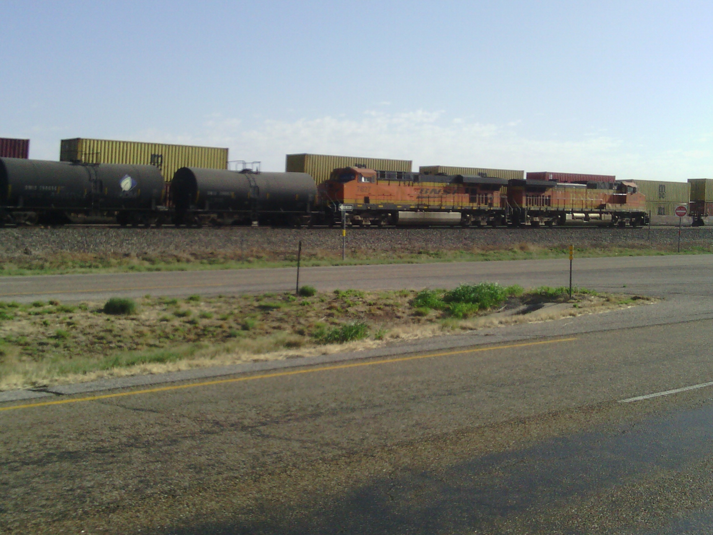
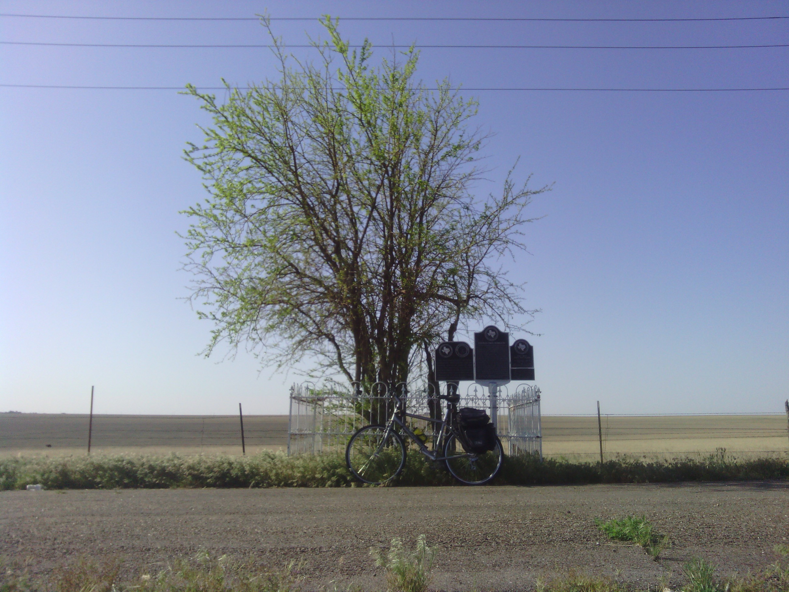
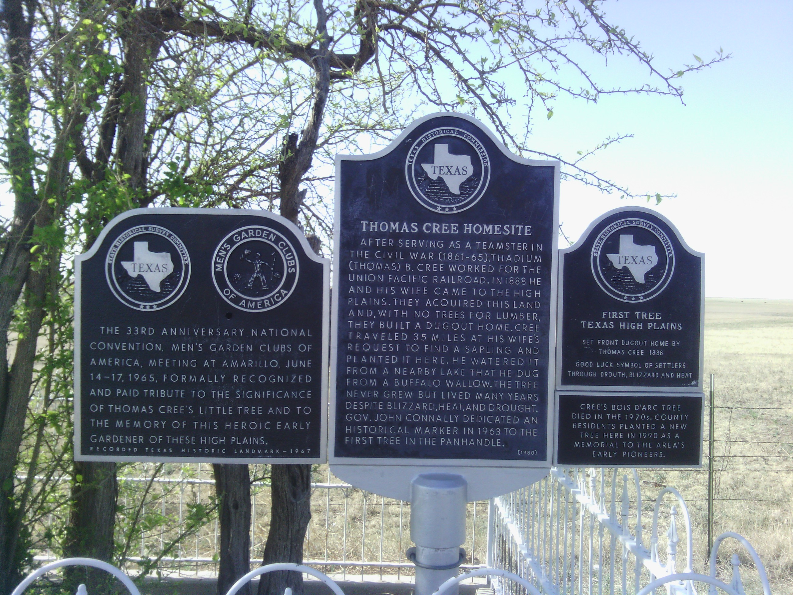
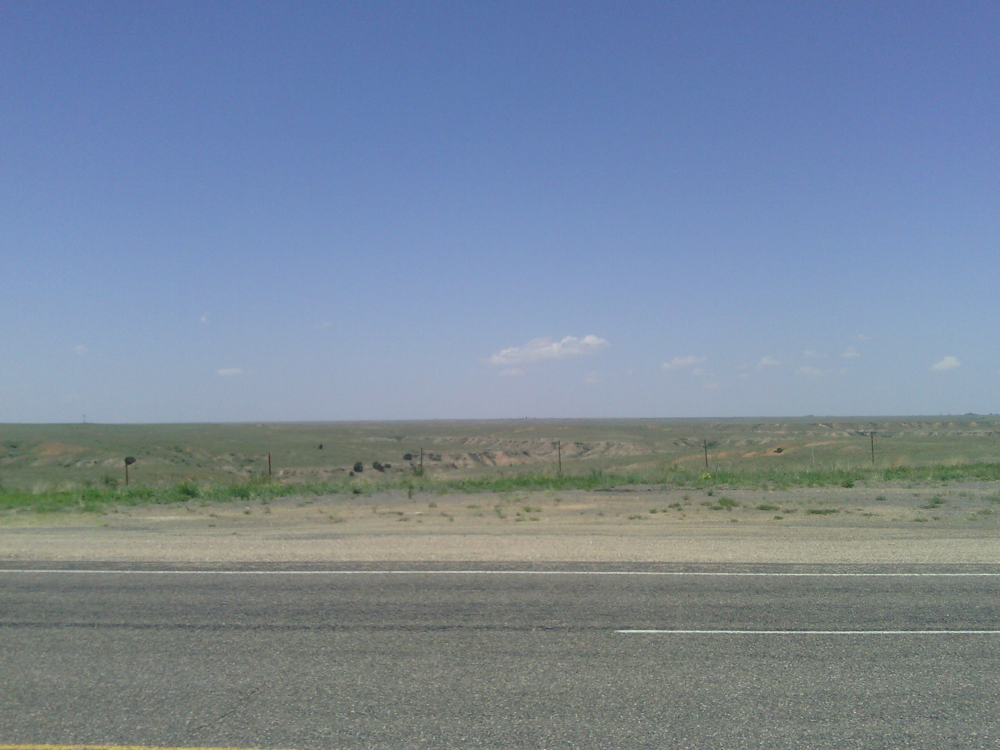
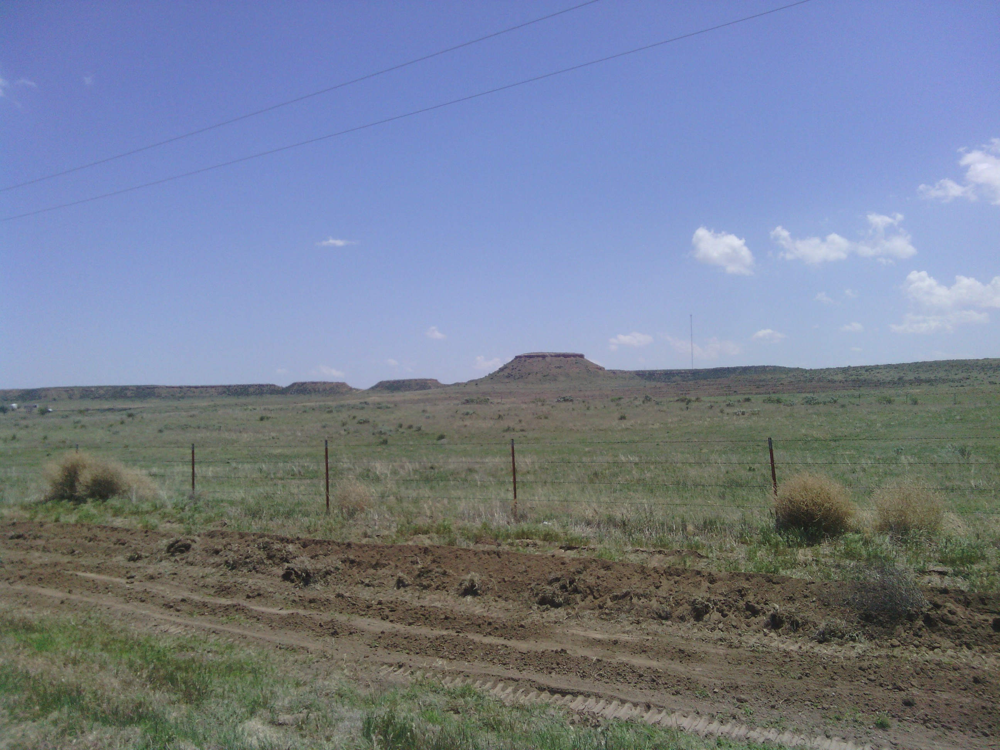

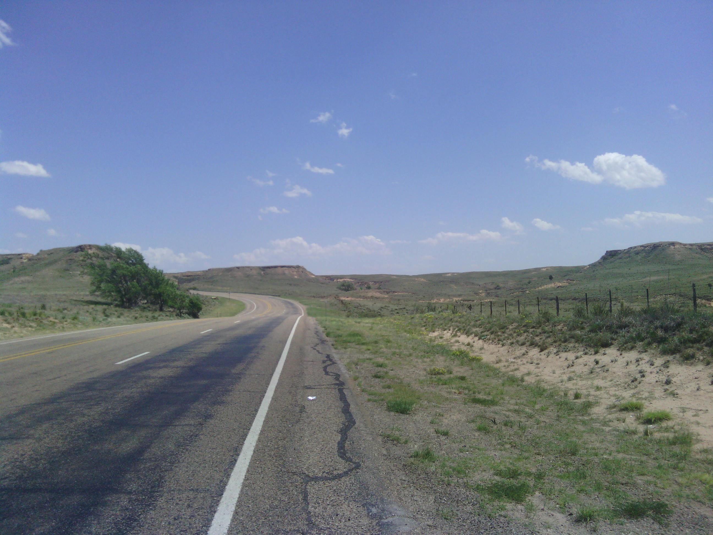
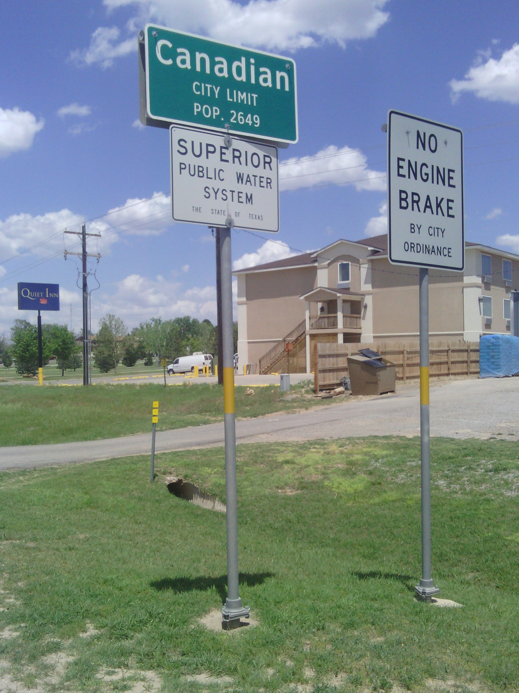
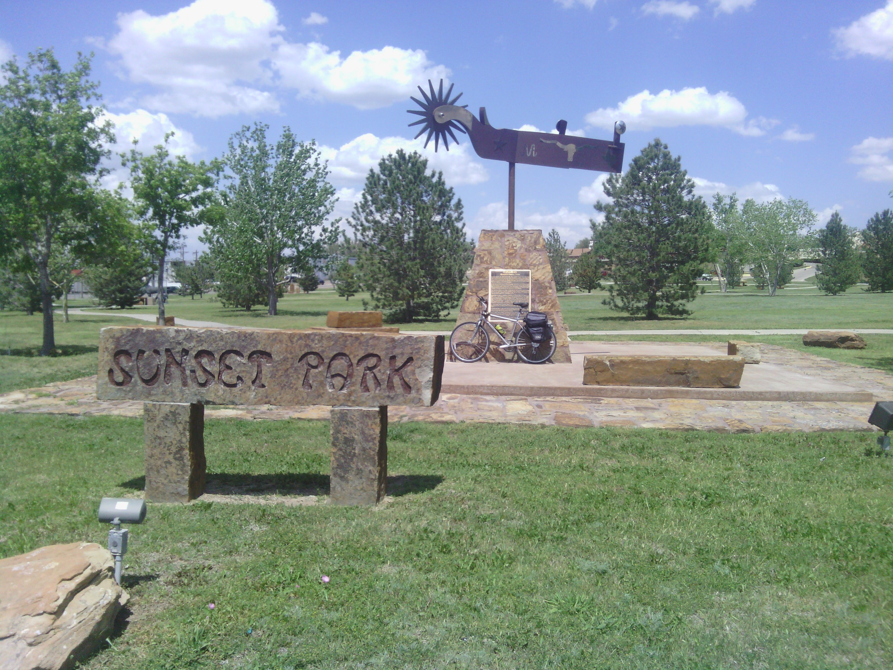
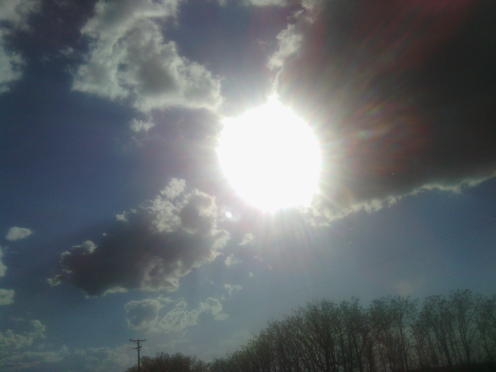
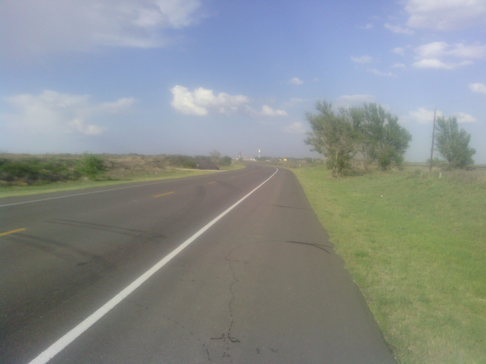
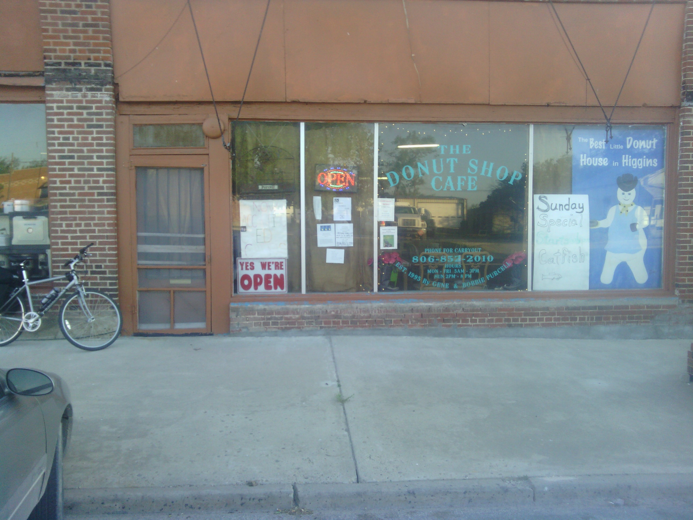
