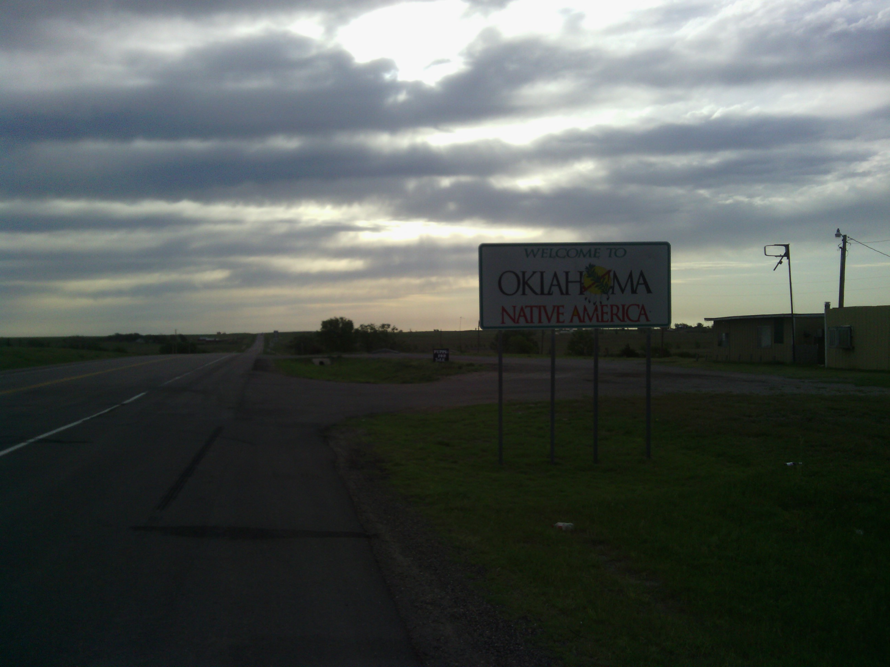
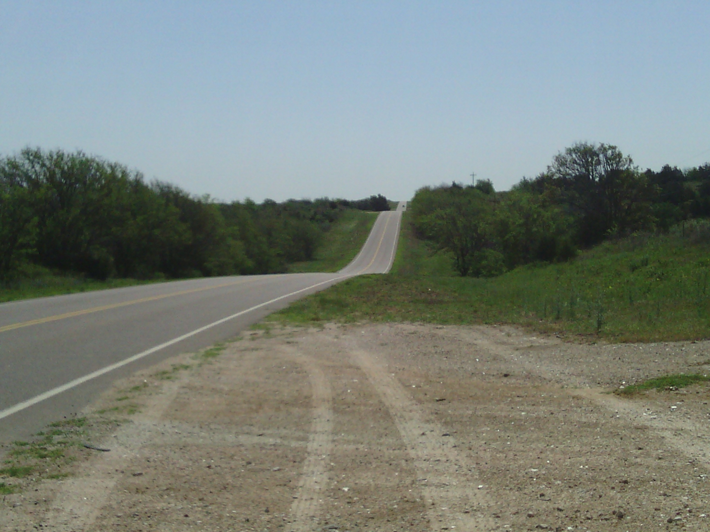
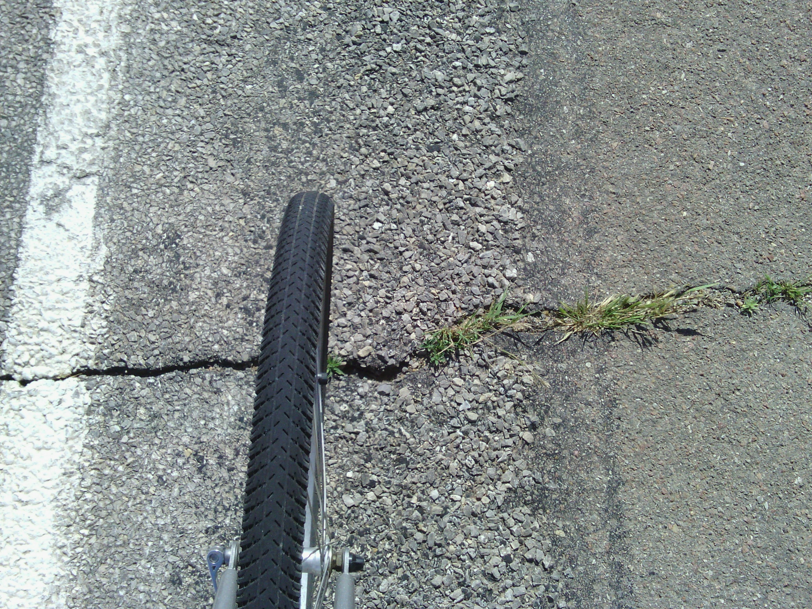
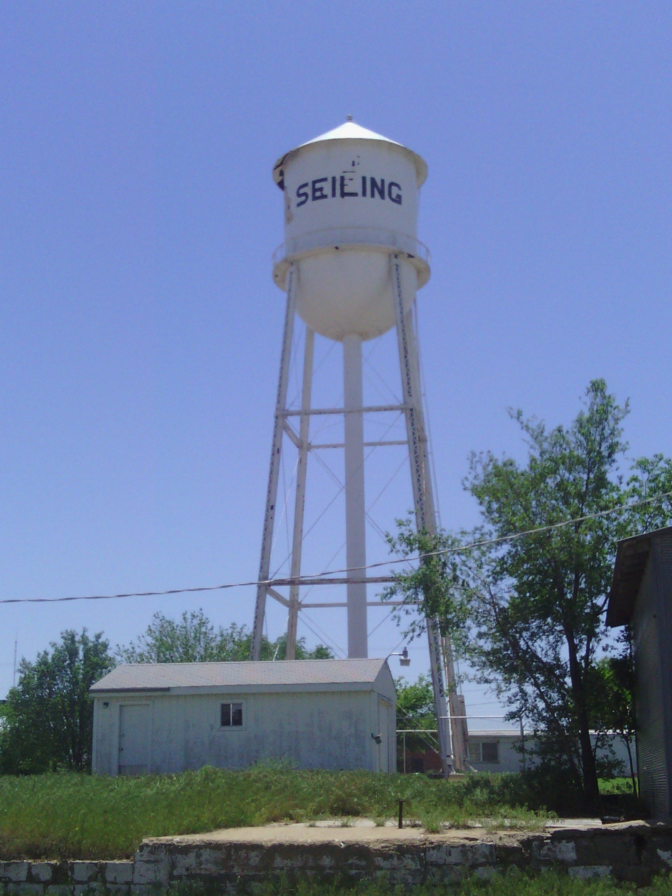
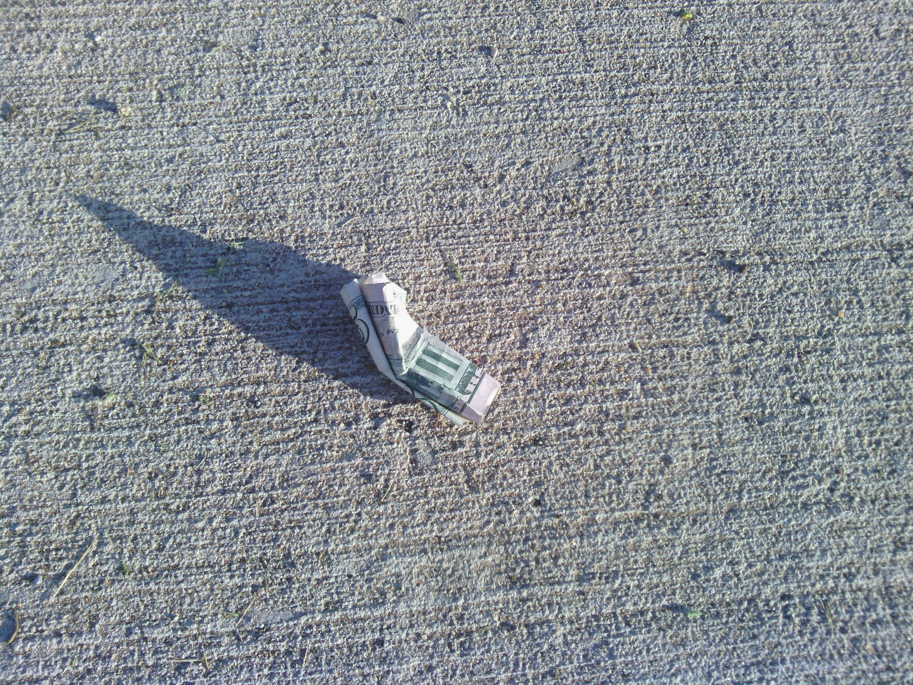

+++
title = "Day 17 -- Higgins TX to Seiling OK -- Rolling rolling rolling"
date = "2013-05-20T23:12:21+00:00"
tags = ["Bicycle Trip"]
categories = []
image = "IMG_20130520_103037.jpg"
+++

The morning in Higgins was the best of the trip so far. I tore down my camp and headed to the donut shop for breakfast. Some of the familiar faces from last night were there again including, of course,  Kay, the owner who had let me camp on her yard and use her shower. I ordered a breakfast burrito and chatted with the gang for a while and then changed into my cycling clothes preparing to leave. Finally I asked to fill my bottles and went to pay for my breakfast, and Kay wouldn't let me. She told me to come back sometime and I could buy a meal then. If you ever get close to Higgins Texas go to the donut shop cafe. It is well worth it.

I must have hit the road around 8:00, and it was an exhausting ride. For one thing I got spoiled the last few days with perfectly flat terrain, and today was lots and lots of rolling hills. For another thing the wind was back to its old tricks coming fast from the north east.

I took one rest stop in Vici, OK where I rested until noon, before pressing on the last 35 km to Seiling. The total distance today was only 102 km but it was tiring. After checking into the Seiling motel at 1:30, I got a shower and a nap. That rain I was worried about never came. Hopefully tomorrow will be the same.

I walked to a local restaurant for dinner and ordered way too much. I guess I still haven't learned that my appetite is smaller after I bike all day. On the walk back I found five bucks on the ground.

Today's distance: 35 km
Average speed: 22.9 km/h
Trip odometer: 2222 km

Photos:

Comments:

> Sounds like a great day! Kay sounds nice! Maybe you'll see the news in your motel and be less upset about the winds since at least they weren't a tornadoe!
> **Sarah22bara**