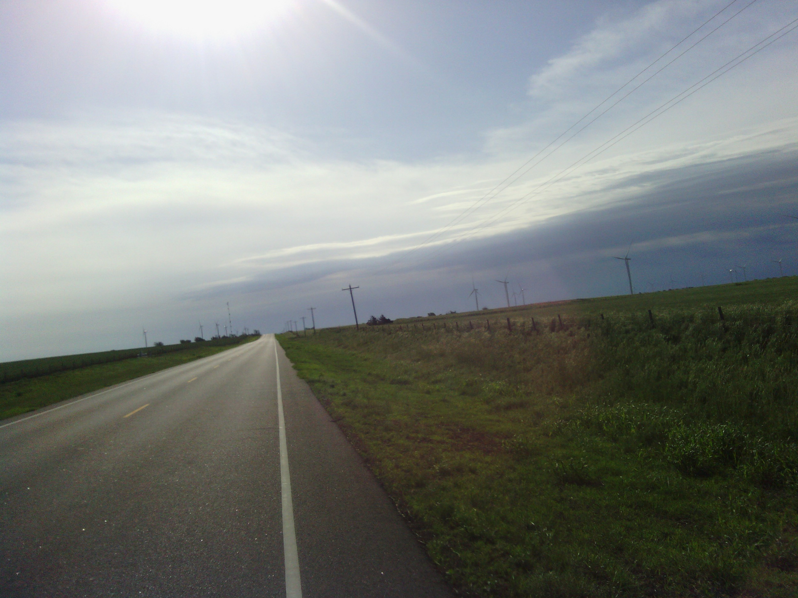
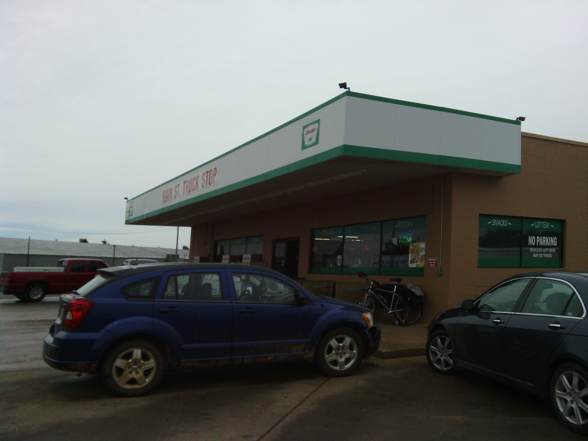
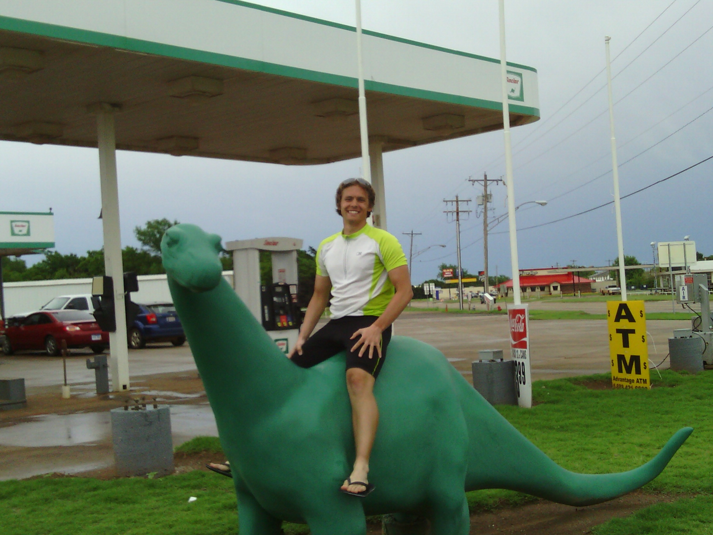
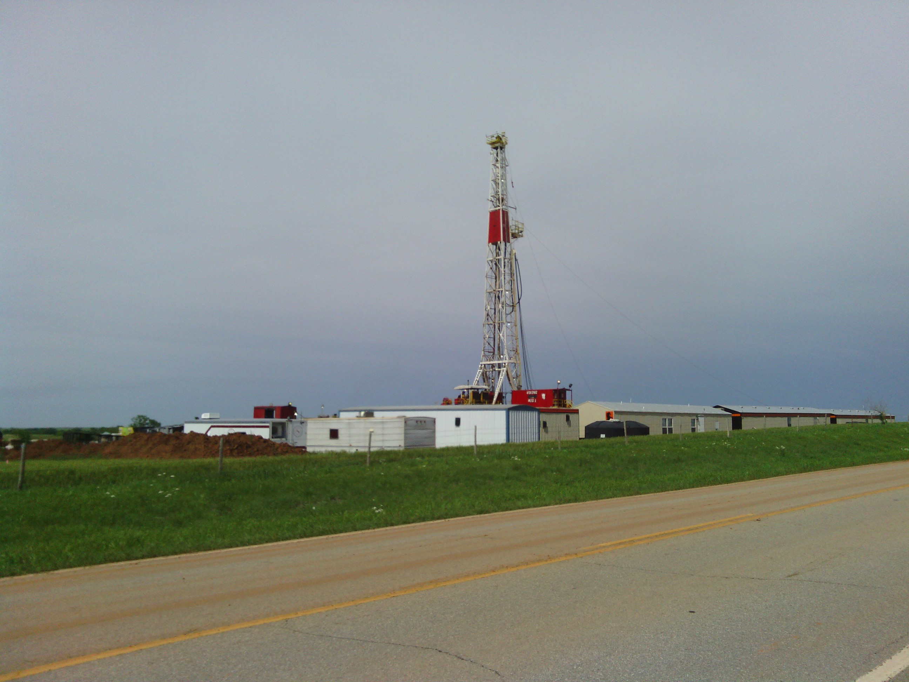
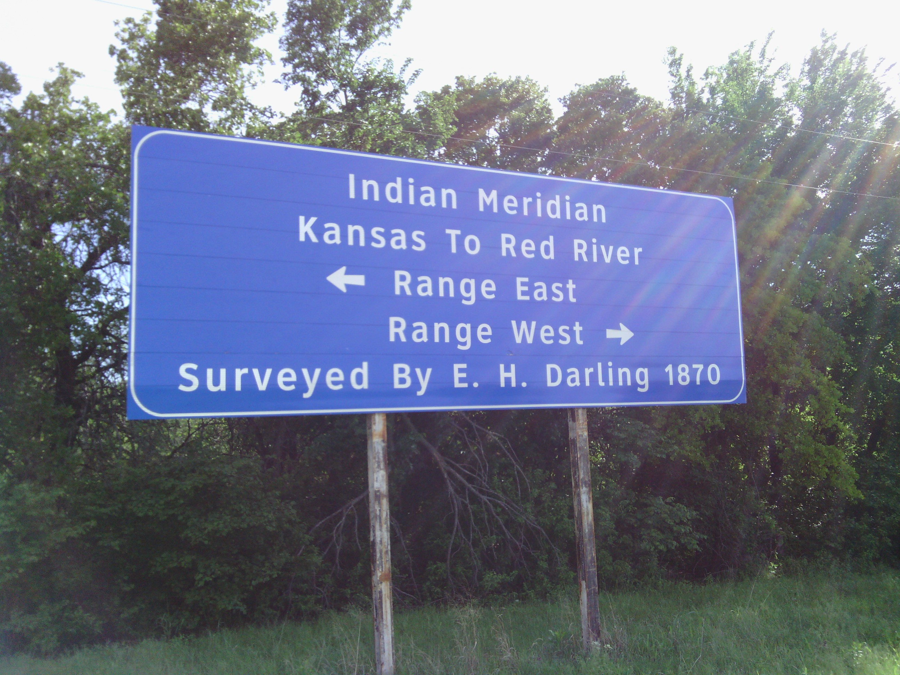
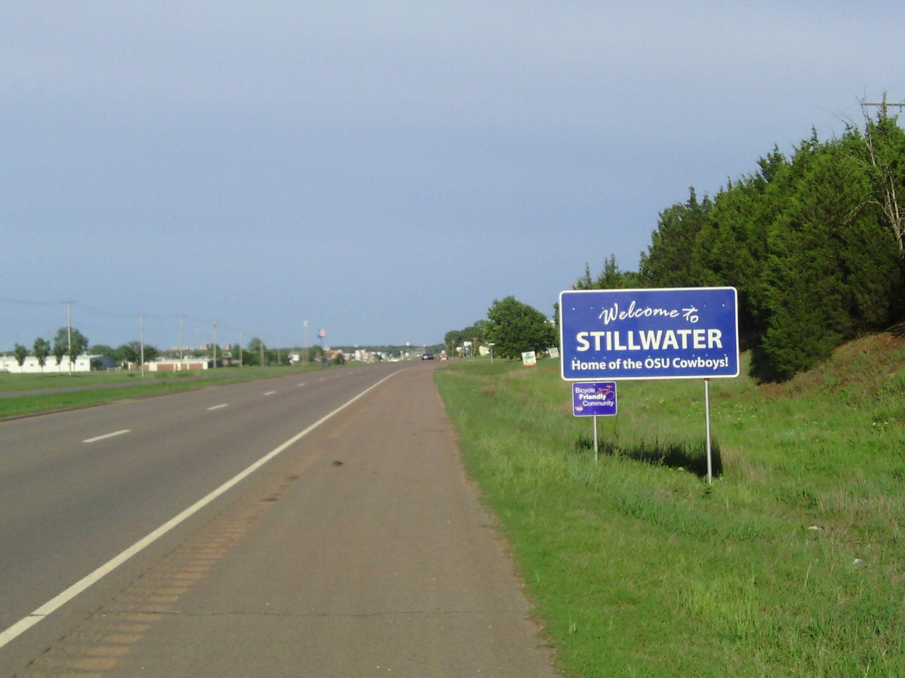
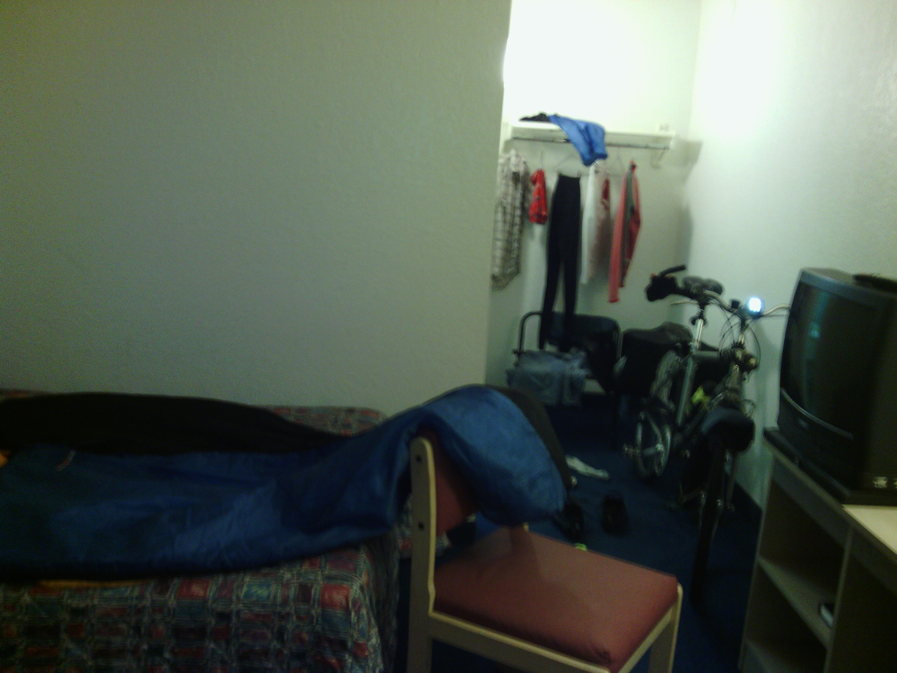

+++
title = "Day 18 -- Seiling OK to Stillwater OK -- Oklahoma rainstorm"
date = "2013-05-22T02:08:20+00:00"
tags = ["Bicycle Trip"]
categories = []
image = "IMG_20130521_145352.jpg"
+++

It was hard to get out of bed this morning. I finally managed to get everything together and leave the hotel room by 9:00. I made a quick trip to Subway where I ate half a sub for breakfast and saved the other half for later.

When I left town the sky was mostly clear, but there were dark clouds ahead to the east. I came to the first town of the day, Canton, and cruised through after a quick bathroom stop. About 70 km into the ride I came to the town of Okeene where I stopped again to ask if anyone had seen a weather forecast because the sky was getting darker. The lady at the gas station acted like I was crazy to even consider riding a bicycle in the same state that a tornado once happened in, let alone just a few days later and a hundred miles away. The more rational manager had seen the forecast and assured me it was safe outside but cautioned that I might get wet. I decided to press on the next 30 km into Hennessey anyway. That turned out to be a mistake though, because by the time I got there I was totally soaked. And it turns out the waterproof covers for my panniers, while certainly helpful, were really more water resistant. As I neared the city, a semi coming the opposite way splashed a hard wall of water into me and my speedometer went to zero. I was afraid it wasn't so waterproof either.

When I finally arrived at the Sinclair station in Hennessey, I ate the second half of my sub, ran my hands under warm water for about five minutes and bought an extra super huge hot chocolate. The attendants were nice enough to let me hang around for about two hours while the rain stopped and the sky started to clear. During that time I checked out my speedometer and found that it wasn't permanently broken. The stream of water had just displaced the magnet on my front wheel; an easy fix.

I decided I wasn't going to camp because my clothes and sleeping bag were soaked. The forecast showed that the rain had all moved east, but that side of the sky was still dark and I was hesitant to ride farther. I debated for a while whether I should ride into Stillwater or get a hotel in Hennessey for the night. That decision became very easy when the only hotel in town was locked up and the owner was nowhere to be found. I would ride the next 75 km into Stillwater.

The last stretch was not so bad, and I cruised through the rolling hills at a pretty good speed. I stopped briefly to take a roadside break and check the map, laying my bike down on the grass. When I got back on it I heard the all-too-familiar ping. Another broken spoke. This time it was the front wheel. Good thing too because I might have ridden back to Flagstaff to personally kick the guy's ass who sold me that touring wheel if I had broken a back spoke already. I checked the map again. Another 12 km to the city. It was farther than I wanted to walk since it was already getting a bit late, so I disconnected my front brake and rode slowly on my bent wheel to the Motel 6 where I hung my clothes and sleeping bag to dry for the night.

After a good dinner of Mexican food, I'm ready for bed. The bike shop opens at 10:00 tomorrow so I'll get the spoke fixed then.

Today's distance: 173 km (There is a little uncertainty here because the odometer stopped working for a little bit.)
Average speed: 16.2 km/h
Trip odometer: 2395 km

Photos:

Comments:

> By the time you get your spoke fixed the storm should be out of reach and your weather should be nice. :)
> **CW Mitchell**

> For the record, the original sentence was "The forecast showed that the rain had all moved east, but that side of the sky was stool dark..." Very nice description, Josh, hehe. 
> **M**

> You should pick up a spoke wrench and then you could counter torque the wheel to relatively straight temporarily zshould that happen again.
> **Steve Hannah**
>
>> Thanks for the tip. I actually have a spoke wrench on my multitool and considered doing just that, but I didn't know enough about wheels to know if it was a good idea. If it happens again I'll try my hand at straightening it out.
>> **Josh Orndorff**
>>
>>> You should find a walmart and practice on their bikes before you try it on yours.   It can be tricky.
>>> **George**