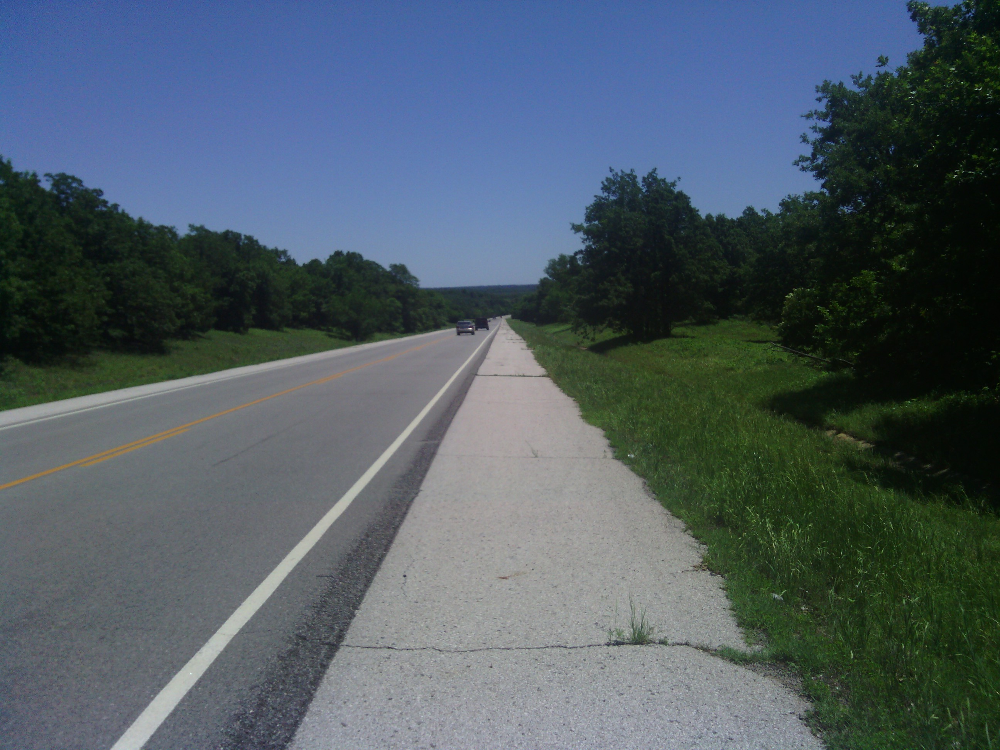
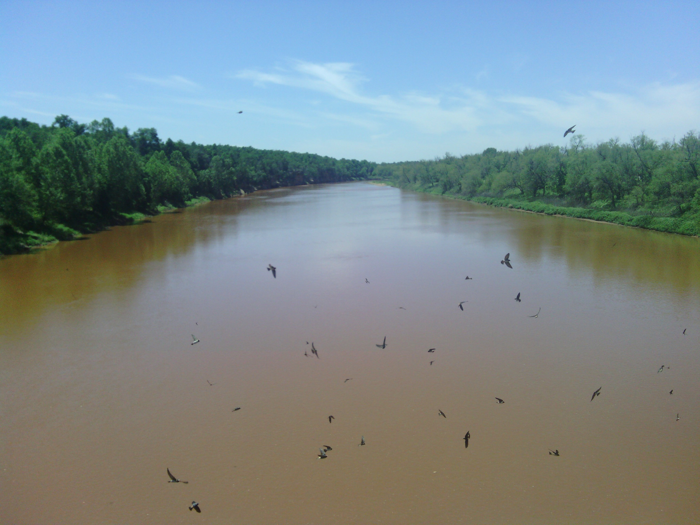
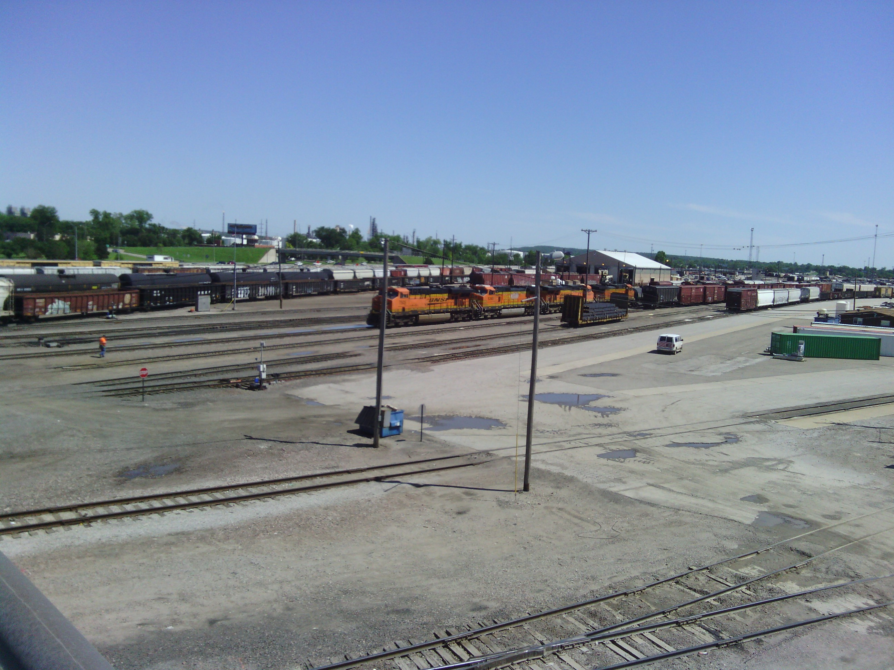
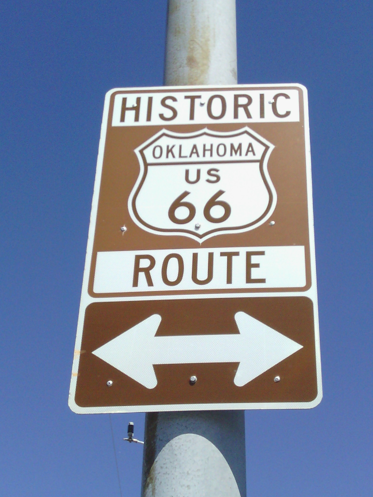
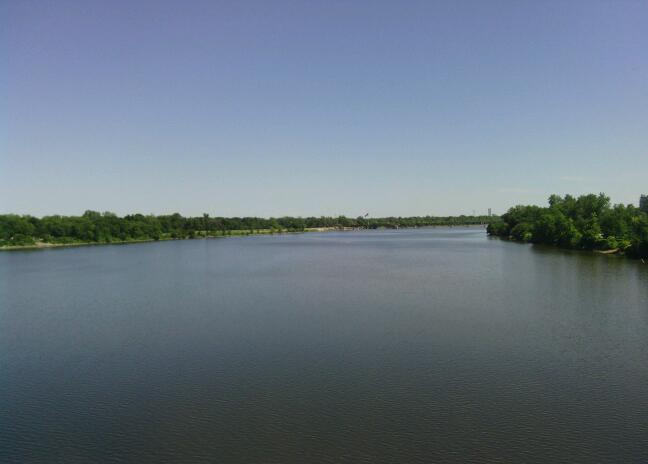
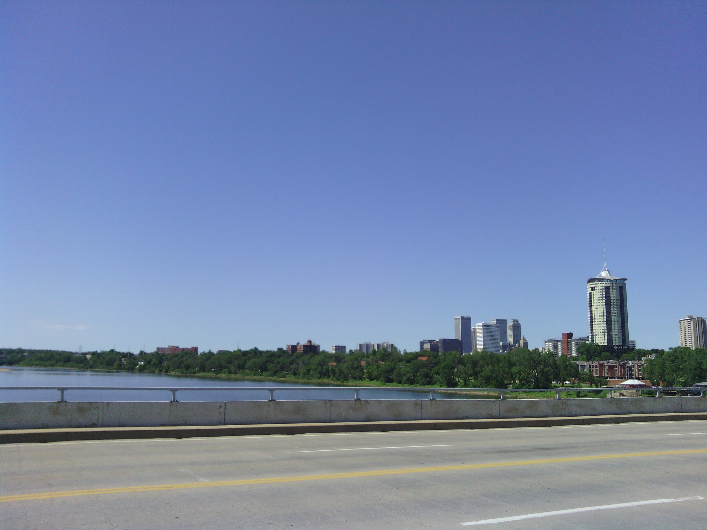

+++
title = "Day 19 -- Stillwater OK to Tulsa OK -- The best bike shop"
date = "2013-05-23T02:12:25+00:00"
tags = ["Bicycle Trip"]
categories = []
image = "IMG_20130522_154526-1.jpg"
+++

After a subway breakfast I went to district bicycles in Stillwater to get my spoke fixed. This is unquestionably the best bike shop I've ever been to. The fixed my spoke quickly, were super friendly, and even gave me a granola bar on the way out. I got back on the road around 11:00.

The ride was lots more rolling hills with a little assistance from the wind. I cruised through several towns without even stopping, and finally rested in Sand Springs right before I got into Tulsa. I can tell I've moved from the southwest to the central because the roadkill had turned from snakes to armadillos.

The last stretch into the city was surprisingly industrial, but I was happy to find lots of bike lanes and bike routes once I got in town.

My hosts, Tom and Jean, fixed a great feast of hamburgers, beans, and potato salad. We chatted about my travels for a while and looked at the map to check out my future route. I'll try to check out the historic blue whale tomorrow.

Today's distance: 108 km
Average speed: I accidentally reset it.
Trip odometer: 2503 km

Photos:

