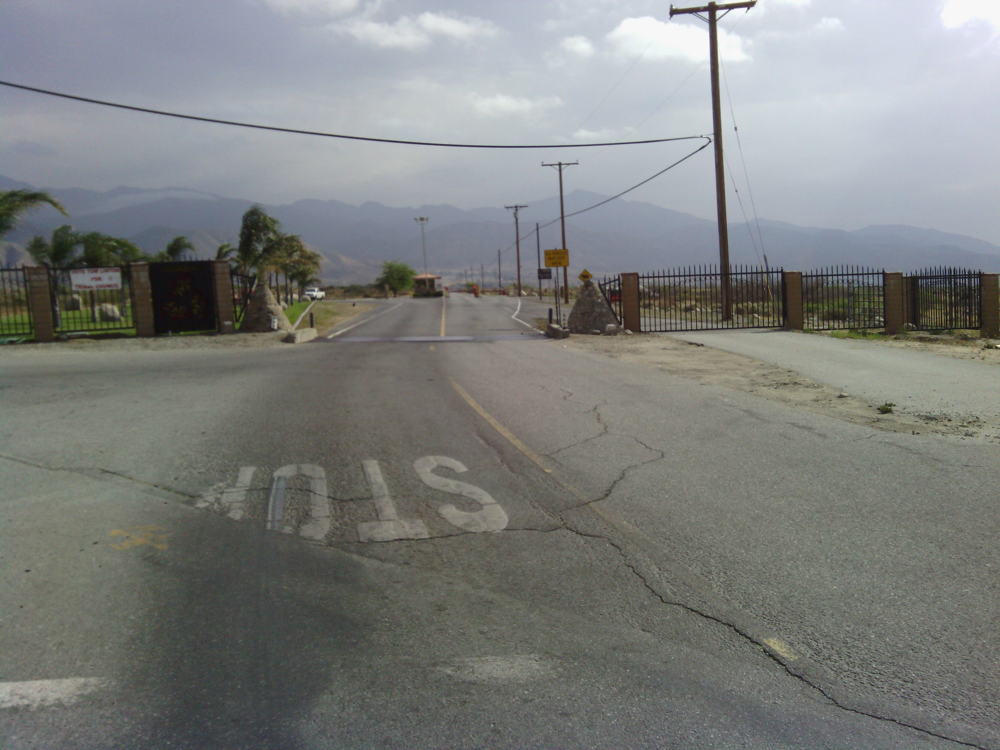
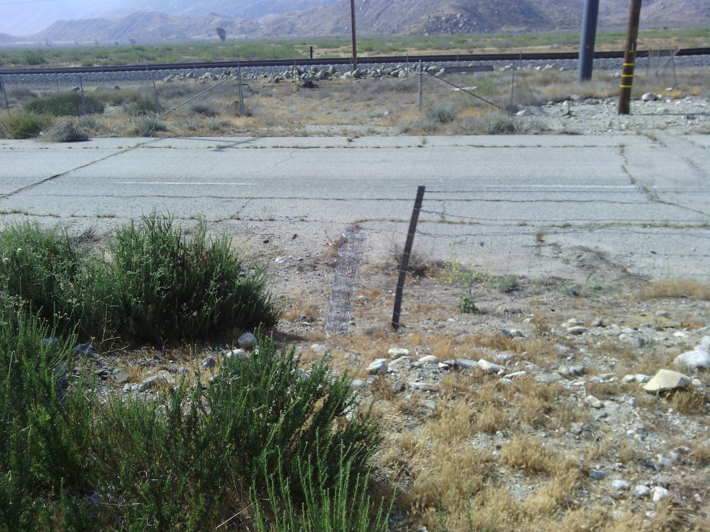
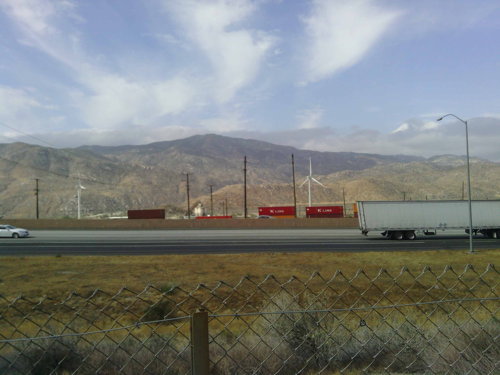
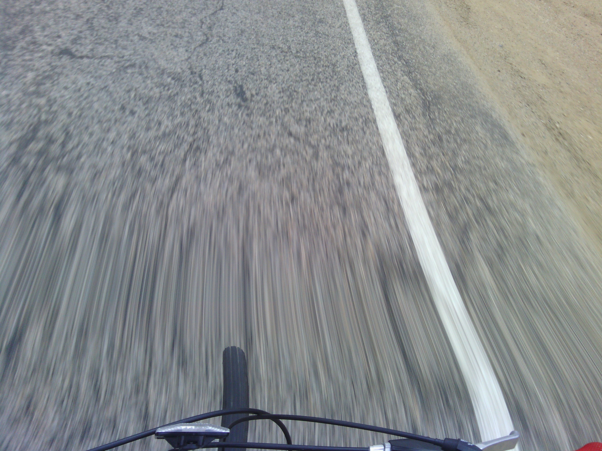
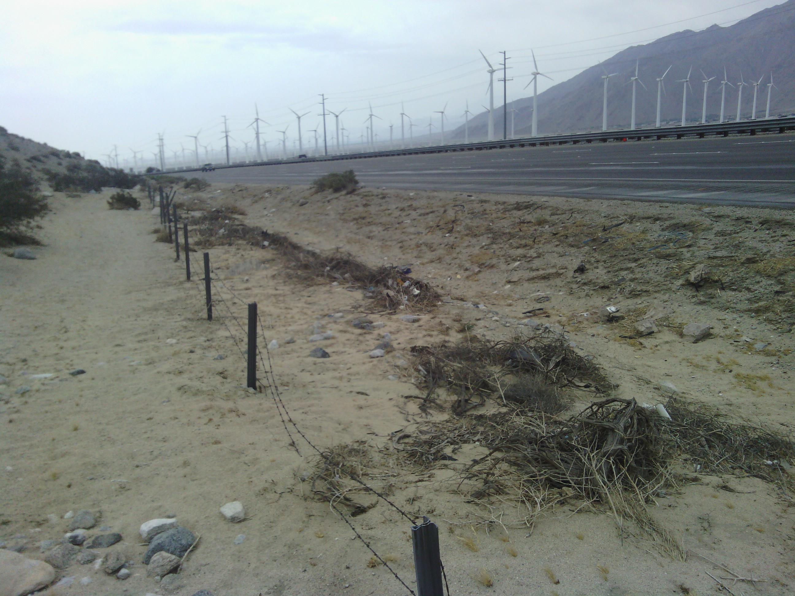
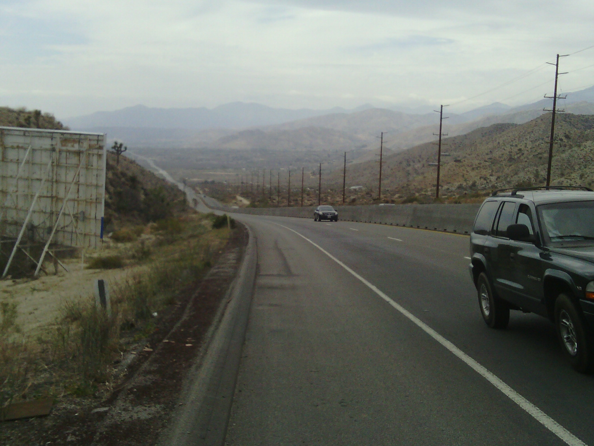
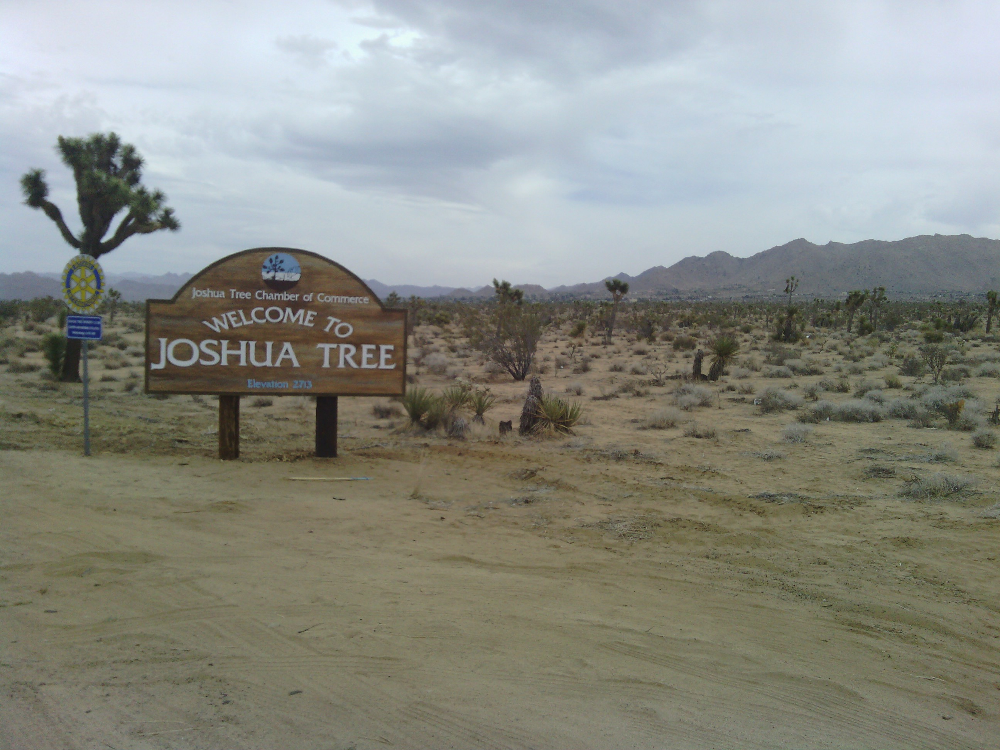
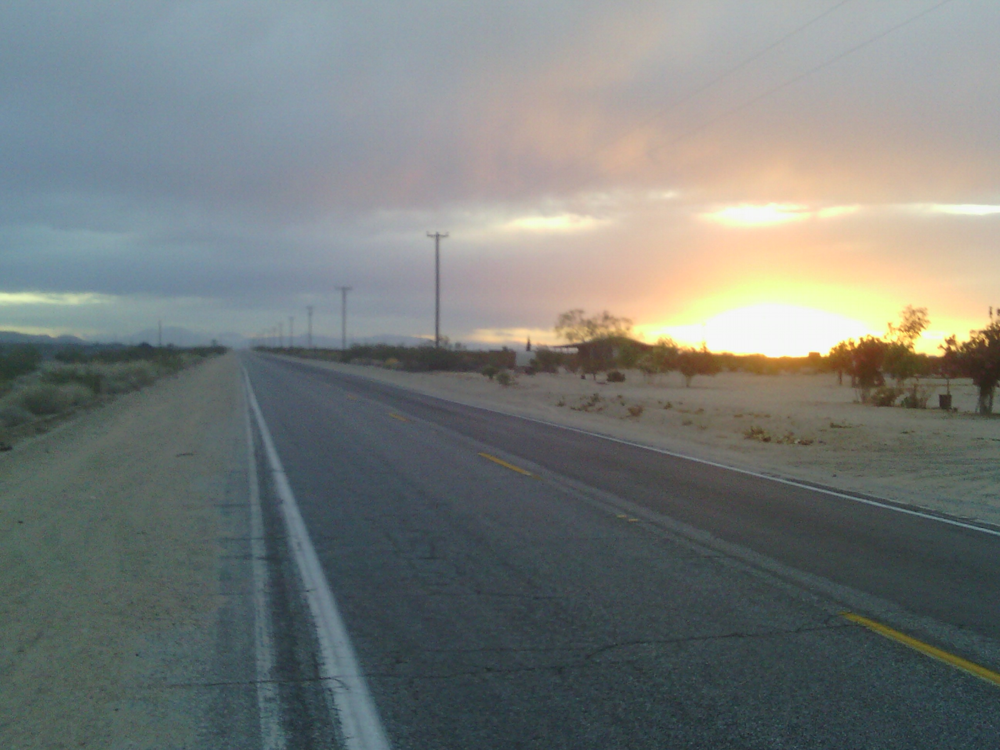

+++
title = "Day 2 -- Beaumont CA to Mojave Desert CA -- Lots of wind"
date = "2013-05-06T01:29:56+00:00"
tags = ["Bicycle Trip"]
categories = []
image = "IMG_20130505_192832.jpg"
+++

This morning I woke up to a small continental breakfast that I knew wouldn't hold me over for long. Before leaving Beaumont I stopped at a convenience store and picked up nail clippers since my shoes were hurting my toe nails, and band aids to prevent or treat the blisters that may show up in the next few days.

Riding out of town the road was slightly downhill and the wind was at my back. It felt great, and I hardly had to pedal. Naturally, I hoped that would last all day. After about 10 km of easy coasting, I turned a corner to an uphill, and at the top found a gate and guard shack. It turned out to be tribal land, and I wasn't allowed in. I told the guard I didn't know how else to go hoping he would let me pass through, but instead he gave me alternate directions. His directions involved getting on the interstate for a "little bit", and then carrying my bike through a cut in the fence to a frontage road which he assured me was paved. Naturally I was skeptical. But lacking a better option I decided to follow his advice. It turned out I was only on the interstate for about 200m, and I did manage to spot the cut in the fence. His route was probably faster and flatter than my original anyway. The frontage road was technically paved, but hadn't been maintained in years, so I went slow to avoid potholes. About two hours of cruising with the wind later I stopped at Ruby's diner for brunch.

Around noon I followed another road Google suggested, and a few km later it turned to dirt. I didn't have another route, and the downhill and wind made turning back nearly impossible, so I proceeded slowly for about half an hour. It made the frontage road look good.

When the dirt ended I turned north on twenty nine palms highway and started my climb. It was steep and long, but the wind had become gentle (probably because the mountains blocked it) and it was at my side. Eventually I made it to Yucca Valley which seemed like a funny name since I had to climb so much to get there. 

I met several interesting people at rest stops along the way that gave me some encouragement.

Despite starting a little later than yesterday, I reached Twenty-nine Palms at about 4:00 and have been resting for the last hour. I'm debating whether I should get to bed super early, or head out and try to get a head start on tomorrow's ~150 km stretch of desert. 

Update: After dinner and a phone charging at Andrea's restaurant, I did end up riding about 40 km farther into the desert after stocking up on food, water, and gatorade. I'm glad I did it because it made the tough Mojave stretch a little shorter, and because camping in the desert was amazing. The sky is huge and clear and beautiful.

I set up my tent on a slight incline which made it a tiny bit hard to sleep, but my tiredness took care of that. I went to bed around 10:00.

Today's distance: 149 km
Average speed: 25.8 km/h
Trip odometer: 317 km

Photos:

Comments:

> Way to go Josh!  I thought you would never cut your toe nails!  Seriously though,  keep it up.   This is awesome.
> **George**