+++
title = "Day 2 -- Key Largo FL to ??? FL"
date = "2018-03-14T17:08:54+00:00"
tags = ["Bicycle Trip"]
categories = []
image = "IMG_20180313_160949561.jpg"
+++

My plan for this morning was to be up by 8:00 and on the road by 9:00. But it turned out to be more like up by 8:45 and on the road by 9:30.

I stopped at Winn Dixie (after passing it once) for breakfast of deli meat and cheese and tortilla shells, yogurt, and banana. The deli portion lasted me through several snacks into the late afternoon. Getting back on the road I continued the last little bit east on Key Largo before getting on the bridge to the mainland. The wind was North East which means it was in my face for both of those parts, but I was glad that it would be partially behind me once I turned West later in the day.

Continuing North, I was planning to get on a bike trail to take me West of Homestead and up to route 41 through the Everglades. I was hesitant about the trail because it was unpaved and my one training ride on a sandy trail was super hard. I was also nervous about junk getting through my back tire since it is pretty worn and had a little cut in it from yesterday's glass incident. Luckily I missed the trail head and didn't have to make that decision.

Rather than staying on the main road, I did take the smaller streets to the West of Homestead, and saw a lot of plant farming. The last bit of my ride North to the Everglades was along route 997, but luckily there was a paved bike path along its side. Unluckily, there were construction vehicles blocking it in several places due to construction on both the trail and the road, so I had to route around them through gravel.

As I reached route 41, I stopped at a gas station to fill my bottles, but they said they didn't have safe drinking water. That would be a recurring theme. The road was nice and had plenty of room for me to bike on the shoulder until I reached a construction zone. It was the kind where only one lane is open and they have a flagger. The flaggers were friendly and let me ride through the closed lane whenever possible to let traffic pass. I did get one extended angry honk at the end, but, as usual, they didn't stop to discuss the issue with me.

Although the road was nice and the wind was partly at my back, route 41 started to get really hard. It was hot, no one had water so I was rationing, and I was getting close to 100km into my second long day. Eventually I noticed that my rear tire was starting to get soft, so I stopped at one of the many air-boat tour places. Thinking there was a chance that nothing was actually wrong, and the tire had just gone soft from two days of lots of weight, I pumped it back up and went inside to buy a water. I also filled a bottle with melted ice from their cooler despite the cashier's advice.

When I got back outside the tire was still hard so I hopped back on and it felt much faster. But it was only 10ish km before the tire went soft again. after a few more unsuccessful attempts to find water, I stopped at a gas station that also had an auto shop. The mechanic let me use his air hose and fill bottles for his 5-gallon-style cooler. But I made a big mistake. I refilled the same tube. Why? Good question. I guess some combination of denial and foolish optimism. But, as we all expected, it went flat again. Now I had to do a roadside change and reinflate with my hand pump. that compressor sure would have been nice. But it turns out I can actually get the time to probably like 60-70psi with that pump... it's just tiring.

I finally got back on the road and eventually reached Midway campground. I checked it out and was pleased to find potable water so I chugged all of mine and refilled. There were no showers or electricity though and the camp host said it was $24 for the night. Brutal. He said there was another campground a few miles down the road that was the same deal, so I said I'd keep moving on despite only having about half an hour until sunset.

Before I reached the next campground I found the big cyprus welcome center complete with drinking fountains, am electrical outlet, and a hose that worked fairly well as a shower. I don't think it is officially for camping, but there were no signs prohibiting it, so I'm laying in my tent out back swyping this right now.

My quads are getting somewhat sore, and my butt is really starting to rash, but I'm surviving. I'll look for a new rear tire tomorrow.

Daily distance: 139.6km
Average speed: 20.2km/h
Trip odometer: 309km

Photos:

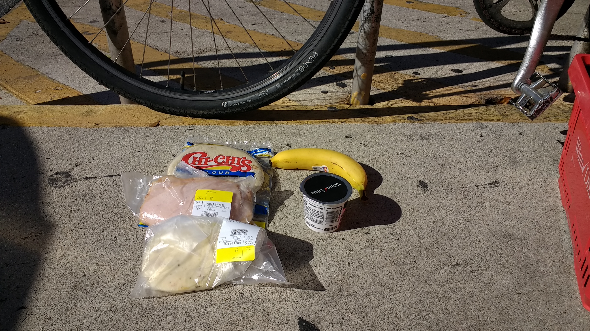
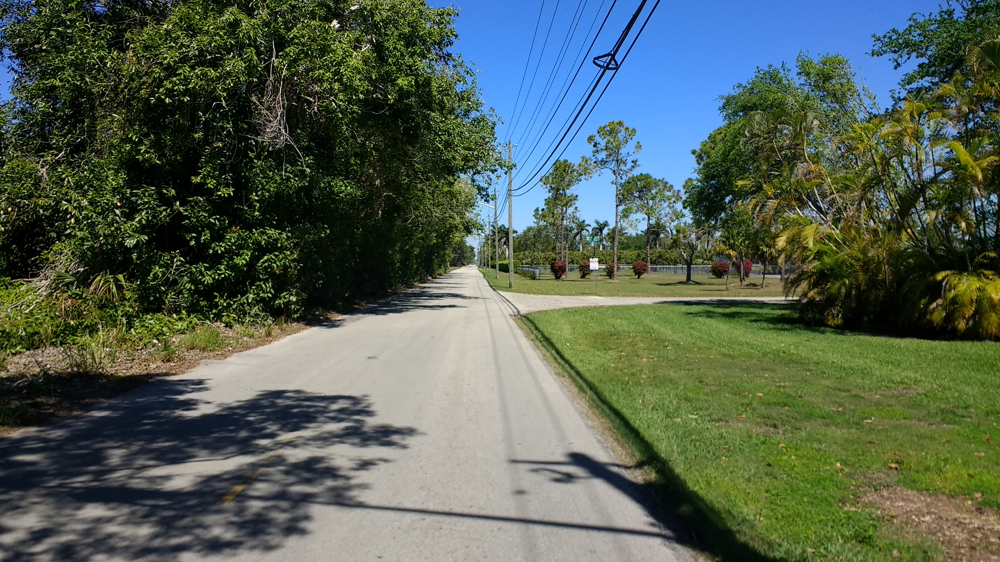
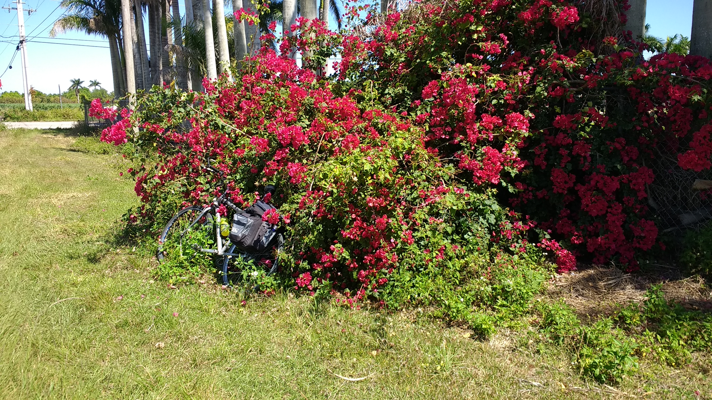
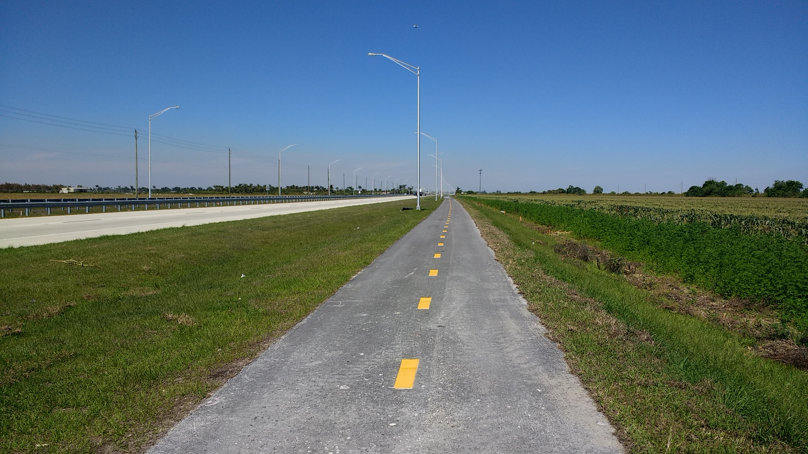

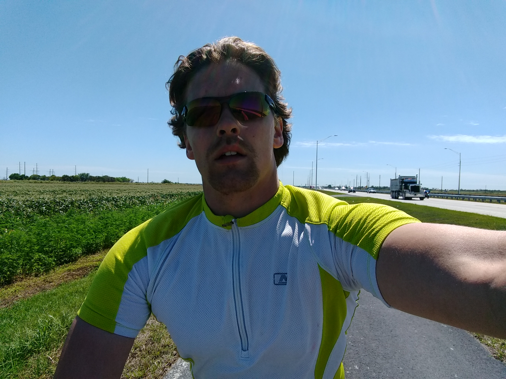
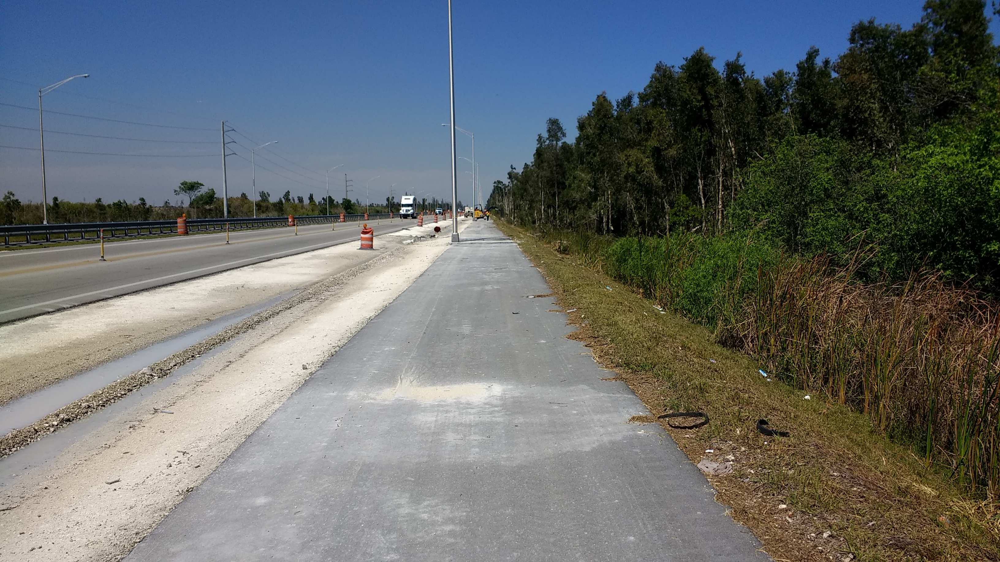
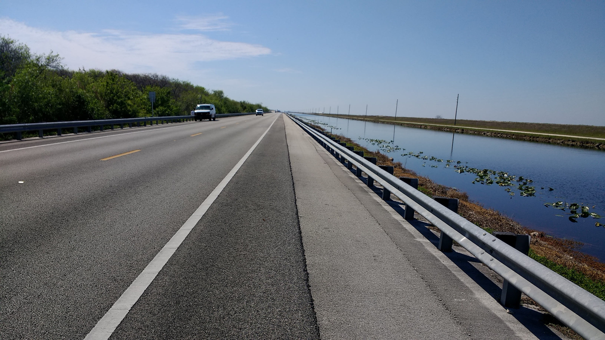
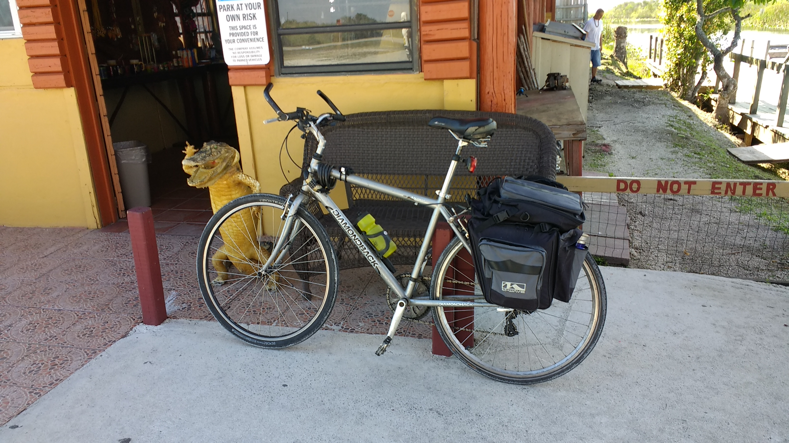

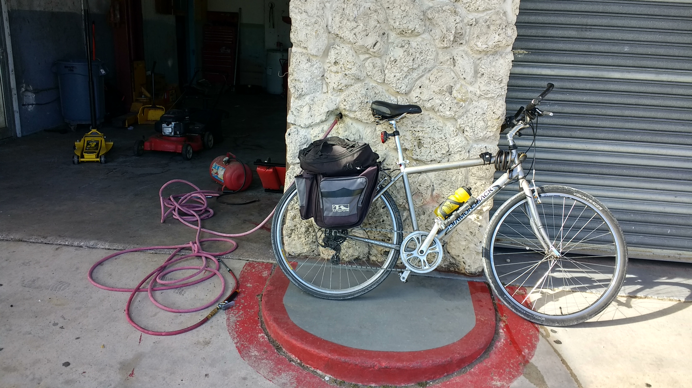
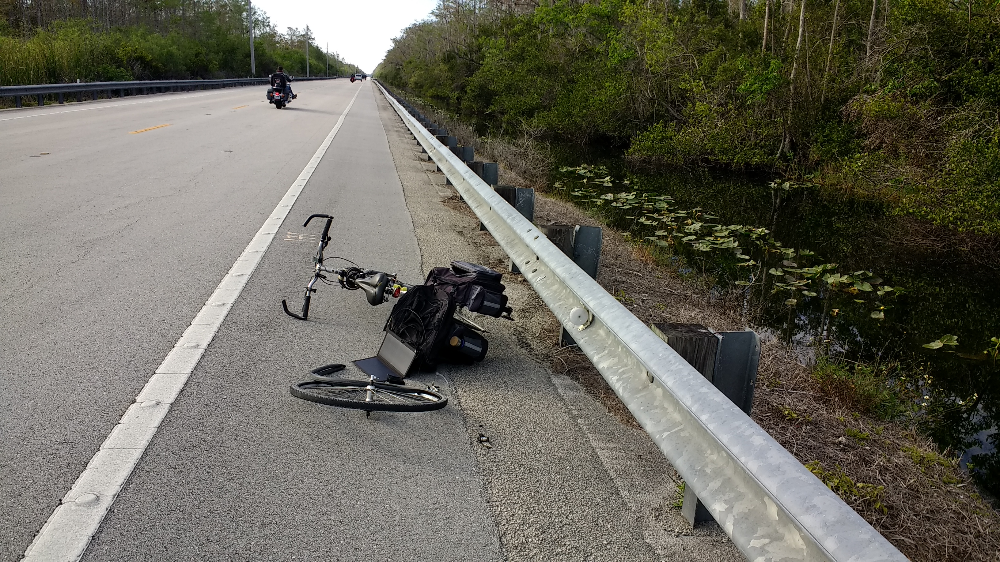
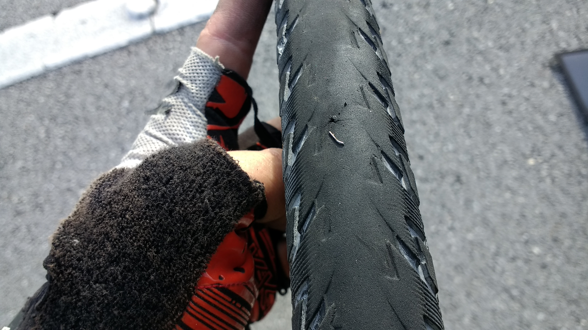
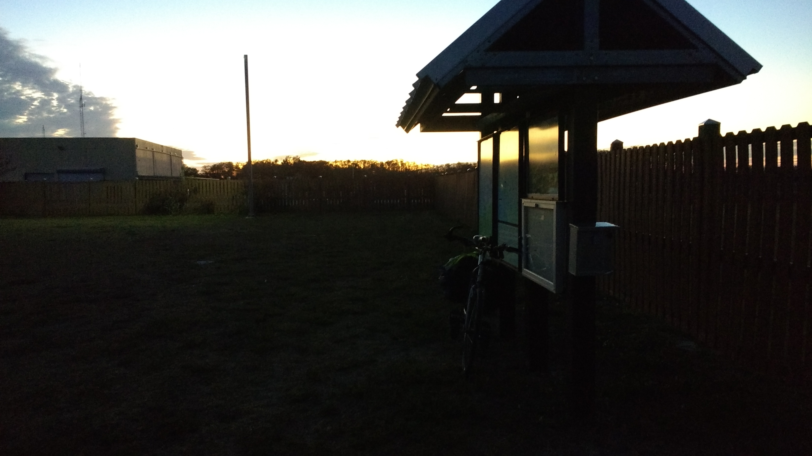
