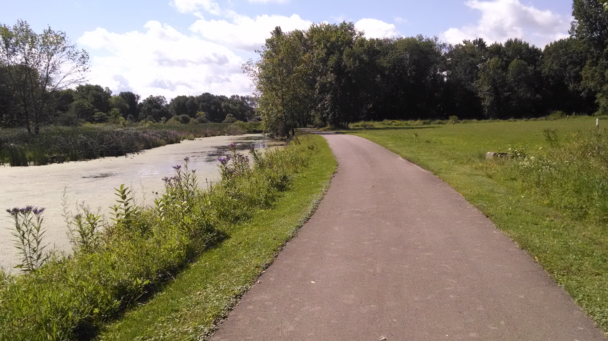
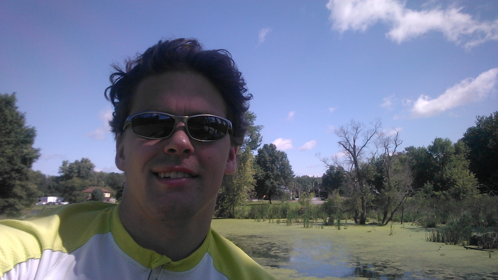
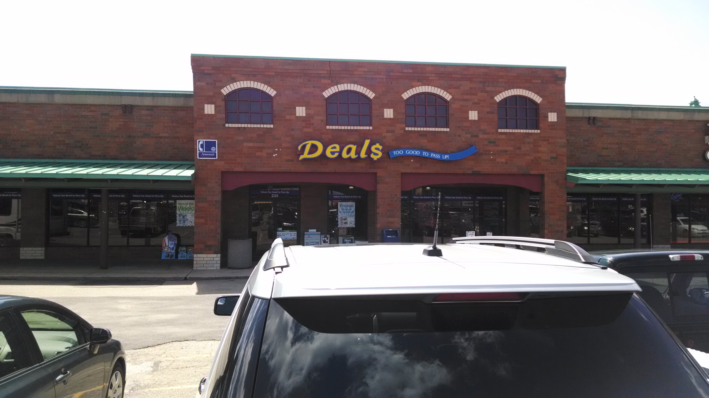
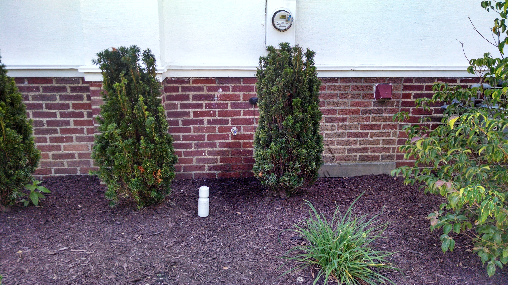
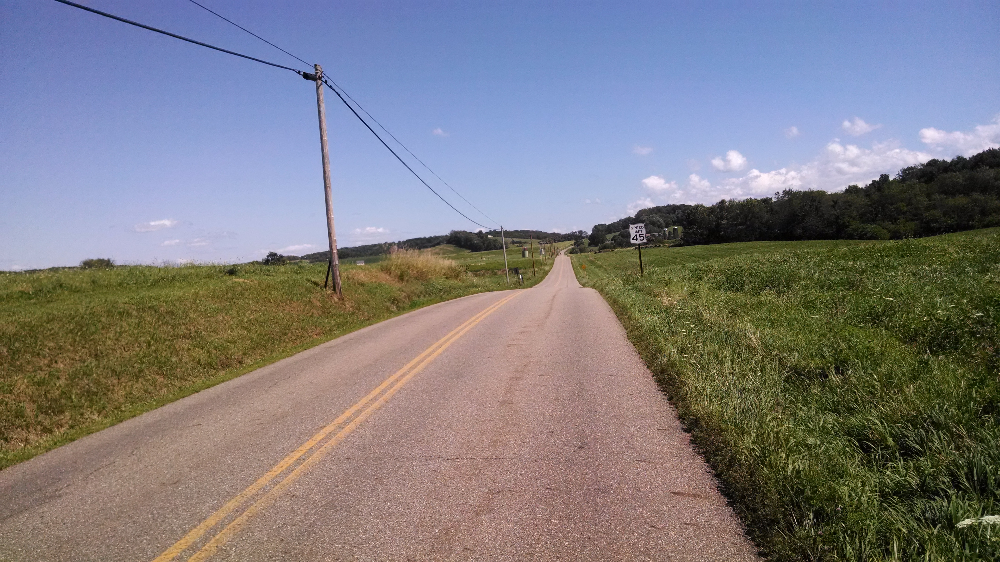
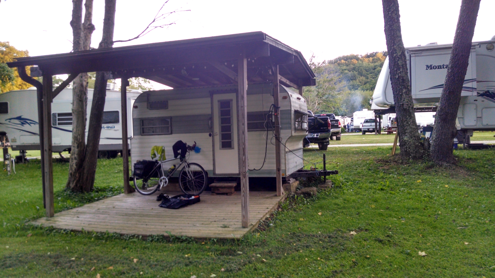
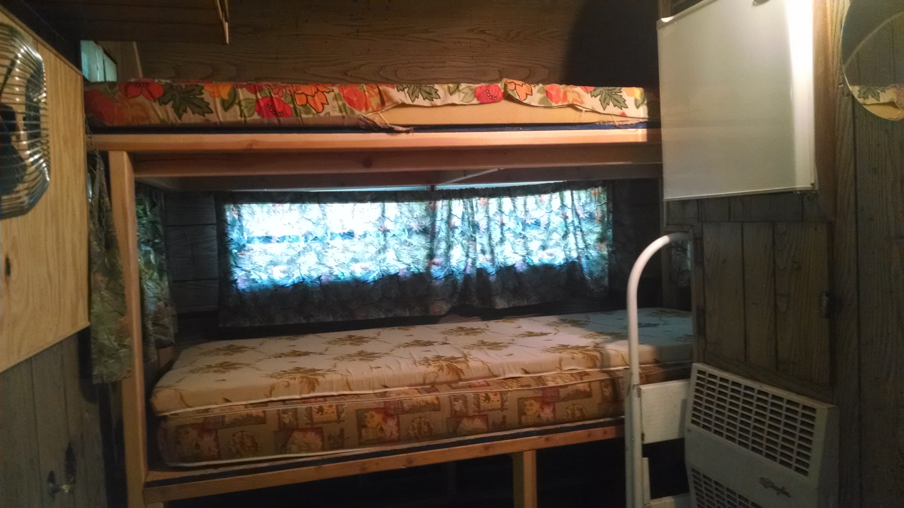

+++
title = "Day 2 -- Medina OH to Carrollton OH -- Thirsty and hilly"
date = "2014-08-15T01:36:50+00:00"
tags = ["Bicycle Trip","Travel"]
categories = []
image = "IMG_20140814_200730775_HDR.jpg"
+++

I had a hard time getting out of bed this morning. Although I planned to be up by 8:00 and on the road by 9:00, I ended up getting up just after 9:00 and on the road by 9:40.

Early on I got a foot long sub at subway and saved half for lunch. They took my gift card this time.

The beginning of my ride was quite hilly, but I managed to make it through just fine. The largest part in the middle was along a towpath trail which meant there were no serious hills, but the unpaved surface slowed me down a bit. I reminded myself that I was not racing and cruised happily along around 22km/h. Going through the city of Massillion the towpath was interrupted and it took me a little while to find my way but I was back on it in no time.

I got off the trail in the next small town to get water and discovered that the gas stations and restaurants were slightly out of my way. As I was deciding what to do I came across a church that had a spigot on the side so I filled up.

The remainder of the trip was quite hit and really wore me out despite the tailwind and distance that was considerably shorter than many days on the last trip. At one point I looked at the map and noted 13km until the next big turn, but somehow forgot and thought it was 13km to the next city so I didn't take any water. That left me thirsty and tired when the bottles ran out, but luckily another church with another spigot showed up.

When I made it to Carrollton I got some lunch meat and yoghurt at the grocery store and rested for a while before making the last short push to my campground.

Everyone at the campground is super friendly. The owners upgraded me to a camper for free, and player a game of cornhole with me. The camper even has a refrigerator so my lunch meat won't go bad. I also chatted with the people at the next campsite for a while. The husband is up here working on a new oil and gas pipeline which it seems is very big around here now.

I've been surprised how tired my legs have been so far this trip. Luckily tomorrow is a tiny bit shorter. Hopefully I'll get back in shape soon!

Today's distance: 126km
Average speed: 22.6km/h
Trip odometer: 216km

Photos:

