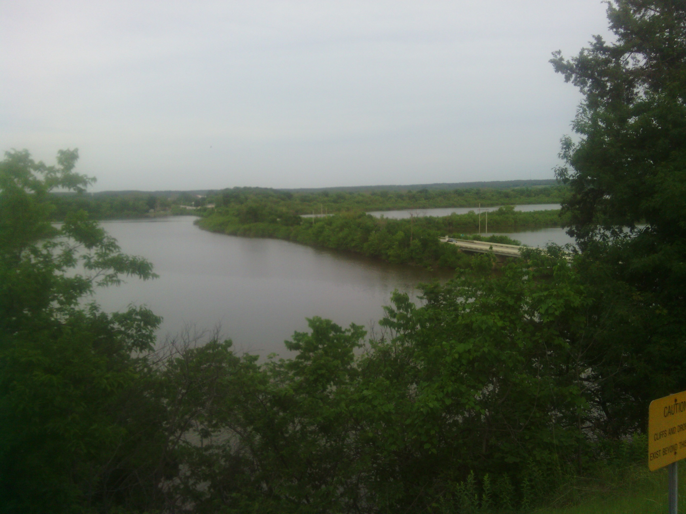

+++
title = "Day 20 -- Tulsa OK to Fairland OK -- Threatening skies"
date = "2013-05-24T01:07:54+00:00"
tags = ["Bicycle Trip"]
categories = []
image = "IMG_20130523_182619.jpg"
+++

Today started out pretty typically. I had a homemade breakfast of eggs and fried potatoes, said goodbye to my hosts, spent an embarrassingly long time looking for a missing glove, and hit the road around 8:30.

The skies were darker than I expected from the forecast and the wind was right in my face. I could tell it would be a hard day quickly because I couldn't get my speed much over 20 km/h and with about 160 km to ride that isn't what you hope for.

I intended to stop and see the blue whale, a historical route 66 attraction just outside of Tulsa, since I'm back on the route now, but I couldn't manage to find it and knew I didn't have much time to spend looking.

I stopped briefly in each small town I went through to chug a gatorade and eat a granola bar. It was important to chug the gatorade because on wind-in-face days it's hard to relax my riding posture long enough to really use my bottles while riding. I spent most of the day in third or forth gear and about 75% of it out of the saddle. In one small town I figured I should have something that resembled lunch so I counted up the loose change I've accumulated so far on the trip and found it was 99 cents. I asked the cashiers if I could get any of their hot items with that much. One said no but the other said he would get me a deal. He gave me about four bucks worth of chicken bites which helped my mood considerably. 

Asking around about the weather forecast, I found out that I probably wouldn't get rained on heavily, but might get a little wet. I pressed on through several more small towns, and near the end of the ride the sky began to lighten a little.

I made it to the campground around 6:30 which means it was about ten hours on the bike. This may have been the hardest day yet, but luckily I've built up a considerable amount of mental toughness compared to day one and was able to buckle down and keep riding. I finally got to camp in Oklahoma. Which reminds me, another way I know I'm out of the west is that the mosquitos are back. I'll have to add repellent to my supplies the next time I find a store.

Today's distance: 159 km
Average speed: 20.9 km/h
Trip odometer: 2662 km

Photos:

