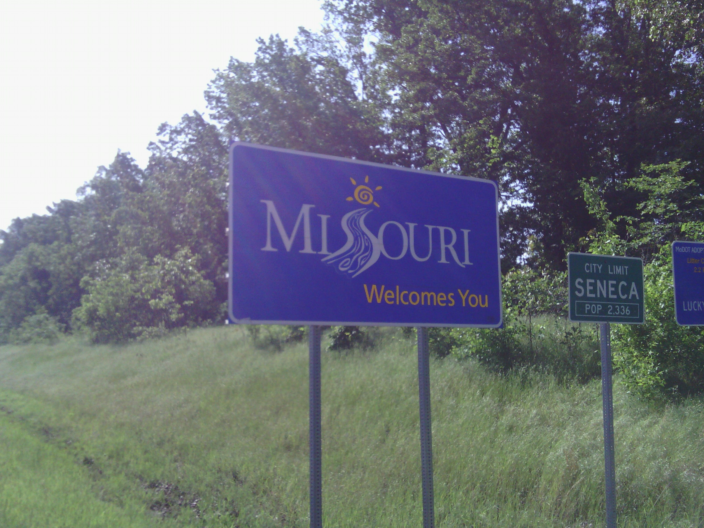
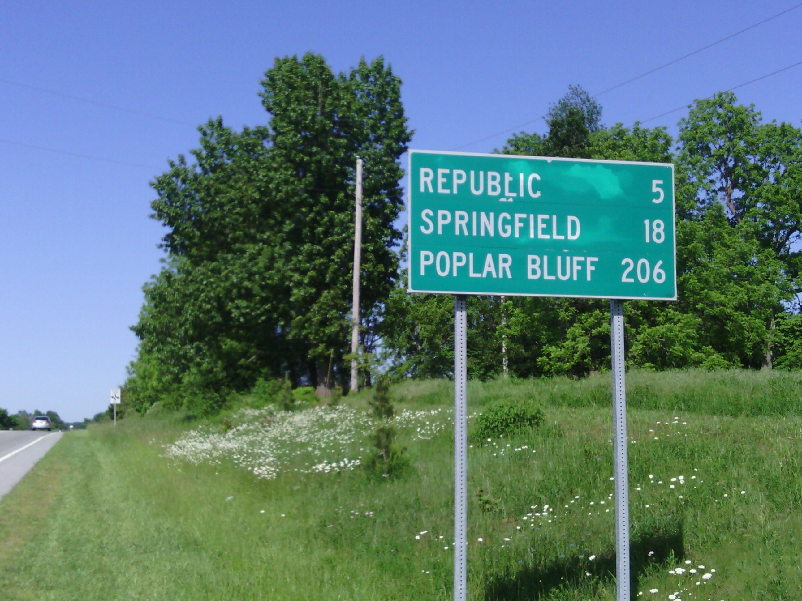
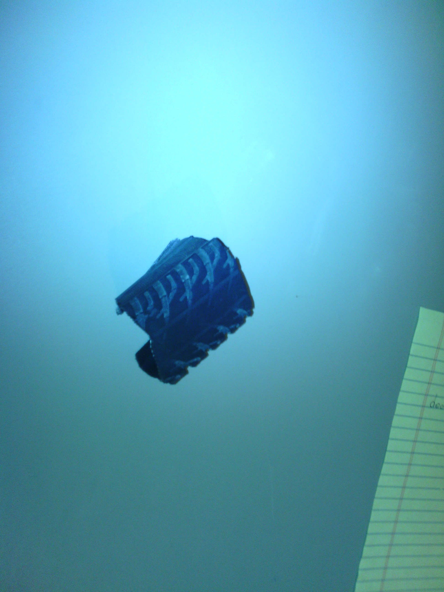
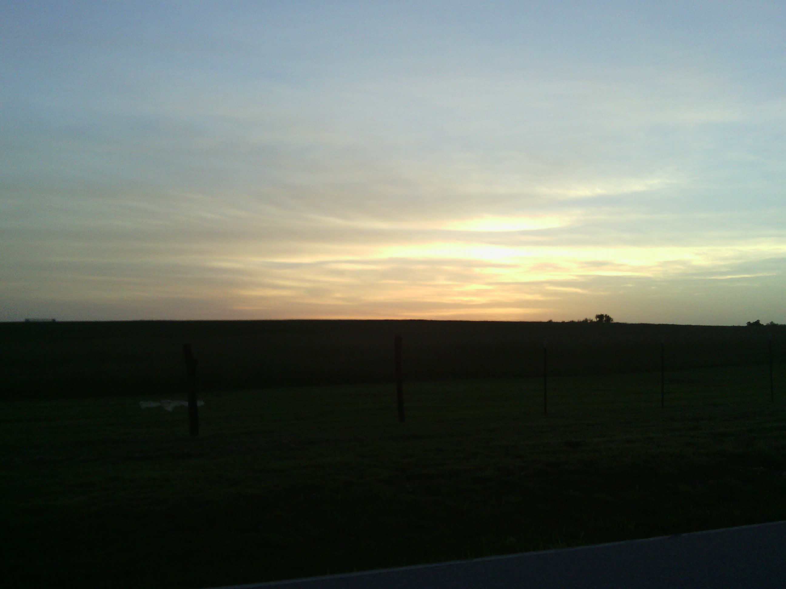

+++
title = "Day 21 -- Fairland OK to Strafford MO -- Not according to plan"
date = "2013-05-25T04:12:27+00:00"
tags = ["Bicycle Trip"]
categories = []
image = "IMG_20130525_083203.jpg"
+++

Wow, what a crazy day. Just about nothing today went according to plan. 

I woke up feeling pretty discouraged for several reasons. It was cold. I was itchy from all the mosquito bites. The wind was fast and east. My bike had started making a concerning squeaking sound the previous day. And worst of all, my formerly broken arm had started hurting and was a little swollen.

But after a little moping around I managed to get on the road. It was slow going as expected, even slower than yesterday. I was averaging about 19 km/h when I rolled into the first town, Neosho. I planned to get breakfast and some granola bars at the subway/Walmart that I saw on the map, but when I got to the expected location, it was a neighborhood. I ended up wasting about half an hour there before finally getting back to the main road and picking up a sandwich from a gas station.

A little while later I found an ice cream place called Baum's and got a milkshake and some trail mix which made me feel a little better.

After hours of slowly grinding and pedaling down the road the wind finally slowed a tiny bit and shifted from directly in my face to only partially in my face. And a few minutes later I saw a sign saying Springfield (my intended destination) was only 18 miles ahead. Things were starting to look up. I even stopped to take a picture of the sign. I got back on my bike with a slightly improved outlook. But everybody knows what happened next right...

Ping. Broken spoke. Front wheel again. Luckily mom had found me a list of bike shops in Springfield already to get the squeak fixed. Unlucky my phone was dying and my wheel was bent. I pushed the bike back a short ways to the small town of Billings and found an electric outlet on the side of a bar. I looked at the list of shops and saw that one of them was open until 7:00. It was already 5:00 so it would be tight, but I was determined. I managed to roll into the shop at quarter 'til and I bought a new front wheel and rear tire. But I kept a small piece of the old tire to say it made it from ocean to ocean. The mechanic also lubed up my whole drive train and seat post so everything is nice and quiet. He didn't even charge me labor. I have to say I've gotten lucky to find some really great bike shops on this trip.

After leaving the shop I was feeling much better, and my bike hadn't ridden so well since the day I bought it. Quiet and smooth. I was excited to ride it and I had already gone past my intended campground to get to the shop, so I decided to go a bit farther. I had called another campground earlier, but they closed at 8:00. I called again, and she said they could stay open late for me. I told her I would be about an hour, but that turned out to be an underestimate. I called her a few times with updates so she stayed up and waited for me. I rolled in about 9:30. She and her husband were very friendly, and the place even cost less than the planned campground.

I'm excited for a few shorter days coming up and to ride the newly upgraded and tuned bike. I am a bit worried about rain and my arm though. I guess I'll have to feel those out.

Total distance: 191 km
Average speed: 20.1 km/h
Trip odometer: 2853 km

Photos:

Comments:

> My finger spanning method is telling me you are now over half way there!!!! Good job, buddy :) (BTW, on a more personal note, I hope you are spreading the word about LUFT and The Zorphans while you are going cross country. This is basically a publicity stunt for both of them, right?) 
> **tymorehart**
>
>> I was just about to ask you for a finger spanning update. It's good to know the halfway point is behind me.
>> **Josh Orndorff**

> Hey Josh,
> 
> Keep it up.   You've made it about 2500KM so far, so that is definitely over halfway, and I'm guessing the hard half is over.  I think you're doing awesome, so don't be too discouraged.   I would refrain from mooning anyone for the rest of the trip unless its an emergency.   You really don't want to put extra strain on that arm.  Maybe find a minute clinic where they can take a quick look at it. 
> **George Visser**
>
>> Thanks for the encouragement man. And good idea about the mooning. You Newberry know when an emergency well crop up though :-) 
>> **Josh Orndorff**