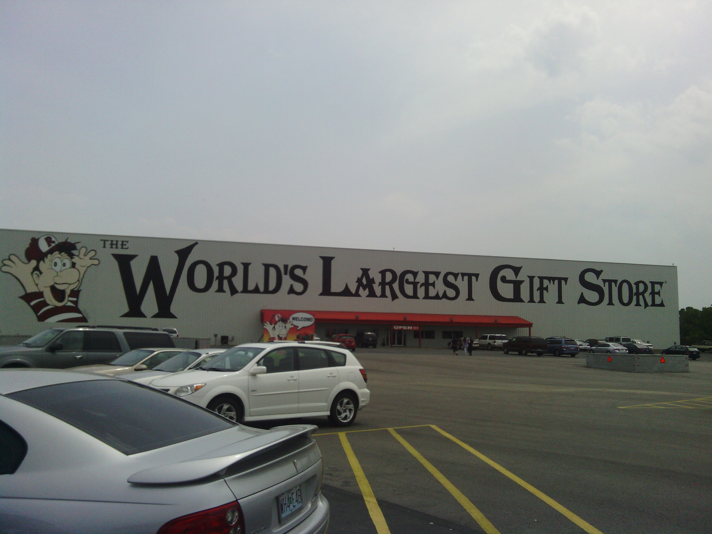
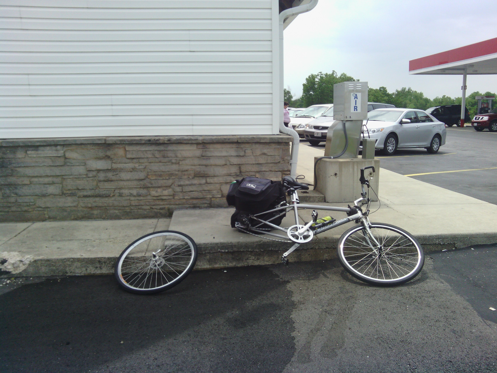
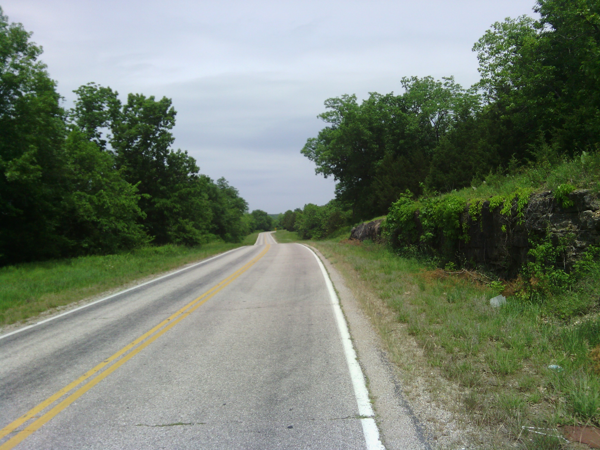
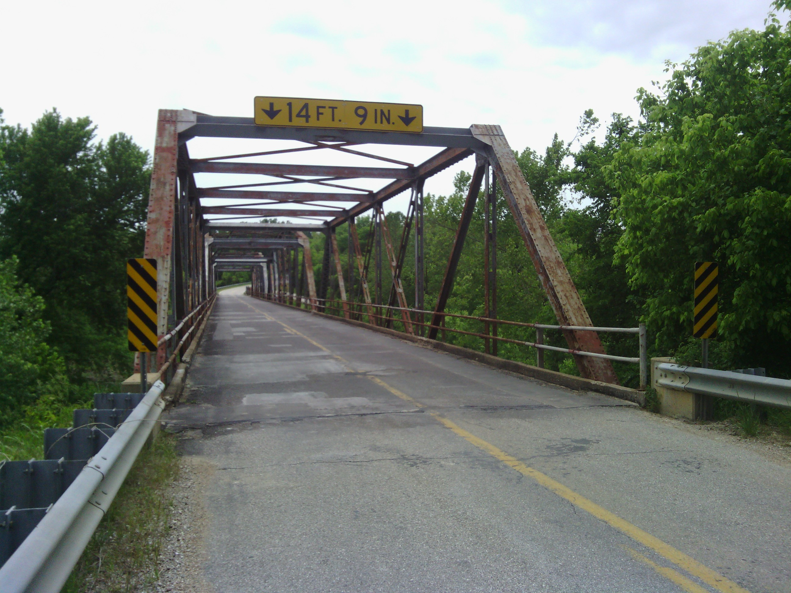

+++
title = "Day 22 -- Strafford MO to Richland MO --My first flat"
date = "2013-05-26T00:09:25+00:00"
tags = ["Bicycle Trip"]
categories = []
image = "IMG_20130525_141739_0.jpg"
+++

It was a cold morning and it took me a few minutes to get out of bed. When I finally did, I tore down my camp quickly. I pushed my bike through the gravel driveway and hopped on at the paved road. But when I started riding I felt a bump. Looking down I saw that my rear tire was flat. I was surprised because it felt fine last night. Few people were up at the campground, and the owners weren't around so I decided to just reinflate it with my hand pump. The pump couldn't quite get up to the pressure requirements of the new tire and I didn't want to tire my arm getting close so I just got it decently full and rode off to the town of Marshfield.

When I got there I stopped in an auto parts shop/garage and asked if they could top me off. The mechanic filled it up and tried to measure the pressure with his gauge, but couldn't get a reading. He tried to let some air back out and that wouldn't work either. I figured something was wrong with my valve, but didn't know what it could be. Anyway, my tire was full for now so after breakfast at subway I pressed on to the next city.

As I rode the tire slowly leaked and when I reached a gas station with an air machine I decided to figure it out. This time I was able to deflate the tire and take it off the wheel. Everything looked fine except that the stem was a bit crooked and I couldn't find a leak in my tube, so I put it back together being careful to keep the stem straight. When I went to refill it I found I needed a dollar for the air machine. Probably should have figured that. I asked the cashier if I could get cash back and when she said no I asked if she could just turn the machine on for me. No again. I told her my story and I guess she felt bad, probably that I was too stupid to check the price before I disassembled my wheel, and gave me a dollar. I thanked her several times and refilled the tire. Everything seemed fine on the test lap around the parking lot so I headed into Lebanon.

A quick stop at a grocery store and I started on the last 30 km stretch to the campground. The owners were super nice and upgraded me from a basic site to a site with water and electric for free. The site only cost $7! (that's excitement not a factorial for you math types) The place was nice with a pool and a river. Since I arrived early I even managed to make friends with the people at the next site who were here celebrating the upcoming wedding of two of their friends.

It never ended up raining and the skies are clear now so I hope it doesn't rain tomorrow either. Arriving early gave the legs a nice chance to rest, and I'm hoping that will happen for the next few days into St .Louis too.

Today's distance: 95 km
Average speed: 22.2 km/h
Trip odometer: 2948 km

Photos:

