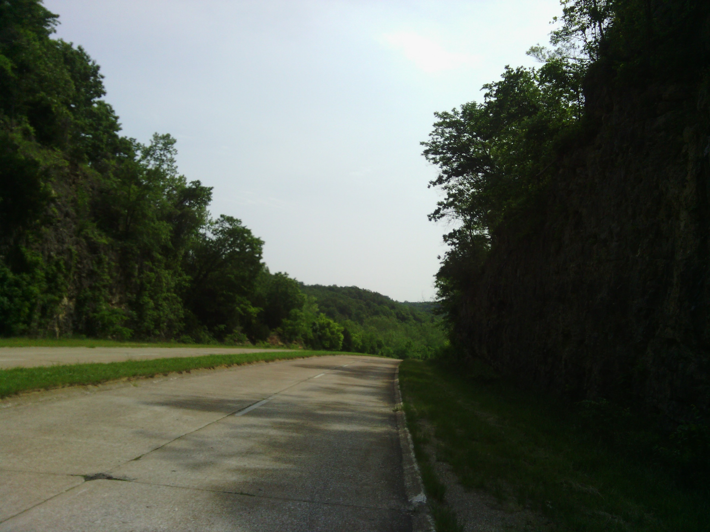
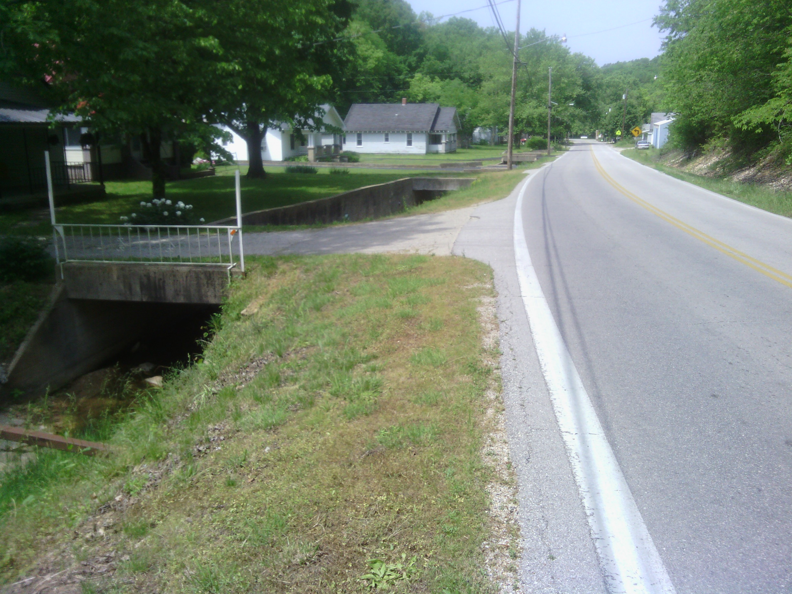
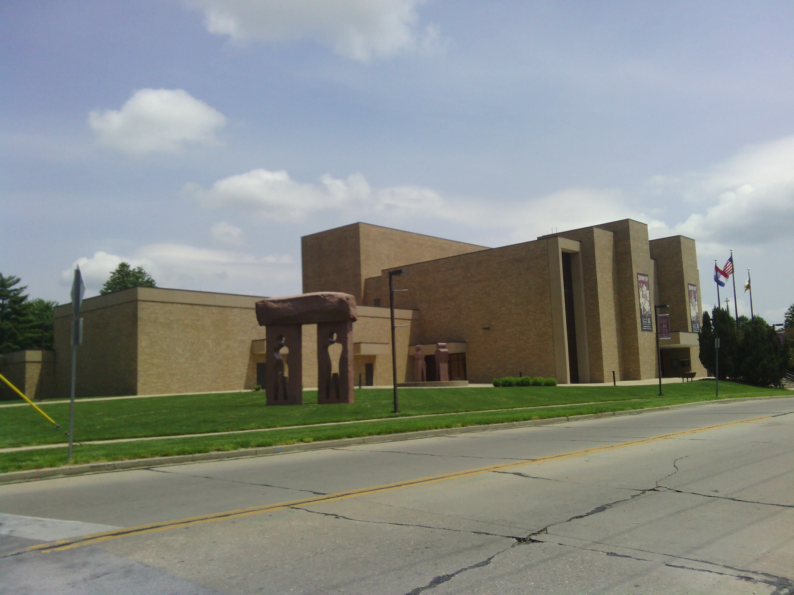
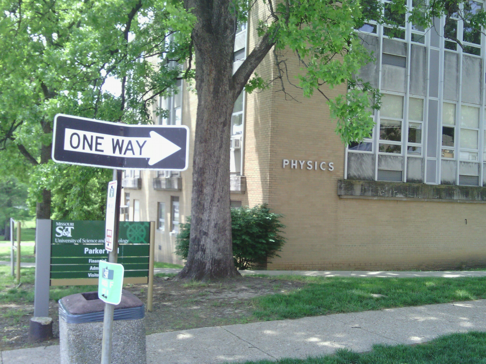
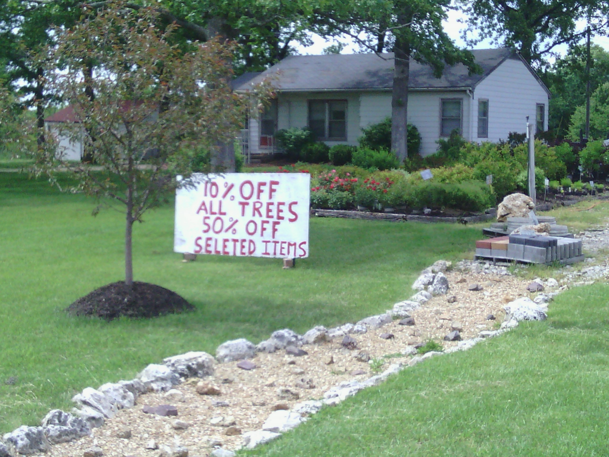

+++
title = "Day 23 --Richland MO to Cuba MO -- Country roads"
date = "2013-05-26T22:38:21+00:00"
tags = ["Bicycle Trip"]
categories = []
image = "IMG_20130526_122122.jpg"
+++

My tire was flat again when I woke up today. Looking more carefully, the stem of my tube seemed to have gotten cut from riding crooked through the wheel the other day. I replaced it and reinflated it with the campground's air compressor. That puncture proof tube served me well, but now that I'm out of thorn territory, I might not miss it's extra weight anyway. By 8:30 I had said goodbye to my friends from the night before and hit the road.

A lot of the route today was winding rolling country roads. Some of it was even through national forest. It was very scenic, and I quite enjoyed riding it.

The weather forecast called for rain again, so I stopped only briefly to fill a bottle or eat a granola bar in each city I passed through. I hoped I could reach the ladybug campground and be set up before the rain came. 

In Rolla I went through the Missouri University of Science and Technology and in St. James I stopped for lunch at a Mexican restaurant.

I rolled into the campground around 3:00 after riding only 107 km. Three short days in a row have helped my legs feel better and more fresh. I think my arm is starting to feel better too. The next two days are supposed to be even shorter so they should feel great. Although I'm thinking of combining them into one long day to get to St. Louis sooner. We'll see how the weather looks before making that call. For now the sky looks nice and blue with just a few clouds. Maybe I didn't have to rush after all.

It was a side wind today, but fairly hilly too.

Today's distance: 107 km
Average speed: 22.5 km/h
Trip odometer: 3055 km

Photos:

