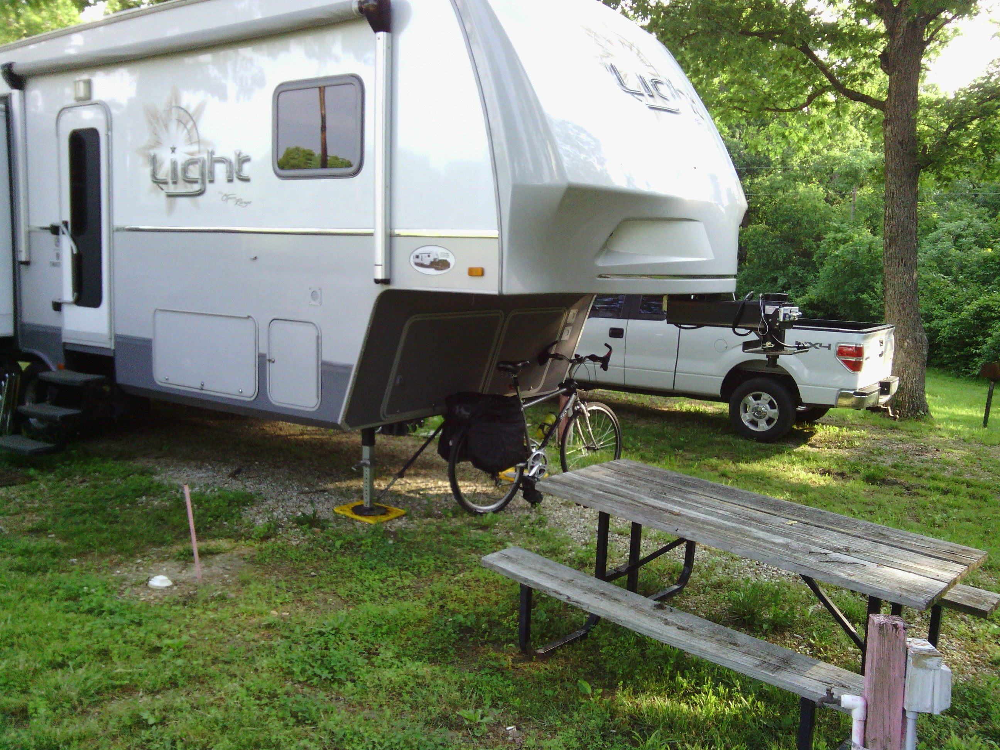
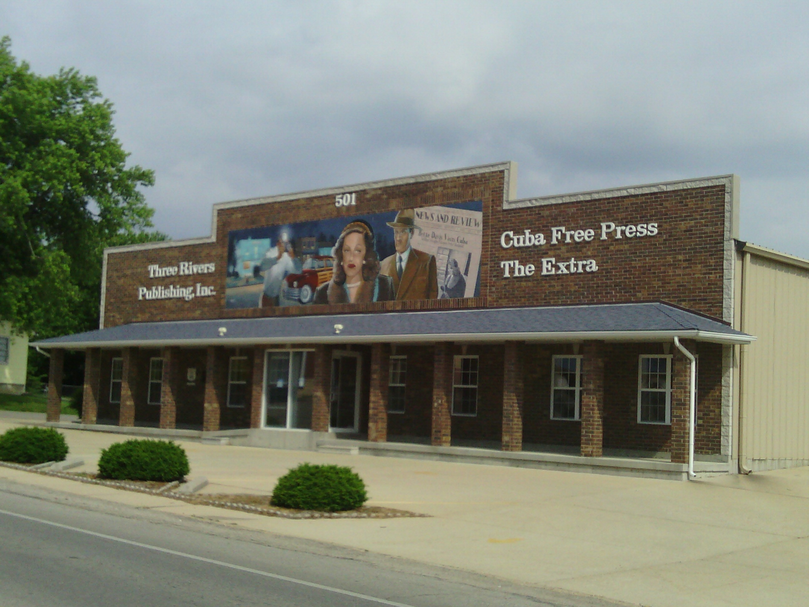
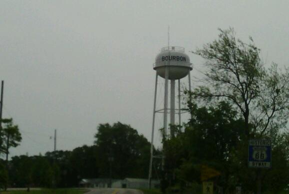
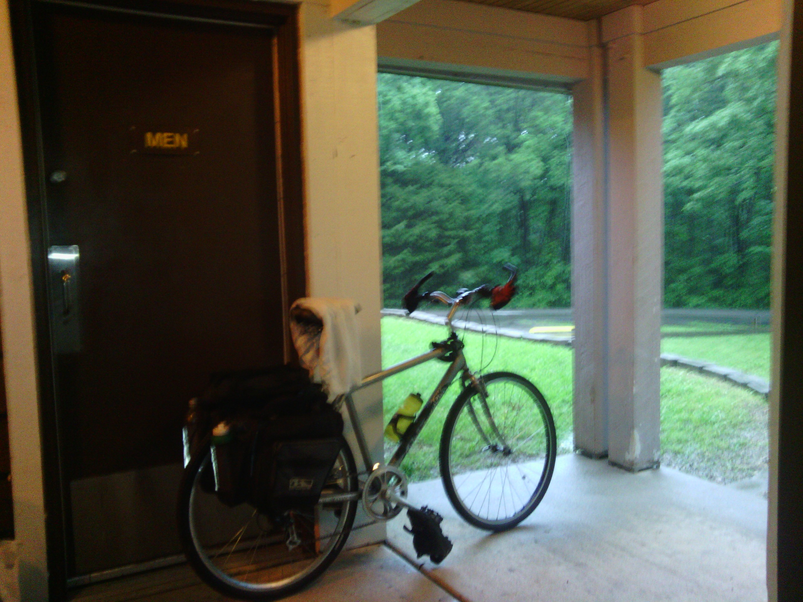

+++
title = "Day 24 -- Cuba MO to Robertsville MO -- Riding the storm out"
date = "2013-05-28T00:36:20+00:00"
tags = ["Bicycle Trip"]
categories = []
image = "IMG_20130527_160129.jpg"
+++

I woke up around 4:00 to the feeling of raindrops hitting my face through the screen on my tent. It was only lightly sprinkling, but I knew I had to get my bike and packs covered quickly or my clothes would be wet and heavy, and my drive train would be squeaky.

I jumped out of the tent quickly zipping it behind me to keep my sleeping bag dry. I thought briefly about whether I should wear more than my boxer shorts, but decided it didn't matter because everyone was asleep anyway. It only took a few minutes to gather the clothes I had laid out to dry, repack my food, and put the rain covers on my packs. The last thing I needed to do was find cover for the whole bike. I remembered the campground owner telling me "those two trailers" were unoccupied, and I was fairly sure I knew which two he meant. So I stashed my bike under the front of one trailer hoping nobody was inside. Finally I hand-squeegeed as much water as I could from my chest and back and hopped back into the sleeping bag.

By the time I woke up again at 7:00 the rain had stopped. I laid my tent over a picnic take to dry as I packed everything else and got ready for the day. As I was taking off the owner gave me a free orange juice and wished me luck.

I had decided that I was going to try to reduce my costs for the rest of the trip which meant I would be buying more food at grocery stores (now that they are more frequent) and less at restaurants and gas stations. As I rolled into the downtown area in Cuba, I realized that might be hard today because stores might be closed for memorial day. Luckily Mace was open so I bought a banana and yogurt for breakfast, sandwich meat and tortillas for lunch and dinner, and granola bars for snacks. I know I said I wouldn't try meat again after so much spoiled before, but I decided to give it one more shot.

The route followed pretty closely to the interstate today, and featured a lot more rolling hills. I'm considering all these hills training for when I get to the big guys in Pennsylvania. As I entered each new town I kept my eye on the sky and the forecast deciding whether I should press on or wait out some rain. And each time I decided to press on because the rain was still far enough behind me. In the last town, St. Claire, I saw a big storm brewing behind me on the radar but still thought I could beat it, so I set out on the last stretch.

I made it to the campground and had time to chat with the camp hosts for a while before the storm hit. And boy did it ever hit. It rained and thundered like crazy. Luckily there was a covered corridor outside the bath house to hide my bike and ride the storm out. While I was hanging around there, I met another camper, Diane, who was also from Ohio, and camping for a few days while she visited St. Louis. When the rain finally stopped it turned to blue sites and sunshine. It's astonishing how quickly and completely the entire sky can change.

Today's distance: 89 km
Average speed: 25.4 km/h
Trip odometer: 3144 km

I have one more short day tomorrow before I set off to cover Illinois. It was good to get my speed back up to a reasonable clip again today.

Photos:

