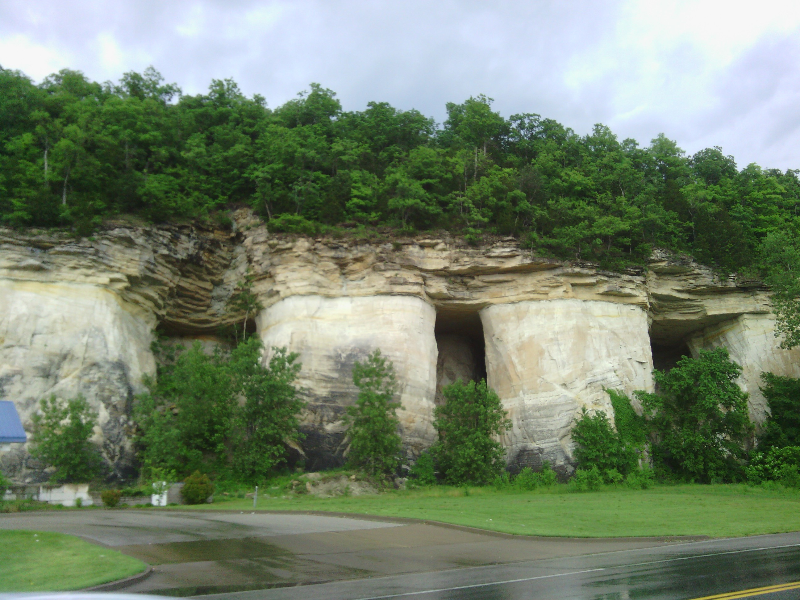
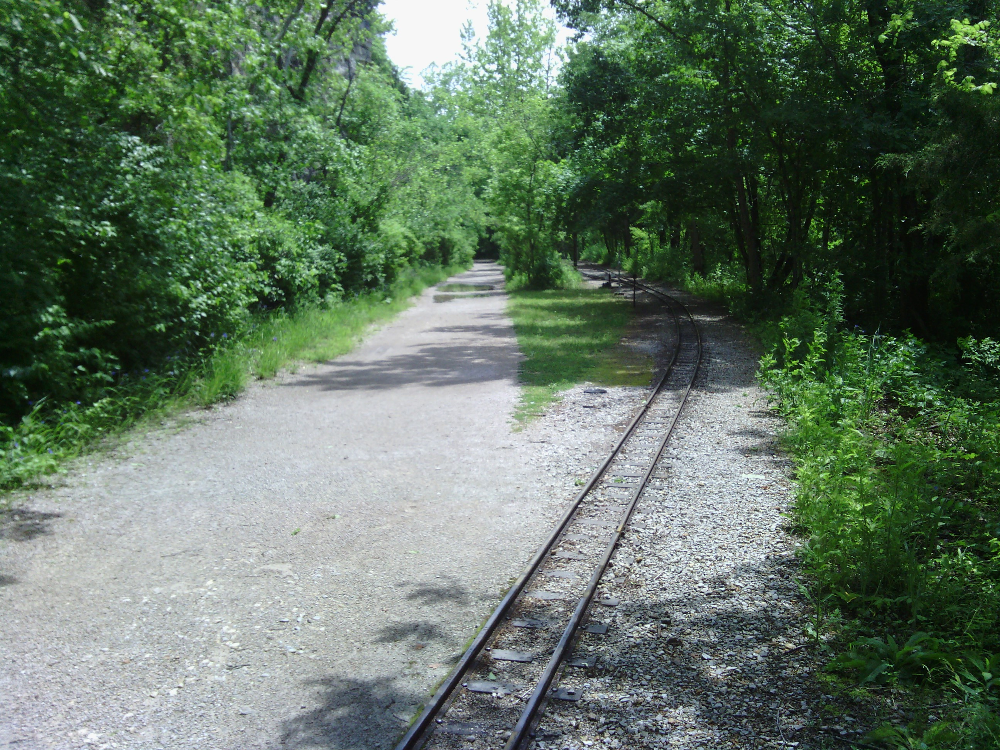
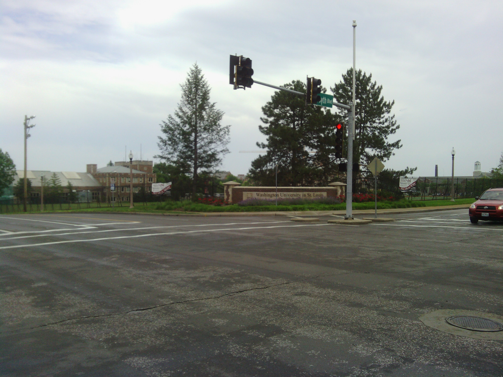
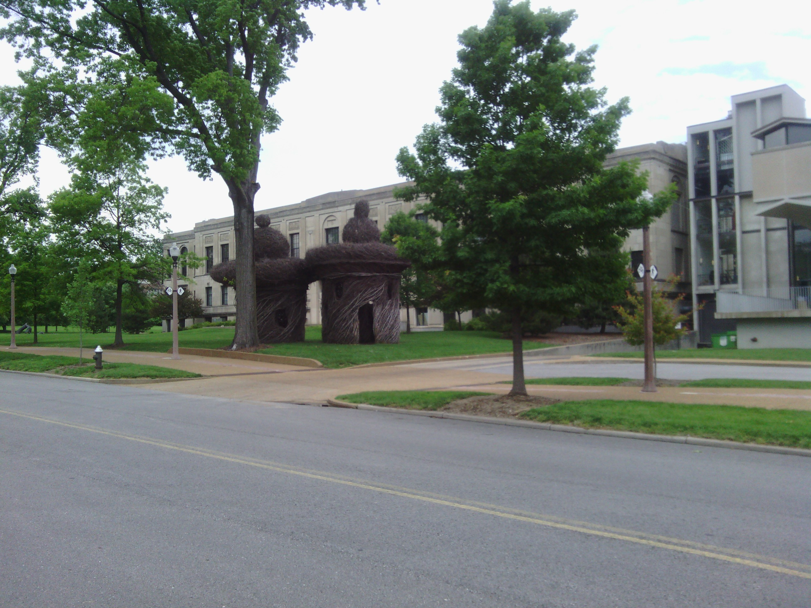
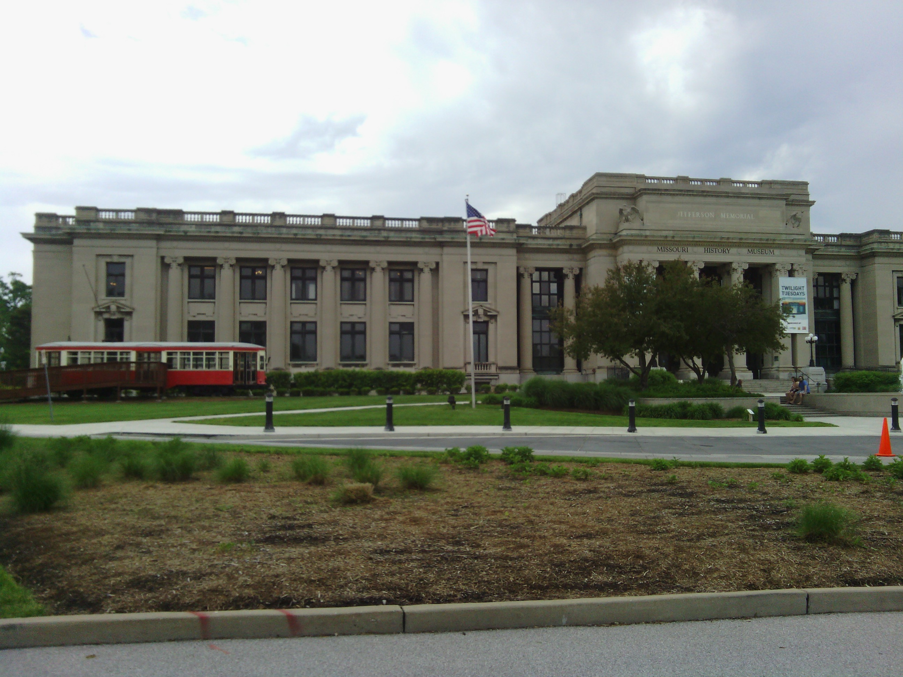
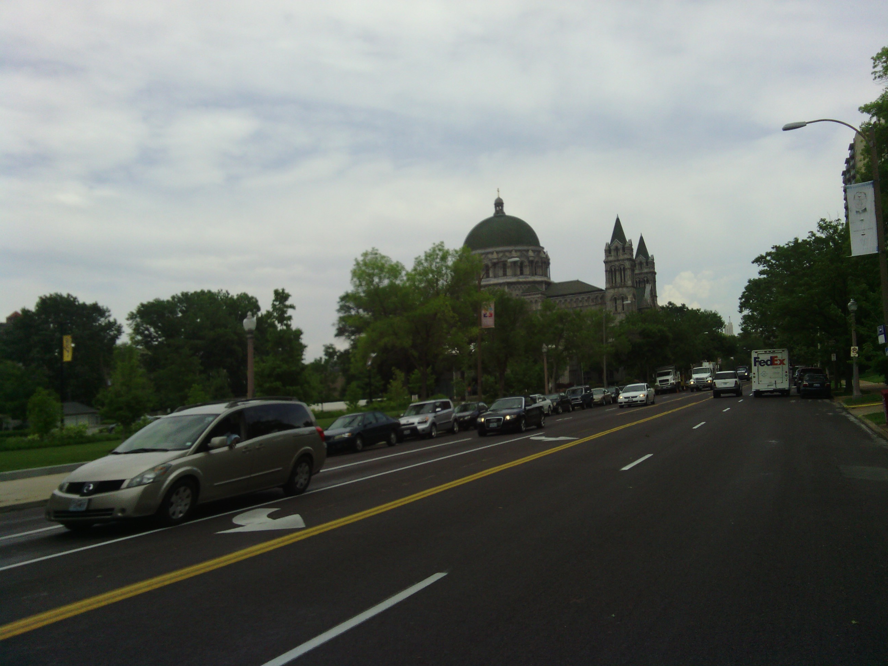

+++
title = "Day 25 -- Robertsville MO to St. Louis MO -- More rain and a mini railroad"
date = "2013-05-29T00:02:47+00:00"
tags = ["Bicycle Trip"]
categories = []
image = "IMG_20130528_110701_0.jpg"
+++

Waking up to the feeling of rain through my tent screen was a disappointment because I thought the last of the storm had passed last night. But I used it as an excuse to sleep in longer which felt pretty good. When it tapered off, I carried my whole tent, sleeping bag and all, still set up to the corridor where I had hung out the previous day. I packed up there, and had the great idea of leaving my sleeping bag in the tent all the time. I would make setting up and tearing down camp easier, and the waterproof tent would keep the sleeping bag dry if I got caught in rain. I wish I had thought of that earlier.

I took off around 8:30 but didn't get far before the rain set in again. I stopped at the 11 km mark and waited at a gas station. Eventually the gas station got boring so when the rain lightened I moved on to a subway and waited for it to stop entirely. Subway is a better waiting place because I could have breakfast and use their wifi while charging my phone.

As the day pressed on it was more of the same. I kept a close eye on the radar and waited when I had to. For the most part I stayed reasonably dry, and I also kept the rain covers on my packs all day. My second good idea if the day was to keep my phone in my shirt's back pocket when the rain covers are on so I can still easily take pictures and check the map.

As I neared the city, the route took me on a bike trail. At first I was hesitant about riding an unpaved trail since I've had so much wheel trouble already. But eventually it turned paved, and wound through some very scenic woods. The weirdest thing about the trail was that it followed along a tiny set of railroad tracks. I have no idea what they were for.

When I finally got into St. Louis I rode through Washington University, then stopped at a bike shop to get my front wheel trued and drive train oiled. I figured I'd need it after the rain today.

Finally I headed to my friend Sarah's house where I'll be spending the night. We're making stir fry for dinner and heading to trivia night at a bar later.

My arm has started feeling better the last few days, and my legs are feeling a little more fresh. Tomorrow is an average length day, so hopefully my body will handle it well after these few short days.

Today's distance: 82 km
Average speed: 22.6 km/h
Trip odometer: 3226 km

Photos:

