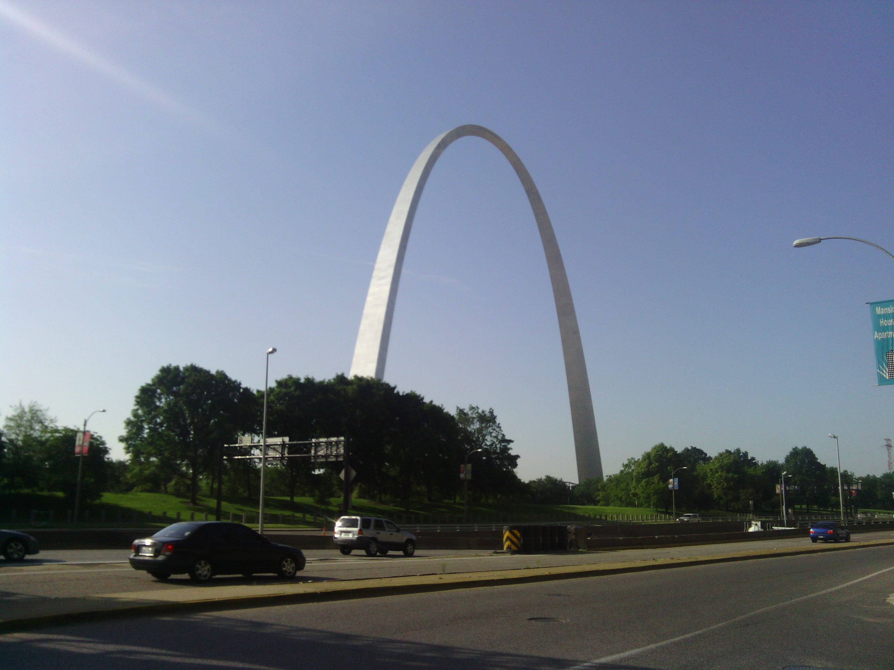
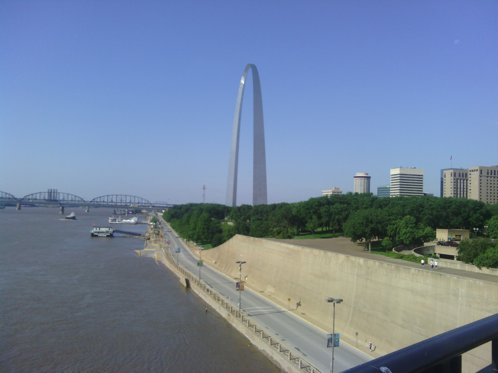
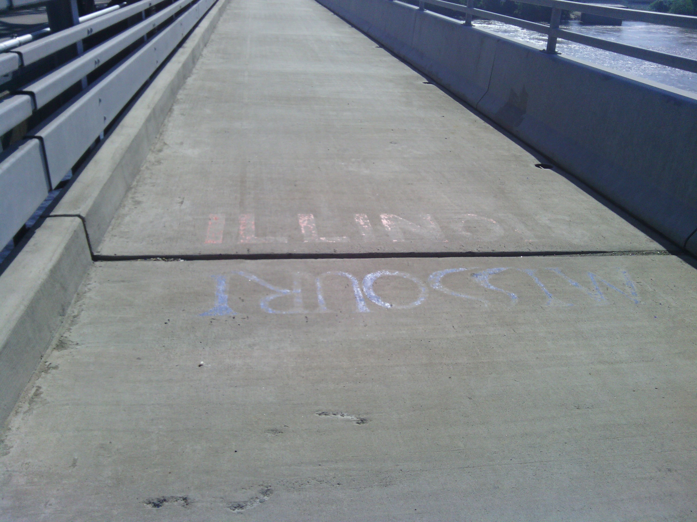
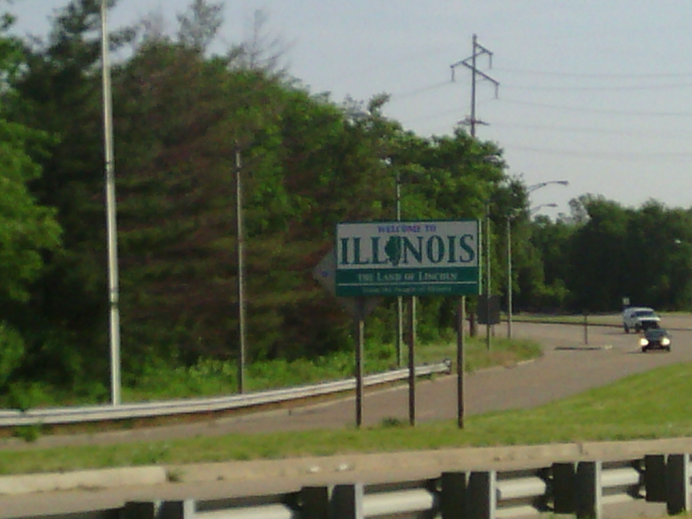
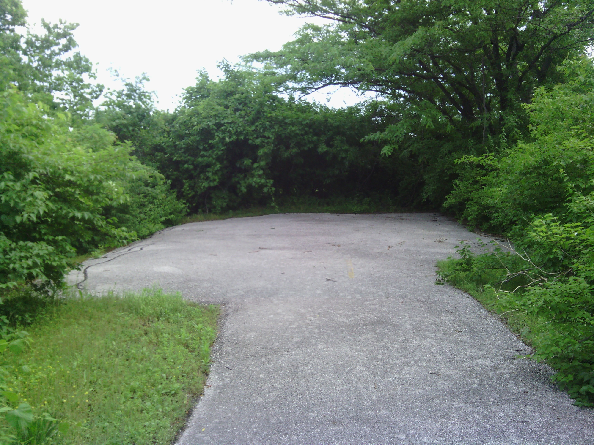
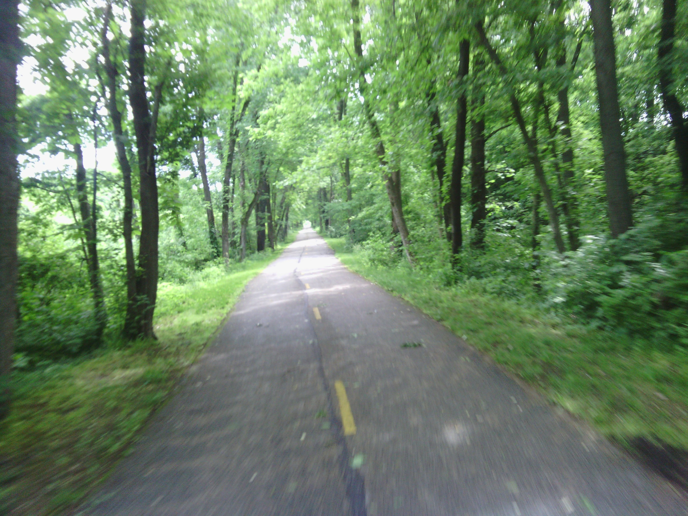

+++
title = "Day 26 -- St. Louis MO to Effingham IL -- From west to east"
date = "2013-05-30T02:14:01+00:00"
tags = ["Bicycle Trip"]
categories = []
image = "IMG_20130529_083027.jpg"
+++

Today was a big event in the trip because I crossed the continent's natural seam, the Mississippi river. After riding downtown and taking some pictures of the arch, I rode upstream on the Missouri side of the river for a few km and then crossed into Illinois.

The area immediately across from St. Louis was pretty industrial and run down, but not long after it turned into fields and country roads. Madison county even had a nice network of bike paths that were built over old railroad tracks. As I neared the edge of the county the trail turned from paved to cinder, but it was solid enough that I could ride without to much worry.

It felt nice to have a day without worrying about rain, and my legs felt fresh after the last few short days. Consequently, I crossed quickly through the towns, and ended up riding a good bit farther than I had planned.

I ended up camping at a nice campground in Effingham where I spent a while chatting with the owner and other campers about my trip. I really enjoy the alone time that this trip gives me to think, but it always feels nice to talk with people in the evening after a long ride by myself.

The bike seems to be in good shape, and my formerly broken arm continues to feel better. I'll try to make it to Terre Haute tomorrow which will put me a day ahead of schedule. But I might get into rain again.

Today's distance: 178 km
Average speed got reset again. I'm not even sure how it happened this time.
Trip odometer: 3404 km

Photos:

