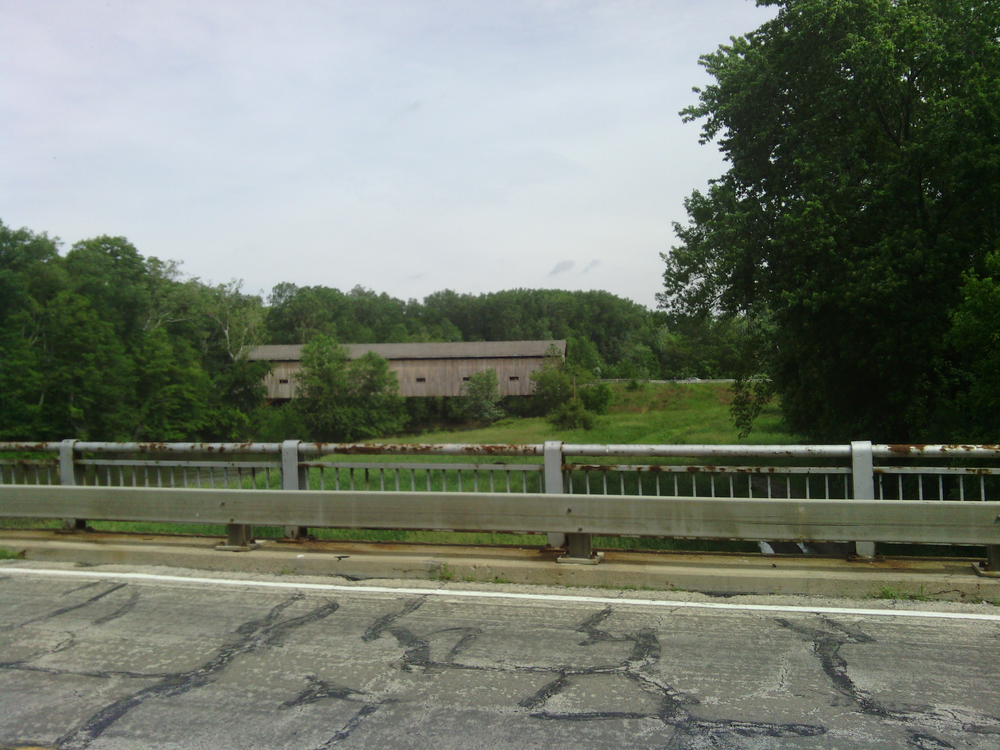
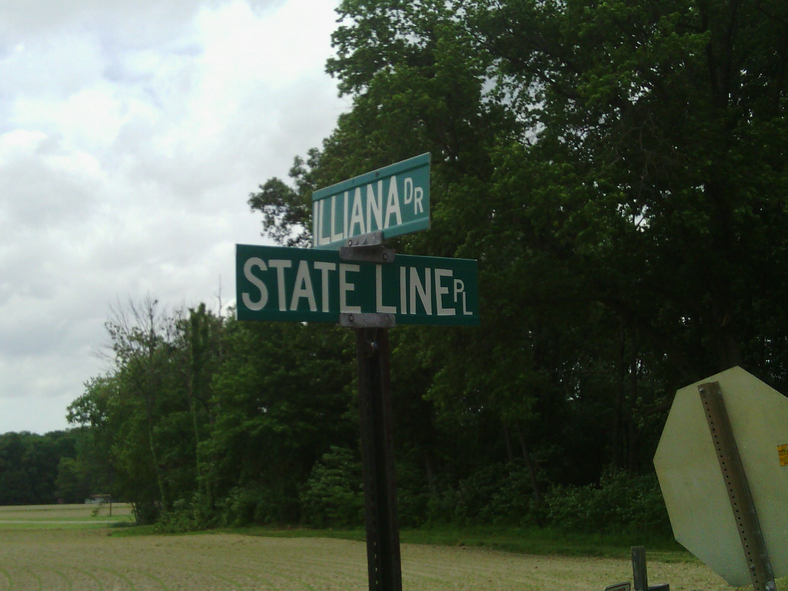
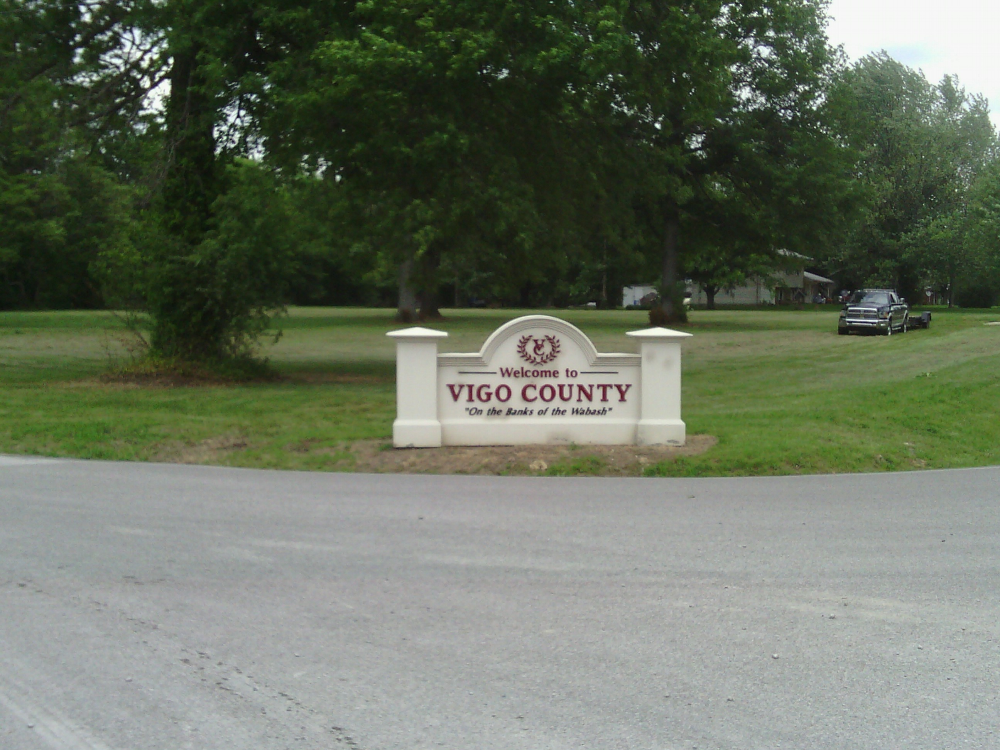

+++
title = "Day 27 -- Effingham IL to Terre Haute IN -- The final time zone"
date = "2013-05-30T23:45:35+00:00"
tags = ["Bicycle Trip"]
categories = []
image = "IMG_20130530_130334_0.jpg"
+++

Let me start by thanking all the Illinois drivers I encountered. I know I only spent one night there, but it was the first state I passed through that didn't have any dumb ass drivers. Nobody flew by a few cm from my handlebars. Nobody blasted their horn or yelled, "get of the road." Nobody pulled over like they wanted to fight. So thanks Illinois, and keep up the good work!

It turns out I didn't need to stash my bike in the campground laundry room after all because it didn't rain overnight. The forecast this morning said I would have until about 1:00 to get into Terre Haute before the chance of rain went way up, so I was trying to move quickly all day.

I followed the old national road which runs roughly along the track of interstate 70 all day. I stopped briefly in each town to fill my bottles, but did a good job keeping the stops short, and a great job reducing my costs. In fact I think this is the first day I didn't spend any money since I arrived in Kingman, AZ.

The wind seemed to be mostly at my side, but I knew it was at least partially at my back because I was able to hold about 28 km/h for long stretches. I realized just how much it was at my back when I passed a couple of riders, Allie and Alec, going the opposite direction. They were almost doing my route in reverse, heading from Connecticut to San Francisco. They were really friendly and we chatted about our routes and experiences for several minutes before heading off in opposite directions. I wished we could have ridden together for a while, but it would have been some serious backtracking for one of us.

I ended up making it into Terre Haute around 3:00 eastern time, but still managed to beat the rain. There were a few small showers this evening, but nothing too serious. Let's hope tomorrow is the same.  For the evening I'll be hanging out and eating pizza with my host, Roger, who is a friend of a friend of a friend. One time zone to go!

Today's distance: 115 km
Average speed: 24 km/h
Trip odometer: 3519 km

Photos:

