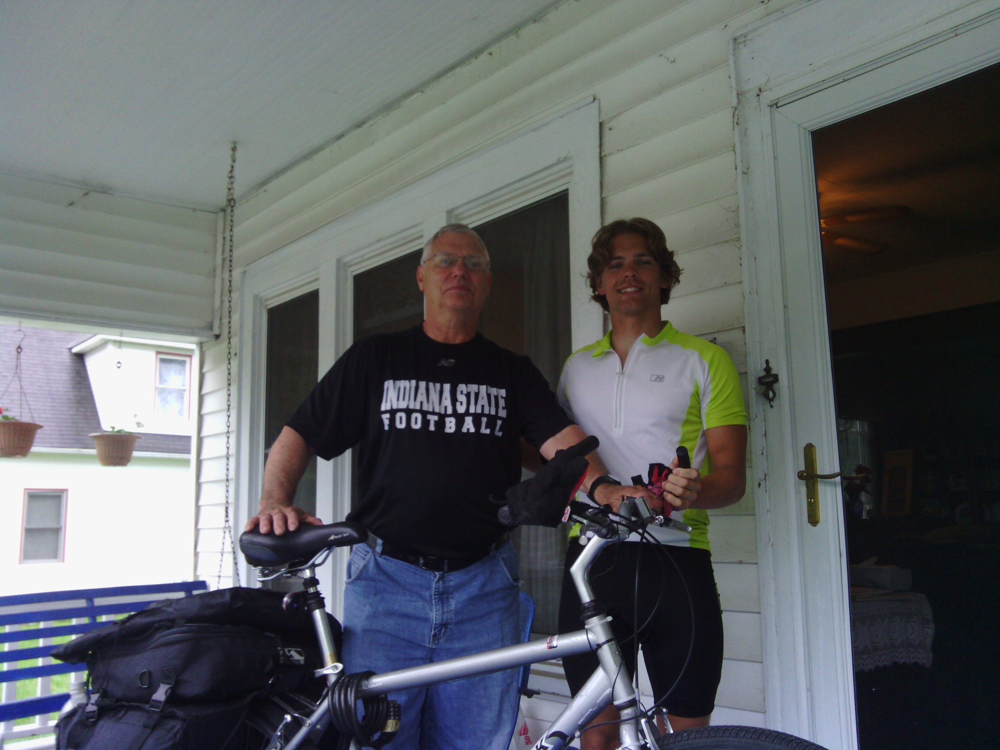
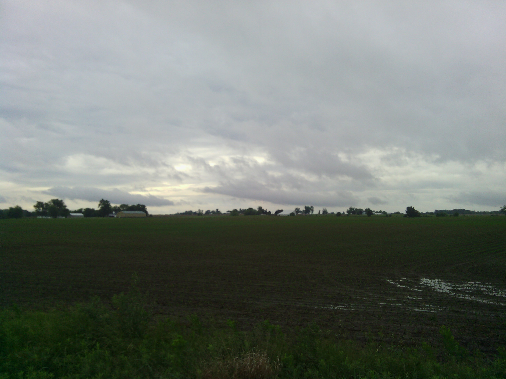
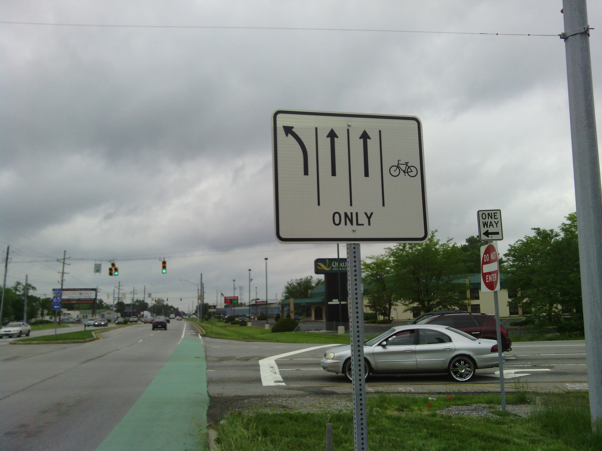
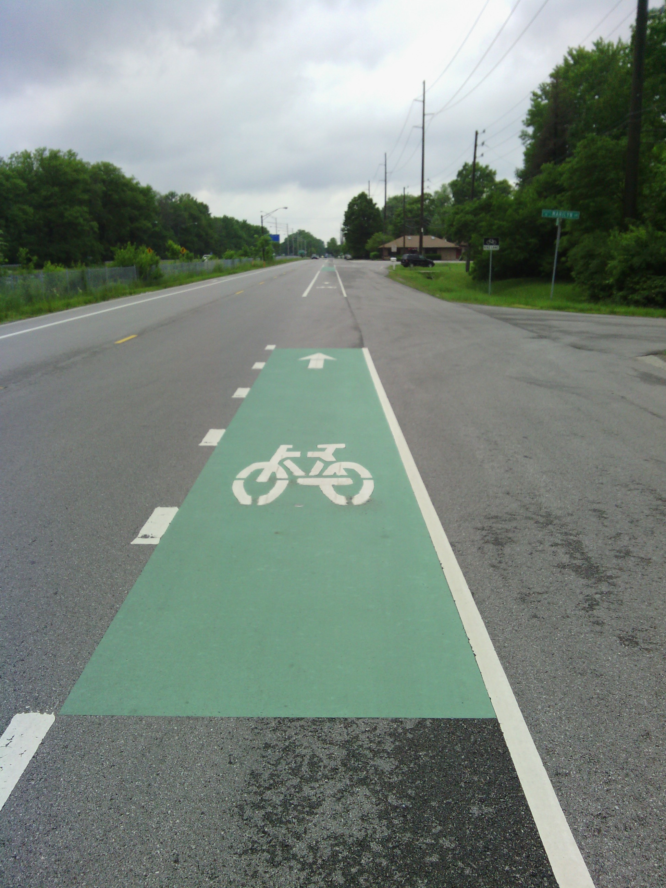
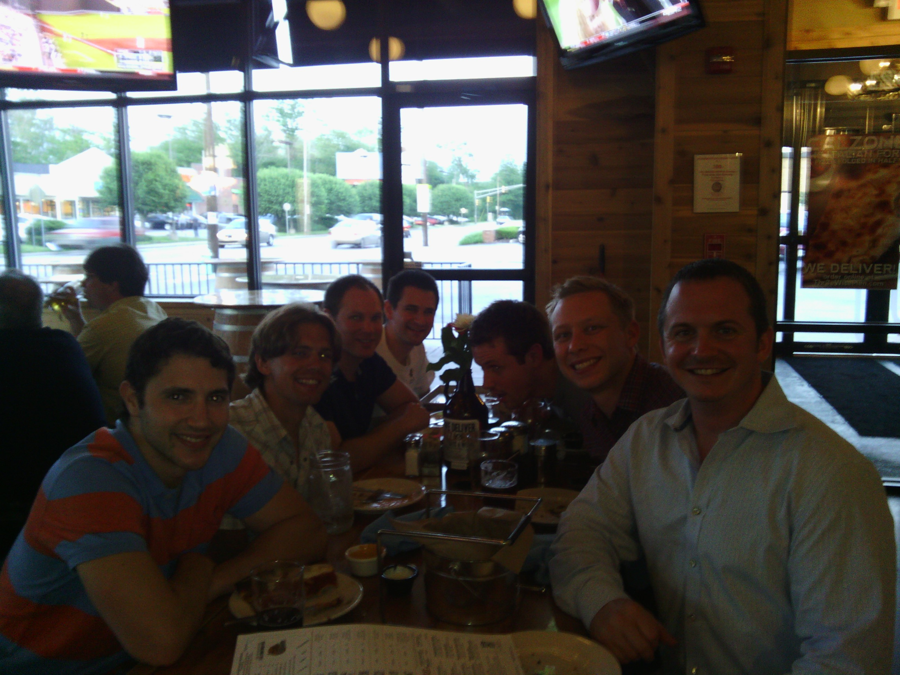

+++
title = "Day 28 -- Terre Haute IN to Indianapolis IN -- A rainy forecast"
date = "2013-06-01T03:40:19+00:00"
tags = ["Bicycle Trip"]
categories = []
image = "IMG_20130531_205255.jpg"
+++

When my alarm went off at 7:00 I heard rain outside the window. If I had to wait it out somewhere bed seemed like a good place. I finally got up just before eight and Roger made me eggs and sausage for breakfast. The radar looked rainy all day and I decided I would just have to ride through it. So I put the rain covers on my packs, thanked Roger for hosting me, and headed out.

As I rode through fields and countryside watching the cloud patterns change above me, I got less traffic than I expected. Since I had prepared myself mentally to ride in it all day long it was actually nice to only get in real heavy rain for about half an hour.

As I neared the outskirts of Indy I stopped at a gas station to fill my bottles and it started pouring. Going out into the rain is much harder than continuing to ride when you're already out there and it starts, so I decided to wait a few minutes and see if it passed. After about five minutes I decided is go inside and get a hot chocolate. But in the half minute it took me to dig out my debit card the rain totally stopped. I canceled the hot chocolate and headed out again. After a quick stop at Meijer where I picked up some groceries and my own bottle of chain oil, I arrived at Wes's house.

I took a much needed shower, and then met several of his friends. The whole group of us went out for pizza for dinner. When we got home we decided to do 200 pullups between the group of 8. Maybe now my arm muscles will not feel neglected compared to my legs.

Total distance: 125 km
Average speed: 24.8 km/h
Trip odometer: 3644 km

Photos:

