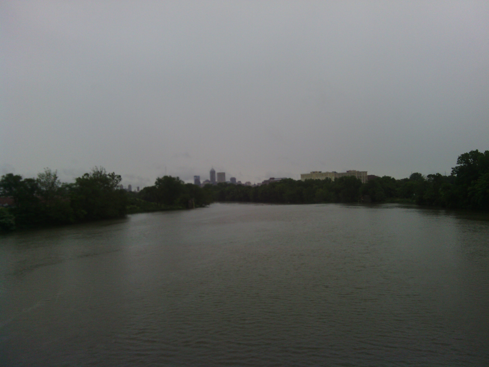
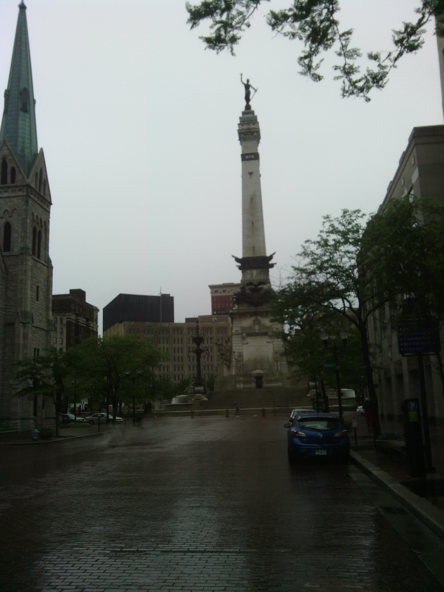
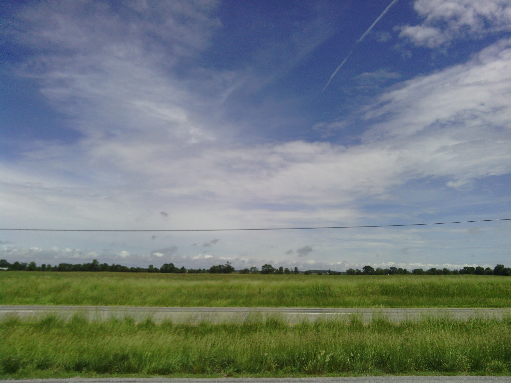
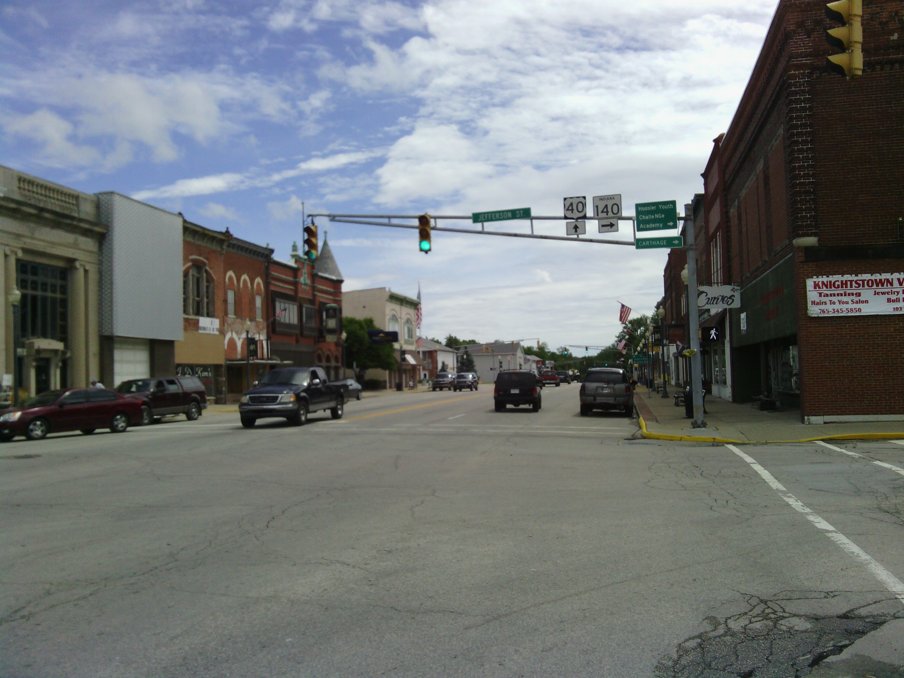
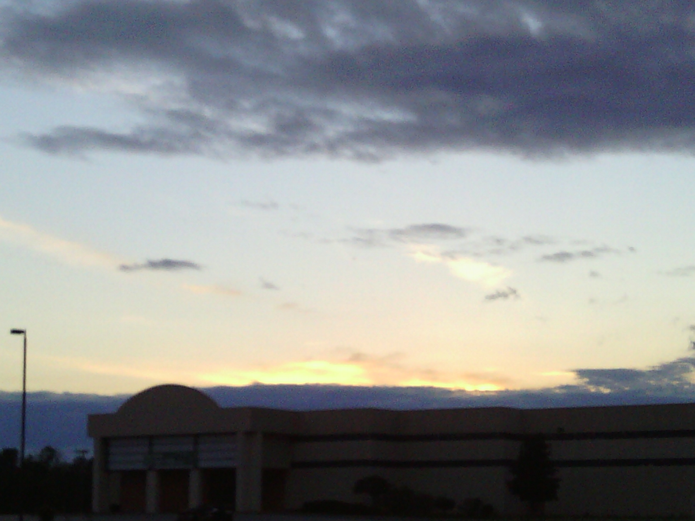
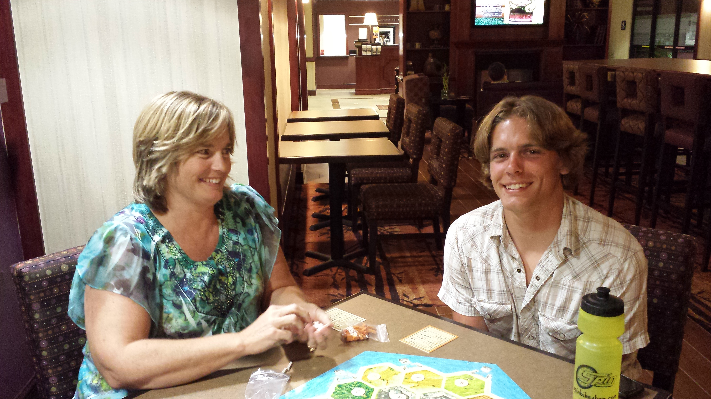

+++
title = "Day 29 -- Indianapolis IN to Richmond IN -- The biggest garage sale I've ever seen"
date = "2013-06-02T03:56:24+00:00"
tags = ["Bicycle Trip"]
categories = []
image = "IMG_20130601_115257.jpg"
+++

It was another rainy morning, but after staying up late with my new friends in Indianapolis, I didn't mind an excuse to sleep in an extra half hour. When I finally got up just before 8:00 the radar looked grim. I figured I would have to ride in the rain all day, so I prepared myself mentally as I prepared the bike.  I rode through downtown Indy enjoying the sculptures and monuments, but the rain prevented me from taking too many pictures.

Not long after I left the city the rain slowed to little more than a sprinkle and the sky began to lighten.  It was a pleasant surprise because I was expecting to be wet all day.  I called my parents who were planning to meet up with me later in the day and found out that they were on the road. We decided to meet up around Richmond, my previously planned destination.

As I continued riding down the old national road I passed a lot of garage sales. I couldn't believe how many people were having sales on a day that was forecast to be rainy, but I later found out that this weekend is the annual old national road garage sale.  All across the eastern part of the United States people were decorating the roadside with tables and tents.  Several of the towns along the way had banners and fund raisers going.

When I made it into Richmond I crossed paths with my parents in their truck, and Dad jumped out to ride the last few kilometers with me.  We will ride the beginning of my route to Dayton together tomorrow too.  After I got a shower we had dinner at a local sandwich shop, and played games for a while. Lately I've been getting a lot of encouragement from people following my blog and the support feels great.  The ride into Dayton tomorrow should give my legs a chance to rest, and the chance of rain is lower than it has been which is encouraging.

Total distance: 134 km
Average speed: 24.5 km/h
Trip odometer: 3778 km

Photos:

