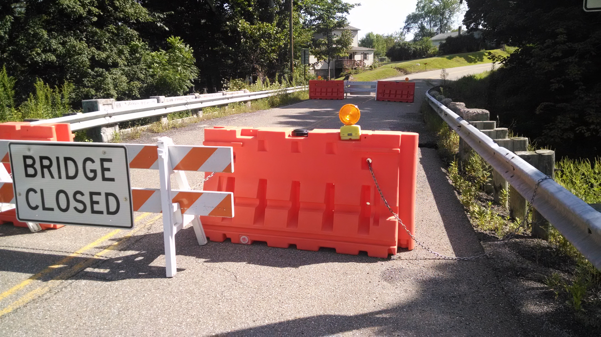
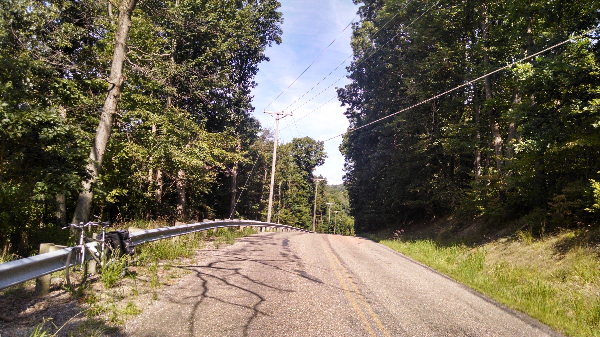
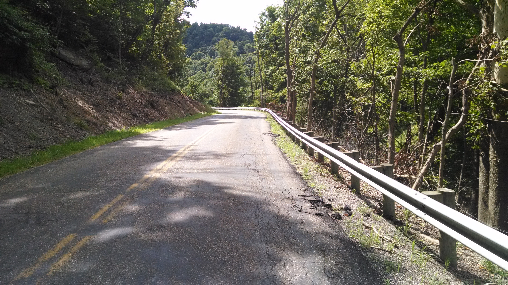
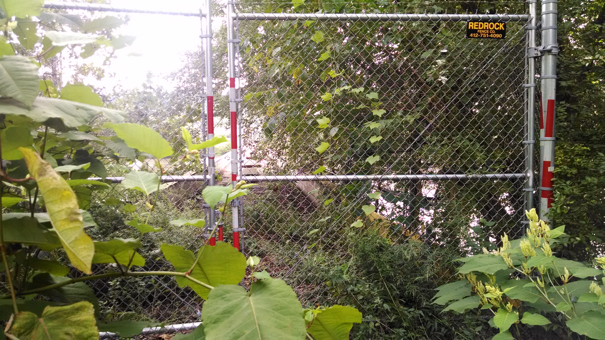
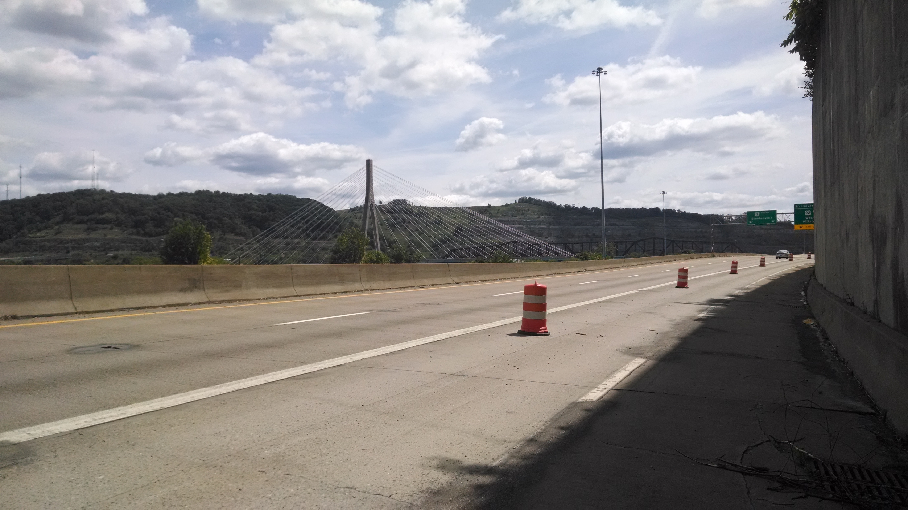
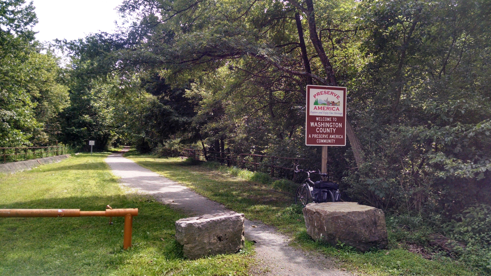
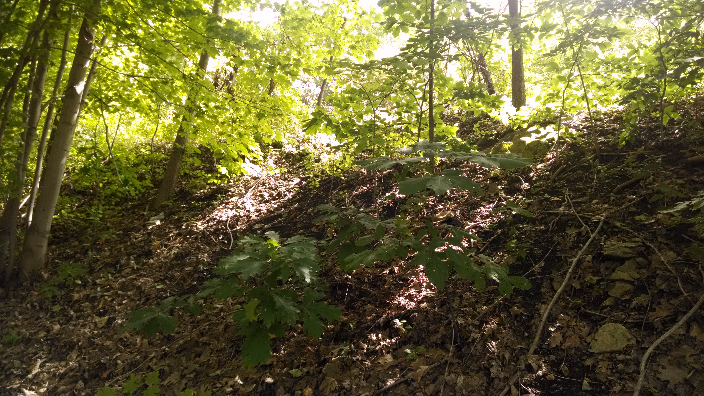

+++
title = "Day 3 -- Carrollton OH to Cannonsburg PA -- Familiar roads"
date = "2014-08-16T00:57:37+00:00"
tags = ["Bicycle Trip","Travel"]
categories = []
image = "IMG_20140815_121035571.jpg"
+++

I did a better job waking up this morning because the campground owner offered to make new breakfast and I figured I should be there on time. We had eggs over easy together and chatted for a while, and I finally hit the road about 10:00.

Not long after leaving I missed a turn and realized it after I had gone about 2 km too far. I considered riding back the way I had come but the map showed a joining road only about 1 km back. Any little bit helps. When I got to the road it was marked as bridge out. Given my experience last year I almost gave up but then decided I should at least check it out. Luckily this bridge want nearly as out as the sign claimed. My bike easily made it across. I originally intended to ride into Steubenville and cross the Ohio river where I crossed it on my last trip, but Google suggested a more northern crossing and it worked well with the campground owner's suggestion for a relatively flat route (which is still pretty hilly around here) so I went for it.

Along the way I encountered a huge descent that got me up to 68km/h with the brakes on. It was a little scary because the road wound around a bit.

When I got to the Ohio river bridge it had clearly been closed for some time. It was overgrown and barbed wired. That's an unfortunate setback. The best route into Steubenville is the limited access highway. I didn't expect to do that at all this time, but it saved me nearly 10 km.

It felt good to enter my second state, but the climb in West Virginia was everything I remembered it to be. I barely conquered it last year and with my heavier belly, heavier packs, and less training, I couldn't quite make it this time. I pushed my bike up the second half of the climb, and still had to stop and pant for a few minutes at the top.

Hopping back on the panhandle trail felt nice because I knew there wouldn't be any more steep climbs for a while. However they had recently laid new gravel and at times it felt like riding on a beach. I moved along very slowly in second gear for a while thinking I must still be tired from the previous hills and the gravel, but then suddenly I was cruising along in fourth gear at 25km/h with little effort. A while later I was back to a brutally slow 18km/h (which, for comparison is how quickly I <i>ran</i> my highschool cross country PR). Perplexed I looked at the Google maps elevation profile and discover that the trail actually does have slight ups and downs, and although I couldn't see them I certainly felt them. I'll keep that in mind for the Great Allegheny Passage the next few days.

The last adventure was pushing my bike up a wooded incline to take the Montour trail toward Aaron's house instead of the hillier road that I was on. I wish I had done that last year too.

Today's distance: 112 km
Average speed: 21.0 km/h
Trip odometer: 328 km

Photos:

