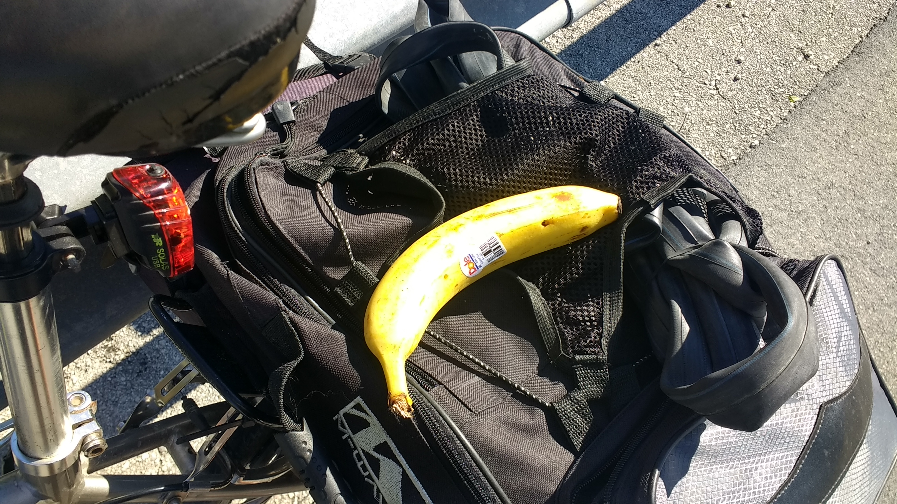
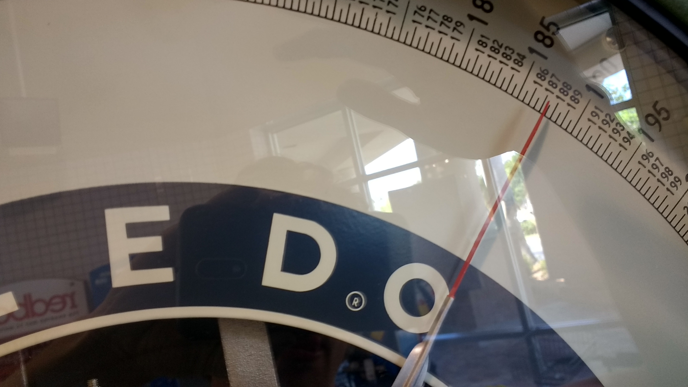
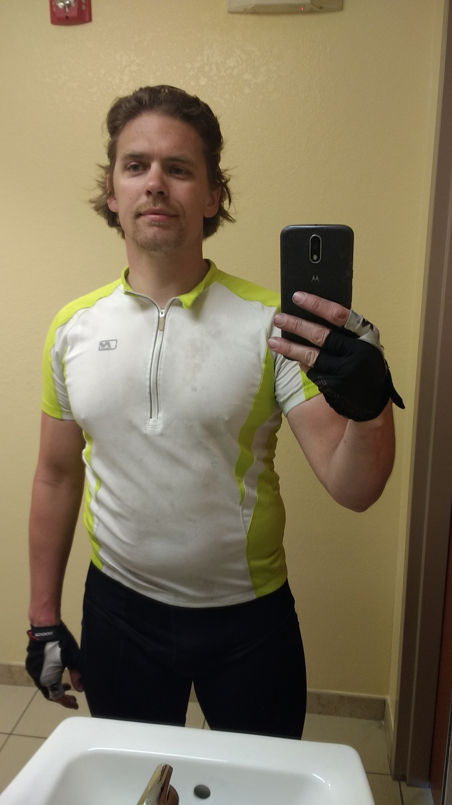
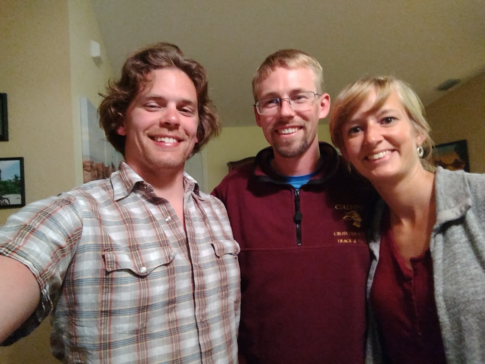

+++
title = "Day 3 -- ??? FL to Cape Coral FL"
date = "2018-03-15T03:36:55+00:00"
tags = ["Bicycle Trip"]
categories = []
image = "IMG_20180314_150827613.jpg"
+++

I woke up just after 7:00 when a big truck pulling a camper parked beside my secret camping spot. The driver and passenger got out, commented on the cold, and climbed into the camper. I was on the road by 8:00 just as the welcome center worker was getting things together for opening.

It was scheduled to be a long, wind-in-face day so I was glad to get an early start. I rode for about an hour straight before stopping for a roadside snack and rest. While stopped I realized the back tire was a little soft and added a few pumps for good measure. But after about another half hour of riding, it was clearly going flat. I did another roadside repair using my last remaining tube, and found a bike shop on the map. It meant going into the densely populated area of Naples instead of skirting it on country roads as I had hoped. It was also another three hours ride away into wind on an under-inflated tire. I told myself I could roll with that punch so long as I didn't lose this last tube before reaching the shop. Three hours on a new tube is usually totally reasonable, but at the rate I've been going it was not something to take for granted.

I as worked the grind, I realized I hadn't applied sunscreen evenly and had to stop to recover some areas that were getting burned. I pressed on slowly but surely thinking about the shop as my only destination, not letting the entire second half of the day's journey enter my mind.

I did manage to reach the shop on the same tube, thank goodness. I upgraded to a new kevlar-lined tire and extra thick tube. I also got Subway (tsaj) and stopped by Publix while the guy was putting them on. I felt silly paying someone to change my tire, but he was friendly enough and it meant I wouldn't have to hand pump again. At Publix I picked up some medicated powder for my saddle rash / chub rub which is about 60% of the way to being a genuine medical situation, and took Johnny's suggestion to look for body glide, but couldn't find it.

When I returned to the shop the bike looked sexy with that new tire. The mechanic handed me my old tube to keep as a spare and I hoped super hard that I wouldn't need it today. He gave me a route suggestion that would be much better than continuing on 41 and I was on my way.

The wind continued in howl in my face, but the fully-inflated tire and peace of mind of knowing that it would likely stay that way made the ride start to feel better. My sore butt continued to worsen although the tingle from the medicated powder gave me hope that it would get better. To prevent more damage, I decided to ride the rest of the way out of the saddle which actually made me go a little faster. Things were looking up.

I ended up reaching Kyle and Kristin's house just after six just in time to join them for dinner. Then I showered and felt soooo clean. We spent the rest of the evening catching up and generally having a good time, and I got to meet their to sons.

Daily distance: 145.45km
Average speed: 19.5km/h
Trip odometer: 454km

Photos:

