+++
title = "Day 3 -- Mojave desert to Parker AZ -- Lots of sand"
date = "2013-05-07T02:14:24+00:00"
tags = ["Bicycle Trip"]
categories = []
image = "IMG_20130506_072034.jpg"
+++

Today I woke up in the Mojave and was struck by the beauty of the distant mountains. I hadn't noticed it so much the night before because the sun had set before I made camp.

After some water, granola bars, and a bearclaw for breakfast, I got back on the bike around 8:00. I rode past sand, sand, sand, and more sand. And at one point I made a left turn. The desert was actually quite beautiful, and despite the two big climbs today it was a net elevation loss which was good on the legs. I took rest stops at the 40, 70, and 90 km marks to eat some sandwiches I had picked up the previous night and let the legs rest. By 1:30 I arrived at Vidal Junction, my planned stop for the night. The stop is nothing but a single gas station, but a much needed one. In the parking lot I met another cyclist named Ray who was going from the San Francisco bay area to Columbus, OH. He ride a recumbant bike which he spoke highly of, and it looked good to me because it has a full seat, and by day three my butt is getting sore.

I rested for a few hours at Vidal Junction, but since it was early I decided to ride another 30 km into Parker AZ where I had dinner and stopped at the library to charge my phone and post this update.

I don't yet have a definite place to stay tonight, but there is a campground on the map that is another 20 km down my route. Maybe I'll head there.

Update: I ended up going to the campground and it was closed when I got there. It was mostly for RVs, like most of the campgrounds around here, but everyone I talked to in town assured me they did allow tents in summer. There was a self pay station, but no prices posted and it seemed like it was only for preexisting reservations. I decided I'd just camp there and figure out how to pay in the morning. I set up my tent, got a much needed shower, and went to bed around 10:00.

Today's distance: 150 km
Average speed: 24 km/h
Trip odometer: 467 km.

Photos:

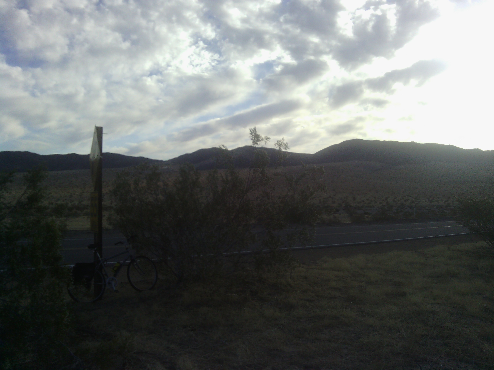
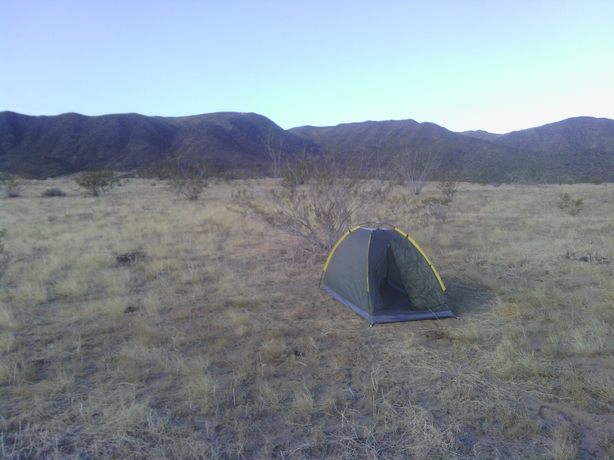
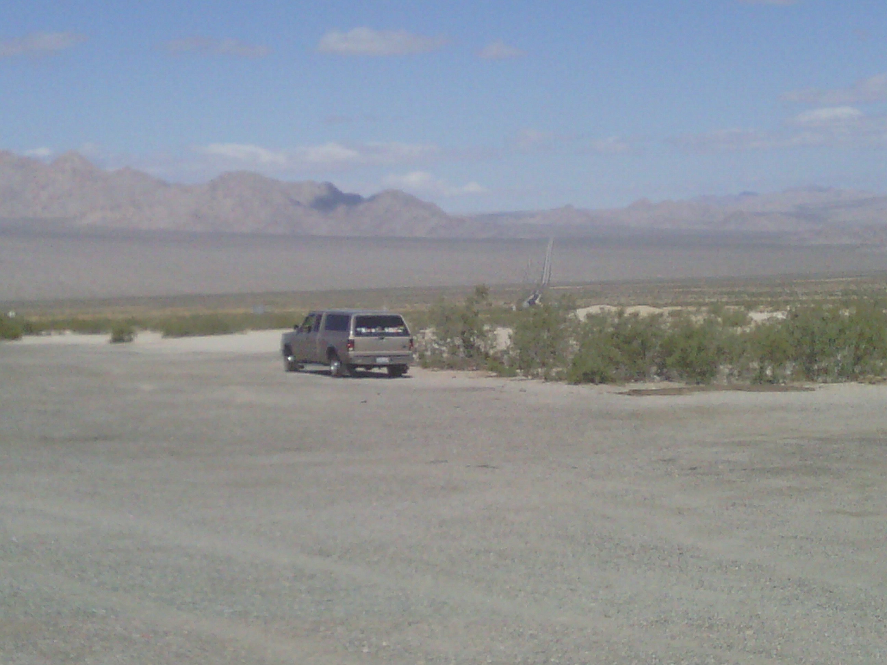
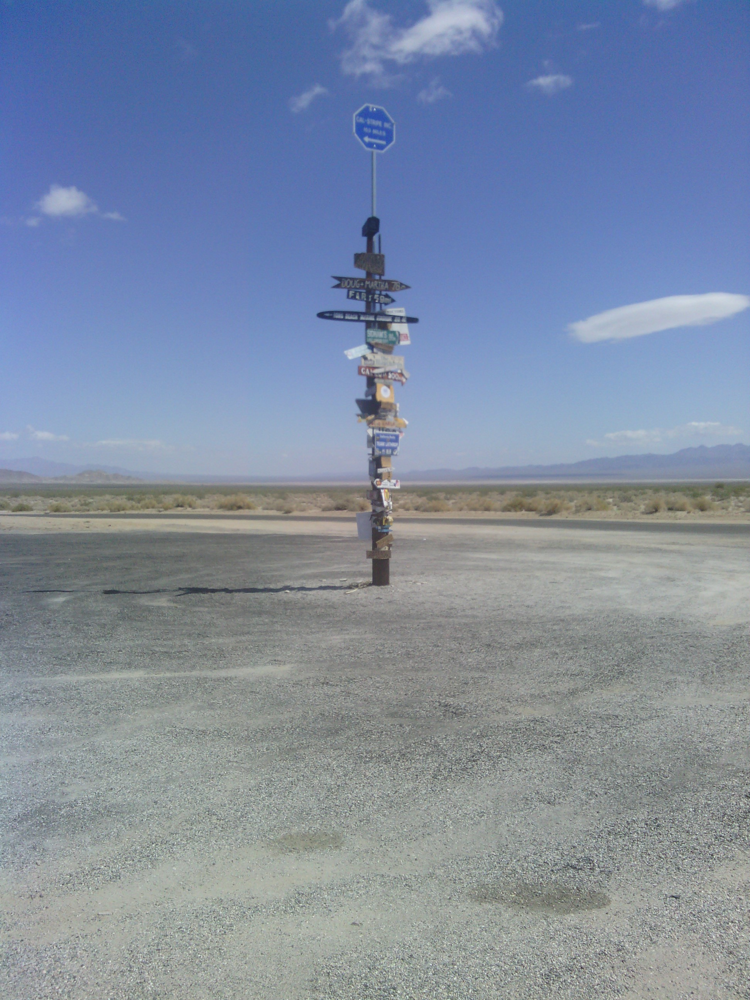

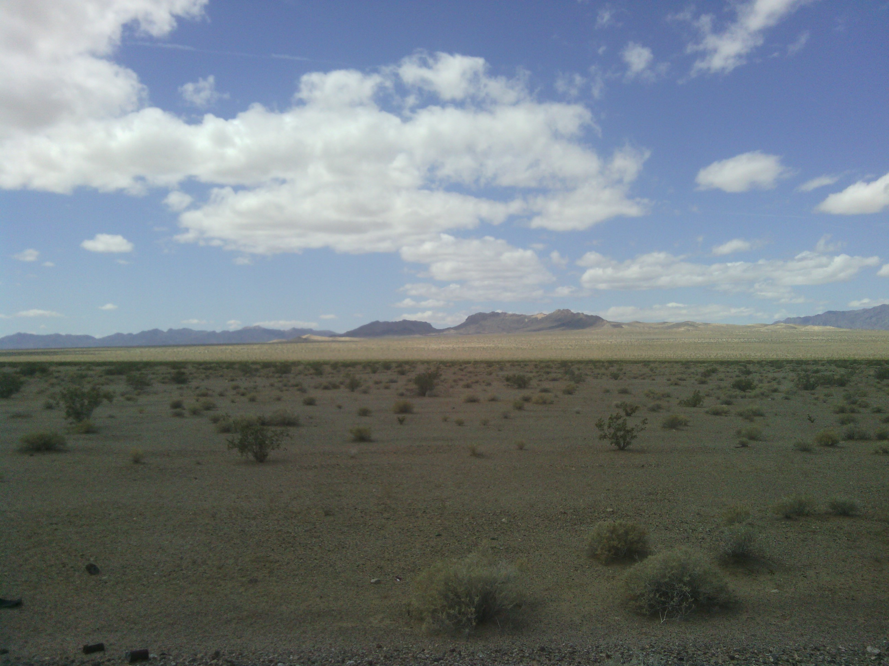
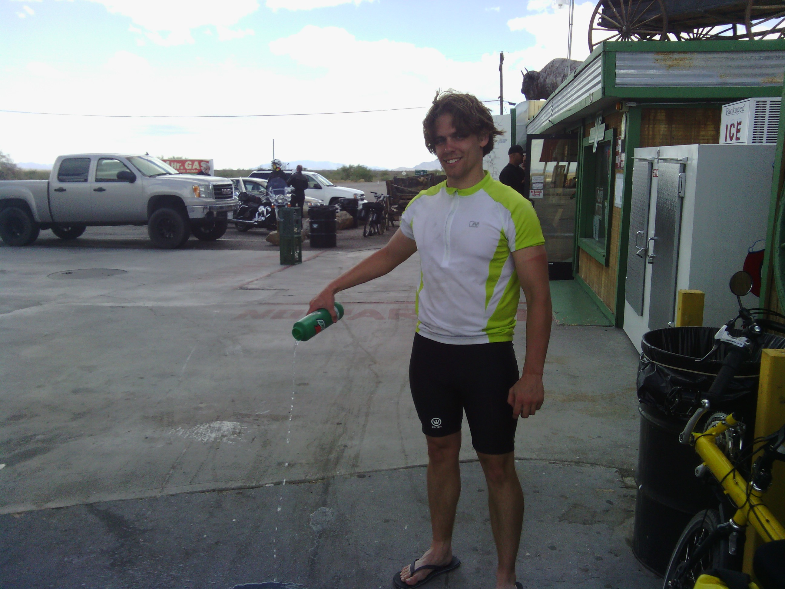
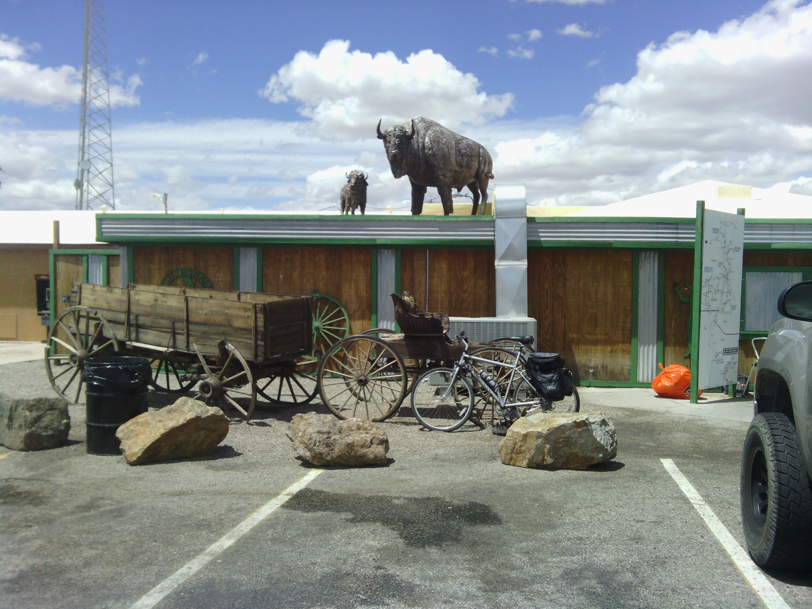
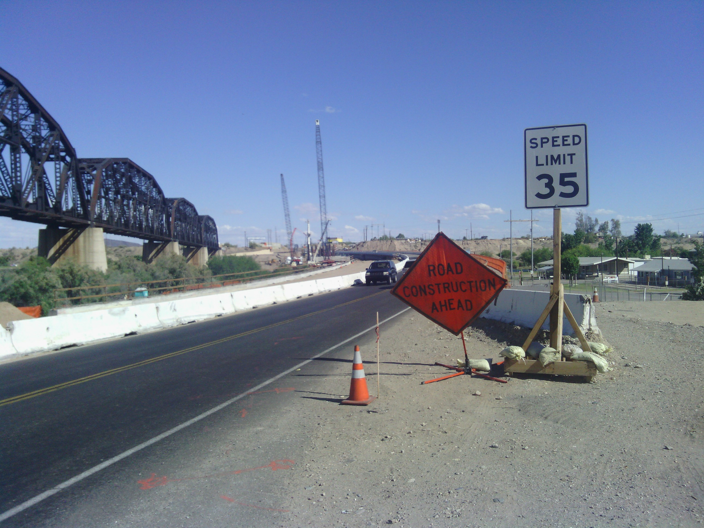

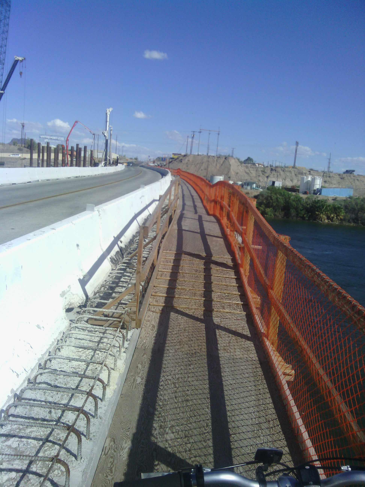
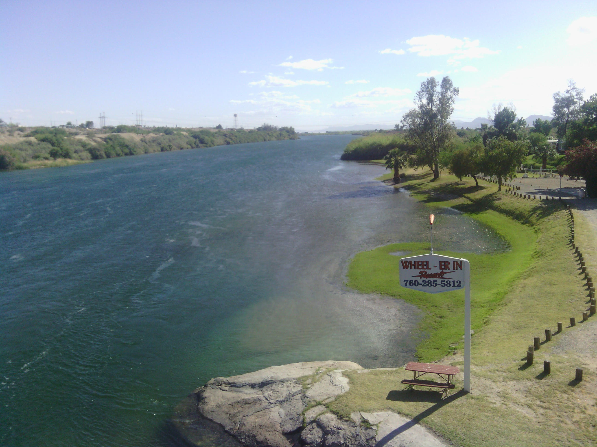
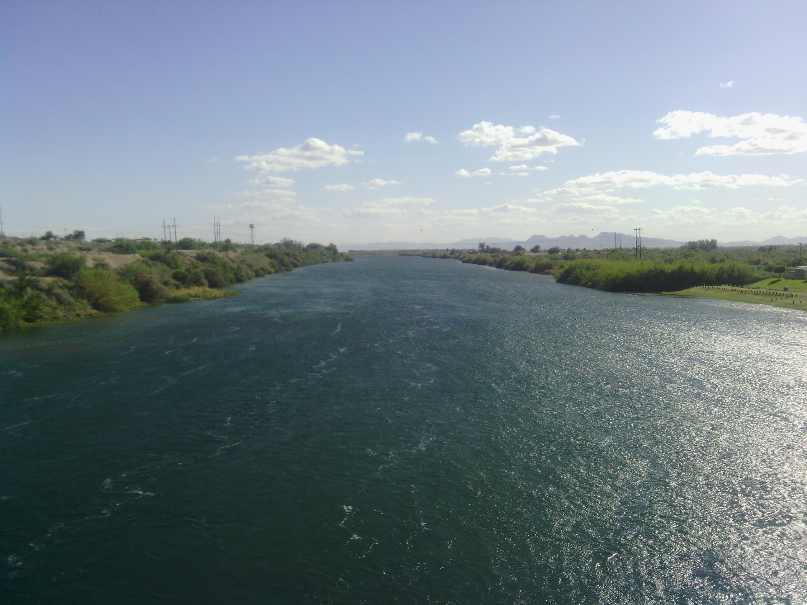
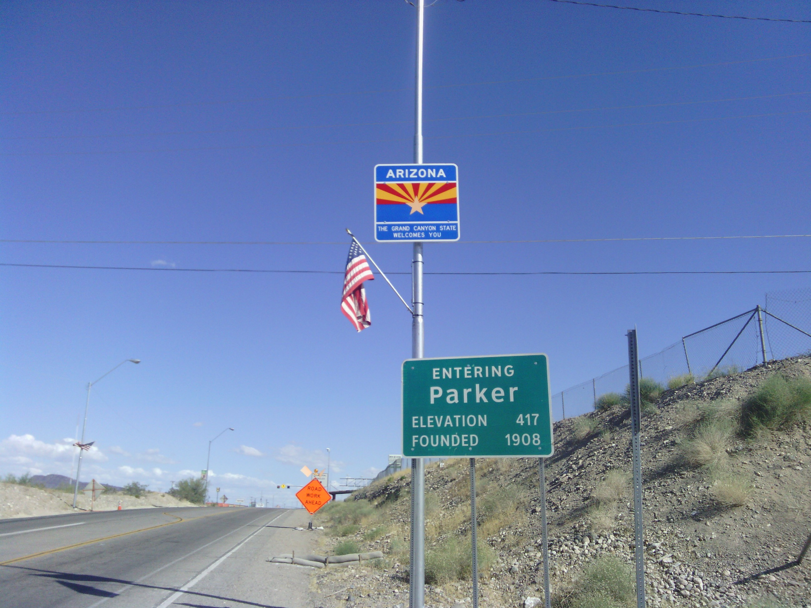

Comments:

> These pictures are amazing!
> **mom**

> http://www.go-one.us/
> 
> I bet your trip would be a lot more different if you were riding one of these.
> 
> -Tyler "Mine Mine Mine Mine" Morehart
> **tymorehart**