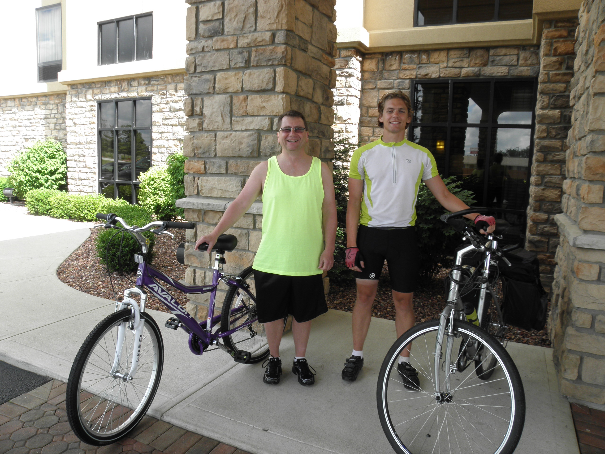
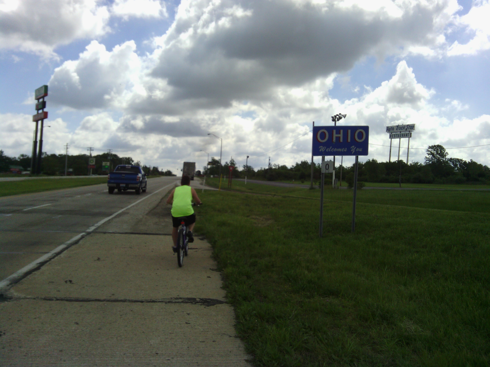
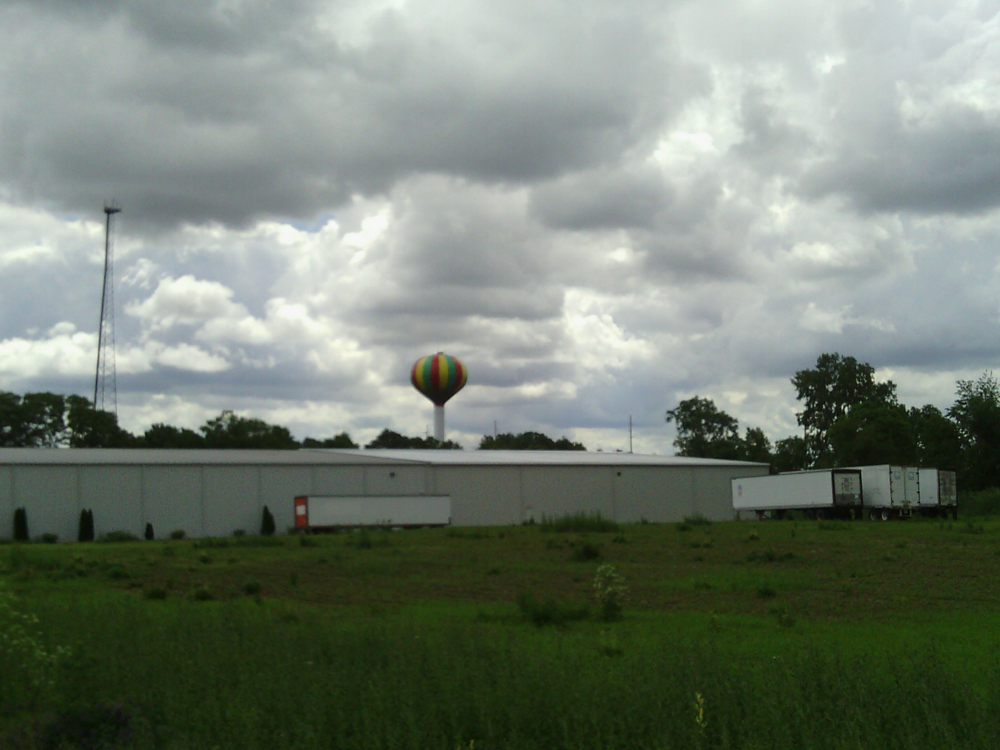
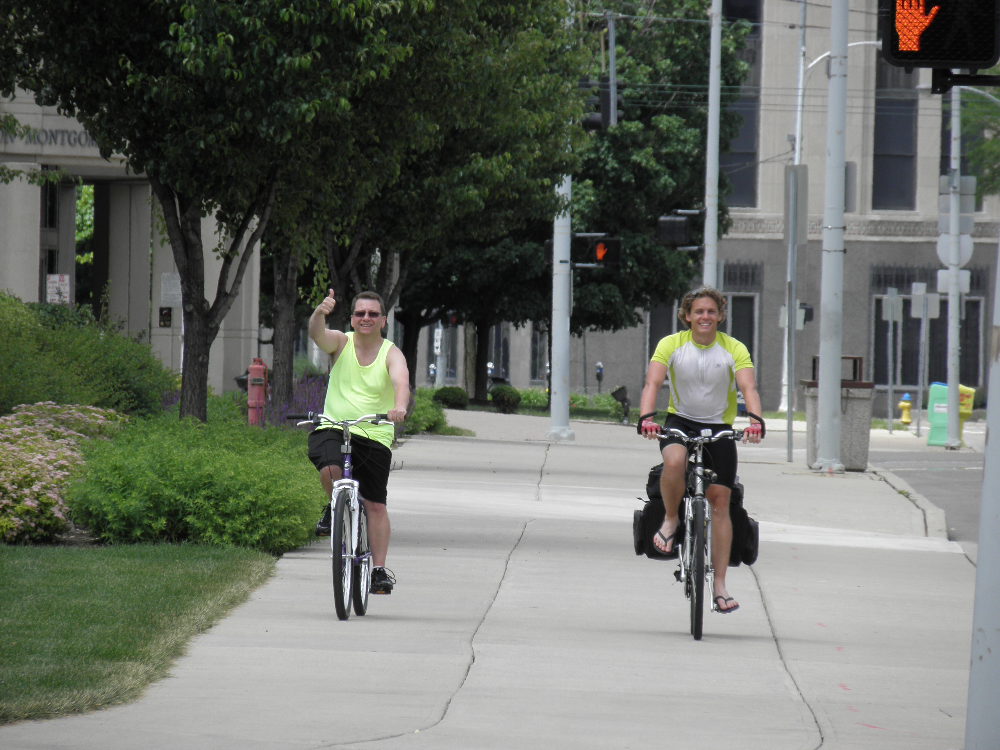
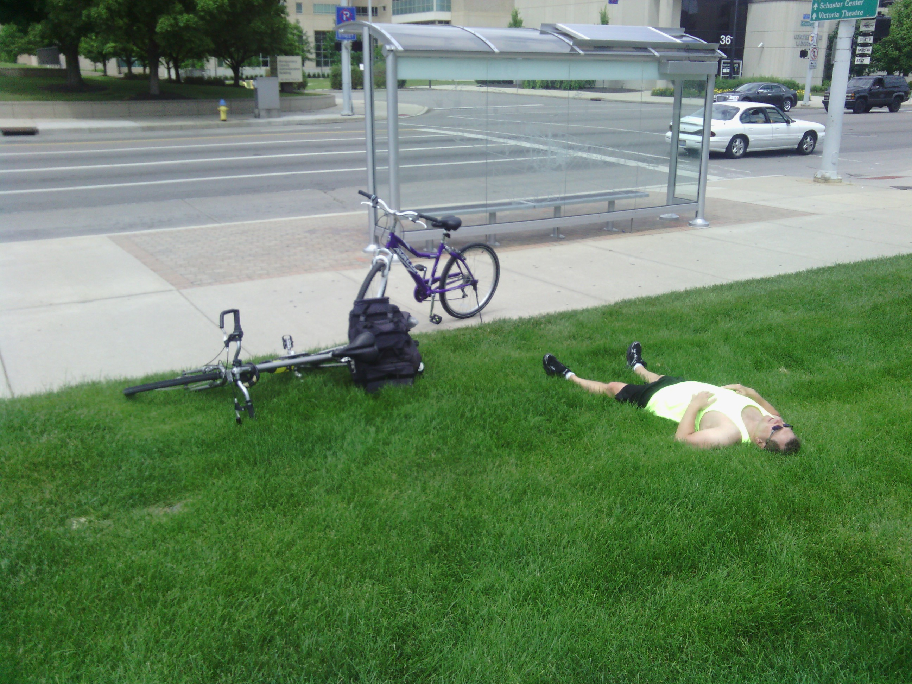
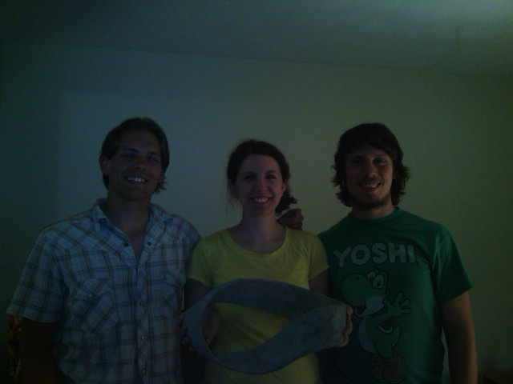
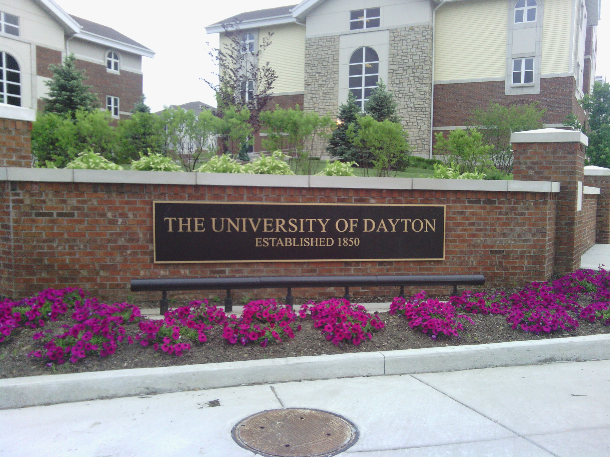

+++
title = "Day 30 -- Richmond IN to Dayton OH -- A riding partner"
date = "2013-06-02T23:02:57+00:00"
tags = ["Bicycle Trip"]
categories = []
image = "P6021235.JPG"
+++

Today was planned to be a short day, and my host in Dayton was expecting to get home around 8:00 pm so I was able to sleep in until 9:30 before waking up and having continental breakfast at the hotel.

The sky was a little cloudy, but there was no rain in the forecast. That hasn't happened in a while, so I was excited to head out and stay dry all day long. My dad decided to ride with me for a while today and we took off a little before 11:00. We entered Ohio almost immediately and continued along the national road passing more garage sales for a while. We also rode a nice paved bike path for a while. 

After a few water and rest stops we entered Dayton and met up with my mom at Sinclair community college. The three of us had dinner together and I said goodbye to my parents around 4:30.

I hung around downtown Dayton and the University of Dayton for a while and headed over to meet my host, Jason, and his girlfriend, Emily, about 8:00. We went to a bar and got a drink while they had dinner. I was still way too full of pasta to get any more food. 

I also got a call from a good friend asking me to stand in his wedding! How exciting!

Today's distance: 67 km
Average speed: 17 km/h
Trip odometer: 3845 km

Photos:

