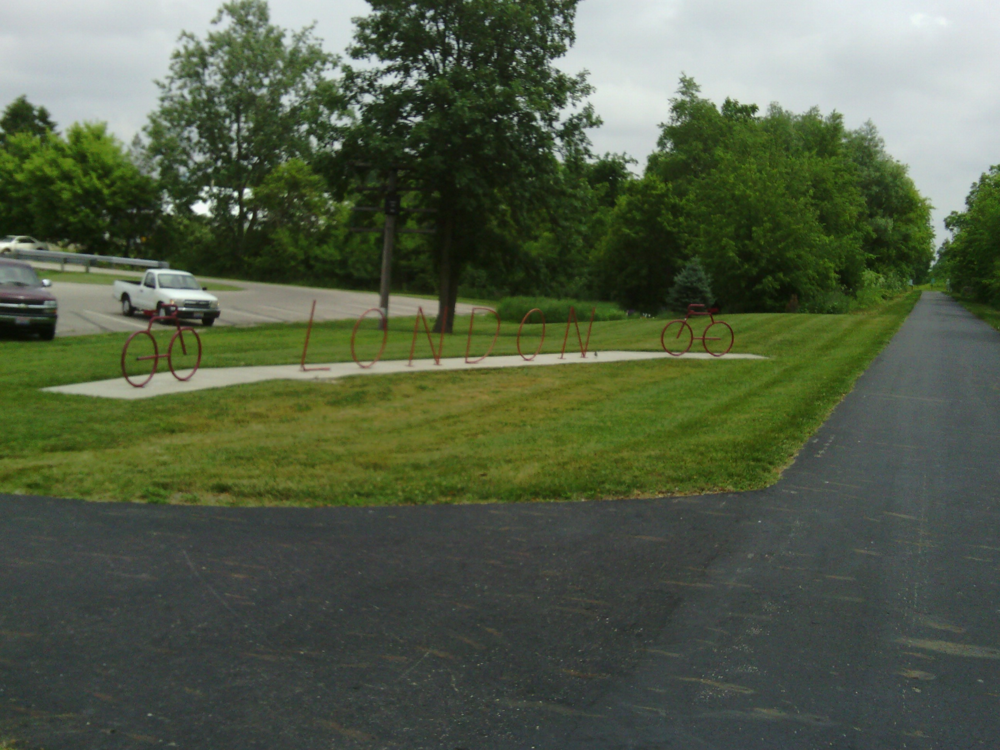
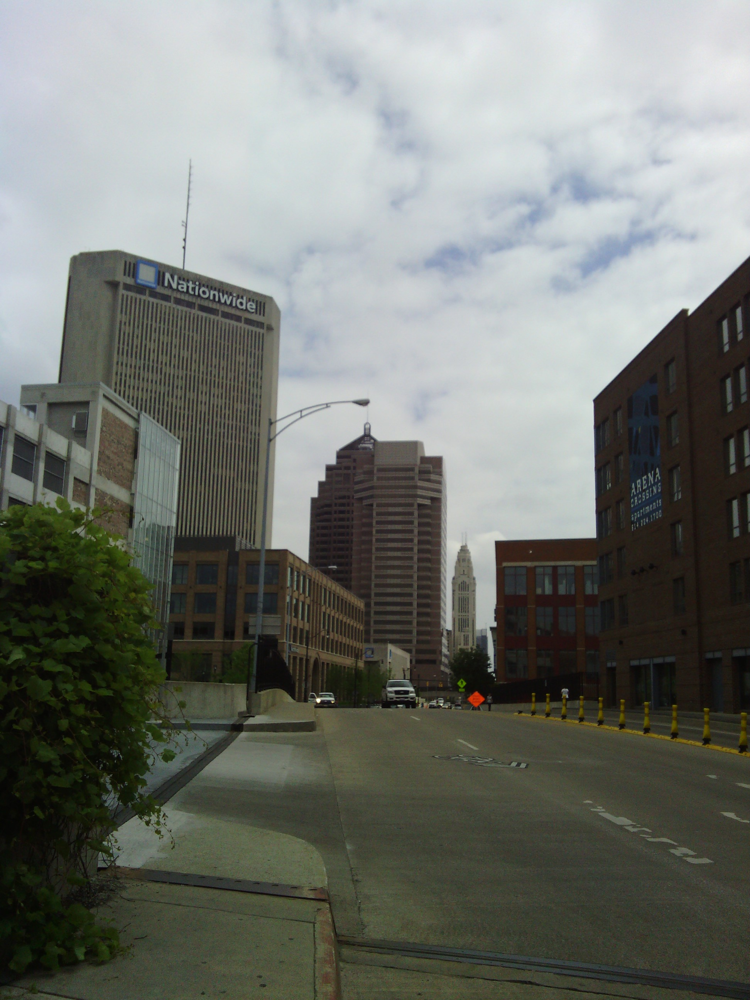
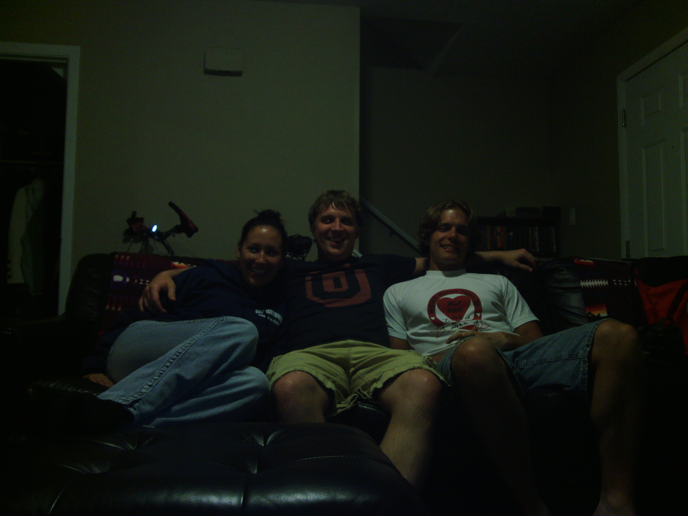

+++
title = "Day 31 -- Dayton OH to Columbus OH -- Meeting up with my inspiration"
date = "2013-06-04T04:38:17+00:00"
tags = ["Bicycle Trip"]
categories = []
image = "IMG_20130604_000719.jpg"
+++

Today was an excellent way to round out my first month of riding. I woke up and finished off the leftover spaghetti warehouse for breakfast then said goodbye to Jason around 8:30.

There was no rain on the forecast today which made me excited to get out and ride. Today's route consisted almost entirely of bike trails along which I was able to cruise despite a slight head wind.

Today was also the first time I've adjusted my own spokes. I heard a knocking coming from my rear wheel and looked several times to see if something was hitting the spokes. Eventually I checked all the spokes' tensions and discovered that a few of them on the right side were loose. I knew that adjusting them could be tricky so I was hesitant at first, but I decided to tighten them up anyway. When I was done they all had good tension and the wheel still looked nice and true. Best of all the knocking was gone and I didn't have to spend time or money at a shop. Hopefully the wheel will prove to be strong the next few days.

I was planning on staying with two college friends tonight. David Doornbos, who had done a cross country trip last year and was a huge part of my inspiration for this trip, and his wife Jesi Hale. I thought I might be able to meet up with Jesi and ride the last bit together, but I made it into Columbus too quickly.

After a few missed turns in the city, I arrived at their house and spent a few fours catching up with Jesi. We picked David up from work around 7:00 and took a tour around the Ohio State campus.

When the three of us returned home we had a feast of grilled steak, shrimp, and veggies, and shared stories about our cross country adventures. David's stories about crossing the mountains got me excited to see what Pennsylvania has to offer.

Tomorrow night I'll meet up with my dad again in Newcomerstown. Maybe I can convince him to ride along again.

Today's distance: 121 km
Average speed: 23.1 km/h
Trip odometer: 3966 km

Photos:

