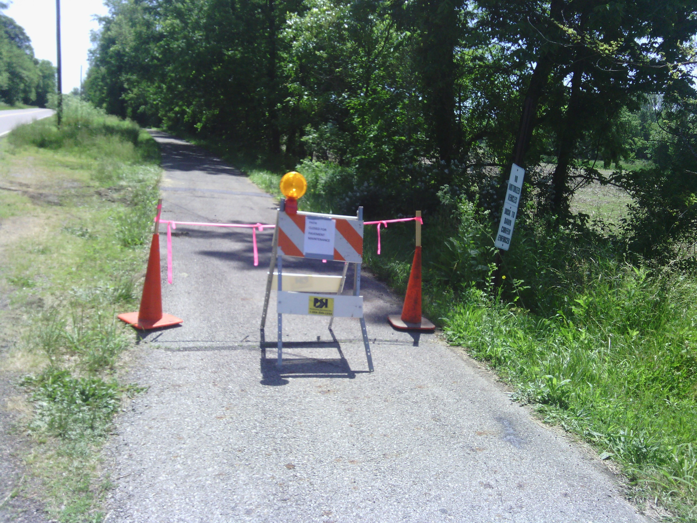
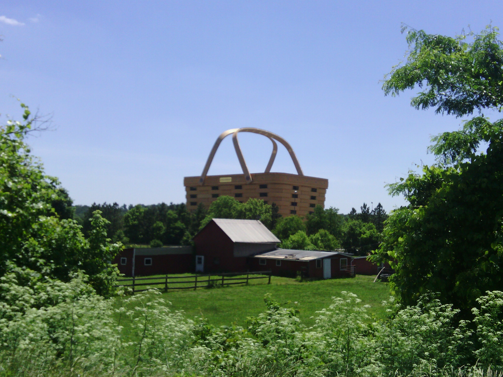
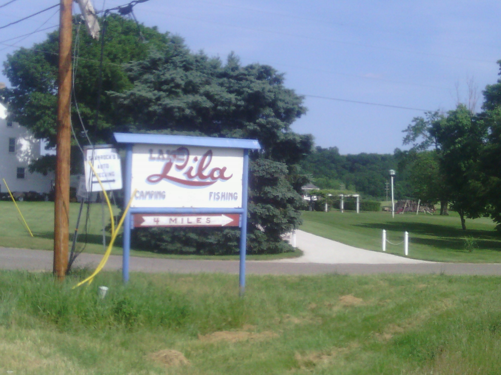

+++
title = "Day 32 -- Columbus OH to Newcomerstown OH -- Slow going"
date = "2013-06-04T22:34:54+00:00"
tags = ["Bicycle Trip"]
categories = []
image = "IMG_20130604_125650.jpg"
+++

I said goodbye to David and Jesi last night because they would both be leaving for work before I wanted to get up. I slept in until about 7:45 enjoying the air mattress and cool breeze in their upstairs room, but got ready quickly, leaving around 8:30. From there the day was very slow-going.

Leaving metropolitan areas is always slow , and today was no exception. The road I chose to leave Columbus was filled with red lights for over an hour. Then when I finally got out of the city, the bike trail I had planned to take was closed for pavement repair. I considered riding it anyway, but ultimately decided not to. That was the right decision because I saw the work equipment on the trail from the road a few minutes later. I also got slowed down because today's route was full of turns from one small road to another which meant frequent stops to check the map. A slight headwind was not strong enough to wear me out, but did make the ride take longer than usual.

Despite the longer-than-expected ride time my spirit was high and the weather was nice. The past few days without threat of rain have been refreshing and I think I'll have one more of them before going back to obsessively checking the radar.  The terrain slowly transitioned from perfectly flat, which it has been since I crossed the Mississippi, to gently rolling, and by the end of the day I even had one moderate climb.  The hills were totally manageable, but they were a reminder that I'm only a day away from the Appalachian foothills and then the mountains.

I met up with dad at the Hampton Inn for the night around 6:30. We had dinner at a local restaurant, hung out in the hot tub, and then looked over the route for the next few days. I've actually caught up with the part of the route that seemed so far away that I didn't bother to thoroughly plan it in Gallup. So I'll be doing some real-time planning the next few days.

Total distance: ~149 km (my bike computer cut out a few times today)
Average speed: 22.6 km/h
Trip odometer: 4115 km

Photos:

