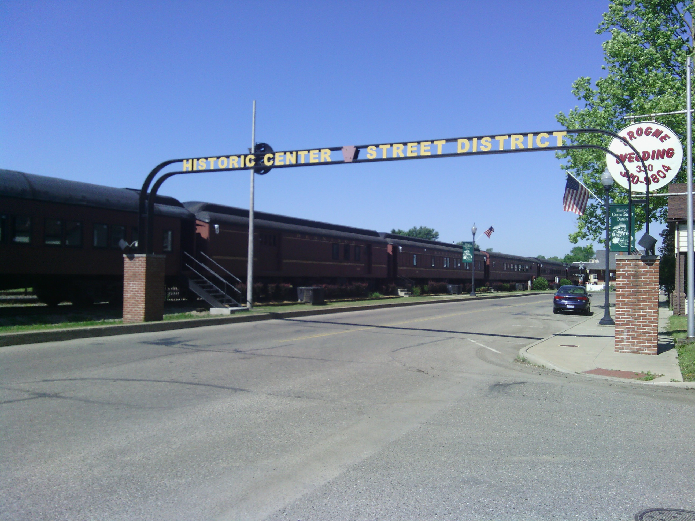
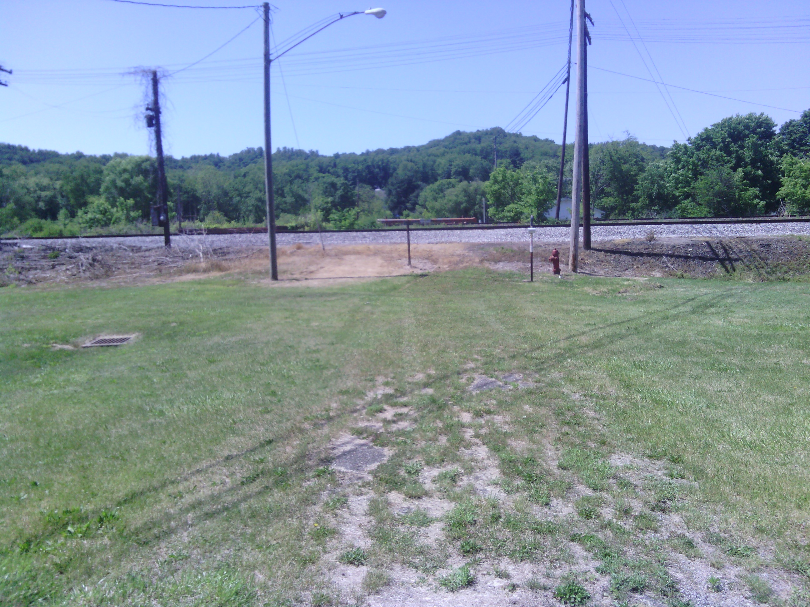
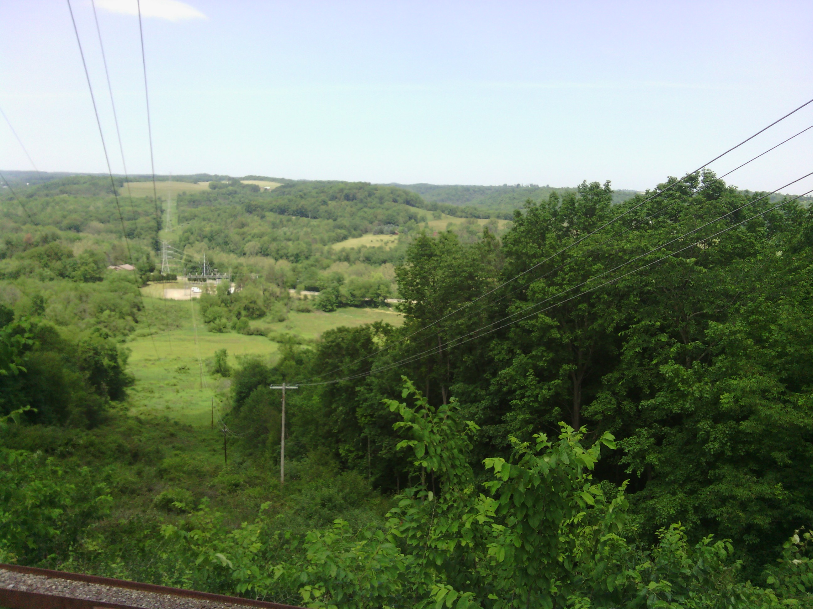
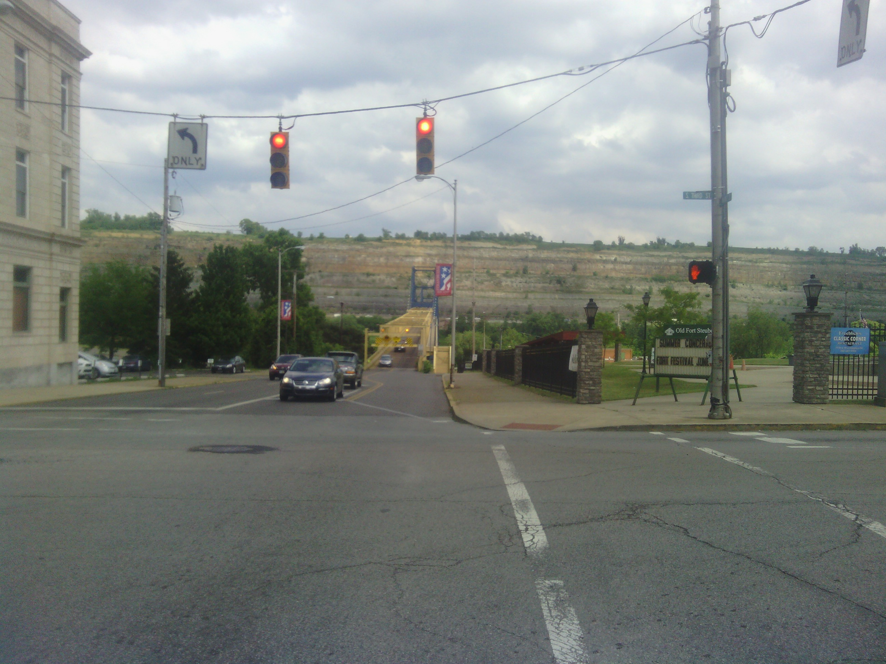
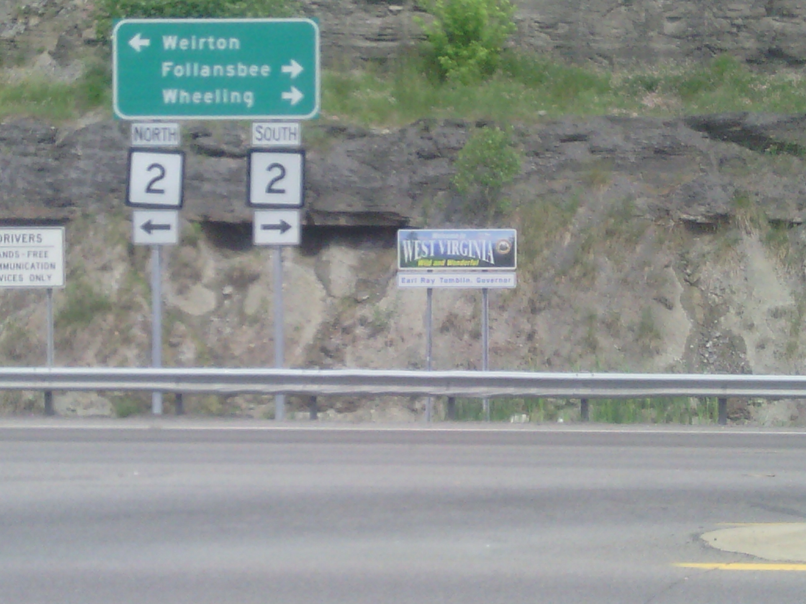
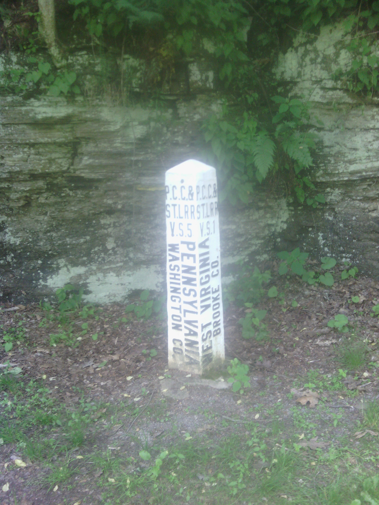
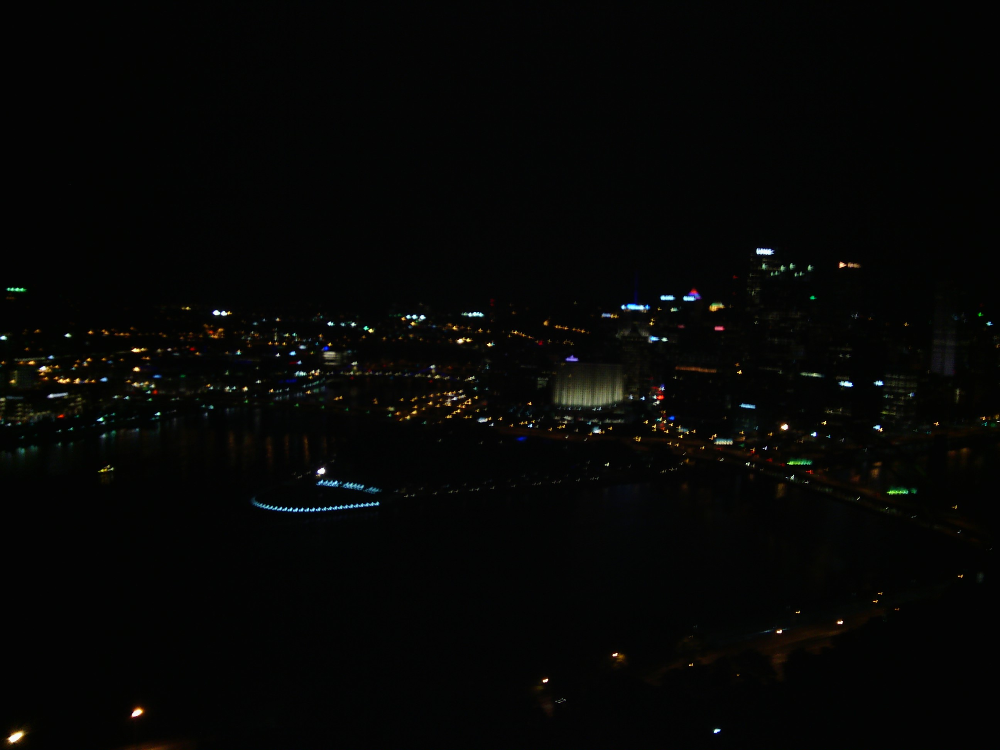
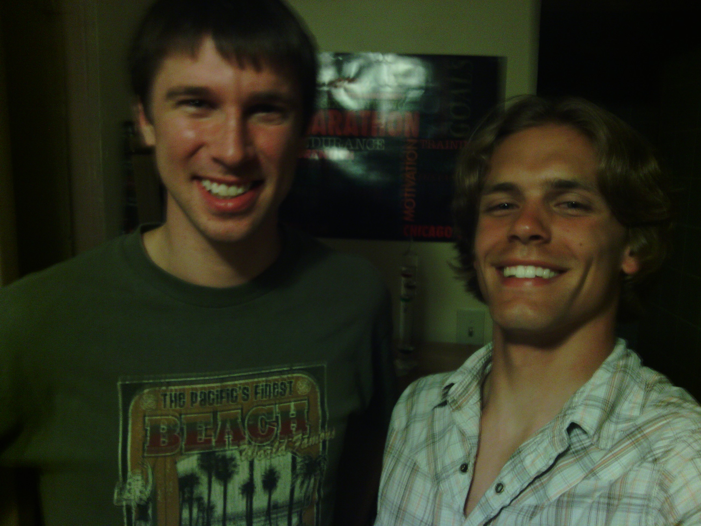

+++
title = "Day 33 -- Newcomerstown OH to Canonsburg PA -- A three state day"
date = "2013-06-06T04:07:33+00:00"
tags = ["Bicycle Trip"]
categories = []
image = "IMG_20130605_154301.jpg"
+++

I was slow to get out of bed this morning. Dad left for work early, but I slept in until almost 8:00. By the time I had breakfast, packed up, and called a few campgrounds, I didn't hit the road until almost 9:30.

It turned out the campground I had planned didn't have showers or electricity so I decided I would just ride toward Pittsburgh and see how far I got. It is nice feeling to ride off without any particular destination. I could ride as far as I wanted or stop as early as I wanted, and that sort of freedom to do what feels best in the moment is part of what this trip is about.

I took a wrong turn about 200m after leaving the hotel, but after that the ride went pretty smoothly. I passed through the remainder of the Ohio plains and entered the Appalachian foothills in short time. There were a few climbs but I didn't yet feel I was in the thick of the mountains. Near the end of Ohio I stopped at a subway and got lunch on the gift card my parents had given me a few days earlier. Next I headed into the border city of Steubenville OH. I passed within blocks of the place I had done a service trip back in high school and was surprised to find that I actually recognized some of the buildings.

Next I crossed the Ohio river into West Virginia. Then about 10 wild and wonderful kilometers later I left into Pennsylvania. Although it was by far the shortest state I've passed through so far, West Virginia offered most of the scenery I've seen so far on the trip. It had a gorgeous layered cliff juxtaposed immediately with a huge industrial monstrosity. Then a brutal uphill climb at the top of which I rested to let my side cramp pass. Then a fast switch-backed downhill, and an unpaved bike path. In fact I think the only things West Virginia didn't have were large open fields and pigsquatch. Seriously though, some of the climbs were pretty steep and I'm beginning to worry that my seven gears might not go low enough. I guess the next few days will tell for sure.

The path that I picked up in West Virginia continued into Pennsylvania, and I followed it almost to Pittsburgh. Eventually I got off it and headed to the southwest suburb of Canonsburg where my college friend Aaron Goodman lives. 

I haven't seen Aaron in a few years, so it was awesome to meet up with him again. The two of us went out to fat head's saloon for dinner and to watch the penguins hockey game. I ordered the quadruple bypass burger, and it was totally delicious. Afterward he showed me a great view of the city and the three rivers from the Duquesne incline. This was a fun night.

Tomorrow will be a light day where I meet my high school friend Michelle for lunch and a tour of Pitt, then head to the east suburbs to stay with a new friend Pilang. I won't really get outside of Pittsburgh, but I will basically cross it so there well still be a decent bit of riding. It should be a fun day though and I'm sure I'll be happy to be on the east side when I finally leave the city the next day.

Total distance: 158 km
Average speed: 22.1 km/h
Trip odometer: 4273 km

Photos:

