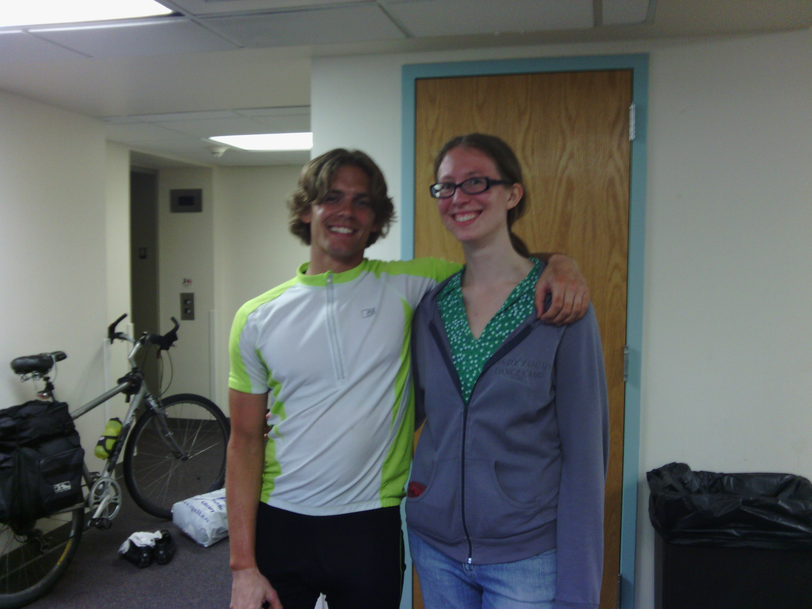

+++
title = "Day 34 -- Canonsburg PA to Verona PA -- Friends in Pittsburgh"
date = "2013-06-07T00:19:48+00:00"
tags = ["Bicycle Trip"]
categories = []
image = "IMG_20130606_135323.jpg"
+++

Since most people probably aren't familiar with the cities in the title today, I basically rode from the southwest suburbs of Pittsburgh through downtown to the east suburbs. It wasn't quite like the rest day in Gallup when I didn't even touch my bike, but it was a short day, and hopefully put most of the slowness that comes with leaving a metro area behind me.

I woke up this morning and had a quick breakfast with Aaron before saying goodbye and heading out. The ride into downturn was nice until the rain started. I had to check the map on my phone often being in the city, and after a while the rain stopped the touch screen from working. I was afraid the phone was permanently broken which would have been bad news for the trip, buy luckily it recovered after it dried off.

I made it into downtown by noon and met my friend Michelle for lunch. We went to a place called "Joe Mamas" which was of course awesome. Then she showed me around Pitt and her physics lab. I haven't seen her in at least three years, and never outside of our high school circle, so it was really cool to get a glimpse of what she is up to now.

I stopped briefly at the library to catch up on email and whatnot, and then rode one more hour to Pilang's house in Verona where I would spend the night. The timing wasn't great because she is working nights at the hospital, but we got to hang out for little while before she had to leave.

Tonight marks one whole week in which I haven't camped. I wonder if my tent is starting to miss me. I'll be camping again tomorrow night in Ebensburg.

Total distance: 56 km
Average speed: 19.7 km/h
Trip odometer: 4329 km

Photos:

Comments:

> Joe Mama! Joe MAAMAA! I know Joe Mama. HEY! I know Joe. Joe MAMA THAT'S RIGHT BOY! BAM!!!!
> **tymorehart**
>
>> Probably the orphans' best song
>> **Josh Orndorff**
