+++
title = "Day 35 -- Verona PA to Ebensburg PA -- Tunnel terrain"
date = "2013-06-08T19:47:22+00:00"
tags = ["Bicycle Trip"]
categories = []
image = "IMG_20130607_114523.jpg"
+++

I said goodbye to Pilang as she was getting home from her overnight shift at the hospital. After using more of my subway gift card for breakfast and taking a quick stop at the grocery store for granola bars, I was on my way.

I decided not to follow the google suggested route for the first part of today's ride. I saw a road that looked a bit shorter and would eliminate several turns so I went for it. In hindsight google probably already knew what I would come to learn. After about half an hour of riding I saw some confusing detour signs that had the eastbound traffic heading backward along the westbound route. I didn't know what to make of that, so I pressed on. A little later I saw a "road closed ahead" sign. After confirming for myself that the road really was impassable I turned back to the map to find an alternate route. It was back to the originally suggested route for me. Luckily the detour only added about 5 km to my ride. Unlucky my exploration of the construction zone led to mud caked around my clips which I had to scrape off before I could clip back into my pedals.

The middle section of today's ride was on the unpaved West Penn Trail. My tolerance for unpaved trails had increased after a few good experiences the last two weeks, so I didn't hesitate much this time. But this particular trail had a few stretches that I would consider mountain bike terrain, and one that I would consider hiking terrain. In my situation, the latter was more of a portage than anything. My thicker hybrid tires and new double walked rims seemed to hold up fine though.

I passed through a few small towns and followed a state highway for a short time before stopping at a Sheetz -- a sure sign that I've reached the north east -- to finish the second half of my sub.

The final stretch was on the Ghost Town Trail, and in an intermittent drizzle. The trail was also unpaved but a little more tame than earlier in the day. The old railroad trails are nice because they are typically pretty level, but unpaved surfaces are slow which made today's ride take a while.

I arrived at the crappiest campground I've stayed at so far around 5:30, and just before the real rain let loose.

Today's distance: 124 km
Average speed: 19.1 km/h
Trip odometer: 4453 km

Photos:

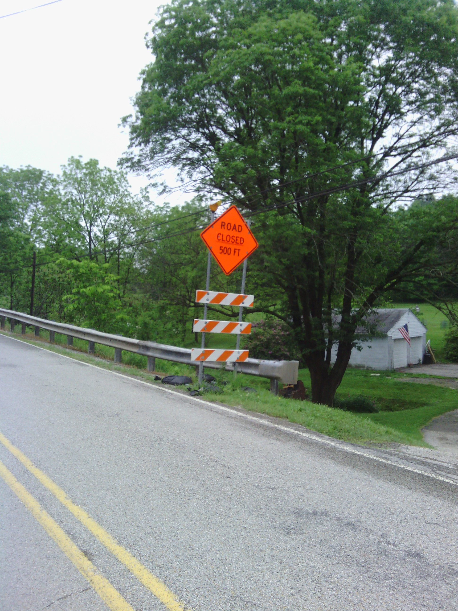
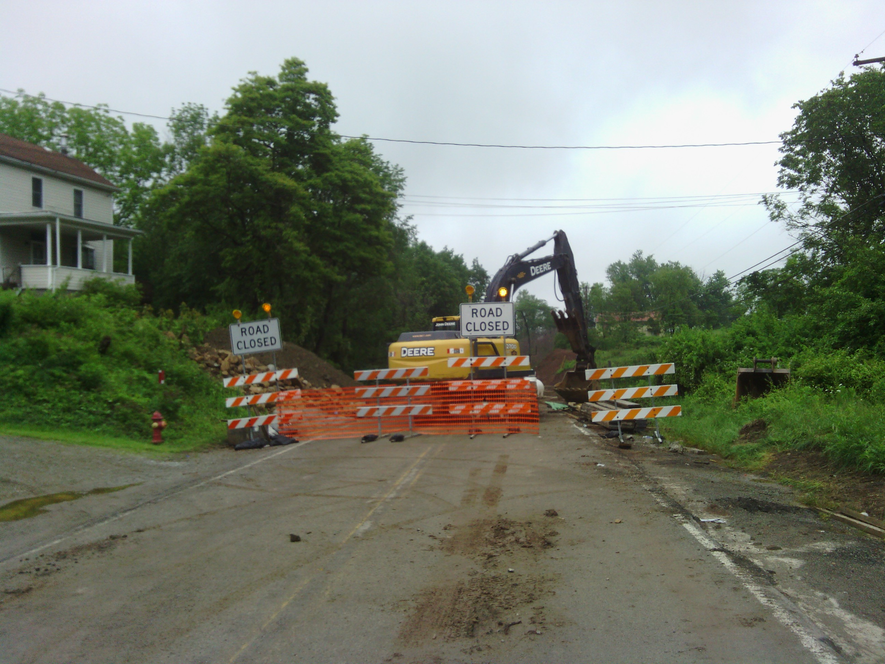
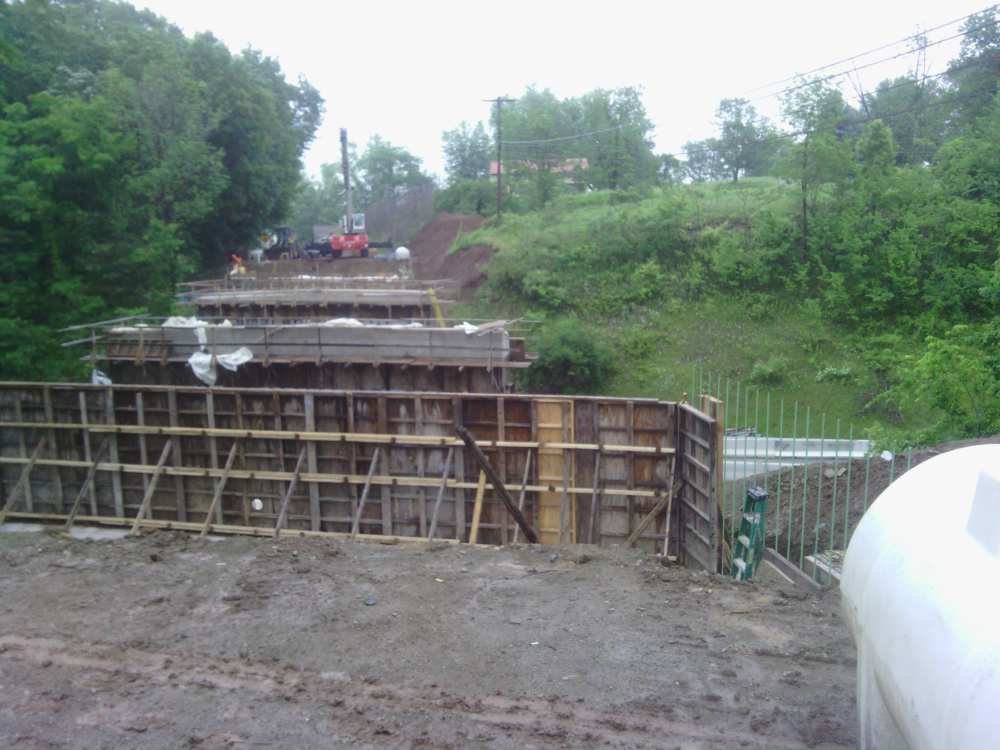
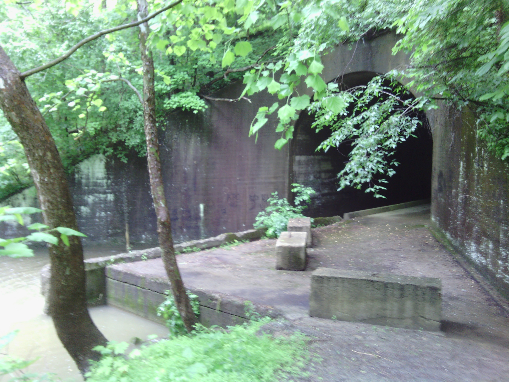

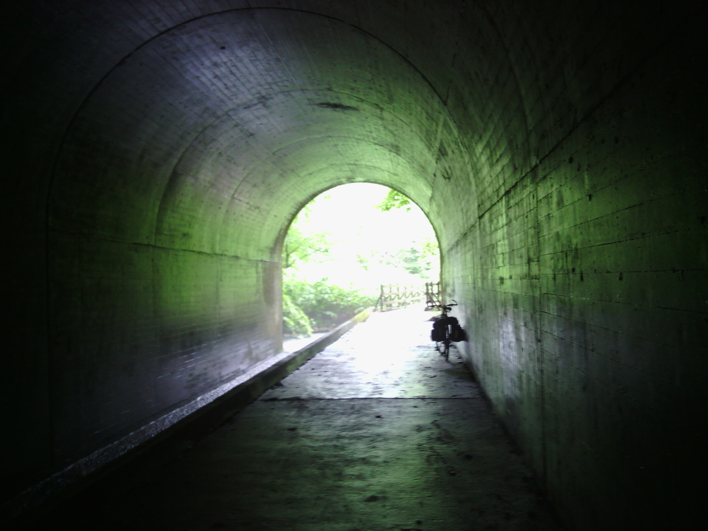
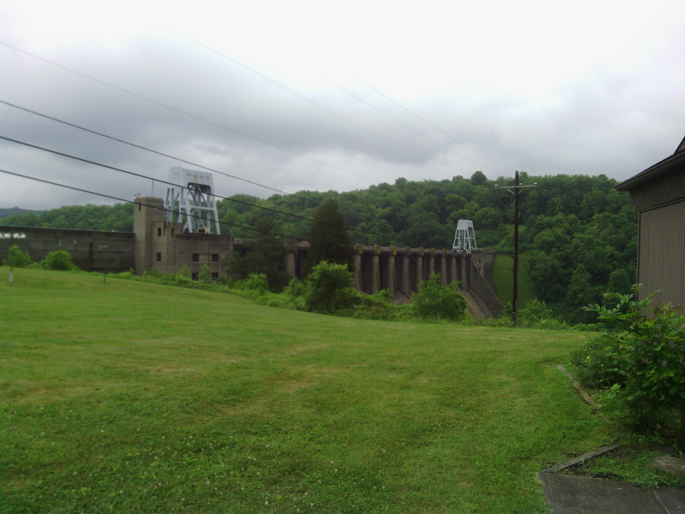
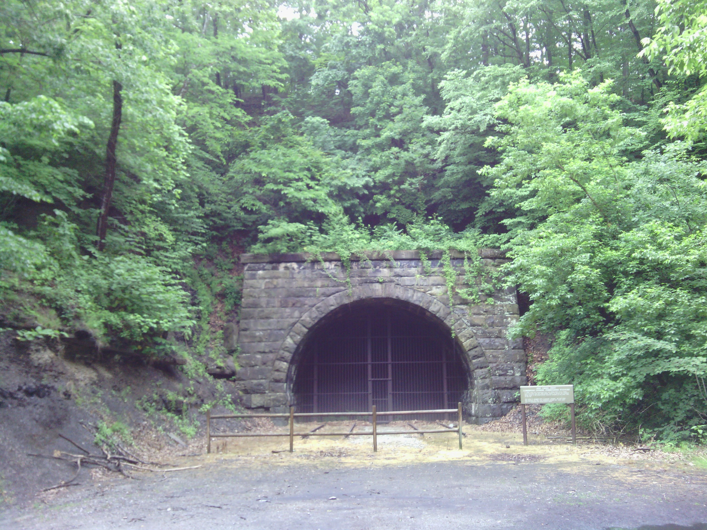
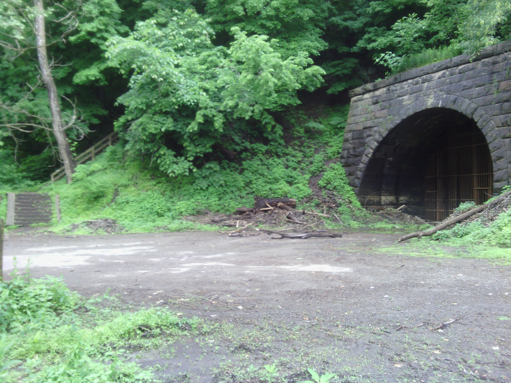

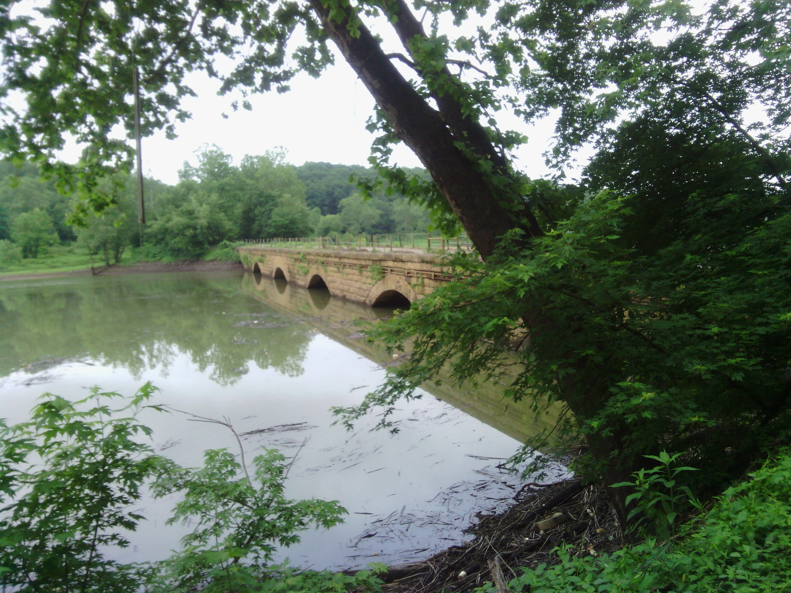
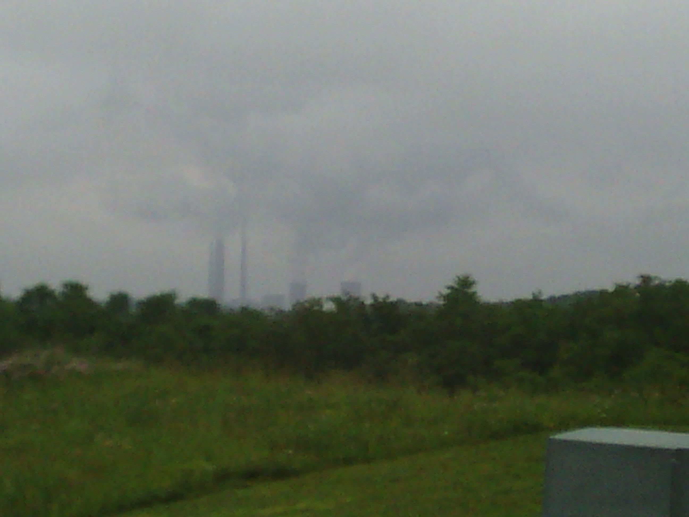
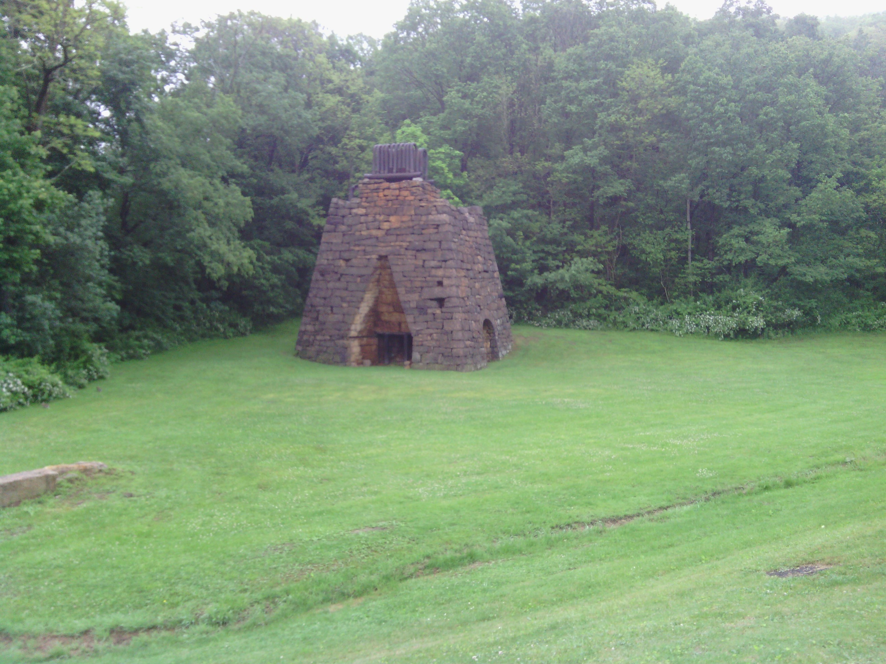
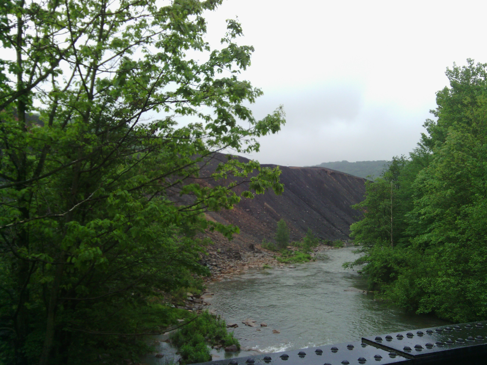
