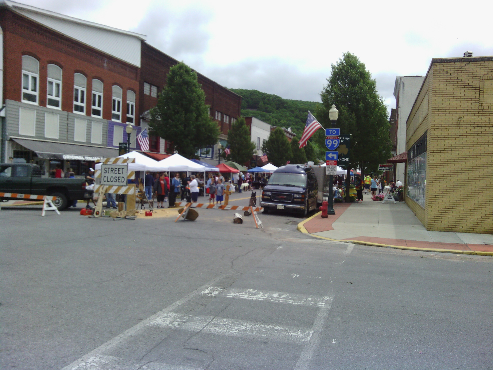
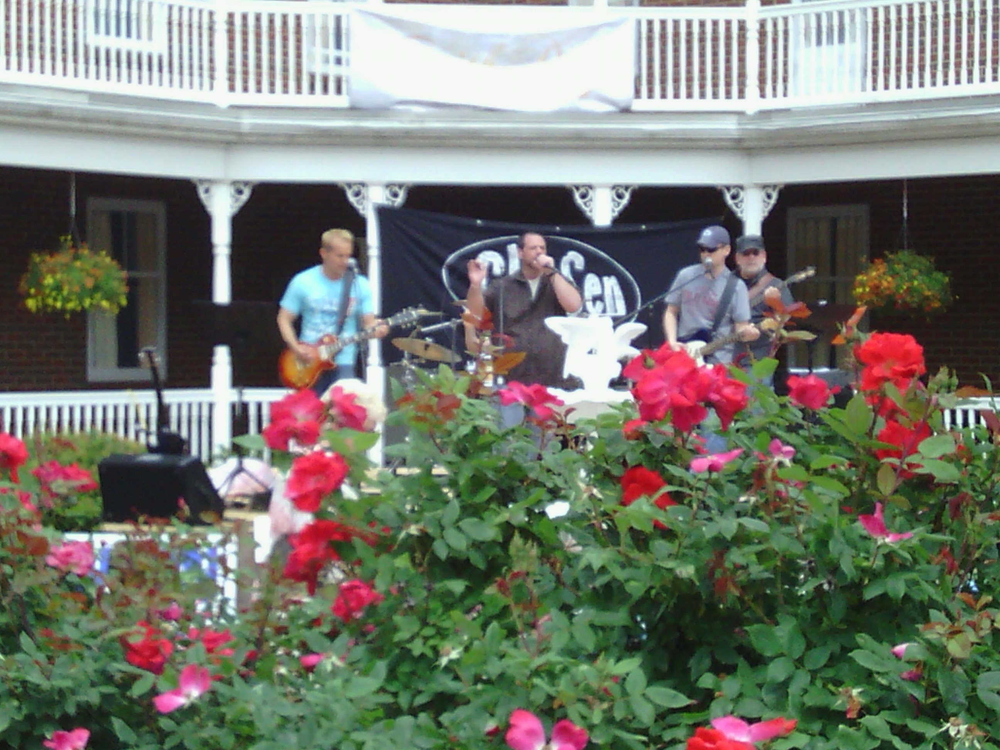
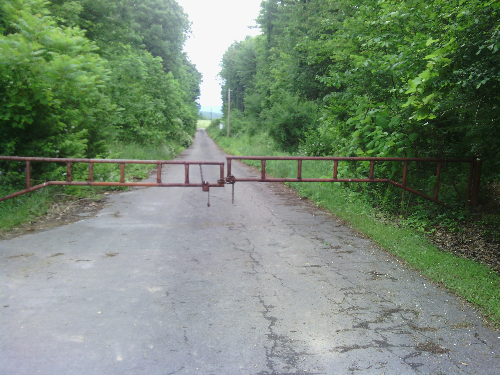
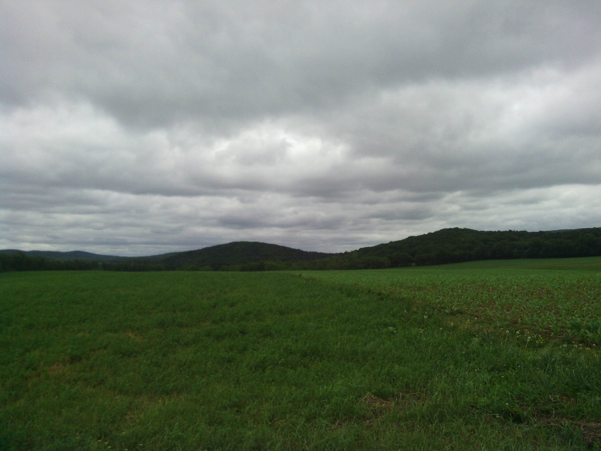
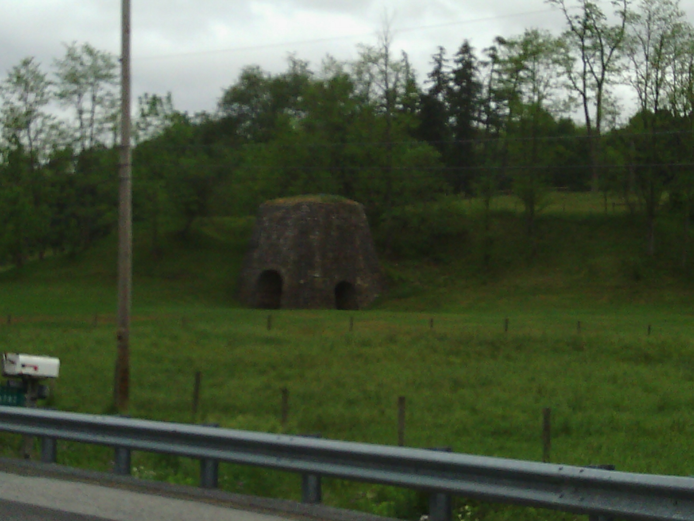
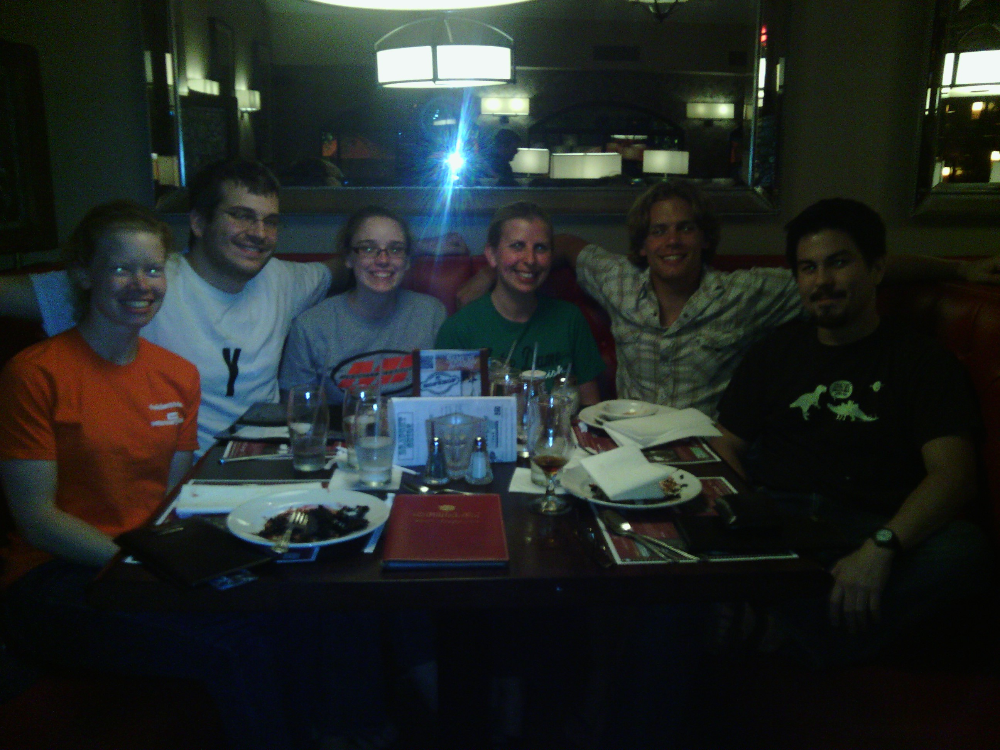

+++
title = "Day 36 -- Ebensburg PA to State College PA --Bicycling directions are in beta"
date = "2013-06-08T19:56:27+00:00"
tags = ["Bicycle Trip"]
categories = []
image = "IMG_20130608_212058.jpg"
+++

This morning was one of the toughest of the trip. I woke up in a wet sleeping bag and had to get ready in the cold. And although yesterday's ride was mostly on bike trails, the few steep climbs caused my formerly broken arm to be sore again. I guess I must be getting tougher mentally because I managed to get going without wishing for a nicer day too long. I started by heading to Walmart to get granola bars and breakfast at the subway.

The day turned out to be nicer than expected though and the rain stopped after less than two hours. I ran into more closed roads today, but the detours were convenient and didn't require much backtracking. I was even able to hold a pretty good speed for most of the ride. Of course it helped that I had a huge downhill during which I didn't have to pedal at all for about 10 minutes.

The day's real surprise came when google's directions led me to a road that was gated off. Unlike the construction areas, rerouting around this one would have required a long detour. So I decided to push my bike through the woods around the gate and see what was ahead. The road eventually turned unpaved, and then to more of a dirt trail but as I got deeper in, turning around became less appealing so I pressed on. Every time I came to what looked like a new intersection on the map, the road got smaller rather than turning paved. Eventually I approached the back of a farm house and the road became their driveway, and then the driveway connected to a real road. I guess that's why the bicycling directions are still in beta. After all the bumping along I had a few loose spokes again and tightened them myself.

I made it into State College around 3:00 and stopped at a bike shop to get my wheels and crank shaft bearings checked out. The mechanic said I had done well on my wheels, but the bearings did need replaced. He also tried to sell me new brake pads, but I passed. I figured they would just slow me down. While he changed the bearing, I hung out at the library.

I arrived at my friend Reuben's house around 5:00 and met his roommates and friends. I got to clean and dry my laundry and dry my tent and sleeping bag outside which was much needed.

As usual, I had a great time meeting his friends and going out to dinner with them.

One week to go.

Today's distance: 116 km
Average speed: 24.0 km/h
Trip odometer: 4569 km

Photos:

