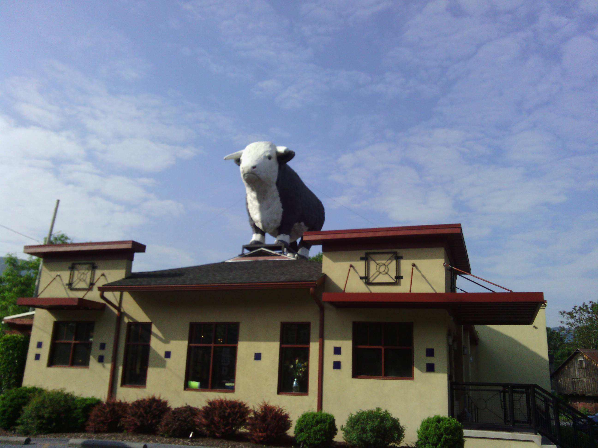
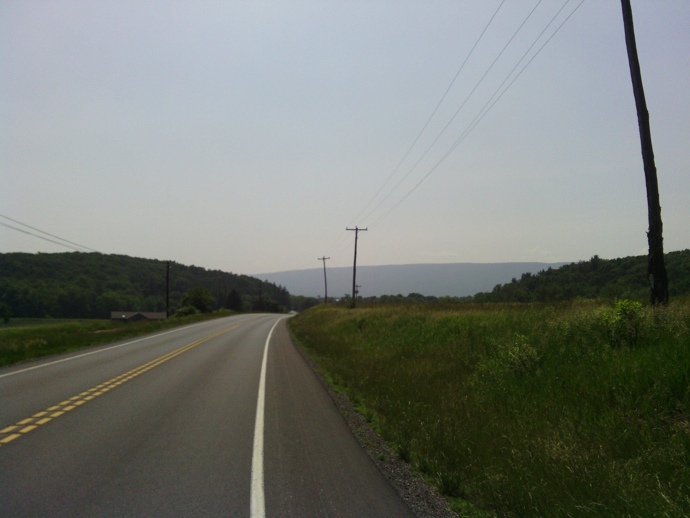
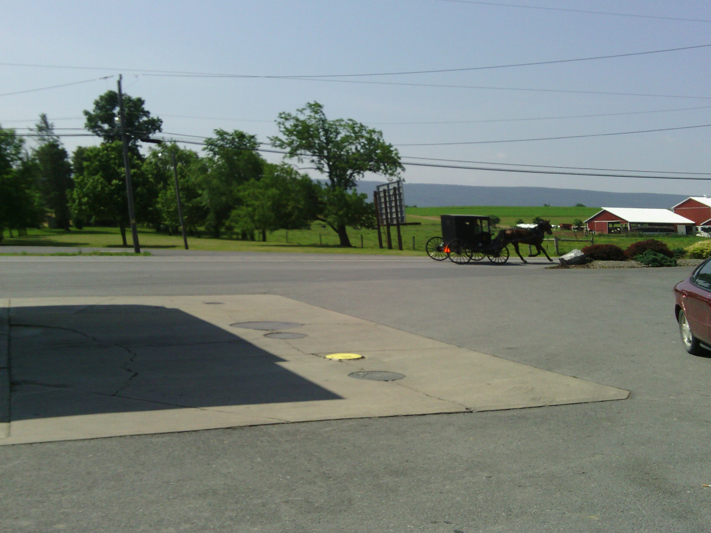
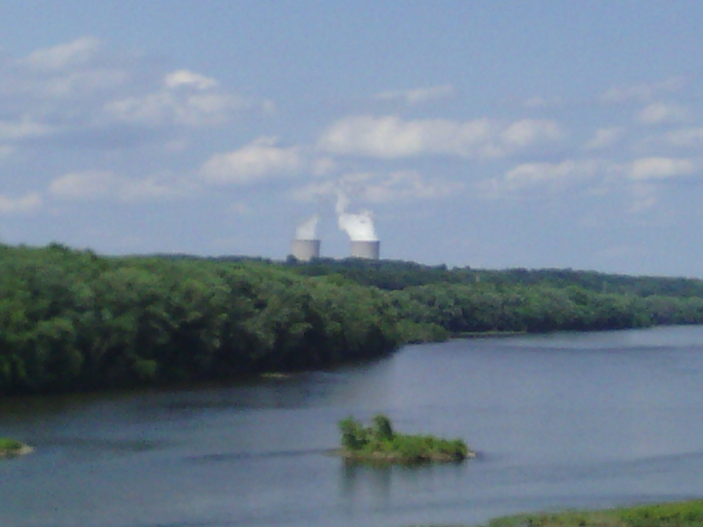

+++
title = "Day 37 -- State College PA to Nescopeck PA --Appalachians continue"
date = "2013-06-09T23:23:19+00:00"
tags = ["Bicycle Trip"]
categories = []
image = "IMG_20130609_163419.jpg"
+++

I managed to get up and say goodbye to Reuben in decent time this morning, and headed out with an idea for a stopping point, but no definite plans. I had worried somewhat that today would be hard because I had planned to go about 160 km and with the hills that might have been tough. To my surprise it didn't feel significantly harder than previous days of the same distance. And apart from a few steep climbs the terrain wasn't a lot harder than the rolling hills of Missouri. Of course it helped that it was sunny and beautiful today too.

The hills rolled by one after another, and by 4:00 I was stopping at a grocery store for dinner in Berwick before pressing on a few more kilometers to my stop for the night. I ended up going even a tiny bit farther than planned because I managed to find a cheaper campground where the owner said I could use the wifi from his house.

Tomorrow might be rainy again, but the ride is shorter and I'll be staying at the very first campground I found when I was planning this trip.

Today's distance: 164 km
Trip odometer: 4733 km

Photos:

