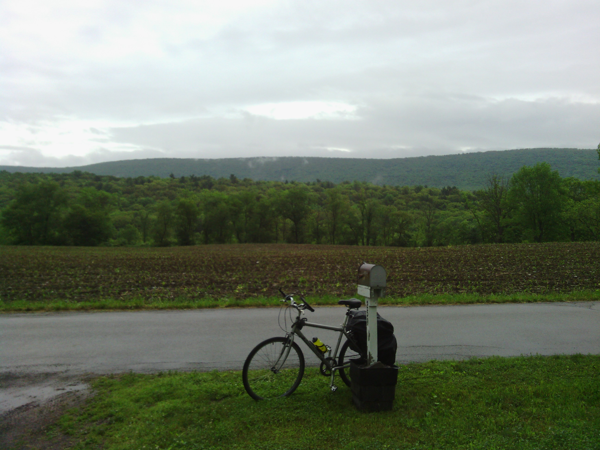

+++
title = "Day 38 -- Nescopeck PA to East Stroudsburg PA -- Monsoon season part I"
date = "2013-06-11T03:37:37+00:00"
tags = ["Bicycle Trip"]
categories = []
image = "IMG_20130610_100457.jpg"
+++

I woke to the sound of rain on the pavilion roof under which I had pitched my tent. The forecast had predicted rain all day, but I decided to sleep a while longer anyway to see if it lightened up. It didn't much, so about 8:30 I got up, and just after 9:00 I rode into the wet beginning of what I'm calling monsoon season. This was the heaviest rain I've been in on the trip. It wasn't just a drizzle, but a truly heavy rain and at times even a downpour, and it persisted all day long with a single brief exception during which I was able to appreciate one of the most strikingly beautiful Appalachian scenes I've seen. Apart from the everpresent rain, today was characterized by two extended events which I'll share.

As I worked up one of the morning's steeper climbs I was frustrated with the cold, the slight headwind, the fact that my gatorade powder was buried under my rain cover, and several other little things that really weren't such a big deal. I thought to myself that the situation couldn't get any worse; not even in the way that it does on TV when one thinks that because it was already raining. But I was forgetting the one way that it can always get worse on a bike, the issue that had almost become a unifying theme on this trip. Ping. Another broken spoke. That sure puts the buried gatorade in perspective. I got out my phone, doing my best to use the touch screen through a plastic bag to keep it dry, and rerouted away from a probably-unpaved bike path preferring the road to the nearest city. When I arrived in White Haven, I took cover under an awning on the from of an Italian restaurant and searched for a bike shop. Cell service was spotty to say the least, and there were no open wifi networks, so I didn't make much progress. Just then someone walked out of the restaurant and I asked if there was a shop in town. He said there wasn't, but told me where to find the nearest one in the next town. Then he explained that he was the delivery guy for the restaurant and after he finished that delivery he could take me there. I thanked him a lot and told him if I didn't figure something else out I would take his offer when he got back. While he was gone I checked out my wheel and saw that it still looked fairly straight. I decided I could ride to the place he described. On my way there the delivery driver pulled up beside me to be sure I was okay and could make it. What a guy. When I reached the shop I replaced the spoke and brake pads.

I left the shop about 2:30 and had decided on a hotel 50 km farther up the road. It was mostly downhill and I figured if I was lucky I'd be there in two hours. But I wasn't quite as lucky as I had hoped. Halfway there I saw the signs for construction ahead and a posted detour. I got out my map and saw that the detour would add at least 10km to my ride, possibly more depending how it was routed. I flagged down a driver and he told me it would add more like 20km, but made a few alternate suggestions. I asked if it was totally closed or if a bicycle might be able get through. He said a bridge was out, then paused, then added, "I mean it isn't a roaring river or anything". Interesting. I didn't feel totally confident that I understood his directions, and my phone screen had gotten wet enough that I couldn't use it anymore so I knocked on the door of the corner house. The guy who lived there made a few more suggestions, and then said, "I'm not sure how much water is in the creek".  I found it interesting that both the people had implied I might be able to ford the river, and figured it would be rude not to check it out. By the time the conversation was over I was shivering uncontrollably and knew I needed to get moving again. I rushed downhill to the construction site catching a few glimpses of the creek on way. It looked a little fast to me, but I was almost there, so I kept going. On my way there I thought about how cool it would be to title this post "fording the river". But when I got there I realized what maybe should have been obvious from the beginning: pushing my bike across a river in a construction zone after twelve hours of hard rain was a bad idea. I backtracked to the best route the guy in the house had suggested. It was a good route, although I can see why it wasn't the posted detour.  It had what the guy aptly described as "a hell of a climb" that a semi truck never could have completed. Finally I cruised back down all that altitude to my hotel in East Stroudsburg.

Monsoon season part II will come tomorrow. But I'm not quite as excited that part II will follow immediately in this case as I am when a Happy Days rerun is continued.

Total distance: 113 km
Average speed: 21.8 km/h
Trip odometer: 4846 km

Photos:

