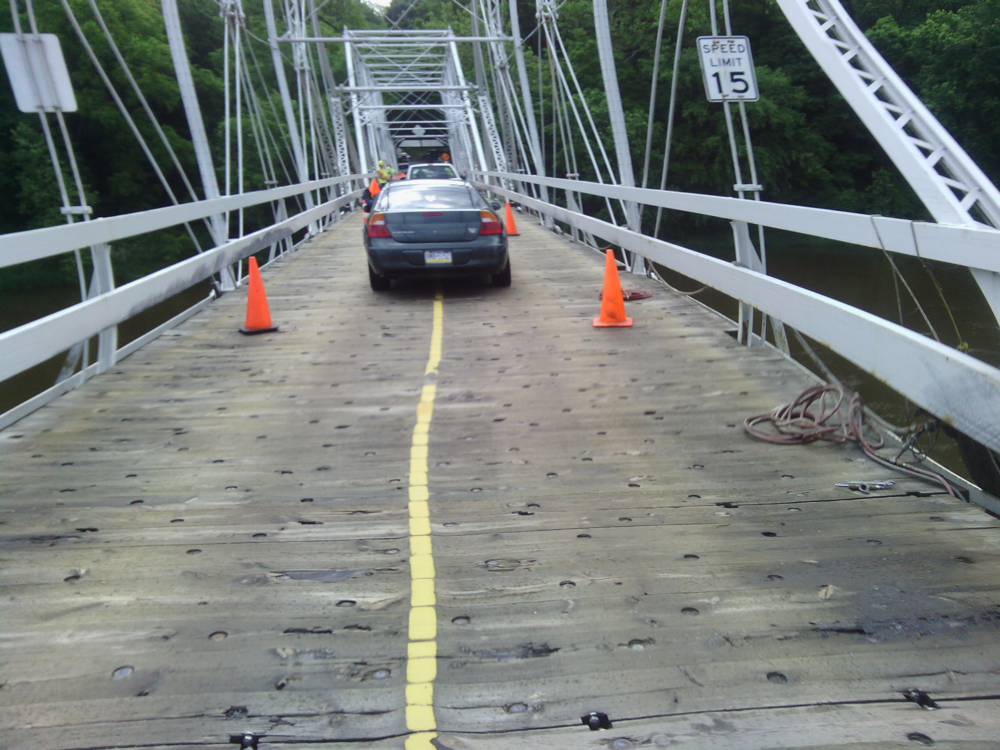
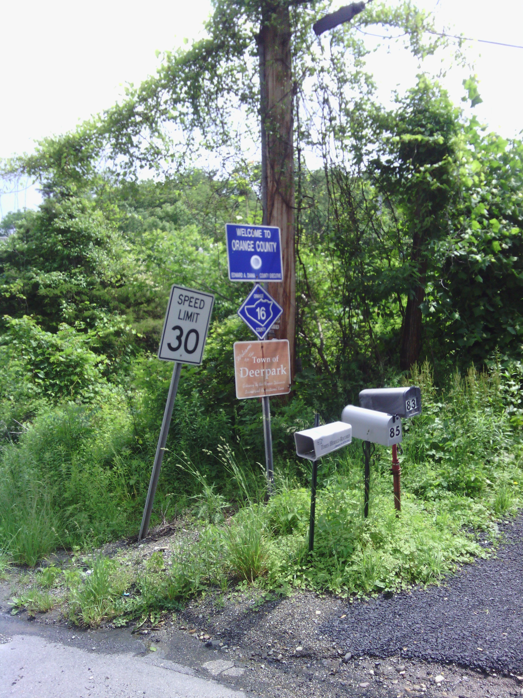
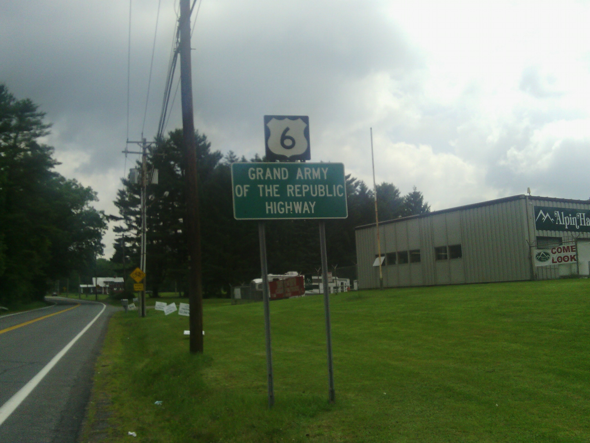
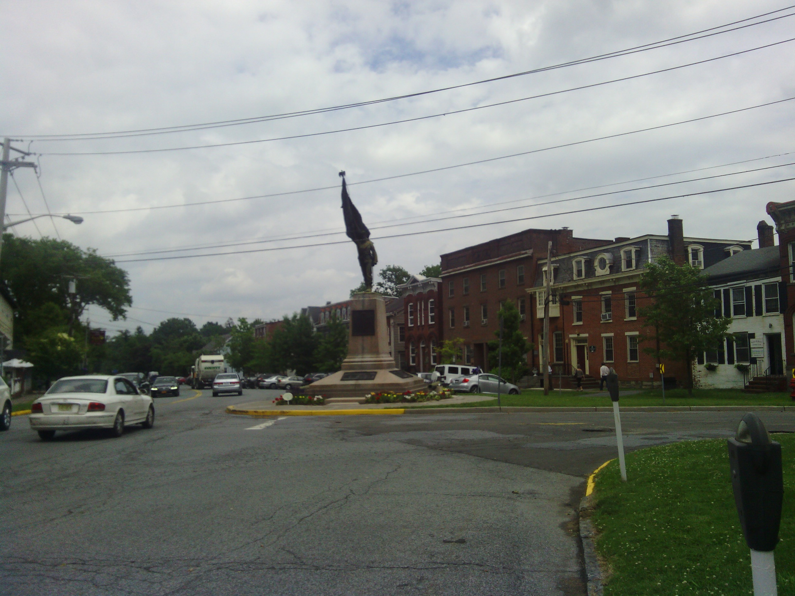
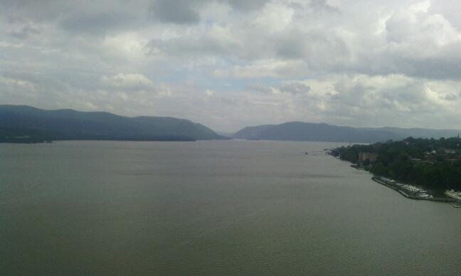
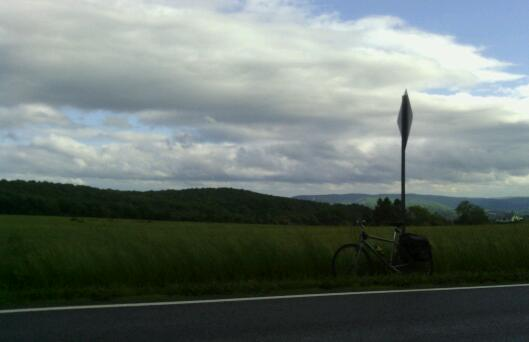
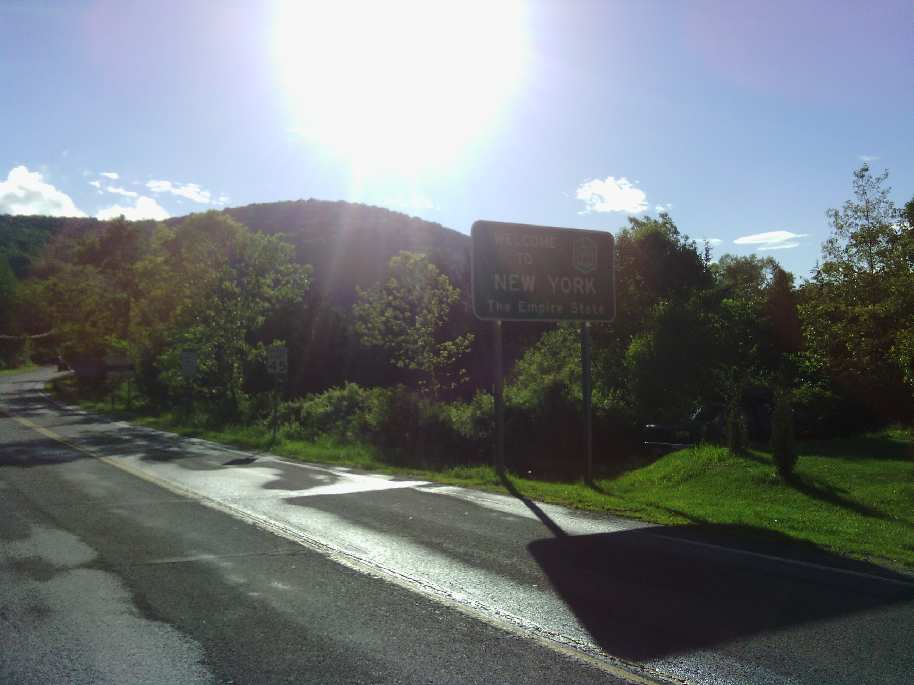
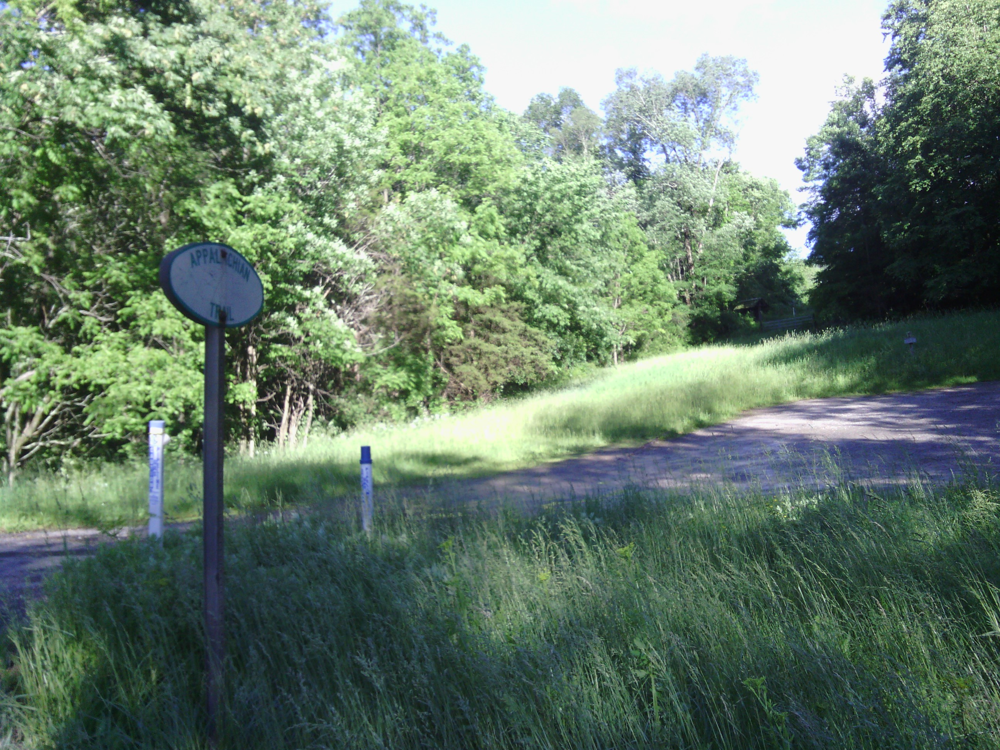

+++
title = "Day 39 -- East Stroudsburg PA to New Milford CT -- A four state day"
date = "2013-06-12T03:39:50+00:00"
tags = ["Bicycle Trip"]
categories = []
image = "IMG_20130611_101347.jpg"
+++

It looks like mother nature decided to postpone (or hopefully cancel) monsoon season part II, so instead I'll recount my four state day -- something I didn't expect to happen on this trip.

I woke up with my alarm at 7:00 and groggily thought, "it's raining I'll sleep in". When the next alarm went off I actually bothered to look outside and discovered that it wasn't raining at all. In fact there were large patches of blue sky showing. I got ready in a hurry expecting that the nice weather would end shortly. After a hilariously cheap continental breakfast and a trip to the grocery store I was on my way.

I was hoping that the rain would hold out until I reached the New Jersey border about an hour into the ride. Sure enough it did. I crossed the toll bridge (which I didn't have to pay for) over the Delaware river in the dry.

My route through New Jersey was on very small back roads mostly through wooded areas. On one such road I rolled over the crest of a small hill and saw what looked like a person walking down the road the same direction I was going. They were walking in the middle of the lane, but the roads really were not heavily trafficked so I wasn't too surprised. As I got closer I realized it wasn't a walker because it wasn't moving. I started thinking maybe it was a garbage can that had blown out there. But how could it still be standing upright? Or maybe it was a ... It started to move. As it turned sideways to look at me I realized it was a black bear. Standing right in the middle of the road. I didn't think to hit the brakes or anything, I just kept rolling toward it. It didn't seem afraid or upset it just wandered off to the side and I rolled past it. I stated to reach for my camera, but by the time I could it had walked into the bushes alongside the road. I swear I got at most 30m away from the thing. I didn't even have time to realize how scary that was until after we had crossed paths.

The rain was still holding out when I reached New York and after climbing and descending the only ridge I had planned to cross today, I rolled into my planned destination of Newburgh. It was only 2:15, and I still felt good and I started to realize I might be able to make this a four state day. I hung outside a gas station for about an hour looking for possible routes and stopping points and checking the weather. Finally I decided to go for it. It would be a long day but not my longest. And with this surprise nice weather I thought it would be a waste not to ride more.

An hour after I took off again a little bit of monsoon finally came, but it only rained hard for about 15 minutes then cleared up again. The addition to my route also added another ridge crossing and I really had to work for this one with the weight of my wet packs. By the time I finally reached Connecticut I was tired and ready to be done. The last 8 km stretch into New Milford was along an unpaved but fairly scenic riverside road. It was a good relaxing end to a long day.

Today's distance: 201 km
Average speed: 23.9 km/h
Trip odometer: 5047 km

Photos:

